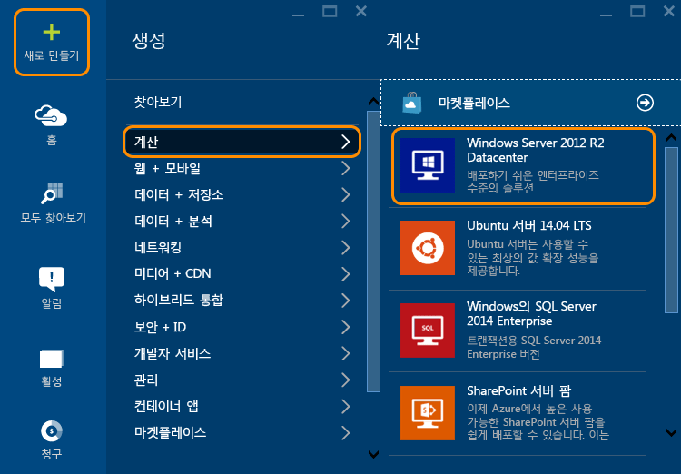
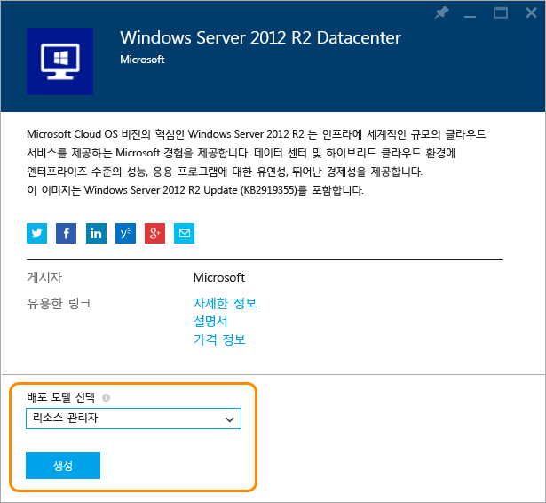
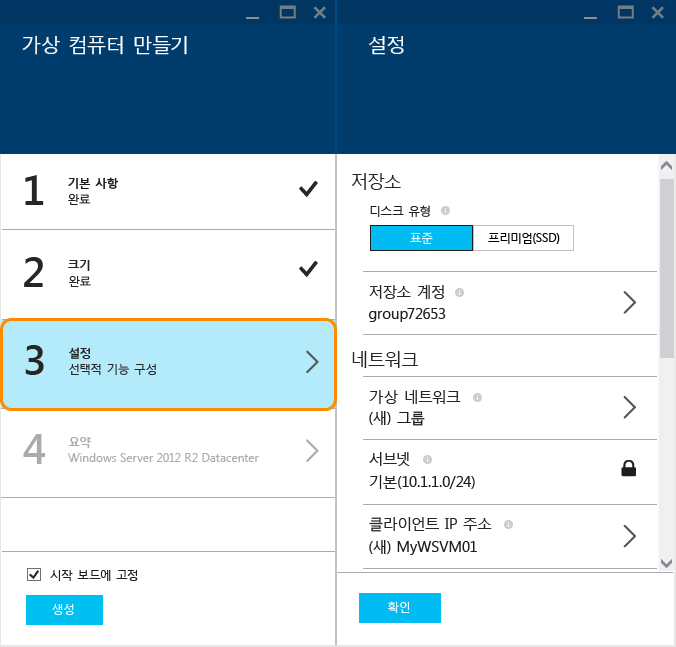
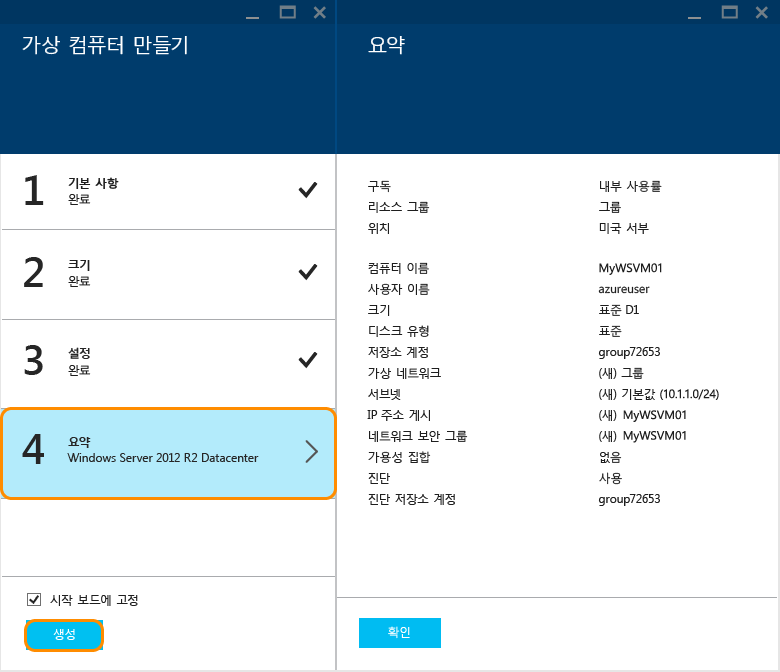
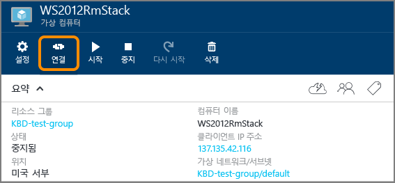

<properties
	pageTitle="Azure 포털에서 Windows VM 만들기| Microsoft Azure"
	description="Azure 포털에서 Windows 가상 컴퓨터를 만드는 방법 알아보기"
	keywords="Windows 가상 컴퓨터, 가상 컴퓨터 만들기, 가상 컴퓨터, 가상 컴퓨터 설정"
	services="virtual-machines-windows"
	documentationCenter=""
	authors="cynthn"
	manager="timlt"
	editor=""
	tags="azure-resource-manager"/>
<tags
	ms.service="virtual-machines-windows"
	ms.workload="infrastructure-services"
	ms.tgt_pltfrm="vm-windows"
	ms.devlang="na"
	ms.topic="hero-article"
	ms.date="04/14/2016"
	ms.author="cynthn"/>

# Azure 포털에서 Windows 가상 컴퓨터 만들기

이 자습서에서는 Azure 포털에서 단 몇 분 만에 Windows VM을 간단히 만드는 방법을 보여 줍니다. Windows Server 2012 R2 Datacenter 이미지를 예로 사용할 것이지만, 해당 이미지는 Azure가 제공하는 여러 이미지 중 하나일 뿐입니다. 선택할 수 있는 이미지는 구독에 따라 달라집니다. 예를 들어 데스크톱 이미지는 [MSDN 구독자](https://azure.microsoft.com/pricing/member-offers/msdn-benefits-details/?WT.mc_id=A261C142F)가 사용할 수 있습니다.

Azure 구독이 없는 경우 몇 분 만에 [무료 계정](https://azure.microsoft.com/free/)을 만들 수 있습니다.

## 연습 동영상

이 자습서의 [비디오 연습](https://channel9.msdn.com/Blogs/Azure-Documentation-Shorts/Create-A-Virtual-Machine-Running-Windows-In-The-Azure-Preview-Portal)은 다음과 같습니다.

## 마켓플레이스에서 Windows 2012 R2 가상 컴퓨터 이미지를 선택합니다.

1. [Azure 포털](https://portal.azure.com)에 로그인합니다.

2. 허브 메뉴에서 **새로 만들기** > **계산** > **Windows Server 2012 R2 Datacenter**를 클릭합니다.

	

3. **Windows Server 2012 R2 Datacenter** 페이지의 **배포 모델 선택**에서 **리소스 관리자**를 선택합니다. **만들기**를 클릭합니다.

	

## Windows 가상 컴퓨터 만들기

이미지를 선택한 후에는 대부분의 구성에 Azure 기본 설정을 그대로 사용하여 신속하게 가상 컴퓨터를 만들 수 있습니다.

1. **가상 컴퓨터 만들기** 블레이드에서 **기본 사항**을 클릭합니다.

2. 가상 컴퓨터에 원하는 **이름**을 입력합니다. 이름은 특수 문자를 포함할 수 없습니다.

3. 관리 **사용자 이름** 및 강력한 **암호**를 입력합니다. 암호의 길이는 8-123자여야 하며 다음 중 적어도 3가지를 포함해야 합니다. 1개의 소문자, 1개의 대문자, 1개의 숫자 및 1개의 특수 문자. **가상 컴퓨터에 연결하는 데 사용자 이름과 암호가 필요합니다**.

4. 둘 이상의 구독이 있는 경우 새 가상 컴퓨터에 하나를 지정합니다. 새 또는 기존 [리소스 그룹](../resource-group-overview/#resource-groups)과 Azure 데이터센터 **위치**(예: **미국 서부**)를 선택합니다.

	

	
2. **크기**를 클릭하고 필요에 맞는 가상 컴퓨터 크기를 선택합니다. 각각의 크기는 계산 코어, 메모리 및 기타 기능(예: 프리미엄 저장소에 대한 지원)의 수를 지정하며 가격에 영향을 미칩니다. Azure는 선택하는 이미지에 따라 특정 크기를 자동으로 권장합니다.

	

	>[AZURE.NOTE] 프리미엄 저장소는 특정 지역에서 DS 시리즈 가상 컴퓨터에 대해 사용할 수 있습니다. 프리미엄 저장소는 데이터베이스와 같은 데이터 집약적인 작업에 대해 최상의 저장소 옵션입니다. 자세한 내용은 [프리미엄 저장소: Azure 가상 컴퓨터 작업을 위한 고성능 저장소](../storage/storage-premium-storage.md)를 참조하세요.

3. **설정**을 클릭하여 새 가상 컴퓨터의 저장소 및 네트워킹 설정을 봅니다. 첫 번째 가상 컴퓨터의 경우 일반적으로 기본 설정을 적용할 수 있습니다. 지원하는 가상 컴퓨터 크기를 선택한 경우 **디스크 유형** 아래에서 **프리미엄(SSD)**을 선택해 볼 수 있습니다.

	

6. **요약**을 클릭하여 구성 선택 사항을 검토합니다. 설정 검토 또는 업데이트가 완료되면 **만들기**를 클릭합니다.

	

8. Azure에서 가상 컴퓨터를 만드는 동안 허브 메뉴의 **가상 컴퓨터**에서 진행 상황을 추적할 수 있습니다.

## 가상 컴퓨터에 연결하고 로그온

1. 아직 로그인하지 않은 경우 [Azure 포털](https://portal.azure.com/)에 로그인합니다.

2.	허브 메뉴에서 **가상 컴퓨터**를 클릭합니다.

3.	목록에서 가상 컴퓨터를 선택합니다.

4. 가상 컴퓨터 블레이드에서 **연결**을 클릭합니다.

	

[AZURE.INCLUDE [virtual-machines-log-on-win-server](../../includes/virtual-machines-log-on-win-server.md)]

연결하려고 할 때 문제가 발생할 경우 [Windows 기반 Azure 가상 컴퓨터에 대한 원격 데스크톱 연결 문제 해결](virtual-machines-windows-troubleshoot-rdp-connection.md)을 참조하세요.

이제 다른 서버처럼 가상 컴퓨터에서 작업할 수 있습니다.

## 다음 단계

* [Powershell을 사용하여 Windows VM 만들기](virtual-machines-windows-ps-create.md) 또는 [Azure CLI를 사용하여 Linux 가상 컴퓨터 만들기](virtual-machines-linux-quick-create-cli.md)를 사용할 수도 있습니다.

<!---HONumber=AcomDC_0427_2016-->