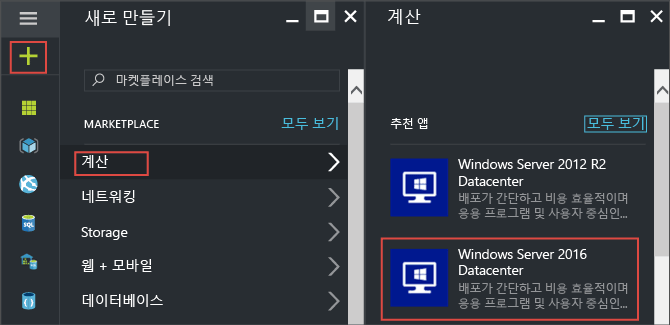
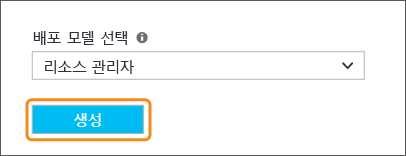
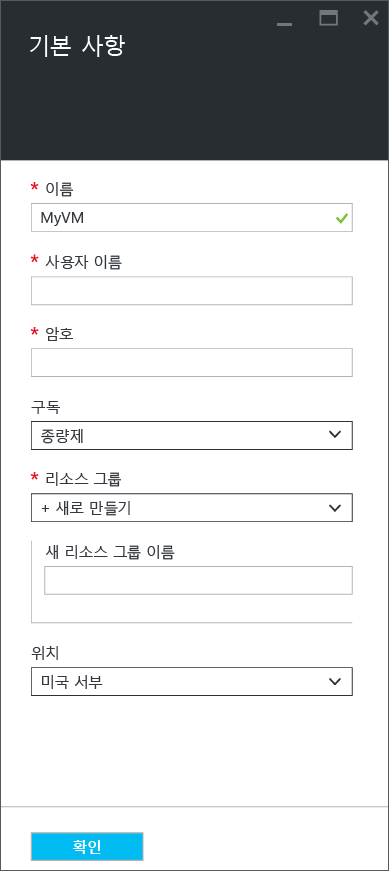
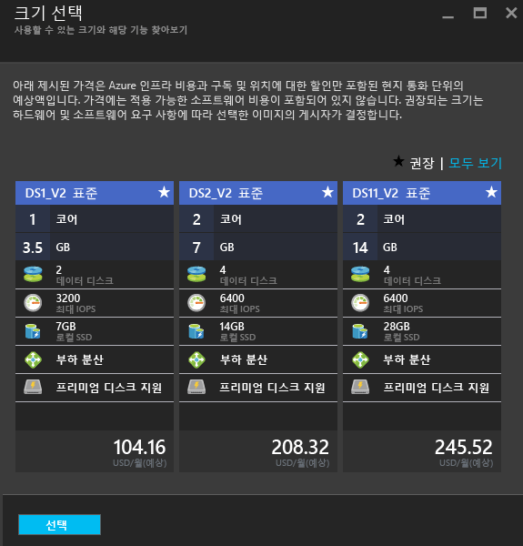
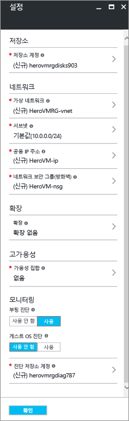
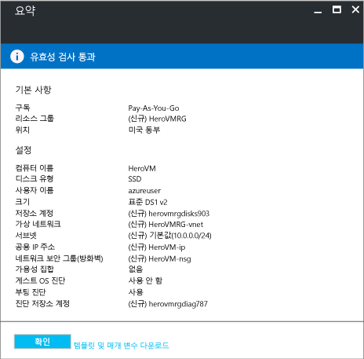
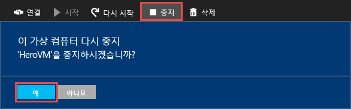

# Azure 포털에서 첫 번째 Windows 가상 컴퓨터 만들기
이 자습서에서는 Azure Portal을 사용하여 Windows VM(가상 컴퓨터)을 몇 분 이내에 간편하게 만드는 방법을 보여 줍니다.  

Azure 구독이 아직 없는 경우 시작하기 전에 [무료 계정](https://azure.microsoft.com/free/) 을 만듭니다.

## 마켓플레이스에서 VM 이미지를 선택합니다.
Windows Server 2016 Datacenter 이미지를 예로 사용할 것이지만, 해당 이미지는 Azure가 제공하는 여러 이미지 중 하나일 뿐입니다. 선택할 수 있는 이미지는 구독에 따라 달라집니다. 예를 들어 데스크톱 이미지는 [MSDN 구독자](https://azure.microsoft.com/pricing/member-offers/msdn-benefits-details/?WT.mc_id=A261C142F)에 사용할 수 있습니다.

1. [Azure 포털](https://portal.azure.com)에 로그인합니다.
2. 왼쪽 위에서 시작하여 **새로 만들기** > **계산** > **Windows Server 2016 Datacenter**를 클릭합니다.
   
    
3. **Windows Server 2016 Datacenter** 블레이드의 **배포 모델 선택**에서 **Resource Manager**가 선택되어 있는지 확인합니다. **만들기**를 클릭합니다.
   
    

## Windows 가상 컴퓨터 만들기
이미지를 선택한 후에 기본 설정을 사용하여 신속하게 가상 컴퓨터를 만들 수 있습니다.

1. **기본 사항** 블레이드에서 가상 컴퓨터의 **이름**을 입력합니다. 이 예제에서 *HeroVM*은 가상 컴퓨터의 이름입니다. 이름은 1-15자 길이여야 하며 특수 문자를 포함할 수 없습니다.
2. **사용자 이름** 및 VM에서 로컬 계정을 만드는 데 사용할 강력한 **암호**를 입력합니다. 로컬 계정은 VM에 로그온하고 VM을 관리하는 데 사용됩니다. 이 예제에서 *azureuser*는 사용자 이름입니다.
   
    암호는 8-123자 길이여야 하며 1개의 소문자, 1개의 대문자, 1개의 숫자 및 1개의 특수 문자 등 네 가지 복잡성 요구 사항 중 적어도 세 가지를 충족해야 합니다. 자세한 내용은 [사용자 이름 및 암호 요구 사항](virtual-machines-windows-faq.md#what-are-the-username-requirements-when-creating-a-vm)을 참조하세요.

3. 기존 [리소스 그룹](../azure-resource-manager/resource-group-overview.md#resource-groups)을 선택하거나 새 리소스 그룹의 이름을 입력합니다. 이 예제에서 *HeroVMRG*는 리소스 그룹의 이름입니다.

4. Azure 데이터 센터 **위치**를 선택합니다. 이 예제에서 *미국 동부**는 위치입니다. 

4. 완료되면 **확인** 을 클릭하여 다음 섹션을 진행합니다. 
   
    
5. VM [크기](virtual-machines-windows-sizes.md?toc=%2fazure%2fvirtual-machines%2fwindows%2ftoc.json)를 선택하고 **선택** 을 클릭하여 진행합니다. 이 예제에서 *DS1_V2 표준*은 VM 크기입니다.
   
    
6. **설정** 블레이드에서 저장소 및 네트워크 옵션을 변경할 수 있습니다. 이 자습서에서는 기본 설정을 적용합니다. 지원하는 가상 컴퓨터 크기를 선택한 경우 **디스크 유형**에서 **프리미엄(SSD)**을 선택하여 Azure Premium Storage를 사용해 볼 수 있습니다. 변경 작업이 완료되면 **확인**을 클릭합니다.
   
    
7. **요약** 을 클릭하여 선택 사항을 검토합니다. **유효성 검사 통과함** 메시지가 표시되면 **확인**을 클릭합니다.
   
    
8. Azure에서 가상 컴퓨터를 만드는 동안 왼쪽의 **Virtual Machines**를 클릭하여 진행 상황을 추적할 수 있습니다. VM을 만들면 상태가 **실행**으로 변경됩니다.

## 가상 컴퓨터에 연결 및 로그온
1. 왼쪽에서 **Virtual Machines**를 클릭합니다.
2. 목록에서 가상 컴퓨터를 선택합니다.
3. 가상 컴퓨터 블레이드에서 **연결**을 클릭합니다. 컴퓨터에 연결하는 바로 가기와 같은 원격 데스크톱 프로토콜 파일(.rdp 파일)을 만들고 다운로드합니다. 쉽게 액세스할 수 있도록 바탕 화면에 파일을 저장 수 있습니다. **열어서** VM에 연결합니다.
   
    
4. .rdp이 알 수 없는 게시자에게서 비롯되었다는 경고를 받게 됩니다. 이것은 정상입니다. 원격 데스크톱 창에서 **연결** 을 클릭하여 계속합니다.
   
    
5. Windows 보안 창에서 VM을 만들 때 생성한 로컬 계정에 대한 사용자 이름 및 암호를 입력합니다. 사용자 이름을 *vmname*&#92;*사용자 이름*으로 입력한 다음 **확인**을 클릭합니다.
   
    
6. 인증서를 확인할 수 없다는 경고를 받게 됩니다. 이것은 정상입니다. **예** 를 클릭하여 가상 컴퓨터의 ID를 확인하고 로그온을 완료합니다.
   
   

연결하려고 할 때 문제가 발생할 경우 [Windows 기반 Azure 가상 컴퓨터에 대한 원격 데스크톱 연결 문제 해결](virtual-machines-windows-troubleshoot-rdp-connection.md?toc=%2fazure%2fvirtual-machines%2fwindows%2ftoc.json)을 참조하세요.

이제 다른 서버처럼 가상 컴퓨터에서 작업할 수 있습니다.

## 선택 사항: VM 중지
실제로 사용하지 않는 경우 요금이 발생하지 않도록 VM을 중지하는 것이 좋습니다. **중지**를 클릭하고 **예**를 클릭합니다.

**시작** 단추를 클릭하여 다시 사용할 준비가 되면 VM을 다시 시작합니다.

## 다음 단계
* [IIS를 설치](virtual-machines-windows-hero-role.md?toc=%2fazure%2fvirtual-machines%2fwindows%2ftoc.json)하여 새 VM에서 실험할 수 있습니다. 이 자습서에서는 NSG(네트워크 보안 그룹)를 사용하여 들어오는 웹 트래픽에 포트 80을 여는 방법을 보여 줍니다. 
* [PowerShell을 사용하여 Windows VM을 만들거나](virtual-machines-windows-ps-create.md?toc=%2fazure%2fvirtual-machines%2fwindows%2ftoc.json) Azure CLI를 사용하여 [Linux 가상 컴퓨터를 만들 수도 있습니다](virtual-machines-linux-quick-create-cli.md?toc=%2fazure%2fvirtual-machines%2flinux%2ftoc.json).
* 배포를 자동화하려는 경우 [Resource Manager 템플릿을 사용하여 Windows 가상 컴퓨터 만들기](virtual-machines-windows-ps-template.md?toc=%2fazure%2fvirtual-machines%2fwindows%2ftoc.json)를 참조하세요.

<!--HONumber=Feb17_HO3-->

