<properties
	pageTitle="SQL Server 가상 컴퓨터 프로비전 | Microsoft Azure"
	description="포털을 사용하여 Azure에서 SQL Server 가상 컴퓨터를 만들고 연결하기. 이 자습서는 리소스 관리자 모드를 사용합니다."
	services="virtual-machines-windows"
	documentationCenter="na"
	authors="rothja"
	editor=""
	manager="jhubbard"
	tags="azure-resource-manager" />
<tags
	ms.service="virtual-machines-windows"
	ms.devlang="na"
	ms.topic="hero-article"
	ms.tgt_pltfrm="vm-windows-sql-server"
	ms.workload="infrastructure-services"
	ms.date="09/21/2016"
	ms.author="jroth" />

# Azure 포털에서 SQL Server 가상 컴퓨터 프로비전

> [AZURE.SELECTOR]
- [포털](virtual-machines-windows-portal-sql-server-provision.md)
- [PowerShell](virtual-machines-windows-ps-sql-create.md)

이 종단간 자습서는 Azure 포털을 사용하여 SQL Server를 실행하는 가상 컴퓨터를 프로비전하는 방법을 보여줍니다.

Azure 가상 컴퓨터(VM) 갤러리에는 Microsoft SQL Server가 포함된 몇 개의 이미지가 있습니다. 클릭 몇 번으로, 갤러리에서 SQL VM 이미지 중 하나를 선택하고 Azure 환경에 프로비전할 수 있습니다.

이 자습서에서는 다음을 수행합니다.

- [갤러리에서 SQL VM 이미지 선택](#select-a-sql-vm-image-from-the-gallery)
- [VM 구성 및 만들기](#configure-the-vm)
- [원격 데스크톱을 사용하여 VM 열기](#open-the-vm-with-remote-desktop)
- [원격으로 SQL Server 연결](#connect-to-sql-server-remotely)

## 갤러리에서 SQL VM 이미지 선택

1. 사용자 계정을 사용하여 [Azure 포털](https://portal.azure.com)에 로그인합니다.

	>[AZURE.NOTE] Azure 계정이 없는 경우 [Azure 무료 평가판](https://azure.microsoft.com/pricing/free-trial/)을 방문하십시오.

1. Azure 포털에서 **새로 만들기**를 클릭합니다. 포털에 **새** 블레이드가 열립니다. SQL Server VM 리소스가 마켓플레이스의 **가상 컴퓨터** 그룹에 있습니다.

1. **새로 만들기** 블레이드에서 **가상 컴퓨터**를 클릭합니다.

1. 사용 가능한 이미지를 모두 보려면 **가상 컴퓨터** 블레이드에서 **모두 표시**를 클릭합니다.

	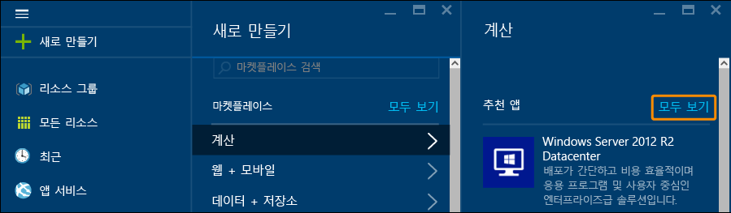

1. **데이터베이스 서버** 아래에서 **SQL Server**를 클릭합니다. **데이터베이스 서버**를 찾으려면 아래로 스크롤해야 할 수도 있습니다. 사용 가능한 SQL Server 템플릿을 검토합니다.

	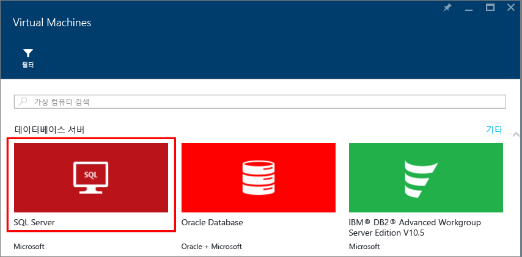

1. 각 템플릿은 SQL Server 버전 및 운영 체제를 식별합니다. 목록에서 이러한 이미지 중 하나를 선택합니다. 그런 다음 가상 컴퓨터 이미지에 대한 설명을 제공하는 세부 정보 블레이드를 검토하십시오.

	>[AZURE.NOTE] SQL VM 이미지는 만든 VM의 분당 가격에 SQL Server에 대한 라이선스 비용을 포함합니다. BYOL(Bring Your Own License) 및 VM에 대해서만 지불에 대한 또 다른 옵션이 있습니다. 이러한 이미지 이름에는 접두사 {BYOL}이 붙습니다. 이 옵션에 대한 자세한 내용은 [Azure 가상 컴퓨터에서 SQL Server 시작](virtual-machines-windows-sql-server-iaas-overview.md)을 참조하세요.

1. **배포 모델 선택**에서 **리소스 관리자**가 선택되었는지 확인합니다. 리소스 관리자는 새로운 가상 컴퓨터에 권장되는 배포 모델입니다. **만들기**를 클릭합니다.

	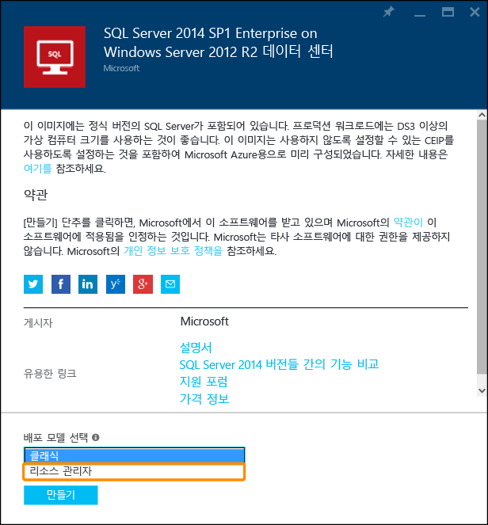

## VM 구성
SQL Server 가상 컴퓨터를 구성하기 위한 5개의 블레이드가 있습니다.

| 단계 | 설명 |
|---------------------|-------------------------------|
| **기본 사항** | [기본 설정 구성](#1-configure-basic-settings) |
| **크기** | [가상 컴퓨터 크기 선택](#2-choose-virtual-machine-size) |
| **설정** | [선택적 기능 구성](#3-configure-optional-features) |
| **SQL 서버 설정** | [SQL Server 설정 구성](#4-configure-sql-server-settings) |
| **요약** | [요약 검토](#5-review-the-summary) |

## 1\. 기본 설정 구성
**기본** 블레이드에서 다음 정보를 제공합니다.

* 고유한 가상 컴퓨터 **이름**을 입력합니다.
* VM의 로컬 관리자 계정에 대한 **사용자 이름**을 지정합니다. 이 계정은 SQL Server **sysadmin** 고정 서버 역할에도 추가됩니다.
* 강력한 **암호**를 제공합니다.
* 구독이 여러 개인 경우 구독이 새 VM에 대해 올바른지 확인합니다.
* **리소스 그룹** 상자에 새 리소스 그룹의 이름을 입력합니다. 또는 기존 리소스 그룹을 사용하려면 **기존 항목 선택**을 클릭합니다. 리소스 그룹은 Azure 내 관련 리소스의 컬렉션입니다(가상 컴퓨터, 저장소 계정, 가상 네트워크 등).

	>[AZURE.NOTE] 새 리소스 그룹을 사용하면 Azure에서 SQL Server 배포를 테스트하거나 알아보는 경우에 유용합니다. 테스트를 완료한 후 리소스 그룹을 삭제하면 VM과 해당 리소스 그룹과 연결된 모든 리소스가 자동으로 삭제됩니다. 리소스 그룹에 대한 자세한 내용은 [Azure Resource Manager 개요](../resource-group-overview.md)를 참조하세요.

* 이 배포의 **위치**를 선택합니다.
* **확인**을 클릭하여 설정을 저장합니다.

	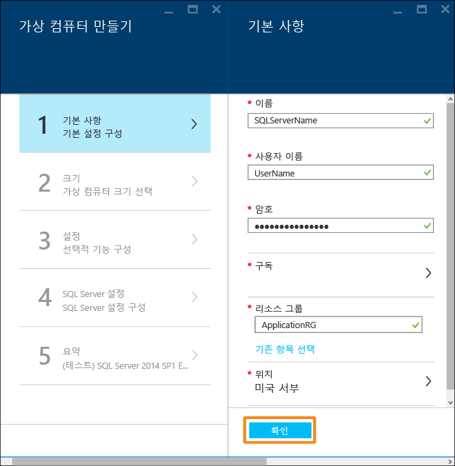

## 2\. 가상 컴퓨터 크기 선택
**크기** 단계에서는 **크기 선택** 블레이드에서 가상 컴퓨터 크기를 선택합니다. 블레이드는 선택한 템플릿을 기반으로 권장되는 컴퓨터 크기를 처음에 표시합니다. VM 실행에 소요되는 월간 비용을 예측합니다.

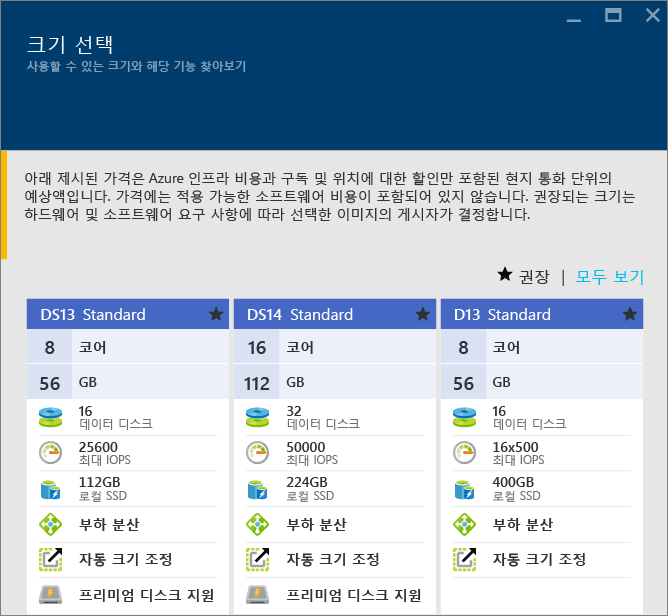

프로덕션 워크로드에는, [프리미엄 저장소](../storage/storage-premium-storage.md)를 지원하는 가상 컴퓨터 크기를 선택하는 것이 좋습니다. 그러한 수준의 성능이 필요하지 않으면, **모두 보기** 단추를 사용하여 모든 컴퓨터 크기 옵션을 표시합니다. 예를 들어, 개발 또는 테스트 환경을 위해 더 작은 컴퓨터 크기를 사용할 수 있습니다.

>[AZURE.NOTE] 가상 컴퓨터 크기에 대한 자세한 내용은 [가상 컴퓨터 크기](virtual-machines-windows-sizes.md)를 참조하세요. SQL Server VM 크기에 대한 고려 사항은 [Azure 가상 컴퓨터의 SQL Server에 대한 성능 모범 사례](virtual-machines-windows-sql-performance.md)를 참조하세요.

컴퓨터 크기를 선택한 다음 **선택**을 클릭합니다.

## 3\. 선택적 기능 구성
**설정** 블레이드에서 가상 컴퓨터용 Azure 저장소, 네트워킹 및 모니터링을 구성합니다.

- **저장소**에서 표준 또는 프리미엄(SSD) **디스크 유형**을 지정합니다. 프리미엄 저장소는 프로덕션 워크로드용으로 권장됩니다.

>[AZURE.NOTE] 프리미엄 저장소를 지원하지 않는 컴퓨터 크기에 대해 프리미엄(SSD)을 선택하면, 컴퓨터 크기가 자동으로 변경됩니다.

- **저장소 계정** 아래에서 자동으로 프로비전된 저장소 계정 이름을 적용할 수 있습니다. 또한 **저장소 계정**을 클릭하여 기존 계정을 선택하고 저장소 계정 유형을 구성할 수도 있습니다. 기본적으로 Azure에서는 로컬 중복 저장소로 새 저장소 계정을 만듭니다. 저장소 옵션에 대한 자세한 내용은 [Azure 저장소 복제](../storage/storage-redundancy.md)를 참조하세요.

- **네트워크** 아래에서 자동으로 채워진 값을 사용할 수 있습니다. 각 기능을 클릭하여 **가상 네트워크**, **서브넷**, **공용 IP 주소**, **네트워크 보안 그룹**을 수동으로 구성할 수도 있습니다. 이 자습서에서는 기본 값을 유지합니다.

- Azure에서는 VM에 지정된 것과 동일한 저장소 계정을 통해 **모니터링**이 기본적으로 사용됩니다. 여기에서 이러한 설정을 변경할 수 있습니다.

- **가용성 집합** 아래에서 가용성 집합을 지정합니다. 이 자습서에서는 **없음**을 선택할 수 있습니다. SQL AlwaysOn 가용성 그룹을 설정하려는 경우 가상 컴퓨터를 다시 만들지 않도록 가용성을 구성합니다. 자세한 내용은 [가상 컴퓨터의 가용성 관리](virtual-machines-windows-manage-availability.md)를 참조하세요.

이러한 설정 구성을 완료한 후 **확인**을 클릭합니다.

## 4\. SQL Server 설정 구성
**SQL Server 설정** 블레이드에서 SQL Server에 대한 설정 및 최적화를 구성합니다. SQL Server에 대해 구성할 수 있는 설정은 다음과 같습니다.

| 설정 |
|---------------------|
| [연결](#connectivity) |
| [인증](#authentication) |
| [저장소 구성](#storage-configuration) |
| [자동화된 패치](#automated-patching) |
| [자동화된 백업](#automated-backup) |
| [Azure 주요 자격 증명 모음 통합](#azure-key-vault-integration) |
| [R 서비스](#r-services) |

### 연결
**SQL 연결**에서 VM의 SQL Server 인스턴스에 대해 원하는 액세스 유형을 지정합니다. 이 자습서에서는 **공개(인터넷)**를 지정하여 인터넷 상의 컴퓨터 또는 서비스에서 SQL Server로의 연결을 허용합니다. 이 옵션을 선택하면 Azure에서는 포트 1433에서 트래픽을 허용하도록 방화벽 및 네트워크 보안 그룹을 자동으로 구성합니다.

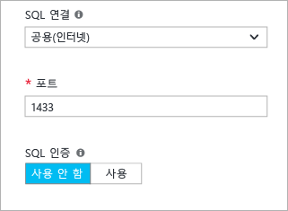

인터넷을 통해 SQL Server에 연결하려면 SQL Server 인증을 사용하도록 설정해야 합니다. 이 내용은 다음 섹션에 설명되어 있습니다.

>[AZURE.NOTE] 네트워크 통신에 대한 추가 제한을 SQL Server VM에 추가할 수 있습니다. 이 작업은 VM이 만들어진 후에 네트워크 보안 그룹을 편집하여 수행할 수 있습니다. 자세한 내용은 [NSG(네트워크 보안 그룹)란?](../virtual-network/virtual-networks-nsg.md)을 참조하세요.

인터넷을 통해 데이터베이스 엔진에 대한 연결을 사용하도록 설정하지 않으려면 다음 옵션 중 하나를 선택합니다.

- VM 내부에서만 SQL Server에 연결할 수 있도록 하려면 **로컬(VM 내부만)**을 선택합니다.
- 동일한 가상 네트워크의 컴퓨터 또는 서비스에서 SQL Server에 연결할 수 있도록 하려면 **사설(Virtual Network 내부)**을 선택합니다.

>[AZURE.NOTE] SQL Server Express Edition용 가상 컴퓨터 이미지는 자동으로 TCP/IP 프로토콜을 사용하지 않습니다. 공용 및 개인 연결 옵션에 대해서도 마찬가지입니다. Express Edition의 경우 VM을 만든 후에 SQL Server 구성 관리자를 사용하여 [수동으로 TCP/IP 프로토콜을 사용](#configure-sql-server-to-listen-on-the-tcp-protocol)해야 합니다.

일반적으로, 시나리오에 허용되는 가장 제한적인 연결을 선택하여 보안을 개선합니다. 하지만 모든 옵션은 네트워크 보안 그룹 및 SQL/Windows 인증을 통해 보안을 설정할 수 있습니다.

**포트** 기본값은 1433입니다. 다른 포트 번호를 지정할 수 있습니다. 자세한 내용은 [SQL Server Virtual Machine에 연결(Resource Manager) | Microsoft Azure](virtual-machines-windows-sql-connect.md)를 참조하세요.

### 인증
SQL Server 인증이 필요하도록 지정하려면 **SQL 인증**에서 **사용**을 클릭합니다.

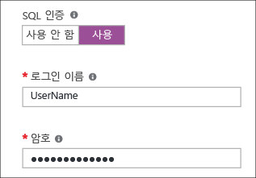

>[AZURE.NOTE] 인터넷(즉, 공용 연결 옵션)을 통해 SQL Server에 액세스하려는 경우 여기에서 SQL 인증을 사용해야 합니다. SQL Server에 대한 공용 액세스를 위해서는 SQL 인증을 사용해야 합니다.

SQL Server 인증을 사용하도록 설정하는 경우 **로그인 이름** 및 **암호**를 지정합니다. 이 사용자 이름은 SQL Server 인증 로그인 및 **sysadmin** 고정된 서버 역할의 구성원으로 구성됩니다. 인증 모드에 대한 자세한 내용은 [인증 모드 선택](http://msdn.microsoft.com/library/ms144284.aspx)을 참조하세요.

SQL Server 인증을 사용하도록 설정하지 않으면, VM의 로컬 관리자 계정을 사용하여 SQL Server 인스턴스에 연결할 수 있습니다.

### 저장소 구성
저장소 요구 사항을 지정하려면 **저장소 구성**을 클릭합니다.

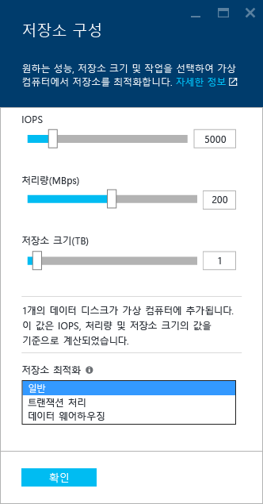

>[AZURE.NOTE] 표준 저장소를 선택하면, 이 옵션을 사용할 수 없습니다. 자동 저장소 최적화는 프리미엄 저장소에서만 사용할 수 있습니다.

초당 입/출력 작업(IOPs), 처리량(MB/s) 및 총 저장소 크기로 요구 사항을 지정할 수 있습니다. 슬라이딩 규모를 사용하여 이 값을 구성합니다. 포털에는 이러한 요구 사항에 따라 디스크 수를 자동으로 계산합니다.

기본적으로 Azure에서는 5000 IOPs, 200MBs 및 1TB의 저장소 공간에 대해 저장소를 최적화합니다. 워크로드에 따라 이러한 저장소 설정을 변경할 수 있습니다. **다음에 대해 저장소 최적화**에서 다음 옵션 중 하나를 선택합니다.

- **일반**은 기본 설정이며 대부분의 워크로드를 지원합니다.
- **트랜잭션** 처리는 기존의 데이터베이스 OLTP 워크로드용으로 저장소를 최적화합니다.
- **데이터 웨어하우징**은 분석 및 보고 워크로드용으로 저장소를 최적화합니다.

>[AZURE.NOTE] 슬라이더에 대한 상한값은 선택한 가상 컴퓨터 크기에 따라 달라집니다.

### 자동화된 패치
기본적으로 **자동화된 패치**가 사용됩니다. Azure에서는 자동화된 패치를 통해 SQL Server와 운영 체제를 자동으로 패치합니다. 요일, 시간 및 유지 관리 기간에 대한 날짜를 지정합니다. Azure에서 유지 관리 기간에 패치를 수행합니다. 유지 관리 기간 일정에서는 VM 로캘 시간을 사용합니다. Azure에서 SQL Server와 운영 체제를 자동으로 패치하지 않으려면 **사용 안 함**을 클릭합니다.

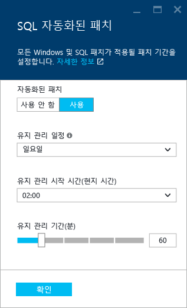

자세한 내용은 [Azure Virtual Machines에서 SQL Server의 자동화된 패치](virtual-machines-windows-sql-automated-patching.md)를 참조하세요.

### 자동화된 백업
**자동화된 백업**에서 모든 데이터베이스에 대해 자동 데이터베이스 백업을 사용하도록 설정합니다. 자동화된 백업은 기본적으로 사용하지 않도록 설정됩니다.

SQL 자동화된 백업을 사용하면 다음을 구성할 수 있습니다.

- 백업에 대한 보존 기간(일)
- 백업에 사용할 저장소 계정
- 백업을 위한 암호화 옵션 및 암호

백업을 암호화하려면 **사용**을 클릭합니다. 그 다음 **암호**를 지정합니다. Azure에서는 백업을 암호화할 인증서를 만들고 지정된 암호를 사용하여 인증서를 보호합니다.

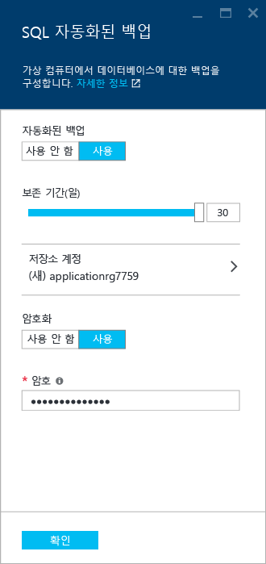

 자세한 내용은 [Azure 가상 컴퓨터에서 SQL Server에 대한 자동화된 백업](virtual-machines-windows-sql-automated-backup.md)을 참조하세요.

### Azure 주요 자격 증명 모음 통합
Azure에서 암호화를 위한 보안 암호를 저장하려면 **Azure Key Vault 통합**을 클릭하고 **사용**을 클릭합니다.

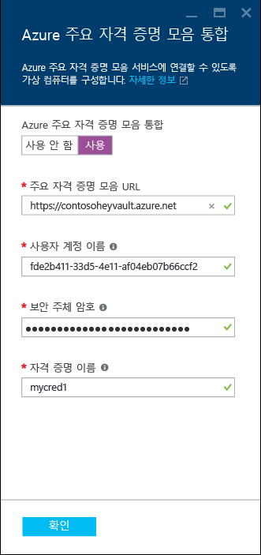

다음 표에서는 Azure 주요 자격 증명 모음 통합을 구성하는 데 필요한 매개 변수를 나열합니다.

|매개 변수|설명|예제|
|----------|----------|-------|
|**주요 자격 증명 모음 URL** |주요 자격 증명 모음의 위치입니다.|https://contosokeyvault.vault.azure.net/ |
|**주체 이름** |Azure Active Directory 서비스 주체 이름. 이 이름을 클라이언트 ID라고도 합니다. |fde2b411-33d5-4e11-af04eb07b669ccf2|
| **주체 암호**|Azure Active Directory 서비스 주체 암호입니다. 이 암호를 클라이언트 암호라고도 합니다. | 9VTJSQwzlFepD8XODnzy8n2V01Jd8dAjwm/azF1XDKM=|
|**자격 증명 이름**|**자격 증명 이름**: AKV 통합은 VM이 주요 자격 증명 모음에 액세스할 수 있도록 SQL Server 내에 자격 증명을 만듭니다. 이 자격 증명의 이름을 선택하세요.| mycred1|

자세한 내용은 [Azure VM에서 SQL Server에 대한 Azure Key Vault 통합 구성](virtual-machines-windows-ps-sql-keyvault.md)을 참조하세요.

SQL Server 설정 구성을 마치면 **확인**을 클릭합니다.

### R 서비스
SQL Server 2016 Enterprise edition의 경우 [SQL Server R 서비스](https://msdn.microsoft.com/library/mt604845.aspx)를 사용하도록 설정하는 옵션이 있습니다. SQL Server 2016을 사용하여 고급 분석을 사용할 수 있습니다. **SQL Server 설정** 블레이드에서 **사용**을 클릭합니다.

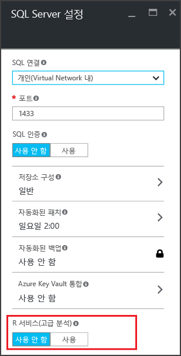

>[AZURE.NOTE] 2016 Enterprise edition이 아닌 SQL Server 이미지의 경우 R 서비스를 사용하도록 설정하는 옵션을 비활성화했습니다.

## 5\. 요약 검토
**요약** 블레이드에서 요약을 검토하고 **확인**을 클릭하여 이 VM에 대해 지정된 SQL Server, 리소스 그룹 및 리소스를 만듭니다.

Azure 포털에서 배포를 모니터링할 수 있습니다. 화면 맨 위에 있는 **알림** 단추는 배포의 기본 상태를 표시합니다.

>[AZURE.NOTE] 배포 시간에 대한 정보를 제공하기 위해 SQL VM을 미국 동부 지역에 기본 설정을 사용하여 배포해 두었습니다. 이 테스트 배포는 완료하기까지 총 26분이 소요되었습니다. 사용자의 지역 및 선택한 설정에 따라서 배포 시간이 더 빠르거나 늦을 수 있습니다.

## 원격 데스크톱을 사용하여 VM 열기

다음 단계를 사용하여 원격 데스크톱으로 가상 컴퓨터에 연결합니다.

1. Azure VM이 작성되면, VM에 대한 아이콘이 Azure 대시보드에 표시됩니다. 기본 가상 컴퓨터를 검색하여 찾을 수도 있습니다. 새 SQL 가상 컴퓨터를 클릭합니다. **가상 컴퓨터** 블레이드에 가상 컴퓨터 세부 정보가 표시됩니다.
1. **가상 컴퓨터** 블레이드 위쪽에서 **연결**을 클릭합니다.
1. 브라우저가 VM에 대한 RDP 파일을 다운로드합니다. RDP 파일을 엽니다. 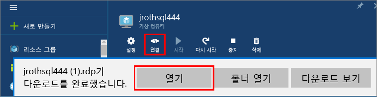
1. 원격 데스크톱 연결이 이 원격 연결의 게시자를 식별할 수 없다고 알립니다. **연결**을 클릭하여 계속합니다.
1. **Windows 보안** 대화 상자에서 **다른 계정 사용**을 클릭합니다.
1. **사용자 이름**에 **<user name>**을 입력합니다. 여기서 <user name>은 VM 구성 시 지정한 사용자 이름입니다. 이름 앞에 초기 백슬래시를 추가해야 합니다.
1. 이 VM에 대해 앞서 구성해 놓은 **암호**를 입력한 다음 **확인**을 클릭하여 연결합니다.
1. 다른 **원격 데스크톱 연결** 대화 상자가 연결 여부를 물으면 **예**를 클릭합니다.

SQL Server 가상 컴퓨터에 연결된 후에, SQL Server Management Studio를 시작하고 로컬 관리자 자격 증명을 사용하여 Windows 인증으로 연결할 수 있습니다. SQL Server 인증을 사용하도록 설정한 경우에는, 프로비전 중에 구성해 놓은 SQL 로그인 및 암호를 사용하여 SQL 인증에 연결할 수 있습니다.

컴퓨터에 연결하면 요구 사항에 따라 컴퓨터와 SQL Server 설정을 직접 변경할 수 있습니다. 예를 들어, 방화벽 설정을 구성하거나 SQL Server 구성 설정을 변경할 수 있습니다.

## 원격으로 SQL Server 연결

이 자습서에서는 가상 컴퓨터와 **SQL Server 인증**에 대해 **공개** 액세스를 선택했습니다. 이러한 설정은 가상 컴퓨터가 인터넷을 통한 모든 클라이언트의 SQL Server 연결을 허용하도록 자동으로 구성합니다(올바른 SQL 로그인이 있다는 가정 하에).

>[AZURE.NOTE] 프로비전 중에 공용을 선택하지 않은 경우 인터넷을 통한 SQL Server 인스턴스 액세스에 추가 단계가 필요합니다. 자세한 내용은 [SQL Server Virtual Machine에 연결](virtual-machines-windows-sql-connect.md)을 참조하세요.

다음 섹션은 인터넷 상의 다른 컴퓨터에서 VM의 SQL Server 인스턴스에 연결하는 방법을 보여줍니다.

> [AZURE.INCLUDE [VM 리소스 관리자에서 SQL Server에 연결](../../includes/virtual-machines-sql-server-connection-steps-resource-manager.md)]

## 다음 단계
Azure에서 SQL Server를 사용하는 방법에 대한 기타 정보는 [Azure Virtual Machines의 SQL Server](virtual-machines-windows-sql-server-iaas-overview.md) 및 [질문과 대답](virtual-machines-windows-sql-server-iaas-faq.md)을 참조하세요.

Azure Virtual Machines의 SQL Server에 대한 비디오 개요는 [Azure VM은 SQL Server 2016에 가장 적합한 플랫폼입니다.](https://channel9.msdn.com/Events/DataDriven/SQLServer2016/Azure-VM-is-the-best-platform-for-SQL-Server-2016)를 시청하세요.

Azure 가상 컴퓨터의 SQL Server에 대한 [학습 경로를 탐색](https://azure.microsoft.com/documentation/learning-paths/sql-azure-vm/)합니다.

<!---HONumber=AcomDC_0921_2016-->