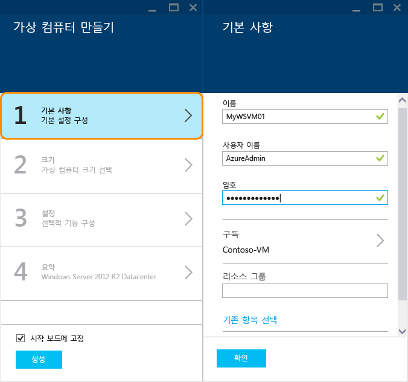
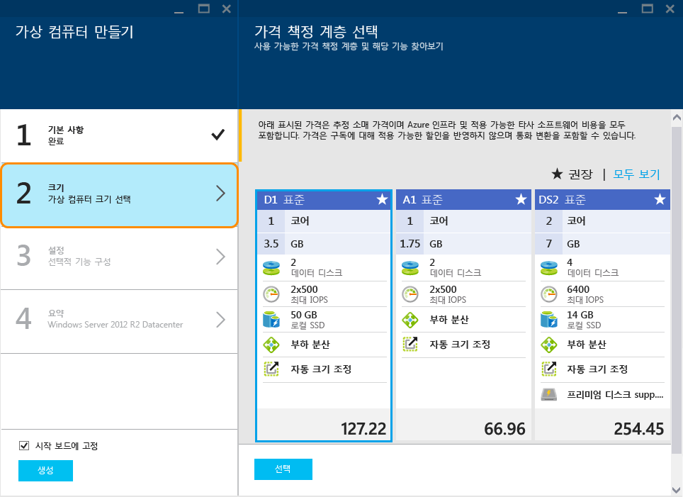

<properties
	pageTitle="Azure 포털에서 Windows 가상 컴퓨터 만들기| Microsoft Azure"
	description="Azure 포털의 Azure 마켓플레이스를 사용하여 Windows 가상 컴퓨터 또는 가상 컴퓨터를 만드는 방법에 대해 알아봅니다."
	keywords="Windows 가상 컴퓨터, 가상 컴퓨터 만들기, 가상 컴퓨터, 가상 컴퓨터 설정"
	services="virtual-machines"
	documentationCenter=""
	authors="cynthn"
	manager="timlt"
	editor=""
	tags="azure-resource-manager"/>
<tags
	ms.service="virtual-machines"
	ms.workload="infrastructure-services"
	ms.tgt_pltfrm="vm-windows"
	ms.devlang="na"
	ms.topic="hero-article"
	ms.date="01/07/2016"
	ms.author="cynthn"/>

# Azure 포털에서 Windows 가상 컴퓨터 만들기#

> [AZURE.SELECTOR]
- [포털 - Windows](virtual-machines-windows-tutorial.md)
- [PowerShell](virtual-machines-ps-create-preconfigure-windows-resource-manager-vms.md)
- [PowerShell - 템플릿](virtual-machines-create-windows-powershell-resource-manager-template.md)
- [포털 - Linux](virtual-machines-linux-tutorial-portal-rm.md)
- [CLI](virtual-machines-linux-tutorial.md)

이 자습서에서는 Azure 포털에서 Windows 가상 컴퓨터를 몇 분 이내에 간편하게 만드는 방법을 보여 줍니다. 여기에서는 Windows Server 2012 R2 Datacenter 이미지를 예로 들어 가상 컴퓨터를 이는 Azure에서 제공하는 여러 이미지 중 하나일 뿐입니다. 선택할 수 있는 이미지는 구독에 따라 달라집니다. 예를 들어 데스크톱 이미지는 MSDN 구독자가 사용할 수 있습니다.

[AZURE.INCLUDE [learn-about-deployment-models](../../includes/learn-about-deployment-models-rm-include.md)]클래식 배포 모델.

 

>[AZURE.TIP] VM이 가용성 설정의 일부가 되도록 하려는 경우 포털을 사용할 때 첫 번째 VM을 만들기 전 또는 만드는 동안 가용성 집합을 만들어야 합니다. 가용성 집합을 만들고 사용하는 방법에 대한 자세한 내용은 [가상 컴퓨터의 가용성 관리](virtual-machines-manage-availability.md)를 참조하세요.

사용자 고유의 이미지, 리소스 관리자 템플릿 또는 자동화 도구를 사용하여 가상 컴퓨터를 만들 수도 있습니다. 여러 방법에 대한 자세한 내용은 [Windows 가상 컴퓨터를 만드는 다양한 방법](virtual-machines-windows-choices-create-vm.md)을 참조하세요.

[AZURE.INCLUDE [free-trial-note](../../includes/free-trial-note.md)]

## 연습 동영상

이 자습서의 연습은 다음과 같습니다.

[AZURE.VIDEO create-a-virtual-machine-running-windows-in-the-azure-preview-portal]

## Windows 가상 컴퓨터 이미지 선택

1. Azure 포털에 로그인합니다.

2. 허브 메뉴에서 **새로 만들기** > **계산** > **Windows Server 2012 R2 Datacenter**를 클릭합니다.

	

	>[AZURE.TIP] 다른 이미지를 찾으려면 **마켓플레이스**를 클릭하고 사용 가능한 항목을 검색하거나 필터링합니다.

3. **Windows Server 2012 R2 Datacenter** 페이지의 **배포 모델 선택**에서 **리소스 관리자**를 선택합니다. **만들기**를 클릭합니다.

	

## Windows 가상 컴퓨터 만들기

이미지를 선택한 후에는 대부분의 구성에 Azure 기본 설정을 그대로 사용하여 신속하게 가상 컴퓨터를 만들 수 있습니다.

1. **가상 컴퓨터 만들기** 블레이드에서 **기본 사항**을 클릭합니다.

2. 가상 컴퓨터에 원하는 **이름**을 입력합니다. 이름은 특수 문자를 포함할 수 없습니다.

3. 관리 **사용자 이름** 및 강력한 **암호**를 입력합니다. 암호의 길이는 8-123자여야 하며 다음 중 적어도 3가지를 포함해야 합니다. 1개의 소문자, 1개의 대문자, 1개의 숫자 및 1개의 특수 문자. **가상 컴퓨터에 로그온하는 데 이 사용자 이름과 암호가 필요합니다**.

4. 구독이 둘 이상인 경우 새 가상 컴퓨터에 대한 구독을 지정하고 새로운 또는 기존 **리소스 그룹** 및 Azure 데이터 센터 **위치**도 지정합니다.

	

	
2. **크기**를 클릭하고 필요에 맞는 가상 컴퓨터 크기를 선택합니다. 각각의 크기는 계산 코어, 메모리 및 기타 기능(예: 프리미엄 저장소에 대한 지원)의 수를 지정하며 가격에 영향을 미칩니다. Azure는 선택하는 이미지에 따라 특정 크기를 자동으로 권장합니다.

	

	>[AZURE.NOTE] 프리미엄 저장소는 특정 지역에서 DS 시리즈 가상 컴퓨터에 대해 사용할 수 있습니다. 프리미엄 저장소는 데이터베이스와 같은 데이터 집약적인 작업에 대해 최상의 저장소 옵션입니다. 자세한 내용은 [프리미엄 저장소: Azure 가상 컴퓨터 작업을 위한 고성능 저장소](storage-premium-storage.md)를 참조하세요.

3. **설정**을 클릭하여 새 가상 컴퓨터의 저장소 및 네트워킹 설정을 봅니다. 첫 번째 가상 컴퓨터의 경우 일반적으로 기본 설정을 적용할 수 있습니다. 지원하는 가상 컴퓨터 크기를 선택한 경우 **디스크 유형** 아래에서 **프리미엄(SSD)**을 선택해 볼 수 있습니다.

	

6. **요약**을 클릭하여 구성 선택 사항을 검토합니다. 설정 검토 또는 업데이트가 완료되면 **만들기**를 클릭합니다.

	

8. Azure에서 가상 컴퓨터를 만드는 동안 허브 메뉴의 **가상 컴퓨터**에서 진행 상황을 추적할 수 있습니다.

## Windows 가상 컴퓨터에 로그온

가상 컴퓨터를 만든 후 해당 가상 컴퓨터에 로그인하여 자체 설정 및 실행할 응용 프로그램을 관리할 수 있습니다.

>[AZURE.NOTE] 자세한 요구 사항 및 문제 해결 팁은 [RDP 또는 SSH를 사용하여 Azure 가상 컴퓨터에 연결](https://msdn.microsoft.com/library/azure/dn535788.aspx)을 참조하십시오.

1. 아직 로그인하지 않은 경우 Azure 포털에 로그인합니다.

2. 대시보드에서 가상 컴퓨터를 클릭하거나 가상 컴퓨터를 클릭하고 목록에서 선택합니다.

3. 가상 컴퓨터 블레이드에서 **연결**을 클릭합니다.

	

4. **열기**를 클릭하여 Windows Server 가상 컴퓨터에 대해 자동으로 만들어진 원격 데스크톱 프로토콜 파일을 사용합니다.

5. **연결**을 클릭합니다.

6. 가상 컴퓨터를 만들 때 설정한 사용자 이름 및 암호를 입력하고 **확인**을 클릭합니다.

7. **예**를 클릭하여 가상 컴퓨터의 ID를 확인합니다.

이제 다른 서버처럼 가상 컴퓨터에서 작업할 수 있습니다.

## 다음 단계

* Azure PowerShell 및 Azure CLI를 사용하여 [가상 컴퓨터 이미지를 찾아서 선택](resource-groups-vm-searching.md)합니다.
* [Azure Resource Manager 템플릿](https://azure.microsoft.com/documentation/templates/)을 사용하여 가상 컴퓨터 및 워크로드 배포와 관리를 자동화합니다.

<!---HONumber=AcomDC_0302_2016-->