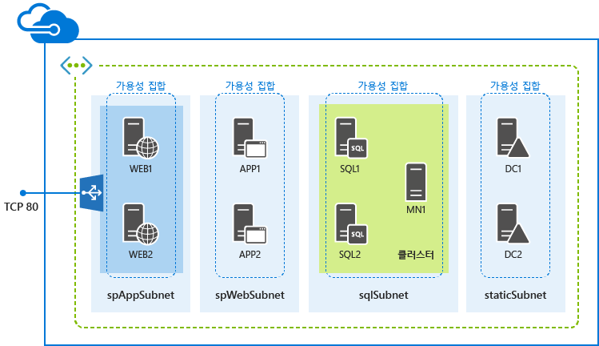

<properties
	pageTitle="ARM 템플릿을 사용하여 SharePoint 팜 배포 | Microsoft Azure"
	description="리소스 관리자 템플릿과 Azure 포털, Azure PowerShell 또는 Azure CLI를 사용하여 3대 서버 또는 9대 서버 SharePoint 팜을 쉽게 배포합니다."
	services="virtual-machines"
	documentationCenter=""
	authors="JoeDavies-MSFT"
	manager="timlt"
	editor=""
	tags="azure-resource-manager"/>

<tags
	ms.service="virtual-machines"
	ms.workload="infrastructure-services"
	ms.tgt_pltfrm="vm-windows-sharepoint"
	ms.devlang="na"
	ms.topic="hero-article"
	ms.date="10/20/2015"
	ms.author="josephd"/>

# Azure 리소스 관리자 템플릿을 사용하여 SharePoint 팜 배포

[AZURE.INCLUDE [learn-about-deployment-models](../../includes/learn-about-deployment-models-rm-include.md)]클래식 배포 모델. 클래식 배포 모델을 사용하여 이 리소스를 만들 수 없습니다.

리소스 관리자 템플릿을 사용하여 새로운 3개의 서버 또는 9-서버 SharePoint 2013 팜을 배포하려면 이 문서의 지침을 사용하세요.

## 3개의 서버 SharePoint 팜 배포

기본 SharePoint Server 2013 팜에 대해, 리소스 관리자 템플릿은 3개의 서로 다른 서브넷의 새로운 가상 네트워크에 3개의 가상 컴퓨터를 만듭니다.

Azure Preview 포털, Azure PowerShell 또는 Azure CLI에서 템플릿 파일을 실행할 수 있습니다.

> [AZURE.NOTE]또한 Azure Preview 포털의 Azure 마켓플레이스에서 [SharePoint 2013 비 HA 팜](https://azure.microsoft.com/marketplace/partners/sharepoint2013/sharepoint2013farmsharepoint2013-nonha/) 항목을 사용하여 이 구성을 만들 수 있습니다.

### Azure 미리 보기 포털

리소스 관리자 템플릿과 Azure Preview 포털을 사용하여 이 작업을 배포하려면 [여기](https://portal.azure.com/#create/Microsoft.Template/uri/https%3A%2F%2Fraw.githubusercontent.com%2FAzure%2Fazure-quickstart-templates%2Fmaster%2Fsharepoint-three-vm%2Fazuredeploy.json)를 클릭합니다.

1.	**매개 변수**를 클릭합니다. **매개 변수** 창에서 새 값을 입력하거나 허용되는 값에서 선택하거나 기본값을 그대로 적용한 다음 **확인**을 클릭합니다.
2.	필요한 경우 **구독**을 클릭하고 올바른 Azure 구독을 선택합니다.
3.	**리소스 그룹**을 클릭하고 기존 리소스 그룹을 선택합니다. 아니면 **또는 새로 만들기**를 클릭하여 이 워크로드에 대한 새 그룹을 만듭니다.
4.	필요한 경우 **리소스 그룹 위치**를 클릭하고 올바른 Azure 위치를 선택합니다.
6.	**약관**을 클릭하여 템플릿 사용 조건 및 규약을 검토한 다음 **구입**을 클릭합니다.
7.	**만들기**를 클릭합니다.

템플릿에 따라 Azure의 워크로드 빌드에 다소 시간이 걸릴 수 있습니다. 해당 작업이 완료되면 기존 또는 새 리소스 그룹에 3-서버 SharePoint 팜을 갖게 됩니다.

### Azure PowerShell

> [AZURE.NOTE]이 문서에는 Azure PowerShell Preview 1.0에 대한 명령이 포함되어 있습니다. Azure PowerShell 0.9.8 및 이전 버전에서 이러한 명령을 실행하려면 **New-AzureRMResourceGroup**을 **New-AzureResourceGroup**로 대체하고, **New-AzureRMResourceGroupDeployment**를 **New-AzureResourceGroupDeployment**로 대체한 다음 **New-AzureResourceGroup** 명령 앞에 **Switch-AzureMode AzureResourceManager**를 추가합니다. 자세한 내용은 [Azure PowerShell 1.0 Preview](https://azure.microsoft.com/blog/azps-1-0-pre/)를 참조하세요.

다음 명령 세트에 Azure 배포 이름, 새 리소스 그룹 이름 및 Azure 데이터센터 위치를 입력합니다. < and > 문자를 포함하여 따옴표 안의 모든 내용을 제거합니다.

	$deployName="<deployment name>"
	$RGName="<resource group name>"
	$locName="<Azure location, such as West US>"
	$templateURI="https://raw.githubusercontent.com/Azure/azure-quickstart-templates/master/sharepoint-three-vm/azuredeploy.json"
	New-AzureRMResourceGroup -Name $RGName -Location $locName
	New-AzureRMResourceGroupDeployment -Name $deployName -ResourceGroupName $RGName -TemplateUri $templateURI

다음은 예제입니다.

	$deployName="TestDeployment"
	$RGName="TestRG"
	$locname="West US"
	$templateURI="https://raw.githubusercontent.com/Azure/azure-quickstart-templates/master/sharepoint-three-vm/azuredeploy.json"
	New-AzureRMResourceGroup -Name $RGName -Location $locName
	New-AzureRMResourceGroupDeployment -Name $deployName -ResourceGroupName $RGName -TemplateUri $templateURI

다음으로, Azure PowerShell 프롬프트에서 명령 블록을 실행합니다.

**New-AzureRmResourceGroupDeployment** 명령을 실행하면 일련의 매개 변수 값을 제공하라는 메시지가 표시됩니다. 모든 매개 변수 값을 지정하면 **New-AzureRmResourceGroupDeployment**에서 가상 컴퓨터를 만들고 구성합니다.

템플릿 실행이 완료되면 새 리소스 그룹에 3개의 서버 SharePoint 팜을 갖게 됩니다.

### Azure CLI

시작하기 전에 올바른 버전의 Azure CLI이 설치되었는지, 로그인했는지, 새 리소스 관리자 모드로 전환했는지 확인해야 합니다. 자세한 내용을 보려면 [여기](virtual-machines-deploy-rmtemplates-azure-cli.md#getting-ready)를 클릭하세요.

먼저, 새 리소스 그룹을 만듭니다. 다음 명령을 사용하고 배포에 사용할 그룹 및 Azure 데이터센터 위치의 이름을 지정합니다.

	azure group create <group name> <location>

다음으로, 다음 명령을 사용하고 새 리소스 그룹의 이름 및 Azure 배포의 이름을 지정합니다.  

	azure group deployment create --template-uri https://raw.githubusercontent.com/Azure/azure-quickstart-templates/master/sharepoint-three-vm/azuredeploy.json <group name> <deployment name>

다음은 예제입니다.

	azure group create sp3serverfarm eastus2
	azure group deployment create --template-uri https://raw.githubusercontent.com/Azure/azure-quickstart-templates/master/sharepoint-three-vm/azuredeploy.json sp3serverfarm spdevtest

**azure group deployment create** 명령을 실행하면 일련의 매개 변수 값을 제공하라는 메시지가 표시됩니다. 모든 매개변수 값을 지정하면 Azure에서 가상 컴퓨터를 만들고 구성합니다.

이제 사용자는 새로운 리소스 그룹에 3-서버 Sharepoint 팜을 갖게 됩니다.

## 9-서버 SharePoint 팜 배포

고가용성 SharePoint Server 2013 팜에 대해, 리소스 관리자 템플릿은 9개의 서로 다른 서브넷의 새로운 가상 네트워크에 9개의 가상 컴퓨터를 만듭니다.

> [AZURE.NOTE]또한 Azure Preview 포털의 Azure 마켓플레이스에서 [SharePoint 2013 HA 팜](https://azure.microsoft.com/marketplace/partners/sharepoint2013/sharepoint2013farmsharepoint2013-ha/) 항목을 사용하여 이 구성을 만들 수 있습니다.

### Azure 미리 보기 포털

리소스 관리자 템플릿과 Azure Preview 포털을 사용하여 이 작업을 배포하려면 [여기](https://portal.azure.com/#create/Microsoft.Template/uri/https%3A%2F%2Fraw.githubusercontent.com%2FAzure%2Fazure-quickstart-templates%2Fmaster%2Fsharepoint-server-farm-ha%2Fazuredeploy.json)를 클릭합니다.

1.	**매개 변수**를 클릭합니다. **매개 변수** 창에서 새 값을 입력하거나 허용되는 값에서 선택하거나 기본값을 그대로 적용한 다음 **확인**을 클릭합니다.
2.	필요한 경우 **구독**을 클릭하고 올바른 Azure 구독을 선택합니다.
3.	**리소스 그룹**을 클릭하고 기존 리소스 그룹을 선택합니다. 아니면 **또는 새로 만들기**를 클릭하여 이 워크로드에 대한 새 그룹을 만듭니다.
4.	필요한 경우 **리소스 그룹 위치**를 클릭하고 올바른 Azure 위치를 선택합니다.
5.	**약관**을 클릭하여 템플릿 사용 조건 및 규약을 검토한 다음 **구입**을 클릭합니다.
6.	**만들기**를 클릭합니다.

템플릿에 따라 Azure의 워크로드 빌드에 다소 시간이 걸릴 수 있습니다. 해당 작업이 완료되면 기존 또는 새 리소스 그룹에 새로운 9-서버 SharePoint 팜을 갖게 됩니다.

### Azure PowerShell

> [AZURE.NOTE]이 문서에는 Azure PowerShell Preview 1.0에 대한 명령이 포함되어 있습니다. Azure PowerShell 0.9.8 및 이전 버전에서 이러한 명령을 실행하려면 **New-AzureRMResourceGroup**을 **New-AzureResourceGroup**로 대체하고, **New-AzureRMResourceGroupDeployment**를 **New-AzureResourceGroupDeployment**로 대체한 다음 **New-AzureResourceGroup** 명령 앞에 **Switch-AzureMode AzureResourceManager**를 추가합니다. 자세한 내용은 [Azure PowerShell 1.0 Preview](https://azure.microsoft.com/blog/azps-1-0-pre/)를 참조하세요.

다음 명령 세트에 Azure 배포 이름, 새 리소스 그룹 이름 및 Azure 데이터센터 위치를 입력합니다. < and > 문자를 포함하여 따옴표 안의 모든 내용을 제거합니다.

	$deployName="<deployment name>"
	$RGName="<resource group name>"
	$locName="<Azure location, such as West US>"
	$templateURI="https://raw.githubusercontent.com/Azure/azure-quickstart-templates/master/sharepoint-server-farm-ha/azuredeploy.json"
	New-AzureRMResourceGroup -Name $RGName -Location $locName
	New-AzureRMResourceGroupDeployment -Name $deployName -ResourceGroupName $RGName -TemplateUri $templateURI

다음은 예제입니다.

	$deployName="TestDeployment"
	$RGName="TestRG"
	$locname="West US"
	$templateURI="https://raw.githubusercontent.com/Azure/azure-quickstart-templates/master/sharepoint-server-farm-ha/azuredeploy.json"
	New-AzureRMResourceGroup -Name $RGName -Location $locName
	New-AzureRMResourceGroupDeployment -Name $deployName -ResourceGroupName $RGName -TemplateUri $templateURI

다음으로, Azure PowerShell 명령 프롬프트에서 명령 블록을 실행합니다.

**New-AzureRmResourceGroupDeployment** 명령을 실행하면 일련의 매개 변수 값을 제공하라는 메시지가 표시됩니다. 모든 매개 변수 값을 지정하면 **New-AzureRmResourceGroupDeployment**에서 가상 컴퓨터를 만들고 구성합니다.

템플릿 실행이 완료되면 새 리소스 그룹에 9-서버 SharePoint 팜을 갖게 됩니다.

### Azure CLI

시작하기 전에 올바른 버전의 Azure CLI이 설치되었는지, 로그인했는지, 새 리소스 관리자 모드로 전환했는지 확인해야 합니다. 자세한 내용을 보려면 [여기](virtual-machines-deploy-rmtemplates-azure-cli.md#getting-ready)를 클릭하세요.

먼저, 새로운 리소스 그룹을 만듭니다. 다음 명령을 사용하고 배포에 사용할 그룹 및 Azure 데이터센터 위치의 이름을 지정합니다.

	azure group create <group name> <location>

다음으로, 다음 명령을 사용하고 새 리소스 그룹의 이름 및 Azure 배포의 이름을 지정합니다.  

	azure group deployment create --template-uri https://raw.githubusercontent.com/Azure/azure-quickstart-templates/master/sharepoint-server-farm-ha/azuredeploy.json <group name> <deployment name>

다음은 예제입니다.

	azure group create sphaserverfarm eastus2
	azure group deployment create --template-uri https://raw.githubusercontent.com/Azure/azure-quickstart-templates/master/sharepoint-server-farm-ha/azuredeploy.json sphaserverfarm spdevtest

**azure group deployment create** 명령을 실행하면 일련의 매개 변수 값을 제공하라는 메시지가 표시됩니다. 모든 매개변수 값을 지정하면 Azure에서 가상 컴퓨터를 만들고 구성합니다.

템플릿 실행이 완료되면, 사용자의 새로운 리소스 그룹에 9-서버 SharePoint Server 2013 팜을 갖게 됩니다.

## 추가 리소스

[Azure 인프라 서비스에서 호스트되는 SharePoint 팜](virtual-machines-sharepoint-infrastructure-services.md)

[Azure 리소스 관리자 템플릿 및 Azure PowerShell을 사용하여 가상 컴퓨터 배포 및 관리](virtual-machines-deploy-rmtemplates-powershell.md)

[Azure 리소스 관리자의 Azure 계산, 네트워크 및 저장소 공급자](virtual-machines-azurerm-versus-azuresm.md)

[Azure 리소스 관리자 개요](../resource-group-overview.md)

[Azure 리소스 관리자 템플릿 및 Azure CLI를 사용하여 가상 컴퓨터 배포 및 관리](virtual-machines-deploy-rmtemplates-azure-cli.md)

[가상 컴퓨터 설명서](http://azure.microsoft.com/documentation/services/virtual-machines/)

[Azure PowerShell을 설치 및 구성하는 방법](../install-configure-powershell.md)

<!---HONumber=Nov15_HO3-->