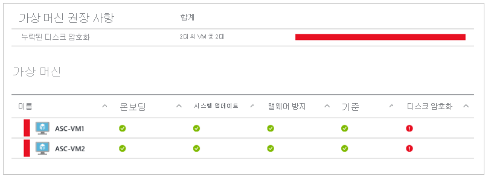

# Windows VM용 Azure 디스크 암호화 

Azure Disk Encryption은 조직의 보안 및 규정 준수 약정에 따라 데이터를 안전하게 보호하는 데 도움이 됩니다. Windows의 [Bitlocker](https://en.wikipedia.org/wiki/BitLocker) 기능을 사용하여 Azure 가상 시스템(VM)의 OS 및 데이터 디스크에 대한 볼륨 암호화를 제공하며 [Azure Key Vault와](../../key-vault/index.yml) 통합되어 디스크 암호화 키 및 비밀을 제어하고 관리할 수 있습니다. 

[Azure 보안 센터를](../../security-center/index.yml)사용하는 경우 암호화되지 않은 VM이 있는 경우 경고가 표시됩니다. 이 경고는 심각도가 높다고 표시되며 이러한 VM을 암호화하도록 권장합니다.

> [!WARNING]
> - 이전에 Azure AD와 함께 Azure 디스크 암호화를 사용하여 VM을 암호화한 경우 이 옵션을 계속 사용하여 VM을 암호화해야 합니다. 자세한 내용은 [Azure AD(이전 릴리스)가 있는 Azure 디스크 암호화를](disk-encryption-overview-aad.md) 참조하십시오. 
> - 특정 권장 사항으로 인해 데이터, 네트워크 또는 컴퓨팅 리소스 사용량이 증가할 수 있으며 이로 인해 라이선스 또는 구독 비용이 발생합니다. 사용자는 유효한 활성 Azure 구독을 포함하여 지원되는 지역에서 Azure에 리소스를 만들어야 합니다.

Azure [CLI 빠른 시작 또는](disk-encryption-cli-quickstart.md) Azure Powershell 빠른 시작을 사용하여 Windows VM 만들기 및 암호화를 사용하여 몇 분 만에 Windows용 Azure 디스크 암호화의 기본 을 [학습하고](disk-encryption-powershell-quickstart.md)암호화할 수 있습니다.

## 지원되는 VM 및 운영 체제

### 지원되는 VM

Windows VM은 [다양한 크기로](sizes-general.md)제공됩니다. Azure 디스크 암호화는 [기본, A 시리즈 VM](https://azure.microsoft.com/pricing/details/virtual-machines/series/)또는 메모리가 2GB 미만인 가상 컴퓨터에서는 사용할 수 없습니다.

Azure 디스크 암호화는 프리미엄 저장소가 있는 VM에서도 사용할 수 있습니다.

Azure 디스크 암호화는 [세대 2 VM)](generation-2.md#generation-1-vs-generation-2-capabilities)및 [Lsv2 시리즈 VM에서](../lsv2-series.md)사용할 수 없습니다. 추가 예외는 [Azure 디스크 암호화: 지원되지 않는 시나리오를](disk-encryption-windows.md#unsupported-scenarios)참조하십시오.

### 지원되는 운영 체제

- 윈도우 클라이언트 : 윈도우 8 이상.
- 윈도우 서버 : 윈도우 서버 2008 R2 이상.  
 
> [!NOTE]
> Windows Server 2008 R2에는 암호화를 위해 .NET Framework 4.5를 설치해야 합니다. 옵션 업데이트와 윈도우 업데이트에서 설치 마이크로 소프트 .NET 프레임 워크 4.5.2 윈도우 서버 2008 R2 x64 기반 시스템[(KB2901983).](https://www.catalog.update.microsoft.com/Search.aspx?q=KB2901983)  
>  
> Windows Server 2012 R2 코어 및 Windows 서버 2016 코어는 암호화를 위해 VM에 bdehdcfg 구성 요소를 설치해야 합니다.

## 네트워킹 요구 사항
Azure 디스크 암호화를 사용하려면 VM이 다음 네트워크 끝점 구성 요구 사항을 충족해야 합니다.
  - 키 자격 증명 모음에 연결하는 토큰을 얻으려면 Windows VM이 Azure Active Directory \[끝점인 login.microsoftonline.com\]에 연결할 수 있어야 합니다.
  - 키 자격 증명 모음에 암호화 키를 쓰려면 Windows VM이 키 자격 증명 모음 끝점에 연결할 수 있어야 합니다.
  - Windows VM은 Azure 확장 리포지토리를 호스팅하는 Azure 저장소 끝점과 VHD 파일을 호스트하는 Azure 저장소 계정에 연결할 수 있어야 합니다.
  -  보안 정책이 Azure VM에서 인터넷으로 액세스를 제한하는 경우 이전 URI를 확인하고 IP에 대한 아웃바운드 연결을 허용하도록 특정 규칙을 구성할 수 있습니다. 자세한 내용은 [방화벽 뒤에 있는 Azure Key Vault](../../key-vault/general/access-behind-firewall.md)를 참조하세요.    

## 그룹 정책 요구 사항

Azure 디스크 암호화는 Windows VM용 BitLocker 외부 키 보호를 사용합니다. 도메인 가입 VM의 경우 TPM 보호기를 적용하는 그룹 정책을 푸시하지 않습니다. "호환되는 TPM 없이 BitLocker 허용"에 대한 그룹 정책에 대한 자세한 내용은 [BitLocker 그룹 정책 참조를](/windows/security/information-protection/bitlocker/bitlocker-group-policy-settings#bkmk-unlockpol1)참조하십시오.

사용자 지정 그룹 정책이 있는 도메인 에 대한 BitLocker 정책에는 다음 설정이 포함되어야 합니다 [>.](/windows/security/information-protection/bitlocker/bitlocker-group-policy-settings) BitLocker에 대한 사용자 지정 그룹 정책 설정이 호환되지 않으면 Azure Disk Encryption이 실패합니다. 올바른 정책 설정이 없는 머신에서 새 정책을 적용하고, 새 정책을 강제로 업데이트한(gpupdate.exe /force) 다음, 다시 시작해야 할 수 있습니다.

도메인 수준 그룹 정책이 BitLocker에서 사용하는 AES-CBC 알고리즘을 차단하면 Azure 디스크 암호화가 실패합니다.

## 암호화 키 스토리지 요구 사항  

Azure 디스크 암호화에는 디스크 암호화 키 및 비밀을 제어하고 관리하기 위해 Azure 키 자격 증명 모음이 필요합니다. 키 자격 증명 모음 및 VM은 동일한 Azure 리전 및 구독에 있어야 합니다.

자세한 내용은 [Azure 디스크 암호화에 대한 키 자격 증명 모음 만들기 및 구성을](disk-encryption-key-vault.md)참조하십시오.

## 용어
다음 표에서는 Azure 디스크 암호화 설명서에 사용되는 몇 가지 일반적인 용어를 정의합니다.

| 용어 | 정의 |
| --- | --- |
| Azure Key Vault | Key Vault는 FIPS(Federal Information Processing Standard) 검증 하드웨어 보안 모듈을 기반으로 하는 암호화 키 관리 서비스입니다. 이러한 표준은 암호화 키 및 중요한 비밀을 보호하는 데 도움이 됩니다. 자세한 내용은 Azure [Key Vault](https://azure.microsoft.com/services/key-vault/) 설명서 및 [Azure 디스크 암호화에 대한 키 자격 증명 모음 만들기 및 구성을](disk-encryption-key-vault.md)참조하십시오. |
| Azure CLI | [Azure CLI](/cli/azure/install-azure-cli)는 명령줄에서 Azure 리소스를 관리하고 관리하는 데 최적화되어 있습니다.|
| BitLocker |[BitLocker는](https://technet.microsoft.com/library/hh831713.aspx) Windows VM에서 디스크 암호화를 활성화하는 데 사용되는 업계에서 인정받는 Windows 볼륨 암호화 기술입니다. |
| 키 암호화 키(KEK) | 비밀을 보호하거나 래핑하는 데 사용할 수 있는 비대칭 키(RSA 2048)입니다. HSM(하드웨어 보안 모듈) 보호 키 또는 소프트웨어 보호 키를 제공할 수 있습니다. 자세한 내용은 Azure [Key Vault](https://azure.microsoft.com/services/key-vault/) 설명서 및 [Azure 디스크 암호화에 대한 키 자격 증명 모음 만들기 및 구성을](disk-encryption-key-vault.md)참조하십시오. |
| PowerShell cmdlet | 자세한 내용은 [Azure PowerShell cmdlet](/powershell/azure/overview)을 참조하세요. |

## 다음 단계

- [빠른 시작 - Azure CLI를 사용하여 Windows VM 생성 및 암호화](disk-encryption-cli-quickstart.md)
- [빠른 시작 - Azure Powershell을 사용하여 Windows VM 생성 및 암호화](disk-encryption-powershell-quickstart.md)
- [Windows VM에 대한 Azure Disk Encryption 시나리오](disk-encryption-windows.md)
- [Azure 디스크 암호화 필수 구성 조건 CLI 스크립트](https://github.com/ejarvi/ade-cli-getting-started)
- [Azure 디스크 암호화 필수 구성 조건 PowerShell 스크립트](https://github.com/Azure/azure-powershell/tree/master/src/Compute/Compute/Extension/AzureDiskEncryption/Scripts)
- [Azure Disk Encryption을 위한 키 자격 증명 모음 만들기 및 구성](disk-encryption-key-vault.md)

