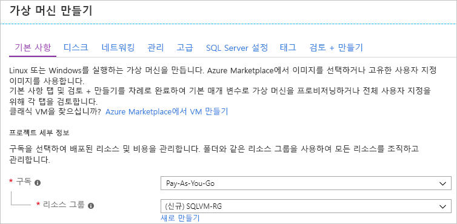
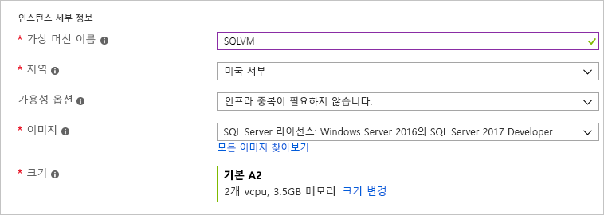
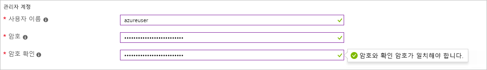
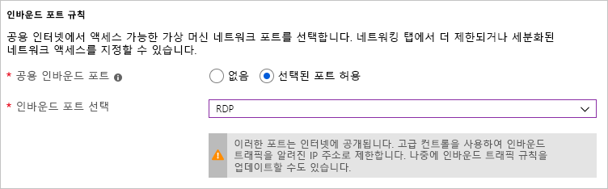

# Azure Portal에서 Windows SQL Server 가상 머신 프로비전하는 방법

이 가이드에서는 Azure Portal에서 Windows SQL Server 가상 머신을 만드는 경우 사용할 수 있는 다양한 옵션에 대한 상세 정보를 제공합니다. 이 아티클에서는 가능한 하나의 프로비전 작업을 살펴보며 [SQL Server VM 빠른 시작](quickstart-sql-vm-create-portal.md)보다 많은 구성 옵션에 대해 설명합니다. 

이 가이드를 사용하여 고유한 SQL Server VM을 만듭니다. 또는 그것을 Azure Portal에서 사용 가능한 옵션에 대한 참조로 사용합니다.

> [!TIP]
> SQL Server 가상 머신에 대한 질문이 있으면 [질문과 대답](virtual-machines-windows-sql-server-iaas-faq.md)을 참조하세요.

Azure 구독이 아직 없는 경우 시작하기 전에 [체험 계정](https://azure.microsoft.com/free/?WT.mc_id=A261C142F)을 만듭니다.

## SQL Server 가상 머신 갤러리 이미지

SQL Server 가상 머신을 만들 때 가상 머신 갤러리에서 미리 구성된 여러 이미지 중 하나를 선택할 수 있습니다. 다음 단계에서는 SQL Server 2017 이미지 중 하나를 선택하는 방법을 보여줍니다.

1. 사용자 계정을 사용하여 [Azure Portal](https://portal.azure.com)에 로그인합니다.

1. Azure Portal에서 **리소스 만들기**를 클릭합니다. 포털에 **새** 창이 열립니다.

1. **새로 만들기** 창에서 **Compute**를 클릭한 다음, **모두 표시**를 클릭합니다.

1. 검색 필드에 **SQL Server 2017**을 입력하고 ENTER 키를 누릅니다.

1. 필터 드롭다운 목록에서 선택 _Windows Server 2016_ 에 대 한 합니다 **운영 체제** 선택한 _Microsoft_ 으로 **게시자**합니다. 

     

1. 사용 가능한 SQL Server 이미지를 검토합니다. 각 이미지는 SQL Server 버전 및 운영 체제를 식별합니다.

1. **무료 SQL Server 라이선스: Windows Server 2016의 SQL Server 2017 Developer** 이미지를 선택합니다.

   > [!TIP]
   > 개발자 버전은 개발 테스트 목적으로 무료로 제공되는 SQL Server의 모든 기능을 갖춘 버전이므로 이 연습에서 사용됩니다. VM 실행 비용에 대해서만 비용을 지불합니다. 그러나 이 연습에 사용할 이미지를 자유롭게 선택할 수 있습니다. 사용 가능한 이미지에 대한 설명은 [SQL Server Windows Virtual Machines 개요](virtual-machines-windows-sql-server-iaas-overview.md#payasyougo)를 참조하세요.

   > [!TIP]
   > SQL Server의 라이선스 비용은 사용자가 만드는 VM의 초당 가격에 통합되며 에디션과 코어에 따라 다릅니다. 그러나 SQL Server 개발자 에디션은 개발/테스트(비 프로덕션)를 위한 평가판이며, SQL Express는 간단한 워크로드(1GB 미만 메모리, 10GB 미만 저장소)를 위한 평가판입니다. 또한 BYOL(사용자 라이선스 필요)할 수 있으며 VM에 대해서만 지불에 대해서만 지불합니다. 이러한 이미지 이름에는 접두사 {BYOL}이 붙습니다. 
   >
   > 이러한 옵션에 대한 자세한 내용은 [SQL Server Azure VM에 대한 가격 책정 지침](virtual-machines-windows-sql-server-pricing-guidance.md)을 참조하세요.

1. **배포 모델 선택**에서 **리소스 관리자**가 선택되어 있는지 확인합니다. 리소스 관리자는 새로운 가상 머신에 권장되는 배포 모델입니다. 

1. **만들기**를 선택합니다.

##  구성 옵션

SQL Server 가상 컴퓨터를 구성 하는 것에 대 한 여러 탭이 있습니다. 이 가이드에서는 다음에 대해 살펴볼 것: 

| 단계 | 설명 |
| --- | --- |
| **기본 사항** |[기본 설정 구성](#1-configure-basic-settings) |
| **선택적 기능** |[선택적 기능 구성](#2-configure-optional-features) |
| **SQL 서버 설정** |[SQL Server 설정 구성](#3-configure-sql-server-settings) |
| **검토 + 만들기** | [요약 검토](#4-review--create) |

## 1. 기본 설정 구성

**기본** 탭에서 다음 정보를 제공합니다.

* 아래 **프로젝트 세부 정보**, 올바른 구독이 선택 되어 있는지 확인 합니다. 
*  에 **리소스 그룹** 섹션을 선택 하거나 기존 리소스 그룹 목록에서 또는를 선택 하는 **새로 만들기** 를 새 리소스 그룹을 만듭니다. 리소스 그룹은 Azure 내 관련 리소스의 컬렉션입니다(가상 머신, 저장소 계정, 가상 네트워크 등). 

    

  > [!NOTE]
  > 새 리소스 그룹을 사용하면 Azure에서 SQL Server 배포를 테스트하거나 알아보는 경우에 유용합니다. 테스트를 완료한 후 리소스 그룹을 삭제하면 VM과 해당 리소스 그룹과 연결된 모든 리소스가 자동으로 삭제됩니다. 리소스 그룹에 대한 자세한 내용은 [Azure Resource Manager 개요](../../../azure-resource-manager/resource-group-overview.md)를 참조하세요.

* **인스턴스 세부 정보**에서
    1. 고유한 입력 **가상 머신 이름**합니다.  
    1. **영역**에 위치를 선택합니다. 
    1. 이 가이드에서는 둡니다 **가용성 옵션** 로 설정 _필수 인프라 중복 되지 않은_합니다. 가용성 옵션에 대한 자세한 내용을 알아보려면 [Azure 지역 및 가용성](../../windows/regions-and-availability.md)을 참조하세요. 
    1. **이미지** 목록에서 _무료 SQL Server 라이선스: Windows Server 2016의 SQL Server 2017 Developer_ 이미지를 선택합니다.  
    1. 가상 머신의 **크기**에서 **크기 변경**을 선택하고 **A2 Basic** 제품을 선택합니다. 리소스를 다 사용했으면 예기치 않은 요금이 청구되지 않도록 리소스를 삭제하세요. 프로덕션 워크로드의 경우 [Azure Virtual Machines의 SQL Server에 대한 성능 모범 사례](virtual-machines-windows-sql-performance.md)에서 권장하는 컴퓨터 크기 및 구성을 참조하세요.

    

> [!IMPORTANT]
> **크기 선택** 창에 표시된 월별 예상 비용에는 SQL Server 라이선스 비용이 포함되지 않습니다. 이 예상 비용은 VM만의 비용입니다. SQL Server의 Express 및 개발자 버전의 경우, 이 예상 비용은 총 예상 비용입니다. 다른 버전의 경우 [Windows Virtual Machines 가격 책정 페이지](https://azure.microsoft.com/pricing/details/virtual-machines/windows/)를 참조하여 SQL Server의 대상 버전을 선택하세요. 도 참조를 [가격 책정 SQL Server Azure Vm에 대 한 지침](virtual-machines-windows-sql-server-pricing-guidance.md) 및 [가상 머신 크기](../sizes.md?toc=%2fazure%2fvirtual-machines%2fwindows%2ftoc.json)합니다.

* 아래 **관리자 계정**, 사용자 이름 및 암호를 제공 합니다. 암호는 12자 이상이어야 하며 [정의된 복잡성 요구 사항](../../windows/faq.md#what-are-the-password-requirements-when-creating-a-vm)을 충족해야 합니다.

   

* **인바운드 포트 규칙**에서 **선택한 포트 허용**을 선택한 다음, 드롭다운에서 **RDP(3389)** 를 선택합니다. 

   

## 2. 선택적 기능 구성

### 디스크

에 **디스크** 탭에서 디스크 옵션을 구성 합니다. 

* 아래 **OS 디스크 유형**, 드롭다운 목록에서 OS에 사용할 디스크 유형을 선택 합니다. Premium은 프로덕션 시스템에 대 한 권장 되지만 기본 VM을 사용할 수 없습니다. Premium SSD를 활용 하려면 가상 컴퓨터 크기를 변경 합니다. 
* 아래 **고급**를 선택 **예** 사용 하 여 아래 **Managed Disks**합니다.

   > [!NOTE]
   > SQL Server에 Managed Disks를 사용하는 것이 좋습니다. Managed Disks는 배후에서 저장소를 처리해줍니다. 또한 Managed Disks가 있는 가상 머신이 동일한 가용성 집합에 속할 경우 Azure는 저장소 리소스를 배포하여 적절한 중복성을 제공합니다. 자세한 내용은 [Azure Managed Disks Overview][../managed-disks-overview.md)를 참조하세요. 가용성 집합의 managed disks에 대 한 자세한 내용은 참조 하세요. [사용 하 여 관리 디스크를 Vm에 대 한 가용성 집합] (.. /manage-availability.md 합니다.

  
  
### 네트워킹

에 **네트워킹** 탭에서 네트워킹 옵션을 구성 합니다. 

* 새 **가상 네트워크**, 또는 SQL Server VM에 대 한 기존 vNet을 사용 합니다. 지정 된 **서브넷** 도 합니다. 

* 아래 **NIC 보안 그룹**, 기본 보안 그룹 또는 고급 보안 그룹 중 하나를 선택 합니다. SQL Server VM에 대 한 인바운드 포트를 선택할 수 있습니다 기본 옵션을 선택 하면 (에서 구성 된 동일한 값을 **기본** 탭). 고급 옵션을 선택 하면 기존 네트워크 보안 그룹을 선택 하거나 새로 만들 수 있습니다. 

* 네트웨크 설정을 변경해도 되고 기본 값을 그대로 유지해도 됩니다.

#### 모니터링

에 **모니터링** 탭, 모니터링 및 자동 종료를 구성 합니다. 

* Azure 사용 하도록 설정 **부팅 모니터링** 동일한 저장소 계정에 대해 기본적으로 VM에 대해 지정 합니다. 여기서 뿐만 아니라 사용 하도록 설정 하면 이러한 설정을 변경할 수 있습니다 **OS 게스트 진단**합니다. 
* 설정할 수 있습니다 **시스템 관리 되는 id를 할당** 하 고 **자동 종료** 이 탭 합니다. 

## 3. SQL Server 설정 구성

에 **SQL Server 설정을** 탭에서 특정 설정 및 SQL Server에 대 한 최적화를 구성 합니다. SQL Server에 대해 구성할 수 있는 설정은 다음과 같습니다.

| 설정 |
| --- |
| [연결](#connectivity) |
| [인증](#authentication) |
| [Azure Key Vault 통합](#azure-key-vault-integration) |
| [Storage 구성](#storage-configuration) |
| [자동화된 패치](#automated-patching) |
| [자동화된 Backup](#automated-backup) |
| [R Services (고급 분석)](#r-services-advanced-analytics) |

### 연결

**SQL 연결**에서 VM의 SQL Server 인스턴스에 대해 원하는 액세스 유형을 지정합니다. 이 연습에서는 **공개(인터넷)** 를 지정하여 인터넷 상의 컴퓨터 또는 서비스에서 SQL Server로의 연결을 허용합니다. 이 옵션을 선택 하면 Azure는 방화벽 및 선택한 포트에서 트래픽을 허용 하도록 네트워크 보안 그룹에 자동으로 구성 합니다.

> [!TIP]
> 기본적으로 SQL Server는 잘 알려진 포트 **1433**에서 수신 대기합니다. 보안 향상을 위해 이전 대화 상자의 포트를 기본 이외 포트(예: 1401)를 수신하도록 변경하세요. 포트를 변경할 경우 SSMS와 같이 모든 클라이언트 도구의 해당 포트를 사용하여 연결해야 합니다.

인터넷을 통해 SQL Server에 연결하려면 SQL Server 인증을 사용하도록 설정해야 합니다. 이 내용은 다음 섹션에 설명되어 있습니다.

인터넷을 통해 데이터베이스 엔진에 대한 연결을 사용하도록 설정하지 않으려면 다음 옵션 중 하나를 선택합니다.

* **로컬(VM 내부만)** 을 선택합니다.
* **사설(Virtual Network 내)** 을 선택합니다.

일반적으로, 시나리오에 허용되는 가장 제한적인 연결을 선택하여 보안을 개선합니다. 하지만 모든 옵션은 네트워크 보안 그룹 및 SQL/Windows 인증을 통해 보안을 설정할 수 있습니다. VM이 만들어진 후에 네트워크 보안 그룹을 편집할 수 있습니다. 자세한 내용은 [Azure Virtual Machines의 SQL Server에 대한 보안 고려 사항](virtual-machines-windows-sql-security.md)을 참조하세요.

### Authentication

SQL Server 인증이 필요하도록 지정하려면 **사용** under **사용**을 방문하십시오.

> [!NOTE]
> 인터넷(공용 연결 옵션)을 통해 SQL Server에 액세스하려는 경우 여기에서 SQL 인증을 사용해야 합니다. SQL Server에 대한 공용 액세스를 위해서는 SQL 인증을 사용해야 합니다.

SQL Server 인증을 사용하도록 설정하는 경우 **로그인 이름** 및 **암호**를 지정합니다. 이 로그인 이름을 구성 하는 SQL Server 인증 로그인으로의 멤버는 **sysadmin** 고정된 서버 역할입니다. 인증 모드에 대한 자세한 내용은 [인증 모드 선택](https://docs.microsoft.com/sql/relational-databases/security/choose-an-authentication-mode) 을 참조하세요.

SQL Server 인증을 사용하도록 설정하지 않으면, VM의 로컬 관리자 계정을 사용하여 SQL Server 인스턴스에 연결할 수 있습니다.

### Azure Key Vault 통합

Azure에서 암호화를 위한 보안 암호를 저장하려면 **Azure Key Vault 통합**을 클릭하고 **사용**을 클릭합니다.

다음 표에서는 Azure Key Vault 통합을 구성하는 데 필요한 매개 변수를 나열합니다.

| 매개 변수 | 설명 | 예제 |
| --- | --- | --- |
| **주요 자격 증명 모음 URL** |주요 자격 증명 모음의 위치입니다. |https:\//contosokeyvault.vault.azure.net/ |
| **주체 이름** |Azure Active Directory 서비스 주체 이름. 이 이름을 클라이언트 ID라고도 합니다. |fde2b411-33d5-4e11-af04eb07b669ccf2 |
| **주체 암호** |Azure Active Directory 서비스 주체 암호입니다. 이 암호를 클라이언트 암호라고도 합니다. |9VTJSQwzlFepD8XODnzy8n2V01Jd8dAjwm/azF1XDKM= |
| **자격 증명 이름** |**자격 증명 이름**: AKV 통합은 VM이 주요 자격 증명 모음에 액세스할 수 있도록 SQL Server 내에 자격 증명을 만듭니다. 이 자격 증명의 이름을 선택하세요. |mycred1 |

자세한 내용은 [Azure VM에서 SQL Server에 대한 Azure Key Vault 통합 구성](virtual-machines-windows-ps-sql-keyvault.md)을 참조하세요.

### Storage 구성

아래 **저장소 구성**를 선택 **구성 변경** 저장소 요구 사항을 지정 합니다.

> [!NOTE]
> 표준 저장소를 사용하도록 VM을 수동으로 구성한 경우 이 옵션은 사용할 수 없습니다. 자동 스토리지 최적화는 Premium Storage에서만 사용할 수 있습니다.

> [!TIP]
> 정지 수와 각 슬라이더의 상한값은 사용자가 선택한 VM 크기에 따라 다릅니다. 더 크고 효율적인 VM이 추가 확장할 수 있습니다.

초당 입/출력 작업(IOPs), 처리량(MB/s) 및 총 저장소 크기로 요구 사항을 지정할 수 있습니다. 슬라이딩 규모를 사용하여 이 값을 구성합니다. 워크로드에 따라 이러한 저장소 설정을 변경할 수 있습니다. 포털에는 이러한 요구 사항에 따라 장착 및 구성할 디스크 수를 자동으로 계산합니다.

**다음에 대해 Storage 최적화**에서 다음 옵션 중 하나를 선택합니다.

* **일반**은 기본 설정이며 대부분의 워크로드를 지원합니다.
* **트랜잭션** 처리는 기존의 데이터베이스 OLTP 워크로드용으로 저장소를 최적화합니다.
* **데이터 웨어하우징**은 분석 및 보고 워크로드용으로 저장소를 최적화합니다.

### SQL Server 라이선스
Software Assurance 고객 인 경우를 사용할 수 있습니다 합니다 [Azure Hybrid Benefit](https://azure.microsoft.com/pricing/hybrid-benefit/) 를 사용자 고유의 SQL Server 라이선스를 가져오고 리소스에 저장 합니다. 

### 자동화된 패치

**Automated patching**이 사용됩니다. Azure에서는 자동화된 패치를 통해 SQL Server와 운영 체제를 자동으로 패치합니다. 요일, 시간 및 유지 관리 기간에 대한 날짜를 지정합니다. Azure에서 유지 관리 기간에 패치를 수행합니다. 유지 관리 기간 일정에서는 VM 로캘 시간을 사용합니다. Azure에서 SQL Server와 운영 체제를 자동으로 패치하지 않으려면 **사용 안 함**을 클릭합니다.  

자세한 내용은 [Azure Virtual Machines에서 SQL Server의 자동화된 패치](virtual-machines-windows-sql-automated-patching.md)를 참조하세요.

### 자동화된 백업

**자동화된 백업**에서 모든 데이터베이스에 대해 자동 데이터베이스 백업을 사용하도록 설정합니다. 자동화된 백업은 기본적으로 사용하지 않도록 설정됩니다.

SQL 자동화된 백업을 사용하도록 설정하면 다음 설정을 구성할 수 있습니다.

* 백업에 대한 보존 기간(일)
* 백업에 사용할 Storage 계정
* 백업을 위한 암호화 옵션 및 암호
* 시스템 데이터베이스 Backup
* 백업 일정 구성

백업을 암호화하려면 **사용**을 클릭합니다. 그 다음 **암호**를 지정합니다. Azure에서는 백업을 암호화할 인증서를 만들고 지정된 암호를 사용하여 인증서를 보호합니다.

자세한 내용은 [Azure Virtual Machines에서 SQL Server에 대한 자동화된 백업](virtual-machines-windows-sql-automated-backup.md)을 참조하세요.

### R Services (고급 분석)

사용 하도록 설정 하는 옵션이 있습니다 [SQL Server R Services (고급 분석)](/sql/advanced-analytics/r/sql-server-r-services/)합니다. 이 옵션을 사용하면 SQL Server 2017로 고급 분석을 사용할 수 있습니다. **SQL Server 설정** 창에서 **사용**을 클릭합니다.

## 4. 검토 + 만들기

**검토 + 만들기** 탭에서 요약을 검토하고 **만들기**를 선택하여 이 VM에 지정된 SQL Server, 리소스 그룹 및 리소스를 만듭니다.

Azure Portal에서 배포를 모니터링할 수 있습니다. 화면 맨 위에 있는 **알림** 단추는 배포의 기본 상태를 표시합니다.

> [!NOTE]
> 배포 시간에 대한 정보를 제공하기 위해 SQL VM을 미국 동부 지역에 기본 설정을 사용하여 배포해 두었습니다. 이 테스트 배포를 완료하는 데 약 12분이 걸렸습니다. 사용자의 지역 및 선택한 설정에 따라서 배포 시간이 더 빠르거나 늦을 수 있습니다.

##  원격 데스크톱을 사용하여 VM 열기

다음 단계를 사용하여 원격 데스크톱으로 SQL Server 가상 머신에 연결합니다.

[!INCLUDE [Connect to SQL Server VM with remote desktop](../../../../includes/virtual-machines-sql-server-remote-desktop-connect.md)]

SQL Server 가상 머신에 연결된 후에, SQL Server Management Studio를 시작하고 로컬 관리자 자격 증명을 사용하여 Windows 인증으로 연결할 수 있습니다. SQL Server 인증을 사용하도록 설정한 경우에는, 프로비전 중에 구성해 놓은 SQL 로그인 및 암호를 사용하여 SQL 인증에 연결할 수 있습니다.

컴퓨터에 연결하면 요구 사항에 따라 컴퓨터와 SQL Server 설정을 직접 변경할 수 있습니다. 예를 들어, 방화벽 설정을 구성하거나 SQL Server 구성 설정을 변경할 수 있습니다.

##  원격으로 SQL Server에 연결

이 연습에서는 가상 머신과 **SQL Server 인증**에 대해 **공용** 액세스를 선택했습니다. 이러한 설정은 가상 머신이 인터넷을 통한 모든 클라이언트의 SQL Server 연결을 허용하도록 자동으로 구성합니다(올바른 SQL 로그인이 있다는 가정 하에).

> [!NOTE]
> 프로비전 중에 공용을 선택하지 않은 경우 프로비전 후 포털을 통해 SQL 연결 설정을 변경할 수 있습니다. 자세한 내용은 [SQL 연결 설정 변경](virtual-machines-windows-sql-connect.md#change)을 참조하세요.

다음 섹션은 인터넷을 통해 SQL Server VM 인스턴스에 연결하는 방법을 보여줍니다.

[!INCLUDE [Connect to SQL Server in a VM Resource Manager](../../../../includes/virtual-machines-sql-server-connection-steps-resource-manager.md)]

  > [!NOTE]
  > 이 예제에서는 공용 포트 1433을 사용 합니다. 그러나이 값 (예: 1401) 다른 포트는 SQL Server VM을 배포 하는 동안 지정 된 경우 수정 해야 합니다. 

## 다음 단계

Azure에서 SQL Server를 사용하는 방법에 대한 기타 정보는 [Azure Virtual Machines의 SQL Server](virtual-machines-windows-sql-server-iaas-overview.md) 및 [질문과 대답](virtual-machines-windows-sql-server-iaas-faq.md)을 참조하세요.