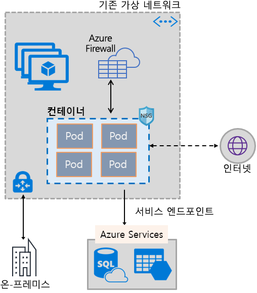
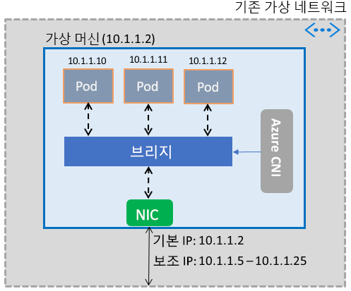

# 컨테이너가 Azure Virtual Network 기능을 사용하도록 설정

가상 머신을 구동하는 동일한 소프트웨어 정의 네트워킹 스택을 활용하여 다양한 Azure 네트워크 기능을 컨테이너에 제공합니다. Azure Virtual Network CNI(컨테이너 네트워크 인터페이스) 플러그인은 Azure Virtual Machine에 설치됩니다. 플러그인은 가상 네트워크의 IP 주소를 가상 머신에 가져온 컨테이너에 할당하고, 이것을 가상 네트워크에 연결하고, 이것을 다른 컨테이너 및 가상 네트워크 리소스에 직접 연결합니다. 플러그인은 오버레이 네트워크나 경로, 연결에 의존하지 않으며 가상 머신과 동일한 성능을 제공합니다. 높은 수준에서, 플러그 인은 다음과 같은 기능을 제공합니다.

- 가상 네트워크 IP 주소는 하나 이상의 컨테이너로 구성될 수 있는 모든 Pod에 지정됩니다.
- Pod는 피어링된 가상 네트워크에 연결될 수 있고 ExpressRoute 또는 사이트 간 VPN을 통해 온-프레미스에 연결할 수 있습니다. Pod는 피어링된 네트워크 및 온 프레미스 네트워크에서도 연결할 수 있습니다.
- Pod는 가상 네트워크 서비스 엔드포인트로 보호되는 Azure Storage 및 Azure SQL Database와 같은 서비스에 액세스할 수 있습니다.
- 네트워크 보안 그룹 및 경로는 Pod에 직접 적용될 수 있습니다.
- Pod는 가상 머신처럼 Azure 내부 또는 공용 Load Balancer 바로 뒤에 배치할 수 있습니다
- Pod에 공용 IP 주소가 할당되면 인터넷에서 직접 액세스할 수 있습니다. Pod는 인터넷에 직접 액세스할 수도 있습니다.
- 서비스, 수신 컨트롤러 및 Kube DNS와 같은 Kubernetes 리소스와 원활하게 작동합니다. Kubernetes 서비스는 Azure Load Balancer를 통해 내부 또는 외부로 노출될 수도 있습니다.

다음 그림은 플러그 인이 Azure Virtual Network 기능을 Pod에 어떻게 제공하는지 보여줍니다.

이 플러그 인은 Linux 및 Windows 플랫폼을 둘 다 지원합니다.

## Pod를 가상 네트워크에 연결

Pod는 가상 네트워크의 일부인 가상 머신에서 가져옵니다. Pod의 IP 주소 풀은 가상 머신의 네트워크 인터페이스에서 보조 주소로 구성됩니다. Azure CNI는 Pod를 위한 기본 네트워크 연결을 설정하고 풀에 있는 IP 주소의 사용을 관리합니다. Pod가 가상 머신에 나타나면 Azure CNI는 풀에서 사용 가능한 IP 주소를 할당하고 Pod를 가상 머신의 소프트웨어 브리지에 연결합니다. Pod가 종료되면 IP 주소가 풀에 다시 추가됩니다. 다음 그림은 Pod가 가상 네트워크에 연결하는 방법을 보여줍니다.

## 인터넷 액세스

Pod가 인터넷에 액세스할 수 있도록, 플러그인은 Pod의 인터넷 바인딩 트래픽에 NAT(Network Address Translation)를 수행하도록 *iptables* 규칙을 구성합니다. 패킷의 원본 IP 주소는 가상 머신의 네트워크 인터페이스에서 기본 IP 주소로 변환됩니다. Windows 가상 머신은 가상 머신이 있는 서브넷 외부의 IP 주소로 지정된 NAT(SNAT) 트래픽을 자동으로 소싱합니다. 일반적으로 가상 네트워크의 IP 범위를 벗어난 IP 주소로 향하는 모든 트래픽은 변환됩니다.

## 제한

플러그 인은 가상 머신당 최대 250개의 Pod를 지원하고 가상 네트워크에서 최대 16,000개의 Pod를 지원합니다. 이러한 제한은 [Azure Kubernetes Service](../azure-subscription-service-limits.md?toc=%2fazure%2fvirtual-network%2ftoc.json#azure-kubernetes-service-limits)에 따라 다릅니다.

## 플러그 인 사용

플러그인은 Pod 또는 Docker 컨테이너에 대한 기본 가상 네트워크 연결을 제공하기 위해 다음과 같은 방식으로 사용될 수 있습니다.

- **Azure Kubernetes Service**: 이 플러그 인은 AKS(Azure Kubernetes Service)에 통합되어 있으며 *고급 네트워킹* 옵션을 선택하여 사용할 수 있습니다. 고급 네트워킹을 사용하면 기존 또는 새로운 가상 네트워크에 Kubernetes 클러스터를 배포할 수 있습니다. 고급 네트워킹 및 설정 단계에 대한 자세한 내용은 [AKS의 네트워크 구성](../aks/networking-overview.md?toc=%2fazure%2fvirtual-network%2ftoc.json)을 참조하십시오.
- **AKS 엔진**: AKS 엔진은 Azure에서 Kubernetes 클러스터 배포를 위한 Azure Resource Manager 템플릿을 생성하는 도구입니다. 자세한 지침은 [AKS 엔진 Kubernetes 클러스터용 플러그 인 배포](deploy-container-networking.md#deploy-the-azure-virtual-network-container-network-interface-plug-in)를 참조하세요.
- **Azure에서 사용자 고유의 Kubernetes 클러스터 만들기**: 이 플러그 인은 AKS 또는 AKS 엔진과 같은 도구를 사용하지 않고 직접 배포하는 Kubernetes 클러스터의 Pod에 대한 기본 네트워킹을 제공하는 데 사용할 수 있습니다. 이 경우 플러그 인은 클러스터의 모든 가상 머신에 설치되어 사용이 가능하게 됩니다. 자세한 지침은 [직접 배포하는 Kubernetes 클러스터를 위한 플러그 인 배포](deploy-container-networking.md#deploy-plug-in-for-a-kubernetes-cluster)를 참조하세요.
- **Azure에서 Docker 컨테이너에 대한 가상 네트워크 연결**: 이 플러그 인은 Kubernetes 클러스터를 만들지 않고 가상 머신에 가상 네트워크가 연결된 Docker 컨테이너를 만들려는 경우에 사용할 수 있습니다. 자세한 지침은 [Docker용 플러그 인 배포](deploy-container-networking.md#deploy-plug-in-for-docker-containers)를 참조하세요.

## 다음 단계

Kubernetes 클러스터 또는 Docker 컨테이너용 [플러그 인 배포](deploy-container-networking.md)
