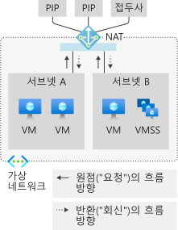
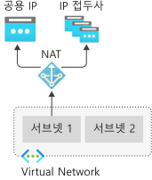
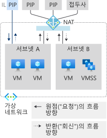
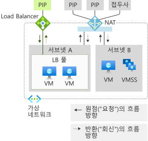
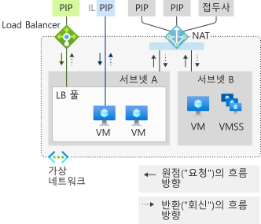
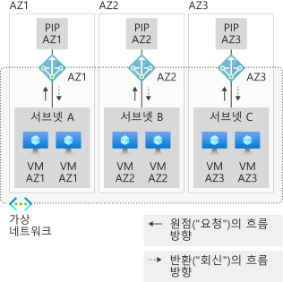
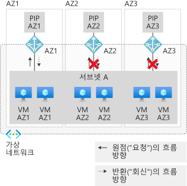
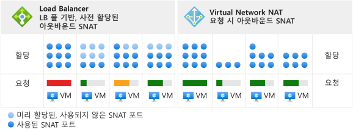
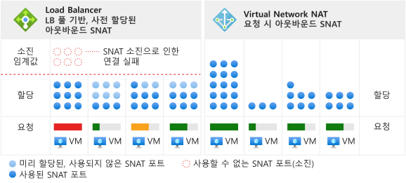

# NAT 게이트웨이 리소스를 사용하여 가상 네트워크 설계

NAT 게이트웨이 리소스는 [Virtual Network NAT](nat-overview.md)의 일부이며, 가상 네트워크에 있는 하나 이상의 서브넷에 대한 아웃바운드 인터넷 연결을 제공합니다. 가상 네트워크의 서브넷에는 사용할 NAT 게이트웨이가 명시됩니다. NAT는 서브넷에 대한 SNAT(Source Network Address Translation)를 제공합니다.  NAT 게이트웨이 리소스는 아웃바운드 흐름을 만들 때 가상 머신에서 사용하는 고정 IP 주소를 지정합니다. 고정 IP 주소는 공용 IP 주소 리소스, 공용 IP 접두사 리소스 또는 둘 다에서 제공됩니다. NAT 게이트웨이 리소스는 둘 중 하나에서 최대 16개의 고정 IP 주소를 사용할 수 있습니다.

  

*그림: 인터넷으로의 아웃바운드를 위한 Virtual Network NAT*

## NAT를 배포하는 방법

NAT 게이트웨이를 구성하고 사용하는 작업은 의도적으로 간단합니다.  

NAT 게이트웨이 리소스:
- 지역 또는 영역(영역 격리) NAT 게이트웨이 리소스를 만듭니다.
- IP 주소를 할당합니다.
- 필요한 경우 TCP 유휴 시간 제한을 수정합니다(선택 사항).  기본값을 변경하기 <ins>전에</ins> [타이머](#timers)를 검토합니다.

가상 네트워크:
- NAT 게이트웨이를 사용하도록 가상 네트워크 서브넷을 구성합니다.

사용자 정의 경로는 필요하지 않습니다.

## 리소스

리소스는 다음 Azure Resource Manager 예제에서 템플릿과 같은 형식으로 볼 수 있듯이 간단하게 설계되었습니다.  이 템플릿과 같은 형식은 개념과 구조를 설명하기 위해 여기에 나와 있습니다.  사용자 요구에 맞게 예제를 수정합니다.  이 문서는 자습서로 제공되지 않습니다.

다음 다이어그램에서는 다양한 Azure Resource Manager 리소스 간의 쓰기 가능한 참조를 보여 줍니다.  화살표는 쓰기 가능한 위치에서 시작되는 참조의 방향을 나타냅니다. 검토 

  

*그림: Virtual Network NAT 개체 모델*

[풀 기반 Load Balancer 아웃바운드 연결](../load-balancer/load-balancer-outbound-connections.md)에 대한 특정 종속성이 없는 경우 NAT를 대부분의 워크로드에 사용하는 것이 좋습니다.  

[아웃바운드 규칙](../load-balancer/load-balancer-outbound-rules-overview.md)을 포함한 표준 부하 분산 장치 시나리오에서 NAT 게이트웨이로 마이그레이션할 수 있습니다. 마이그레이션하려면 공용 IP 및 공용 IP 접두사 리소스를 부하 분산 장치 프런트 엔드에서 NAT 게이트웨이로 이동합니다. NAT 게이트웨이에는 새 IP 주소가 필요하지 않습니다. 표준 공용 IP 및 접두사는 모두 16개의 IP 주소를 초과하지 않는 한 다시 사용할 수 있습니다. 전환 중에 서비스 중단을 고려하여 마이그레이션을 계획합니다.  프로세스를 자동화하여 중단을 최소화할 수 있습니다. 먼저 스테이징 환경에서 마이그레이션을 테스트합니다.  전환 중에는 인바운드에서 시작된 흐름이 영향을 받지 않습니다.

다음 예제는 Azure Resource Manager 템플릿의 코드 조각입니다.  이 템플릿은 NAT 게이트웨이를 비롯한 여러 리소스를 배포합니다.  이 예제에서 템플릿의 매개 변수는 다음과 같습니다.

- **natgatewayname** - NAT 게이트웨이의 이름입니다.
- **location** - 리소스가 있는 Azure 지역입니다.
- **publicipname** - NAT 게이트웨이와 연결된 아웃바운드 공용 IP의 이름입니다.
- **vnetname** - 가상 네트워크의 이름입니다.
- **subnetname** - NAT 게이트웨이와 연결된 서브넷의 이름입니다.

모든 IP 주소 및 접두사 리소스에서 제공하는 총 IP 주소 수는 총 16개를 초과할 수 없습니다. 1-16 개의 모든 IP 주소가 허용됩니다.

:::code language="json" source="~/quickstart-templates/101-nat-gateway-vnet/azuredeploy.json" range="81-96":::

NAT 게이트웨이 리소스가 만들어지면 가상 네트워크에 있는 하나 이상의 서브넷에서 사용할 수 있습니다. 이 NAT 게이트웨이 리소스를 사용하는 서브넷을 지정합니다. NAT 게이트웨이는 둘 이상의 가상 네트워크에 걸쳐 있을 수 없습니다. 가상 네트워크의 모든 서브넷에 동일한 NAT 게이트웨이를 할당할 필요는 없습니다. 개별 서브넷은 서로 다른 NAT 게이트웨이 리소스를 사용하여 구성할 수 있습니다.

가용성 영역을 사용하지 않는 시나리오는 지역(지정된 영역 없음) 시나리오입니다. 가용성 영역을 사용하는 경우 NAT를 특정 영역으로 격리하는 영역을 지정할 수 있습니다. 영역 중복성은 지원되지 않습니다. NAT [가용성 영역](#availability-zones)을 검토합니다.

:::code language="json" source="~/quickstart-templates/101-nat-gateway-vnet/azuredeploy.json" range="1-146" highlight="81-96":::

NAT 게이트웨이는 가상 네트워크 내의 서브넷에 대한 속성으로 정의됩니다. **vnetname** 가상 네트워크의 **subnetname** 서브넷에 있는 가상 머신에서 만든 흐름은 NAT 게이트웨이를 사용합니다. 모든 아웃바운드 연결은 **natgatewayname**와 연결된 IP 주소를 원본 IP 주소로 사용합니다.

이 예제에서 사용된 Azure Resource Manager 템플릿에 대한 자세한 내용은 다음을 참조하세요.

- [빠른 시작: NAT 게이트웨이 만들기 - Resource Manager 템플릿](quickstart-create-nat-gateway-template.md)
- [Virtual Network NAT](https://azure.microsoft.com/resources/templates/101-nat-gateway-1-vm/)

## 디자인 지침

이 섹션을 검토하여 NAT를 통해 가상 네트워크를 설계할 때 고려해야 하는 사항을 숙지합니다.  

1. [비용 최적화](#cost-optimization)
1. [인바운드 및 아웃바운드의 동시 사용](#coexistence-of-inbound-and-outbound)
2. [기본 리소스 관리](#managing-basic-resources)
3. [가용성 영역](#availability-zones)

### 비용 최적화

[서비스 엔드포인트](virtual-network-service-endpoints-overview.md) 및 [프라이빗 링크](../private-link/private-link-overview.md)는 비용을 최적화하기 위해 고려해야 하는 옵션입니다. 이러한 서비스에는 NAT가 필요하지 않습니다. 서비스 엔드포인트 또는 프라이빗 링크로 전달되는 트래픽은 가상 네트워크의 NAT에서 처리되지 않습니다.  

서비스 엔드포인트는 Azure 서비스 리소스를 가상 네트워크에 연결하고 Azure 서비스 리소스에 대한 액세스를 제어합니다. 예를 들어 Azure 스토리지에 액세스하는 경우 서비스 엔드포인트를 스토리지에 사용하여 데이터 처리 NAT 요금이 발생하지 않도록 방지할 수 있습니다. 서비스 엔드포인트는 무료입니다.

프라이빗 링크는 Azure PaaS 서비스(또는 프라이빗 링크를 통해 호스팅되는 다른 서비스)를 가상 네트워크 내의 프라이빗 엔드포인트로 공개합니다.  프라이빗 링크에 대한 요금은 처리된 기간 및 데이터를 기준으로 청구됩니다.

이러한 방법 중 하나 또는 둘 모두가 시나리오에 적합한지 평가하고 필요에 따라 이를 사용합니다.

### 인바운드 및 아웃바운드의 동시 사용

NAT 게이트웨이와 호환되는 리소스는 다음과 같습니다.

 - 표준 부하 분산 장치
 - 표준 공용 IP
 - 표준 공용 IP 접두사

새 배포를 개발하는 경우 표준 SKU부터 시작합니다.

  

*그림: 인터넷으로의 아웃바운드를 위한 Virtual Network NAT*

NAT 게이트웨이에서 제공하는 인터넷 아웃바운드 전용 시나리오는 인터넷 기능에서 인바운드를 사용하여 확장할 수 있습니다. 각 리소스는 흐름이 시작되는 방향을 인식합니다. NAT 게이트웨이가 있는 서브넷에서 인터넷으로의 모든 아웃바운드 시나리오가 NAT 게이트웨이로 대체됩니다. 인터넷으로부터의 인바운드 시나리오는 해당 리소스에서 제공합니다.

#### 인스턴스 수준 공용 IP를 사용하는 NAT 및 VM

  

*그림: 인스턴스 수준 공용 IP를 사용하는 Virtual Network NAT 및 VM*

| Direction | 리소스 |
|:---:|:---:|
| 인바운드 | 인스턴스 수준 공용 IP를 사용하는 VM |
| 아웃바운드 | NAT 게이트웨이 |

VM은 NAT 게이트웨이를 아웃바운드에 사용합니다.  시작된 인바운드는 영향을 받지 않습니다.

#### 공용 Load Balancer를 사용하는 NAT 및 VM

  

*그림: 공용 Load Balancer를 사용하는 Virtual Network NAT 및 VM*

| Direction | 리소스 |
|:---:|:---:|
| 인바운드 | 공용 Load Balancer |
| 아웃바운드 | NAT 게이트웨이 |

부하 분산 규칙 또는 아웃바운드 규칙의 모든 아웃바운드 구성이 NAT 게이트웨이로 대체됩니다.  시작된 인바운드는 영향을 받지 않습니다.

#### 인스턴스 수준 공용 IP 및 공용 Load Balancer를 사용하는 NAT 및 VM

  

*그림: 인스턴스 수준 공용 IP 및 공용 Load Balancer를 사용하는 Virtual Network NAT 및 VM*

| Direction | 리소스 |
|:---:|:---:|
| 인바운드 | 인스턴스 수준 공용 IP 및 공용 Load Balancer를 사용하는 VM |
| 아웃바운드 | NAT 게이트웨이 |

부하 분산 규칙 또는 아웃바운드 규칙의 모든 아웃바운드 구성이 NAT 게이트웨이로 대체됩니다.  또한 VM은 NAT 게이트웨이를 아웃바운드에 사용합니다.  시작된 인바운드는 영향을 받지 않습니다.

### 기본 리소스 관리

표준 부하 분산 장치, 공용 IP 및 공용 IP 접두사는 NAT 게이트웨이와 호환됩니다. NAT 게이트웨이는 서브넷 범위에서 작동합니다. 이러한 서비스의 기본 SKU는 NAT 게이트웨이가 없는 서브넷에 배포해야 합니다. 이러한 격리를 통해 두 SKU 변형이 동일한 가상 네트워크에서 공존할 수 있습니다.

NAT 게이트웨이는 서브넷의 아웃바운드 시나리오보다 우선적으로 적용됩니다. 기본 부하 분산 장치 또는 공용 IP(및 이를 사용하여 구축된 모든 관리되는 서비스)는 올바른 변환으로 조정할 수 없습니다. NAT 게이트웨이는 서브넷의 인터넷 트래픽에 대한 아웃바운드 작업을 제어합니다. 기본 부하 분산 장치 및 공용 IP에 대한 인바운드 트래픽을 사용할 수 없습니다. 기본 부하 분산 장치 및 VM에 구성된 공용 IP에 대한 인바운드 트래픽을 사용할 수 없습니다.

### 가용성 영역

#### 영역 스택을 사용하여 영역 격리

  

*그림: 영역 격리를 사용하는 Virtual Network NAT, 여러 "영역 스택" 만들기*

가용성 영역이 없는 경우에도 NAT는 복원력이 있으며 여러 인프라 구성 요소 오류에서 유지할 수 있습니다.  가용성 영역은 NAT에 대한 영역 격리 시나리오를 통해 이러한 복원력을 기반으로 합니다.

가상 네트워크 및 해당 서브넷은 지역 기반의 구조입니다.  서브넷은 영역으로 제한되지 않습니다.

NAT 게이트웨이 리소스를 사용하는 가상 머신 인스턴스가 NAT 게이트웨이 리소스 및 해당 공용 IP 주소와 동일한 영역에 있는 경우 영역 격리에 대한 영역 프라미스가 존재합니다. 영역 격리에 사용하려는 패턴은 가용성 영역별로 영역 스택을 만듭니다.  이 "영역 스택"은 동일한 영역에만 서비스를 제공하는 것으로 간주되는 서브넷의 가상 머신 인스턴스, NAT 게이트웨이 리소스, 공용 IP 주소 및/또는 접두사 리소스로 구성됩니다.   그러면 컨트롤 플레인과 데이터 평면이 정렬된 후 지정된 영역으로 제한됩니다. 

시나리오가 있는 영역 이외의 영역에서의 오류는 NAT에 영향을 주지 않습니다. 영역 격리로 인해 동일한 영역에 있는 가상 머신의 아웃바운드 트래픽이 실패합니다.  

#### 인바운드 엔드포인트 통합

시나리오에 인바운드 엔드포인트가 필요한 경우 다음과 같은 두 가지 옵션을 사용할 수 있습니다.

| 옵션 | 패턴 | 예제 | Pro | Con |
|---|---|---|---|---|
| (1) | 아웃바운드에 대해 만드는 각 **영역 스택**과 인바운드 엔드포인트를 **맞춥니다**. | 영역별 프런트 엔드가 있는 표준 부하 분산 장치를 만듭니다. | 인바운드 및 아웃바운드의 상태 모델 및 오류 모드가 동일합니다. 운영 방법이 간단합니다. | 영역별 개별 IP 주소를 일반적인 DNS 이름으로 마스킹해야 할 수도 있습니다. |
| (2) | 영역 스택을 **영역 간** 인바운드 엔드포인트로 **오버레이**합니다. | 영역 중복 프런트 엔드가 있는 표준 부하 분산 장치를 만듭니다. | 인바운드 엔드포인트에 단일 IP 주소를 사용합니다. | 인바운드 및 아웃바운드의 상태 모델 및 오류 모드가 다릅니다.  운영 방법이 복잡합니다. |

>[!NOTE]
> 영역 격리된 NAT 게이트웨이에는 NAT 게이트웨이의 영역과 일치하는 IP 주소가 필요합니다. 다른 영역의 IP 주소가 있거나 영역이 없는 NAT 게이트웨이 리소스는 허용되지 않습니다.

#### 영역 간 아웃바운드 시나리오는 지원되지 않음

  

*그림: Virtual Network NAT는 영역 스패닝 서브넷과 호환되지 않음*

가상 머신 인스턴스가 동일한 서브넷 내의 여러 영역에 배포된 경우에는 NAT 게이트웨이 리소스를 사용하여 영역 프라미스를 달성할 수 없습니다.   여러 영역 NAT 게이트웨이가 서브넷에 연결된 경우에도 가상 머신 인스턴스는 어떤 NAT 게이트웨이 리소스를 선택해야 하는지 알 수 없습니다.

영역 프라미스는 a) 가상 머신 인스턴스의 영역과 영역 NAT 게이트웨이의 영역이 맞춰지지 않았거나, b) 지역 NAT 게이트웨이 리소스가 영역 가상 머신 인스턴스와 함께 사용되는 경우에는 존재하지 않습니다.

시나리오가 작동하는 것처럼 보이지만, 상태 모델 및 오류 모드는 가용성 영역 관점에서 정의되지 않습니다. 그 대신 영역 스택 또는 모든 지역을 사용하는 방법을 고려해야 합니다.

>[!NOTE]
>NAT 게이트웨이 리소스의 영역 속성은 변경할 수 없습니다.  원하는 지역 또는 영역 기본 설정을 사용하여 NAT 게이트웨이 리소스를 다시 배포합니다.

>[!NOTE] 
>영역이 지정되지 않은 경우 IP 주소 자체는 영역 중복이 아닙니다.  IP 주소를 특정 영역에 만들지 않은 경우 [표준 Load Balancer의 프런트 엔드는 영역 중복](../load-balancer/load-balancer-standard-availability-zones.md#frontend)입니다.  이는 NAT에 적용되지 않습니다.  지역 또는 영역 격리만 지원됩니다.

## SNAT(Source Network Address Translation)

SNAT는 다른 IP 주소에서 시작하도록 흐름의 원본을 다시 작성합니다.  NAT 게이트웨이 리소스는 일반적으로 PAT(Port Address Translation)라고 하는 SNAT 변형을 사용합니다. PAT는 원본 주소와 원본 포트를 다시 작성합니다. SNAT를 사용하는 경우 개인 주소 수와 변환된 해당 공용 주소 간에 고정된 관계가 없습니다.  

### 기본 사항

기본 개념을 설명하기 위해 4가지 흐름의 예를 살펴보겠습니다.  NAT 게이트웨이는 65.52.0.2 공용 IP 주소 리소스를 사용하고 있습니다.

| 흐름 | 원본 튜플 | 대상 튜플 |
|:---:|:---:|:---:|
| 1 | 192.168.0.16:4283 | 65.52.0.1:80 |
| 2 | 192.168.0.16:4284 | 65.52.0.1:80 |
| 3 | 192.168.0.17.5768 | 65.52.0.1:80 |
| 4 | 192.168.0.16:4285 | 65.52.0.2:80 |

PAT가 수행되면 이러한 흐름은 다음과 같습니다.

| 흐름 | 원본 튜플 | SNAT로 변환된 원본 튜플 | 대상 튜플 | 
|:---:|:---:|:---:|:---:|
| 1 | 192.168.0.16:4283 | 65.52.0.2:234 | 65.52.0.1:80 |
| 2 | 192.168.0.16:4284 | 65.52.0.2:235 | 65.52.0.1:80 |
| 3 | 192.168.0.17.5768 | 65.52.0.2:236 | 65.52.0.1:80 |
| 4 | 192.168.0.16:4285 | 65.52.0.2:237 | 65.52.0.2:80 |

대상에는 할당된 포트가 표시된 흐름의 원본이 65.52.0.2(SNAT 원본 튜플)로 표시됩니다.  위의 표에 나와 있는 PAT를 포트 위장 SNAT라고도 합니다.  여러 프라이빗 원본이 IP 및 포트 뒤에 위장되어 있습니다.

원본 포트가 할당된 특정 방식에 대한 종속성을 사용하지 않습니다.  위의 개념에서는 기본 개념만 보여 줍니다.

NAT에서 제공하는 SNAT는 여러 측면에서 [Load Balancer](../load-balancer/load-balancer-outbound-connections.md)와 다릅니다.

### 요청 시

NAT는 새로운 아웃바운드 트래픽 흐름을 위한 주문형 SNAT 포트를 제공합니다. 인벤토리에서 사용 가능한 모든 SNAT 포트는 NAT로 구성된 서브넷의 모든 가상 머신에서 사용됩니다. 

  

*그림: Virtual Network NAT 주문형 아웃바운드 SNAT*

가상 머신의 모든 IP 구성은 필요에 따라 주문형 아웃바운드 흐름을 만들 수 있습니다.  인스턴스당 최악의 경우 오버프로비저닝을 포함한 인스턴스 계획당 미리 할당은 필요하지 않습니다.  

  

*그림: 소모 시나리오의 차이점*

SNAT 포트가 해제되면 NAT로 구성된 서브넷의 모든 가상 머신에서 사용할 수 있습니다.  주문형 할당을 통해 서브넷의 동적 및 확산 워크로드에서 필요에 따라 SNAT 포트를 사용할 수 있습니다.  사용할 수 있는 SNAT 포트 인벤토리가 있으면 SNAT 흐름이 성공합니다. 대신 SNAT 포트 핫스폿은 더 큰 인벤토리에서 혜택을 받을 수 있습니다. SNAT 포트는 적극적으로 필요하지 않은 가상 머신에도 사용된 상태로 남아 있습니다.

### 확장

NAT 크기 조정은 주로 사용 가능한 공유 SNAT 포트 인벤토리를 관리하는 기능입니다. NAT는 NAT 게이트웨이 리소스에 연결된 모든 서브넷의 예상 최대 아웃바운드 흐름을 처리하기에 충분한 SNAT 포트 인벤토리가 필요합니다.  공용 IP 주소 리소스, 공용 IP 접두사 리소스 또는 둘 다 사용하여 SNAT 포트 인벤토리를 만들 수 있습니다.

SNAT는 개인 주소를 하나 이상의 공용 IP 주소에 매핑하고, 프로세스의 원본 주소와 원본 포트를 다시 작성합니다. NAT 게이트웨이 리소스는 이 변환에 구성된 공용 IP 주소마다 64,000개의 포트(SNAT 포트)를 사용합니다. NAT 게이트웨이 리소스는 최대 16개의 IP 주소와 1,000,000개의 SNAT 포트로 확장할 수 있습니다. 공용 IP 접두사 리소스가 제공되는 경우 접두사 내의 각 IP 주소는 SNAT 포트 인벤토리를 제공합니다. 그리고 더 많은 공용 IP 주소를 추가하면 사용 가능한 인벤토리 SNAT 포트도 증가합니다. TCP와 UDP는 서로 관련이 없는 별도의 SNAT 포트 인벤토리입니다.

NAT 게이트웨이 리소스는 선택적으로 원본 포트를 다시 사용합니다. 크기 조정을 위해 각 흐름에 새 SNAT 포트가 필요하다고 가정하고 아웃바운드 트래픽에 사용할 수 있는 총 IP 주소 수를 조정해야 합니다.

### 프로토콜

NAT 게이트웨이 리소스는 UDP 및 TCP 흐름의 IP 및 IP 전송 헤더와 상호 작용하며 애플리케이션 계층 페이로드와 관련이 없습니다.  다른 IP 프로토콜은 지원되지 않습니다.

### 타이머

>[!IMPORTANT]
>유휴 타이머가 길면 SNAT 고갈 가능성이 불필요하게 높아질 수 있습니다. 지정하는 타이머가 길수록 SNAT 포트가 최종적으로 유휴 시간 제한을 초과할 때까지 NAT는 SNAT 포트를 잡고 있게 됩니다. 흐름이 유휴 시간 제한을 초과하면 흐름이 결국 실패하고 SNAT 포트 인벤토리를 불필요하게 소모합니다.  2시간에 실패하는 흐름은 기본 4분에도 실패합니다. 유휴 시간 제한을 늘리는 방법은 가끔 사용해야 하는 최후의 수단입니다. 흐름이 유휴 상태로 전환되지 않으면 흐름이 유휴 타이머의 영향을 받지 않습니다.

TCP 유휴 시간 제한은 모든 흐름에 대해 4분(기본값)에서 120분(2시간)까지 조정할 수 있습니다.  또한 유휴 타이머를 흐름의 트래픽에 따라 다시 설정할 수 있습니다.  긴 유휴 연결 및 엔드포인트 활동성 검색을 새로 고치는 데 추천되는 패턴은 TCP keepalive입니다.  TCP keepalive는 엔드포인트에 중복된 ACK로 표시되며, 오버헤드가 낮고, 애플리케이션 계층에는 표시되지 않습니다.

SNAT 포트를 해제하는 데 사용되는 타이머는 다음과 같습니다.

| Timer | 값 |
|---|---|
| TCP FIN | 60초 |
| TCP RST | 10초 |
| TCP 절반 열기 | 30초 |

SNAT 포트는 5초 후에 동일한 대상 IP 주소 및 대상 포트에 다시 사용할 수 있습니다.

>[!NOTE] 
>이러한 타이머 설정은 변경될 수 있습니다. 이러한 값은 문제를 해결하는 데 도움을 주기 위해 제공되며, 현재는 특정 타이머를 사용하지 않아야 합니다.

## 제한 사항

- NAT는 표준 SKU 공용 IP, 공용 IP 접두사 및 부하 분산 장치 리소스와 호환됩니다.   기본 리소스(예: 기본 부하 분산 장치) 및 이러한 리소스에서 파생된 제품은 NAT와 호환되지 않습니다.  기본 리소스는 NAT에서 구성되지 않은 서브넷에 배치해야 합니다.
- IPv4 주소 패밀리가 지원됩니다.  IPv6 주소 패밀리는 NAT와 상호 작용하지 않습니다.  NAT는 IPv6 접두사가 있는 서브넷에 배포할 수 없습니다.
- NAT를 사용하는 경우 NSG 흐름 로깅이 지원되지 않습니다.
- NAT는 여러 가상 네트워크에 걸쳐 있을 수 없습니다.

## 사용자 의견

서비스를 향상시킬 수 있는 방법을 찾고 있습니다. 기능이 누락되었나요? 다음에 어떤 기능을 빌드해야 하는지 [UserVoice for NAT](https://aka.ms/natuservoice)에서 사례를 작성해 주세요.

## 다음 단계

* [가상 네트워크 NAT](nat-overview.md)에 대해 알아봅니다.
* [NAT 게이트웨이 리소스에 대한 메트릭 및 경고](nat-metrics.md)에 대해 알아봅니다.
* [NAT 게이트웨이 리소스 문제 해결](troubleshoot-nat.md)에 대해 알아봅니다.
* NAT 게이트웨이의 유효성 검사 자습서
  - [Azure CLI](tutorial-create-validate-nat-gateway-cli.md)
  - [PowerShell](tutorial-create-validate-nat-gateway-powershell.md)
  - [포털](tutorial-create-validate-nat-gateway-portal.md)
* NAT 게이트웨이 리소스 배포 빠른 시작
  - [Azure CLI](./quickstart-create-nat-gateway-cli.md)
  - [PowerShell](./quickstart-create-nat-gateway-powershell.md)
  - [포털](./quickstart-create-nat-gateway-portal.md)
  - [템플릿](./quickstart-create-nat-gateway-template.md)
* NAT 게이트웨이 리소스 API에 대한 자세한 정보
  - [REST API](https://docs.microsoft.com/rest/api/virtualnetwork/natgateways)
  - [Azure CLI](https://docs.microsoft.com/cli/azure/network/nat/gateway?view=azure-cli-latest)
  - [PowerShell](https://docs.microsoft.com/powershell/module/az.network/new-aznatgateway)
* [가용성 영역](../availability-zones/az-overview.md)에 대해 알아봅니다.
* [표준 부하 분산 장치](../load-balancer/load-balancer-standard-overview.md)에 대해 알아봅니다.
* [가용성 영역 및 표준 부하 분산 장치](../load-balancer/load-balancer-standard-availability-zones.md)에 대해 알아봅니다.
* [UserVoice에서 Virtual Network NAT에 대해 다음에 빌드할 항목을 알려줍니다](https://aka.ms/natuservoice).

