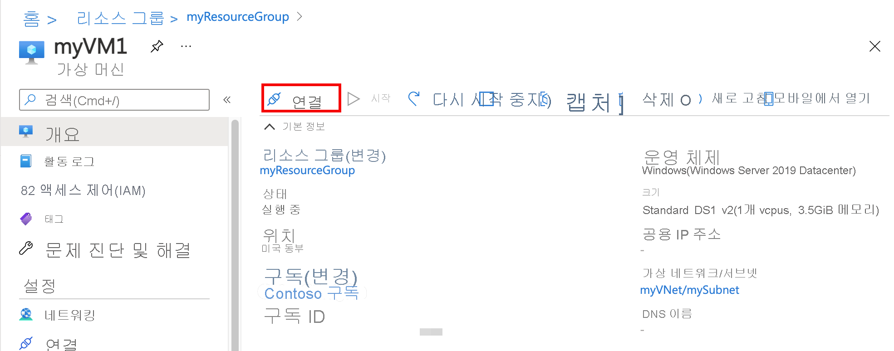

# <a name="quickstart-create-a-virtual-network-using-the-azure-portal"></a>빠른 시작: Azure 포털을 사용하여 가상 네트워크 만들기

가상 네트워크를 사용하면 VM(가상 머신)과 같은 Azure 리소스가 서로 인터넷을 통해 비공개로 통신할 수 있습니다. 이 빠른 시작에서는 가상 네트워크를 만드는 방법을 알아봅니다. 가상 네트워크를 만든 후에 두 개의 VM을 가상 네트워크에 배포합니다. 그런 다음, 인터넷에서 VM에 연결하고 두 VM 간에 비공개로 통신합니다.

Azure 구독이 없는 경우 [무료 계정](https://azure.microsoft.com/free/?WT.mc_id=A261C142F)을 지금 만드세요.

## <a name="sign-in-to-azure"></a>Azure에 로그인

[Azure Portal](https://portal.azure.com)에 로그인합니다.

## <a name="create-a-virtual-network"></a>가상 네트워크 만들기

1. 화면의 왼쪽 위에서 **리소스 만들기** > **네트워킹** > **가상 네트워크**를 차례로 선택합니다.

1. **가상 네트워크 만들기**에서 다음 정보를 입력하거나 선택합니다.

    | 설정 | 값 |
    | ------- | ----- |
    | Name | *myVirtualNetwork*를 입력합니다. |
    | 주소 공간 | *10.1.0.0/16*을 입력합니다. |
    | 구독 | 구독을 선택합니다.|
    | 리소스 그룹 | **새로 만들기**를 선택하고 *myResourceGroup*을 입력한 다음, **확인**을 선택합니다. |
    | 위치 | **미국 동부**를 선택합니다.|
    | 서브넷 - 이름 | *myVirtualSubnet*을 입력합니다. |
    | 서브넷 - 주소 범위 | *10.1.0.0/24*를 입력합니다. |

1. 나머지는 기본값으로 두고 **만들기**를 선택합니다.

## <a name="create-virtual-machines"></a>가상 머신 만들기

가상 네트워크에 두 개의 VM을 만듭니다.

### <a name="create-the-first-vm"></a>첫 번째 VM 만들기

1. 화면의 왼쪽 위에서 **리소스 만들기** > **계산** > **Windows Server 2016 Datacenter**를 선택합니다.

1. **가상 머신 만들기 - 기본 사항**에서 다음 정보를 입력하거나 선택합니다.

    | 설정 | 값 |
    | ------- | ----- |
    | **프로젝트 정보** | |
    | 구독 | 구독을 선택합니다. |
    | 리소스 그룹 | **MyResourceGroup**을 선택합니다. 지난 섹션에서 만들었습니다. |
    | **인스턴스 정보** |  |
    | 가상 머신 이름 | *myVm1*을 입력합니다. |
    | 지역 | **미국 동부**를 선택합니다. |
    | 가용성 옵션 | 기본값인 **인프라 중복이 필요하지 않습니다**를 그대로 둡니다. |
    | 이미지 | 기본값인 **Windows Server 2016 Datacenter**를 그대로 둡니다. |
    | 크기 | 기본값인 **표준 DS1 v2**를 그대로 둡니다. |
    | **관리자 계정** |  |
    | 사용자 이름 | 선택한 사용자 이름을 입력합니다. |
    | 암호 | 선택한 암호를 입력합니다. 암호는 12자 이상이어야 하며 [정의된 복잡성 요구 사항](../virtual-machines/windows/faq.md?toc=%2fazure%2fvirtual-network%2ftoc.json#what-are-the-password-requirements-when-creating-a-vm)을 충족해야 합니다.|
    | 암호 확인 | 암호를 다시 입력합니다. |
    | **인바운드 포트 규칙** |  |
    | 공용 인바운드 포트 | 기본값인 **없음**을 그대로 둡니다. |
    | **비용 절감** |  |
    | 이미 Windows 라이선스가 있나요? | 기본값인 **아니요**를 그대로 둡니다. |

1. **다음: 디스크**를 선택합니다.

1. **가상 머신 만들기 - 디스크**에서 기본값을 그대로 두고 **다음: 네트워킹**을 선택합니다.

1. **가상 머신 만들기 - 네트워킹**에서 다음 정보를 선택합니다.

    | 설정 | 값 |
    | ------- | ----- |
    | 가상 네트워크 | 기본값인 **myVirtualNetwork**를 그대로 둡니다. |
    | 서브넷 | 기본값 **myVirtualSubnet(10.1.0.0/24)** 을 그대로 둡니다. |
    | 공용 IP | 기본값 **(신규) myVm-ip**를 그대로 둡니다. |
    | 네트워크 보안 포트 | **선택한 포트 허용**을 선택합니다. |
    | 인바운드 포트 선택 | **HTTP** 및 **RDP**를 선택합니다.

1. **다음: 관리**를 선택합니다.

1. **가상 머신 만들기 - 관리**에서 **진단 스토리지 계정**에 대해 **새로 만들기**를 선택합니다.

1. **스토리지 계정 만들기**에서 다음 정보를 입력하거나 선택합니다.

    | 설정 | 값 |
    | ------- | ----- |
    | Name | *myvmstorageaccount*를 입력합니다. |
    | 계정 종류 | 기본값인 **스토리지(범용 v1)** 를 그대로 둡니다. |
    | 성능 | 기본값인 **표준**을 그대로 둡니다. |
    | 복제 | 기본값인 **LRS(로컬 중복 스토리지)** 를 그대로 둡니다. |

1. **확인**을 선택합니다.

1. **검토 + 만들기**를 선택합니다. **검토 + 만들기** 페이지로 이동되고, Azure에서 구성의 유효성을 검사합니다.

1. **유효성 검사 통과**가 표시되면 **만들기**를 선택합니다.

### <a name="create-the-second-vm"></a>두 번째 VM 만들기

1. 위에서 1단계와 9단계를 완료합니다.

    > [!NOTE]
    > 2단계에서 **가상 머신 이름**에 대해 *myVm2*를 입력합니다.
    >
    > 7단계에서 **진단 스토리지 계정**에 대해 **myvmstorageaccount**를 선택해야 합니다.

1. **검토 + 만들기**를 선택합니다. **검토 + 만들기** 페이지로 이동되고, Azure에서 구성의 유효성을 검사합니다.

1. **유효성 검사 통과**가 표시되면 **만들기**를 선택합니다.

## <a name="connect-to-a-vm-from-the-internet"></a>인터넷에서 VM에 연결

*myVm1*을 만든 후 인터넷을 통해 연결합니다.

1. 포털의 검색 창에서 *myVm1*을 입력합니다.

1. **연결** 단추를 선택합니다.

    

    **연결** 단추를 선택하면 **가상 머신에 연결**이 열립니다.

1. **RDP 파일 다운로드**를 선택합니다. Azure에서 원격 데스크톱 프로토콜( *.rdp*) 파일을 만들고 컴퓨터에 다운로드합니다.

1. 다운로드한 *.rdp* 파일을 엽니다.

    1. 메시지가 표시되면 **연결**을 선택합니다.

    1. VM을 만들 때 지정한 사용자 이름과 암호를 입력합니다.

        > [!NOTE]
        > **추가 선택 사항** > **다른 계정 사용**을 선택하여 VM을 만들 때 입력한 자격 증명을 지정해야 할 수도 있습니다.

1. **확인**을 선택합니다.

1. 로그인 프로세스 중에 인증서 경고가 나타날 수 있습니다. 인증서 경고가 표시되면 **예** 또는 **계속**을 선택합니다.

1. VM 데스크톱이 나타나면 최소화하여 로컬 데스크톱으로 돌아갑니다.

## <a name="communicate-between-vms"></a>VM 간 통신

1. *myVm1*의 원격 데스크톱에서 PowerShell을 엽니다.

1. `ping myVm2`을 입력합니다.

    다음과 같은 메시지가 반환됩니다.

    ```powershell
    Pinging myVm2.0v0zze1s0uiedpvtxz5z0r0cxg.bx.internal.clouda
    Request timed out.
    Request timed out.
    Request timed out.
    Request timed out.

    Ping statistics for 10.1.0.5:
    Packets: Sent = 4, Received = 0, Lost = 4 (100% loss),
    ```

    `ping`이 ICMP(Internet Control Message Protocol)를 사용하기 때문에 `ping`에 실패합니다. 기본적으로 ICMP는 Windows 방화벽에서 허용되지 않습니다.

1. 이후 단계에서 *myVm2*가 *myVm1*을 ping할 수 있도록 하려면 다음 명령을 입력합니다.

    ```powershell
    New-NetFirewallRule –DisplayName “Allow ICMPv4-In” –Protocol ICMPv4
    ```

    이 명령은 Windows 방화벽에서 ICMP 인바운드를 허용합니다.

1. *myVm1*에 대한 원격 데스크톱 연결을 닫습니다.

1. [인터넷에서 VM에 연결](#connect-to-a-vm-from-the-internet)의 단계를 다시 수행하지만 *myVm2*에 연결합니다.

1. 명령 프롬프트에서 `ping myvm1`을 입력합니다.

    다음과 같은 메시지가 반환됩니다.

    ```powershell
    Pinging myVm1.0v0zze1s0uiedpvtxz5z0r0cxg.bx.internal.cloudapp.net [10.1.0.4] with 32 bytes of data:
    Reply from 10.1.0.4: bytes=32 time=1ms TTL=128
    Reply from 10.1.0.4: bytes=32 time<1ms TTL=128
    Reply from 10.1.0.4: bytes=32 time<1ms TTL=128
    Reply from 10.1.0.4: bytes=32 time<1ms TTL=128

    Ping statistics for 10.1.0.4:
        Packets: Sent = 4, Received = 4, Lost = 0 (0% loss),
    Approximate round trip times in milli-seconds:
        Minimum = 0ms, Maximum = 1ms, Average = 0ms
    ```

    이전 단계에서 *myVm1* VM의 Windows 방화벽을 통해 ICMP를 허용했으므로 *myVm1*에서 회신을 받습니다.

1. *myVm2*에 대한 원격 데스크톱 연결을 닫습니다.

## <a name="clean-up-resources"></a>리소스 정리

가상 네트워크 및 VM 작업을 마쳤으면 리소스 그룹과 리소스 그룹에 포함된 모든 리소스를 삭제합니다.

1. 포털 맨 위에 있는 **검색** 상자에 *myResourceGroup*을 입력합니다.

1. 검색 결과에 **myResourceGroup**이 보이면 선택합니다.

1. **리소스 그룹 삭제**를 선택합니다.

1. **리소스 그룹 이름 입력**에 대해 *myResourceGroup*을 입력하고 **삭제**를 선택합니다.

## <a name="next-steps"></a>다음 단계

이 빠른 시작에서는 기본 가상 네트워크와 두 개의 VM을 만들었습니다. 인터넷에서 하나의 VM에 연결하고 두 VM 간에 비공개로 통신했습니다. 가상 네트워크 설정에 대한 자세한 내용은 [가상 네트워크 관리](manage-virtual-network.md)를 참조하세요.

기본적으로 Azure는 VM 간에 무제한 프라이빗 통신을 허용합니다. 반면, 인터넷에서 Windows VM으로의 인바운드 원격 데스크톱 연결만 허용합니다. 여러 유형의 VM 네트워크 통신을 구성하는 방법에 대한 자세한 내용은 [네트워크 트래픽 필터링](tutorial-filter-network-traffic.md) 자습서를 참조하세요.