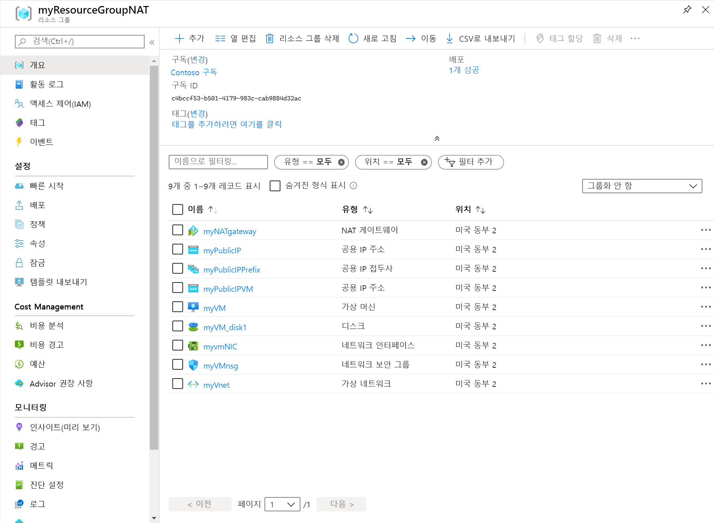

# <a name="quickstart-create-a-nat-gateway---resource-manager-template"></a>빠른 시작: NAT 게이트웨이 만들기 - Resource Manager 템플릿

Azure Resource Manager 템플릿을 사용하여 Virtual Network NAT를 시작합니다.  이 템플릿은 가상 네트워크, NAT 게이트웨이 및 Ubuntu 가상 머신을 배포합니다. Ubuntu 가상 머신은 NAT 게이트웨이와 연결된 서브넷에 배포됩니다.

>[!NOTE] 
>Azure Virtual Network NAT는 현재 공개 미리 보기로 제공되며, 제한된 [지역](https://azure.microsoft.com/global-infrastructure/regions/) 세트에서 사용할 수 있습니다. 이 미리 보기는 서비스 수준 계약 없이 제공되며 프로덕션 워크로드에는 사용하지 않는 것이 좋습니다. 특정 기능이 지원되지 않거나 기능이 제한될 수 있습니다. 자세한 내용은 [Microsoft Azure 미리 보기에 대한 보충 사용 약관](https://azure.microsoft.com/support/legal/preview-supplemental-terms)을 참조하세요.

[!INCLUDE [About Azure Resource Manager](../../includes/resource-manager-quickstart-introduction.md)]

Azure 구독이 아직 없는 경우 시작하기 전에 [체험 계정](https://azure.microsoft.com/free/?WT.mc_id=A261C142F)을 만듭니다.

## <a name="create-a-nat-gateway-and-supporting-resources"></a>NAT 게이트웨이 및 지원 리소스 만들기

이 템플릿은 다음을 만들도록 구성되어 있습니다. 

* 가상 네트워크 
* NAT 게이트웨이 리소스
* Ubuntu 가상 머신

Ubuntu VM은 NAT 게이트웨이 리소스와 연결된 서브넷에 배포됩니다.

### <a name="review-the-template"></a>템플릿 검토

이 빠른 시작에서 사용되는 템플릿은 [Azure 빠른 시작 템플릿](https://raw.githubusercontent.com/Azure/azure-quickstart-templates/master/101-nat-gateway-1-vm/azuredeploy.json)에서 나온 것입니다.

:::code language="json" source="~/quickstart-templates/101-nat-gateway-1-vm/azuredeploy.json" range="1-335" highlight="256-282":::

템플릿에는 아홉 개의 Azure 리소스가 정의되어 있습니다.

**Microsoft.Network**

* **[Microsoft.Network/natGateways](https://docs.microsoft.com/azure/templates/microsoft.network/natgateways)** : NAT 게이트웨이 리소스를 만듭니다.

* **[Microsoft.Network/networkSecurityGroups](https://docs.microsoft.com/azure/templates/microsoft.network/networksecuritygroups)** : 네트워크 보안 그룹을 만듭니다.

    * **[Microsoft.Network/networkSecurityGroups/securityRules](https://docs.microsoft.com/azure/templates/microsoft.network/networksecuritygroups/securityrules)** : 보안 규칙을 만듭니다.

* **[Microsoft.Network/publicIPAddresses](https://docs.microsoft.com/azure/templates/microsoft.network/publicipaddresses)** : 공용 IP 주소를 만듭니다.

* **[Microsoft.Network/publicIPPrefixes](https://docs.microsoft.com/azure/templates/microsoft.network/publicipprefixes)** : 공용 IP 접두사를 만듭니다.

* **[Microsoft.Network/virtualNetworks](https://docs.microsoft.com/azure/templates/microsoft.network/virtualnetworks)** : 가상 네트워크를 만듭니다.

    * **[Microsoft.Network/virtualNetworks/subnets](https://docs.microsoft.com/azure/templates/microsoft.network/virtualnetworks/subnets)** : 가상 네트워크 서브넷을 만듭니다.

* **[Microsoft.Network/networkinterfaces](https://docs.microsoft.com/azure/templates/microsoft.network/networkinterfaces)** : 네트워크 인터페이스를 만듭니다.

**Microsoft.Compute**

* **[Microsoft.Compute/virtualMachines](https://docs.microsoft.com/azure/templates/Microsoft.Compute/virtualMachines)** : 가상 머신을 만듭니다.

### <a name="deploy-the-template"></a>템플릿 배포

**Azure CLI**

```azurecli-interactive
read -p "Enter the location (i.e. westcentralus): " location
resourceGroupName="myResourceGroupNAT"
templateUri="https://raw.githubusercontent.com/Azure/azure-quickstart-templates/master/101-nat-gateway-1-vm/azuredeploy.json" 

az group create \
--name $resourceGroupName \
--location $location

az group deployment create \
--resource-group $resourceGroupName \
--template-uri  $templateUri
```

**Azure PowerShell**

```azurepowershell-interactive
$location = Read-Host -Prompt "Enter the location (i.e. westcentralus)"
$templateUri = "https://raw.githubusercontent.com/Azure/azure-quickstart-templates/master/101-nat-gateway-1-vm/azuredeploy.json"

$resourceGroupName = "myResourceGroupNAT"

New-AzResourceGroup -Name $resourceGroupName -Location $location
New-AzResourceGroupDeployment -ResourceGroupName $resourceGroupName -TemplateUri $templateUri
```

**Azure Portal**

[](https://portal.azure.com/#create/Microsoft.Template/uri/https%3A%2F%2Fraw.githubusercontent.com%2FAzure%2Fazure-quickstart-templates%2Fmaster%2F101-nat-gateway-1-vm%2Fazuredeploy.json)

## <a name="review-deployed-resources"></a>배포된 리소스 검토

1. [Azure Portal](https://portal.azure.com)에 로그인합니다.

2. 왼쪽 패널에서 **리소스 그룹** 을 선택합니다.

3. 이전 섹션에서 만든 리소스 그룹을 선택합니다. 기본 리소스 그룹 이름은 **myResourceGroupNAT**입니다.

4. 다음 리소스가 리소스 그룹에서 만들어졌는지 확인합니다.

    

## <a name="clean-up-resources"></a>리소스 정리

**Azure CLI**

더 이상 필요하지 않은 경우 [az group delete](/cli/azure/group#az-group-delete) 명령을 사용하여 리소스 그룹 및 포함된 모든 리소스를 제거할 수 있습니다.

```azurecli-interactive 
  az group delete \
    --name myResourceGroupNAT
```

**Azure PowerShell**

더 이상 필요하지 않은 경우 [Remove-AzResourceGroup](https://docs.microsoft.com/powershell/module/az.resources/remove-azresourcegroup?view=latest) 명령을 사용하여 리소스 그룹 및 포함된 모든 리소스를 제거할 수 있습니다.

```azurepowershell-interactive 
Remove-AzResourceGroup -Name myResourceGroupNAT
```

**Azure Portal**

더 이상 필요하지 않은 경우 리소스 그룹, NAT 게이트웨이 및 모든 관련 리소스를 삭제합니다. NAT 게이트웨이가 포함된**myResourceGroupNAT** 리소스 그룹을 선택한 다음, **삭제**를 선택합니다.

## <a name="next-steps"></a>다음 단계

이 빠른 시작에서는 다음을 만들었습니다.

* NAT 게이트웨이 리소스
* 가상 네트워크
* Ubuntu 가상 머신

가상 머신은 NAT 게이트웨이와 연결된 가상 네트워크 서브넷에 배포됩니다. 

Virtual Network NAT 및 Azure Resource Manager에 대해 자세히 알아보려면 아래 문서로 계속 진행하세요.

* [Virtual Network NAT의 개요](nat-overview.md) 읽기
* [NAT Gateway 리소스](nat-gateway-resource.md)에 대한 자세한 정보
* [Azure Resource Manager](../azure-resource-manager/management/overview.md)에 대해 자세히 알아보기
