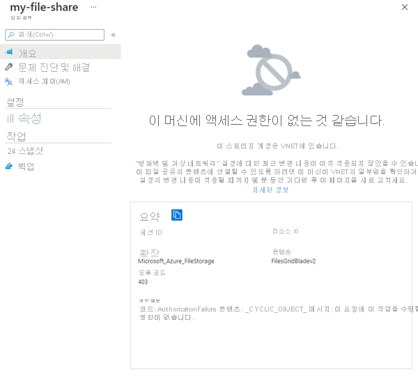

# <a name="tutorial-restrict-network-access-to-paas-resources-with-virtual-network-service-endpoints-using-the-azure-portal"></a>자습서: Azure Portal을 사용하여 가상 네트워크 서비스 엔드포인트로 PaaS 리소스에 대한 네트워크 액세스 제한

가상 네트워크 서비스 엔드포인트를 사용하면 일부 Azure 서비스 리소스에 대한 네트워크 액세스를 가상 네트워크 서브넷으로 제한할 수 있습니다. 리소스에 대한 인터넷 액세스를 제거할 수도 있습니다. 서비스 엔드포인트는 가상 네트워크에서 지원되는 Azure 서비스로의 직접 연결을 제공하므로 가상 네트워크의 프라이빗 주소 공간을 사용하여 Azure 서비스에 액세스할 수 있습니다. 서비스 엔드포인트를 통해 Azure 리소스에 도달하는 트래픽은 항상 Microsoft Azure 백본 네트워크에 유지됩니다. 이 자습서에서는 다음 방법에 대해 알아봅니다.

> [!div class="checklist"]
> * 하나의 서브넷이 있는 가상 네트워크 만들기
> * 서브넷을 추가하고 서비스 엔드포인트를 사용하도록 설정
> * Azure 리소스를 만들고 서브넷에서만 네트워크 액세스 허용
> * 각 서브넷에 VM(가상 머신) 배포
> * 서브넷에서 리소스에 대한 액세스 확인
> * 서브넷 및 인터넷에서 리소스에 대한 액세스가 거부되는지 확인

원하는 경우 [Azure CLI](tutorial-restrict-network-access-to-resources-cli.md) 또는 [Azure PowerShell](tutorial-restrict-network-access-to-resources-powershell.md)을 사용하여 이 자습서를 완료할 수 있습니다.

Azure 구독이 아직 없는 경우 시작하기 전에 [체험 계정](https://azure.microsoft.com/free/?WT.mc_id=A261C142F)을 만듭니다.

## <a name="log-in-to-azure"></a>Azure에 로그인

Azure Portal ( https://portal.azure.com ) 에 로그인합니다.

## <a name="create-a-virtual-network"></a>가상 네트워크 만들기

1. Azure Portal의 왼쪽 위에서 **+ 리소스 만들기**를 선택합니다.
2. **네트워킹**을 선택한 다음 **가상 네트워크**를 선택합니다.
3. 다음 정보를 입력하거나 선택하고 **만들기**를 선택합니다.

   |설정|값|
   |----|----|
   |Name| myVirtualNetwork |
   |주소 공간| 10.0.0.0/16|
   |구독| 구독 선택|
   |리소스 그룹 | **새로 만들기**를 선택하고 *myResourceGroup*을 입력합니다.|
   |위치| **미국 동부**를 선택합니다. |
   |서브넷 이름| 공용|
   |서브넷 주소 범위| 10.0.0.0/24|
   |서비스 엔드포인트| 사용 안 함|

   

## <a name="enable-a-service-endpoint"></a>서비스 엔드포인트 사용

서비스 엔드포인트는 서비스 단위, 서브넷 단위로 활성화됩니다. 서브넷을 만들고 서브넷에 서비스 엔드포인트를 사용하도록 설정합니다.

1. 포털 맨 위에 있는 **리소스, 서비스 및 문서 검색** 상자에 *myVirtualNetwork*를 입력합니다. 검색 결과에 **myVirtualNetwork**가 표시되면 선택합니다.
2. 가상 네트워크에 서브넷을 추가합니다. 다음 그림과 같이 **설정**에서 **서브넷**을 선택한 다음, **+ 서브넷**을 선택합니다.

     

3. **서브넷 추가**에서 다음 정보를 선택하거나 입력한 다음, **확인**을 선택합니다.

    |설정|값|
    |----|----|
    |Name| 프라이빗 |
    |주소 범위| 10.0.1.0/24|
    |서비스 엔드포인트| **서비스** 아래에서 **Microsoft.Storage**를 선택합니다.|

> [!CAUTION]
> 리소스를 포함한 기존 서브넷에 서비스 엔드포인트를 사용하도록 설정하기 전에 [서브넷 설정 변경](virtual-network-manage-subnet.md#change-subnet-settings)을 참조하세요.

## <a name="restrict-network-access-for-a-subnet"></a>서브넷에 대한 네트워크 액세스 제한

기본적으로 모든 VM은 서브넷에 있는 모든 리소스와 통신할 수 있습니다. 네트워크 보안 그룹을 만들고 서브넷에 연결하여 서브넷에 있는 모든 리소스 간에 통신을 제한할 수 있습니다.

1. Azure Portal의 왼쪽 위에서 **+ 리소스 만들기**를 선택합니다.
2. **네트워킹**을 선택하고 **네트워크 보안 그룹**을 선택합니다.
3. **네트워크 보안 그룹 만들기**에서 다음 정보를 입력하거나 선택하고 **만들기**를 선택합니다.

    |설정|값|
    |----|----|
    |Name| myNsgPrivate |
    |구독| 구독 선택|
    |리소스 그룹 | **기존 항목 사용**을 선택하고, *myResourceGroup*을 선택합니다.|
    |위치| **미국 동부**를 선택합니다. |

4. 네트워크 보안 그룹이 만들어진 후에 포털 맨 위에 있는 **리소스, 서비스 및 문서 검색** 상자에 *myNsgPrivate*를 입력합니다. 검색 결과에 **myNsgPrivate**가 표시되면 선택합니다.
5. **설정** 아래에서 **아웃바운드 보안 규칙**을 선택합니다.
6. **+추가**를 선택합니다.
7. Azure Storage 서비스에 대해 아웃바운드 통신을 허용하는 규칙을 만듭니다. 다음 정보를 입력하거나 선택한 다음, **추가**를 선택합니다.

    |설정|값|
    |----|----|
    |원본| **VirtualNetwork**를 선택합니다. |
    |원본 포트 범위| * |
    |대상 | **서비스 태그**를 선택합니다.|
    |대상 서비스 태그 | **저장소**를 선택합니다.|
    |대상 포트 범위| * |
    |프로토콜|모두|
    |조치|허용|
    |우선 순위|100|
    |Name|Allow-Storage-All|

8. 인터넷에 대한 통신을 거부하는 다른 아웃바운드 보안 규칙을 만듭니다. 이 규칙은 아웃바운드 인터넷 통신을 허용하는 모든 네트워크 보안 그룹의 기본 규칙을 재정의합니다. 다음 값을 사용하여 5-7단계를 다시 수행합니다.

    |설정|값|
    |----|----|
    |원본| **VirtualNetwork**를 선택합니다. |
    |원본 포트 범위| * |
    |대상 | **서비스 태그**를 선택합니다.|
    |대상 서비스 태그| **인터넷**을 선택합니다.|
    |대상 포트 범위| * |
    |프로토콜|모두|
    |조치|거부|
    |우선 순위|110|
    |Name|Deny-Internet-All(모든 인터넷 거부)|

9. **설정** 아래에서 **인바운드 보안 규칙**을 선택합니다.
10. **+추가**를 선택합니다.
11. 어디에서든 서브넷에 대한 RDP(원격 데스크톱 프로토콜) 트래픽을 허용하는 인바운드 보안 규칙을 만듭니다. 이 규칙은 인터넷의 모든 인바운드 트래픽을 거부하는 기본 보안 규칙을 재정의합니다. 이후 단계에서 연결을 테스트할 수 있도록 서브넷에대 한 원격 데스크톱 연결이 허용됩니다. **설정** 아래에서 **인바운드 보안 규칙**, **+ 추가**를 차례로 선택하고, 다음 값을 입력한 다음, **추가**를 선택합니다.

    |설정|값|
    |----|----|
    |원본| 모두 |
    |원본 포트 범위| * |
    |대상 | **VirtualNetwork**를 선택합니다.|
    |대상 포트 범위| 3389 |
    |프로토콜|모두|
    |조치|허용|
    |우선 순위|120|
    |Name|Allow-RDP-All|

12. **설정**에서 **서브넷**을 선택합니다.
13. **+ 연결**을 선택합니다.
14. **서브넷 연결**에서 **가상 네트워크**를 선택하고 **가상 네트워크 선택**에서 **myVirtualNetwork**를 선택합니다.
15. **서브넷 선택**에서 **개인**을 선택한 다음, **확인**을 선택합니다.

## <a name="restrict-network-access-to-a-resource"></a>리소스에 대한 네트워크 액세스 제한

서비스 엔드포인트에 사용할 수 있는 Azure 서비스를 통해 만든 리소스에 대한 네트워크 액세스를 제한하는 데 필요한 단계는 서비스에 따라 다릅니다. 각 서비스에 대한 특정 단계는 개별 서비스의 설명서를 참조하세요. 이 자습서의 나머지 부분에는 Azure Storage 계정에 대한 네트워크 액세스를 제한하는 단계가 예제로 포함되어 있습니다.

### <a name="create-a-storage-account"></a>저장소 계정 만들기

1. Azure Portal의 왼쪽 위에서 **+ 리소스 만들기**를 선택합니다.
2. **저장소**를 선택한 다음, **저장소 계정 - Blob, 파일, 테이블, 큐**를 선택합니다.
3. 다음 정보를 입력하거나 선택하고, 나머지 기본값을 그대로 적용한 다음, **만들기**를 선택합니다.

    |설정|값|
    |----|----|
    |Name| 모든 Azure 위치에서 고유한 이름을 입력합니다. 이름은 3~24자 사이여야 하고 숫자와 소문자만 사용할 수 있습니다.|
    |계정 종류|StorageV2(범용 v2)|
    |위치| **미국 동부**를 선택합니다. |
    |복제| LRS(로컬 중복 저장소)|
    |구독| 구독 선택|
    |리소스 그룹 | **기존 항목 사용**을 선택하고, *myResourceGroup*을 선택합니다.|

### <a name="create-a-file-share-in-the-storage-account"></a>저장소 계정에 파일 공유 만들기

1. 저장소 계정이 만들어진 후에 포털 맨 위에 있는 **리소스, 서비스 및 문서 검색** 상자에 저장소 계정의 이름을 입력합니다. 저장소 계정의 이름이 검색 결과에 표시되면 선택합니다.
2. 다음 그림과 같이 **파일**을 선택합니다.

    

3. **+ 파일 공유**를 선택합니다.
4. **이름**에서 *my-file-share*를 입력하고 **확인**을 선택합니다.
5. **파일 서비스** 상자를 닫습니다.

### <a name="restrict-network-access-to-a-subnet"></a>서브넷에 대한 네트워크 액세스 제한

기본적으로 저장소 계정은 인터넷을 비롯하여 네트워크에 있는 클라이언트의 네트워크 연결을 허용합니다. *myVirtualNetwork* 가상 네트워크에 있는 *개인* 서브넷을 제외하고 인터넷 및 다른 모든 서브넷과 모든 가상 네트워크로부터의 네트워크 액세스를 거부합니다.

1. 저장소 계정에 대한 **설정** 아래에서 **방화벽 및 가상 네트워크**를 선택합니다.
2. **선택한 네트워크**를 선택합니다.
3. **+ 기존 가상 네트워크 추가**를 선택합니다.
4. **네트워크 추가**에서 다음 값을 선택한 다음, **추가**를 선택합니다.

    |설정|값|
    |----|----|
    |구독| 구독을 선택합니다.|
    |가상 네트워크|**가상 네트워크** 아래에서 **myVirtualNetwork**를 선택합니다.|
    |서브넷| **서브넷** 아래에서 **개인**을 선택합니다.|

    

5. **저장**을 선택합니다.
6. **방화벽 및 가상 네트워크** 상자를 닫습니다.
7. 다음 그림과 같이 저장소 계정에 대한 **설정** 아래에서 **액세스 키**를 선택합니다.

      

8. 이후 단계에서 파일 공유를 VM의 드라이브 문자에 매핑할 때도 수동으로 입력해야 하므로 **키** 값을 적어둡니다.

## <a name="create-virtual-machines"></a>가상 머신 만들기

저장소 계정에 대한 네트워크 액세스를 테스트하려면 각 서브넷에 VM을 배포합니다.

### <a name="create-the-first-virtual-machine"></a>첫 번째 가상 머신 만들기

1. Azure Portal의 왼쪽 위 모서리에 있는 **+ 리소스 만들기**를 선택합니다.
2. **Compute**를 선택한 다음, **Windows Server 2016 Datacenter**를 선택합니다.
3. 다음 정보를 입력하거나 선택한 다음, **확인**을 선택합니다.

   |설정|값|
   |----|----|
   |Name| myVmPublic|
   |사용자 이름|선택한 사용자 이름을 입력합니다.|
   |암호| 선택한 암호를 입력합니다. 암호는 12자 이상이어야 하며 [정의된 복잡성 요구 사항](../virtual-machines/windows/faq.md?toc=%2fazure%2fvirtual-network%2ftoc.json#what-are-the-password-requirements-when-creating-a-vm)을 충족해야 합니다.|
   |구독| 구독을 선택합니다.|
   |리소스 그룹| **기존 항목 사용**을 선택하고, **myResourceGroup**을 선택합니다.|
   |위치| **미국 동부**를 선택합니다.|

   
4. 가상 머신의 크기를 선택하고 **선택**을 선택합니다.
5. **설정** 아래에서 **네트워크**를 선택한 후 **myVirtualNetwork**를 선택합니다. 그런 후 다음 그림과 같이 **서브넷**을 선택한 후 **Public**을 선택합니다.

   

6. **네트워크 보안 그룹**에서 **고급**을 선택합니다. 포털에서 3389 포트를 허용하는 네트워크 보안 그룹을 자동으로 만듭니다. 3389 포트는 이후 단계에서 가상 머신에 연결하기 위해 열어야 합니다. **설정** 페이지에서 **확인**을 선택합니다.
7. **요약** 페이지에서 **만들기**를 선택하여 가상 머신 배포를 시작합니다. VM을 배포하는 데 몇 분 정도 걸리지만 VM을 만드는 동안 다음 단계를 계속 진행할 수 있습니다.

### <a name="create-the-second-virtual-machine"></a>두 번째 가상 머신 만들기

1-7단계를 다시 수행하지만, 3단계에서 가상 머신의 이름을 *myVmPrivate*로 지정하고, 5단계에서 **프라이빗** 서브넷을 선택합니다.

VM을 배포하는 데 몇 분이 걸립니다. 만들기가 끝나고 해당 설정이 포털에서 열린 후에만 다음 단계를 진행합니다.

## <a name="confirm-access-to-storage-account"></a>저장소 계정에 대한 액세스 확인

1. *myVmPrivate* VM 만들기가 끝나면 Azure에서 해당 설정이 열립니다. 다음 그림과 같이 **연결** 단추를 선택하여 VM에 연결합니다.

   

2. **연결** 단추를 선택하면 원격 데스크톱 프로토콜(.rdp) 파일이 만들어진 후 컴퓨터에 다운로드됩니다.  
3. 다운로드한 rdp 파일을 엽니다. 메시지가 표시되면 **연결**을 선택합니다. VM을 만들 때 지정한 사용자 이름과 암호를 입력합니다. **추가 선택 사항**, **다른 계정 사용**을 차례로 선택하여 VM을 만들 때 입력한 자격 증명을 지정해야 할 수도 있습니다. 
4. **확인**을 선택합니다.
5. 로그인 프로세스 중에 인증서 경고가 나타날 수 있습니다. 경고 메시지가 표시되면 **예** 또는 **계속**을 선택하여 연결을 계속합니다.
6. *myVmPrivate* VM에서 PowerShell을 사용하여 Azure 파일 공유를 Z 드라이브에 매핑합니다. 뒤에 나오는 명령을 실행하기 전에, `<storage-account-key>` 및 `<storage-account-name>`을 [저장소 계정 만들기](#create-a-storage-account)에서 지정했거나 검색한 값으로 바꿉니다.

   ```powershell
   $acctKey = ConvertTo-SecureString -String "<storage-account-key>" -AsPlainText -Force
   $credential = New-Object System.Management.Automation.PSCredential -ArgumentList "Azure\<storage-account-name>", $acctKey
   New-PSDrive -Name Z -PSProvider FileSystem -Root "\\<storage-account-name>.file.core.windows.net\my-file-share" -Credential $credential
   ```

   PowerShell에서 다음 예제 출력과 비슷한 출력을 반환합니다.

   ```powershell
   Name           Used (GB)     Free (GB) Provider      Root
   ----           ---------     --------- --------      ----
   Z                                      FileSystem    \\vnt.file.core.windows.net\my-f...
   ```

   Azure 파일 공유가 Z 드라이브에 매핑되었습니다.

7. VM에 인터넷에 대한 아웃바운드 연결이 없는지 명령 프롬프트에서 확인합니다.

   ```
   ping bing.com
   ```

   *개인* 서브넷에 연결된 네트워크 보안 그룹이 인터넷에 대한 아웃바운드 액세스를 허용하지 않기 때문에 응답이 수신되지 않습니다.

8. *myVmPrivate* VM에 대한 원격 데스크톱 세션을 닫습니다.

## <a name="confirm-access-is-denied-to-storage-account"></a>저장소 계정에 대한 액세스가 거부되는지 확인

1. 포털 맨 위에 있는 *리소스, 서비스 및 문서 검색* 상자에 **myVirtualNetwork**를 입력합니다.
2. 검색 결과에 **myVmPublic**이 표시되면 선택합니다.
3. *myVmPublic* VM에 대한 [저장소 계정에 대한 액세스 확인](#confirm-access-to-storage-account)에서 1-6단계를 완료합니다.

   잠시 기다리면 `New-PSDrive : Access is denied` 오류가 발생합니다. *myVmPublic* VM이 *Public* 서브넷에 배포되었으므로 액세스가 거부되었습니다. *공용* 서브넷에는 Azure Storage에 사용하도록 설정된 서비스 엔드포인트가 없습니다. 스토리지 계정은 *공용* 서브넷이 아닌 *프라이빗* 서브넷으로부터의 네트워크 액세스만을 허용합니다.

4. *myVmPublic* VM에 대한 원격 데스크톱 세션을 닫습니다.

5. 컴퓨터에서 Azure [Portal](https://portal.azure.com)로 이동합니다.
6. **리소스, 서비스 및 문서 검색** 상자에 만든 저장소 계정의 이름을 입력합니다. 저장소 계정의 이름이 검색 결과에 표시되면 선택합니다.
7. **파일**을 선택합니다.
8. 다음 그림에 표시된 오류가 발생합니다.

   

   컴퓨터가 *MyVirtualNetwork* 가상 네트워크의 *프라이빗* 서브넷에 없기 때문에 액세스가 거부되었습니다.

## <a name="clean-up-resources"></a>리소스 정리

더 이상 필요하지 않은 경우, 리소스 그룹 및 이 그룹에 포함된 리소스를 모두 삭제합니다.

1. 포털 맨 위에 있는 **검색** 상자에 *myResourceGroup*을 입력합니다. 검색 결과에 **myResourceGroup**이 보이면 선택합니다.
2. **리소스 그룹 삭제**를 선택합니다.
3. **리소스 그룹 이름 입력:** 에 *myResourceGroup*을 입력하고 **삭제**를 선택합니다.

## <a name="next-steps"></a>다음 단계

이 자습서에서는 가상 네트워크 서브넷에 대해 서비스 엔드포인트를 사용하도록 설정했습니다. 여러 Azure 서비스에서 배포된 리소스에 서비스 엔드포인트를 사용하도록 설정할 수 있음을 알았습니다. Azure Storage 계정을 만들고 스토리지 계정에 대한 네트워크 액세스를 가상 네트워크 서브넷 내의 리소스로만 제한했습니다. 서비스 엔드포인트에 대한 자세한 내용은 [서비스 엔드포인트 개요](virtual-network-service-endpoints-overview.md) 및 [서브넷 관리](virtual-network-manage-subnet.md)를 참조하세요.

계정에 여러 개의 가상 네트워크가 있는 경우, 각 가상 네트워크 내의 리소스가 서로 통신할 수 있도록 두 개의 가상 네트워크를 함께 연결하는 것이 좋습니다. 가상 네트워크를 연결하는 방법을 알아보려면 다음 자습서를 진행합니다.

> [!div class="nextstepaction"]
> [가상 네트워크 연결](./tutorial-connect-virtual-networks-portal.md)
