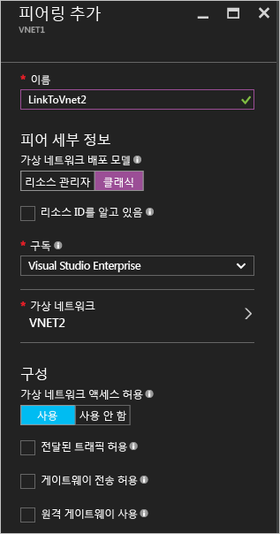
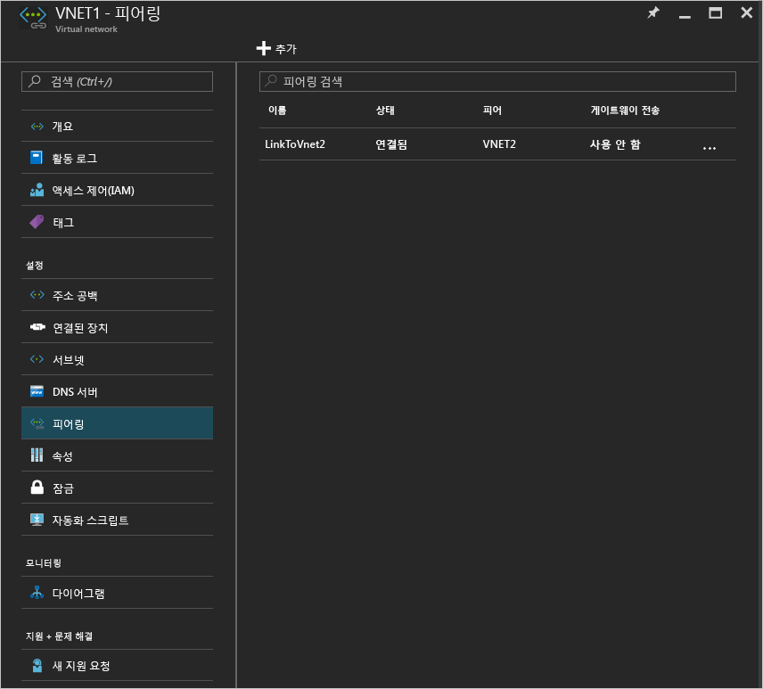

<properties
   pageTitle="Azure 포털을 사용하여 VNet 피어링 만들기 | Microsoft Azure"
   description="Resource Manager에서 Azure 포털을 사용하여 가상 네트워크를 만드는 방법을 알아봅니다."
   services="virtual-network"
   documentationCenter=""
   authors="NarayanAnnamalai"
   manager="jefco"
   editor=""
   tags="azure-resource-manager"/>

<tags
   ms.service="virtual-network"
   ms.devlang="na"
   ms.topic="hero-article"
   ms.tgt_pltfrm="na"
   ms.workload="infrastructure-services"
   ms.date="09/14/2016"
   ms.author="narayanannamalai;annahar"/>

# Azure 포털을 사용하여 가상 네트워크 피어링 만들기

[AZURE.INCLUDE [virtual-networks-create-vnet-selectors-arm-include](../../includes/virtual-networks-create-vnetpeering-selectors-arm-include.md)]

[AZURE.INCLUDE [virtual-networks-create-vnet-intro](../../includes/virtual-networks-create-vnetpeering-intro-include.md)]

[AZURE.INCLUDE [virtual-networks-create-vnet-scenario-basic-include](../../includes/virtual-networks-create-vnetpeering-scenario-basic-include.md)]

Azure 포털을 사용하여 위의 시나리오에 따라 VNet 피어링을 만들려면 다음 단계를 수행합니다.

1. 브라우저에서 http://portal.azure.com으로 이동하고 필요한 경우 Azure 계정으로 로그인합니다.
2. VNET 피어링을 설정하려면 두 개의 VNet 간에 각 방향에 하나씩 두 개의 링크를 만들어야 합니다. 먼저 VNET1-VNet2에 VNET 피어링 링크를 만들 수 있습니다. 포털에서 **찾아보기** > **가상 네트워크 선택**을 클릭합니다.

	

3. 가상 네트워크 블레이드에서 VNET1을 선택하고 피어링을 클릭한 다음 추가를 클릭합니다.

	

4. 피어링 추가 블레이드에서 피어링 링크 이름을 LinkToVnet2로 지정하고 구독 및 피어링 가상 네트워크 VNET2를 선택한 다음 확인을 클릭합니다.

	

5. 일단 이 VNET 피어링 링크를 만듭니다. 다음과 같은 링크 상태를 확인할 수 있습니다.

	

6. 다음으로 VNET2-VNet1에 VNET 피어링 링크를 만듭니다. 가상 네트워크 블레이드에서 VNET2를 선택하고 피어링을 클릭한 다음 추가를 클릭합니다.

	

7. 피어링 추가 블레이드에서 피어링 링크 이름을 LinkToVnet1으로 지정하고 구독 및 피어링 가상 네트워크를 선택한 다음 확인을 클릭합니다.

	

8. 일단 이 VNET 피어링 링크를 만듭니다. 다음과 같은 링크 상태를 확인할 수 있습니다.

	

9. LinkToVnet2에 대한 상태를 확인하면 이제 연결됨으로 변경되었습니다.

	

    > [AZURE.NOTE] 링크를 모두 연결해야만 VNET 피어링이 설정됩니다.

각 링크에 대한 몇 가지 구성 가능한 속성이 있습니다.

|옵션|설명|기본값|
|:-----|:----------|:------|
|AllowVirtualNetworkAccess|피어링 VNet의 주소 공간이 Virtual\_network 태그의 일부로 포함되는지 여부입니다.|예|
|AllowForwardedTraffic|피어링된 VNet에서 시작된 트래픽이 허용되거나 삭제될 수 있습니다.|아니요|
|AllowGatewayTransit|피어링 VNet이 VNet 게이트웨이를 사용할 수 있습니다.|아니요|
|UseRemoteGateways|피어링한 VNet 게이트웨이를 사용합니다. 피어링 VNet에는 게이트웨이가 구성되어 있어야 하고 AllowGatewayTransit을 선택합니다. 구성된 게이트웨이가 있는 경우 이 옵션을 사용할 수 없습니다.|아니요|

VNet 피어링의 링크 각각에는 위의 속성 집합이 있습니다. 포털에서 VNet 피어링 링크를 클릭하고 사용할 수 있는 옵션을 변경한 다음 저장을 클릭하여 변경을 적용할 수 있습니다.

[AZURE.INCLUDE [virtual-networks-create-vnet-scenario-crosssub-include](../../includes/virtual-networks-create-vnetpeering-scenario-crosssub-include.md)]

1. 브라우저에서 http://portal.azure.com으로 이동하고 필요한 경우 Azure 계정으로 로그인합니다.
2. 이 예제에서는 각각의 구독에 두 개의 구독, A 및 B와 권한 있는 두 명의 사용자, 사용자A 및 사용자B를 사용합니다.
3. 포털에서 찾아보기를 클릭하고 가상 네트워크를 선택합니다. VNET을 클릭하고 추가를 클릭합니다.

    

4. 액세스 추가 블레이드에서 역할 선택을 클릭하고 네트워크 참가자를 선택하며 사용자 추가를 클릭하고 사용자B 로그인 이름을 입력한 다음 확인을 클릭합니다.

    

    이는 요구 사항이 아니며 요청이 일치하면 사용자가 해당하는 Vnet에 대한 피어링 요청을 개별적으로 요구하는 경우에도 피어링을 설정할 수 있습니다. 다른 VNet의 권한 있는 사용자를 로컬 VNet의 사용자로 추가하면 포털에서 설치하기가 수월해집니다.

5. 그런 다음 구독B에 대한 권한 있는 사용자인 사용자B로 Azure 포털에 로그인합니다. 위의 단계를 수행하여 사용자A를 네트워크 참가자로 추가합니다.

    

    > [AZURE.NOTE] 브라우저에서 두 사용자 세션에 로그오프하고 로그온하여 권한 부여가 성공적으로 사용되었는지 확인할 수 있습니다.

6. 포털에 사용자A로 로그인하고 VNET3 블레이드로 이동하여 피어링을 클릭한 다음 ‘내 리소스 ID를 알고 있습니다” 확인란을 선택하고 아래 서식에서 VNET5에 대한 리소스 ID를 입력합니다.

    /subscriptions/<Subscription- ID>/resourceGroups/<ResourceGroupName>/providers/Microsoft.Network/VirtualNetwork/<VNET name>

    

7. 포털에 사용자B로 로그인하고 위의 단계에 따라 VNET5에서 VNet3에 피어링 링크를 만듭니다.

    

8. 피어링을 설정하면 VNet3의 가상 컴퓨터는 VNet5의 모든 가상 컴퓨터와 통신할 수 있어야 합니다.

[AZURE.INCLUDE [virtual-networks-create-vnet-scenario-transit-include](../../includes/virtual-networks-create-vnetpeering-scenario-transit-include.md)]

1. 첫 번째 단계로 VNET 피어링 링크가 HubVnet에서 VNET1으로 연결됩니다. 링크에 전달 트래픽 허용 옵션을 선택하지 않았습니다.

    

2. 다음 단계로 VNET1에서 HubVnet으로 피어링 링크를 만들 수 있습니다. 전달 트래픽 허용 옵션을 선택하지 않았습니다.

    

3. 피어링을 설정하면 이 [문서](virtual-network-create-udr-arm-ps.md)를 참조하고 UDR(사용자 정의 경로)를 정의하여 그 기능을 사용하는 가상 어플라이언스를 통해 VNet1 트래픽을 리디렉션할 수 있습니다. 경로에 다음 홉 주소를 지정하면 피어링된 VNet HubVNet에서 가상 어플라이언스의 IP 주소를 설정할 수 있습니다.

[AZURE.INCLUDE [virtual-networks-create-vnet-scenario-asmtoarm-include](../../includes/virtual-networks-create-vnetpeering-scenario-asmtoarm-include.md)]

1. 브라우저에서 http://portal.azure.com으로 이동하고 필요한 경우 Azure 계정으로 로그인합니다.

2. 이 시나리오에서 VNET 피어링을 설정하려면 Azure Resource Manager에서 가상 네트워크에서 클래식의 가상 네트워크에 하나의 링크를 만들어야 합니다. 즉, **VNET1**에서 **VNET2**입니다. 포털에서 **찾아보기**를 클릭하고 **가상 네트워크**를 선택합니다.

3. 가상 네트워크 블레이드에서 **VNET1**을 선택합니다. **피어링**을 클릭한 다음 **추가**를 클릭합니다.

4. 피어링 추가 블레이드에서 링크의 이름을 지정합니다. 여기에서는 **LinkToVNet2**라고 합니다. 피어 세부 정보에서 **클래식**을 선택합니다.

5. 구독 및 피어 Virtual Network **VNET2**를 선택합니다. 그런 후 확인을 클릭합니다.

    

6. 이 VNet 피어링 링크가 만들어지면 두 가상 네트워크는 피어링되며 다음을 볼 수 있습니다.

    

## VNet 피어링 제거

1.	브라우저에서 http://portal.azure.com으로 이동하고 필요한 경우 Azure 계정으로 로그인합니다.
2.	가상 네트워크 블레이드로 이동하여 피어링을 클릭하고 제거하려는 링크를 클릭한 다음 삭제 단추를 클릭합니다.

    

3. VNET 피어링에서 하나의 링크만을 제거하면 피어링 링크 상태는 연결이 끊깁니다.

    

4. 이 상태에서는 피어링 링크 상태가 시작됨으로 변경될 때까지 링크를 다시 만들 수 없습니다. VNET 피어링을 다시 만들기 전에 링크를 모두 제거하는 것이 좋습니다.

<!---HONumber=AcomDC_0921_2016-->