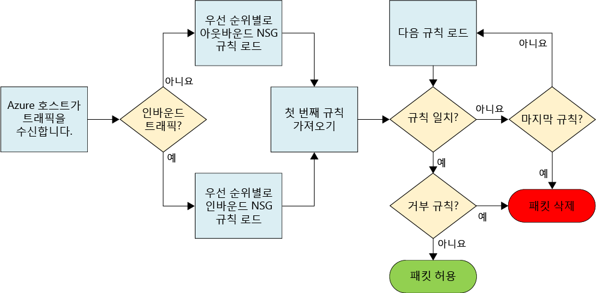
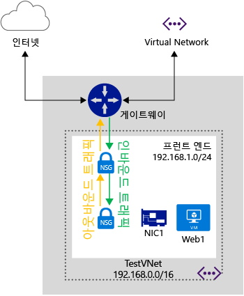
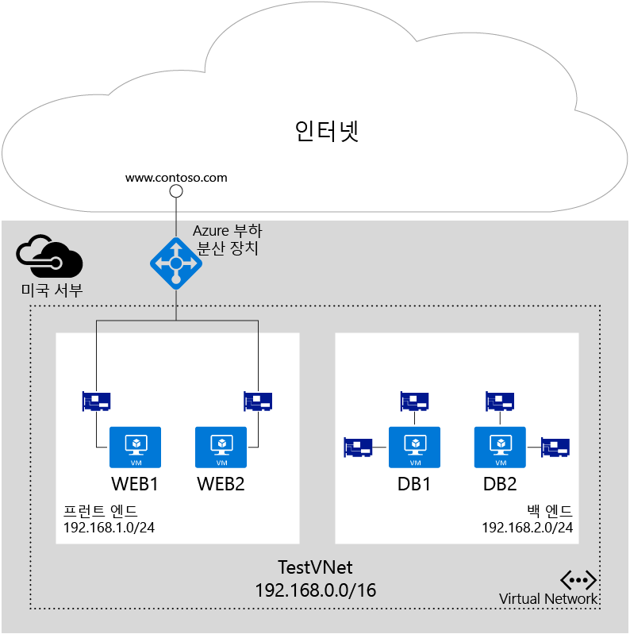

<properties 
   pageTitle="NSG(네트워크 보안 그룹)란?"
   description="NSG(네트워크 보안 그룹)를 사용하여 Azure에서 분산된 방화벽 및 VNet(가상 네트워크) 내에서 NSG를 사용하여 트래픽 흐름을 분리하고 제어하는 방법에 대해 알아봅니다."
   services="virtual-network"
   documentationCenter="na"
   authors="jimdial"
   manager="carmonm"
   editor="tysonn" />
<tags 
   ms.service="virtual-network"
   ms.devlang="na"
   ms.topic="get-started-article"
   ms.tgt_pltfrm="na"
   ms.workload="infrastructure-services"
   ms.date="02/11/2016"
   ms.author="jdial" />

# NSG(네트워크 보안 그룹)란?

NSG(네트워크 보안 그룹)은 ACL(액세스 제어 목록)의 가상 네트워크에 VM 인스턴스에 대한 허용 또는 거부 네트워크 트래픽 규칙의 목록을 포함합니다. NSG는 서브넷 또는 서브넷 내의 개별 VM 인스턴스 중 하나와 연결될 수 있습니다. NSG를 서브넷과 연결한 경우 ACL 규칙은 해당 서브넷에 있는 모든 VM 인스턴스에 적용됩니다. 또한 개별 VM에 대한 트래픽은 해당 VM에 직접 NSG를 연결하여 추가로 제한할 수 있습니다.

## NSG 리소스

NSG는 다음 속성을 포함합니다.

|속성|설명|제약 조건|고려 사항|
|---|---|---|---|
|Name|NSG 이름|지역 내에서 고유해야 합니다. 문자, 숫자, 밑줄, 마침표, 하이픈을 포함할 수 있습니다. 문자 또는 숫자로 시작해야 합니다. 문자, 숫자 또는 밑줄로 끝나야 합니다. 최대 80자까지 포함할 수 있습니다.|NSG를 여러 개 만들어야 하는 경우에는 NSG 기능을 식별하기 쉽도록 명명 규칙을 사용해야 합니다.|
|지역|NSG가 호스팅되는 Azure 지역|NSG는 NSG가 생성된 지역 내의 리소스에만 적용될 수 있습니다.|지역에 포함할 수 있는 NSG의 수를 파악하려면 아래에서 [제한](#Limits)을 참조하세요.|
|리소스 그룹|NSG가 속하는 리소스 그룹|NSG는 하나의 리소스 그룹에 속하지만, 리소스가 NSG와 동일한 Azure 지역의 일부라면, 모든 리소스 그룹에 속하는 리소스에 연결될 수 있습니다.|리소스 그룹은 다수의 리소스를 하나의 배포 단위로 함께 관리하기 위해 사용됩니다. NSG를 연결된 리소스로 그룹화하는 것을 고려하는 것이 좋습니다.|
|규칙|허용되거나 거부되는 트래픽을 정의하는 규칙||아래의 [NSG 규칙](#Nsg-rules)을 참조하세요.| 

>[AZURE.NOTE] 끝점 기반 ACL과 네트워크 보안 그룹은 동일한 VM 인스턴스에서 지원되지 않습니다. NSG를 사용하려는데 끝점 ACL이 이미 있는 경우 먼저, 끝점 ACL을 제거합니다. 이 작업을 수행하는 방법에 대한 자세한 내용은 [PowerShell을 사용하여 끝점에 대한 ACL(액세스 제어 목록) 관리](virtual-networks-acl-powershell.md)를 참조하세요.

### NSG 규칙

NSG 규칙은 다음 속성을 포함합니다.

|속성|설명|제약 조건|고려 사항|
|---|---|---|---|
|**Name**|규칙의 이름|지역 내에서 고유해야 합니다. 문자, 숫자, 밑줄, 마침표, 하이픈을 포함할 수 있습니다. 문자 또는 숫자로 시작해야 합니다. 문자, 숫자 또는 밑줄로 끝나야 합니다. 최대 80자까지 포함할 수 있습니다.|NSG 내에 몇 개의 규칙을 포함할 수 있습니다. 따라서 규칙의 기능을 식별할 수 있도록 명명 규칙을 따라야 합니다.|
|**프로토콜**|규칙과 일치하는 프로토콜|TCP, UDP, 또는 *|프로토콜에 *를 사용하면 ICMP(동부 및 서부 트래픽에만 해당)는 물론 UDP와 TCP가 포함되며 필요한 규칙의 수를 줄일 수 있습니다. 그렇지만 *를 사용하면 방식의 폭이 너무 넓어질 수 있으므로 정말 필요한 경우에만 사용하도록 주의해야 합니다.|
|**원본 포트 범위**|규칙과 일치하는 원본 포트 범위|1에서 65535까지의 단일 포트 번호, 포트 범위(예: 1-65635) 또는 *(모든 포트에 해당)|원본 포트는 사용 후 삭제될 수 있습니다. 클라이언트 프로그램이 특정 포트를 사용하지 않으면 대부분의 경우 "*"을 사용하세요. 여러 규칙을 피하기 위해 포트 범위를 가능한 한 많이 사용하도록 합니다 여러 포트 또는 포트 범위는 쉼표로 그룹화될 수 없습니다
|**대상 포트 범위**|규칙과 일치하는 대상 포트 범위|1에서 65535까지의 단일 포트 번호, 포트 범위(예: 1-65535) 또는 *(모든 포트에 해당)|여러 규칙을 피하기 위해 포트 범위를 가능한 한 많이 사용하도록 합니다 여러 포트 또는 포트 범위는 쉼표로 그룹화될 수 없습니다
|**원본 주소 접두사**|규칙과 일치하는 원본 주소 접두사 또는 태그|단일 IP 주소(예: 10.10.10.10), IP 서브넷(예: 192.168.1.0/24), [기본 태그](#default-tags) 또는 *(모든 주소에 해당)|규칙의 수를 줄이기 위해서 범위, 기본 태그, *를 사용하는 것이 좋습니다.|
|**대상 주소 접두사**|규칙과 일치하는 대상 주소 접두사 또는 태그|단일 IP 주소(예: 10.10.10.10), IP 서브넷(예: 192.168.1.0/24), [기본 태그](#default-tags) 또는 *(모든 주소에 해당)|규칙의 수를 줄이기 위해서 범위, 기본 태그, *를 사용하는 것이 좋습니다.|
|**방향**|규칙과 일치하는 트래픽의 방향|인바운드 또는 아웃바운드|인바운드 규칙과 아웃바운드 규칙은 방향에 근거하여 별도로 처리됩니다.|
|**우선 순위**|규칙은 우선 순위대로 검사되고 규칙이 적용된 후에는 일치 여부를 알기 위해 규칙이 더 이상 테스트되지 않습니다.|100~4096 사이의 숫자|기존 규칙 사이에 새로운 규칙을 위한 공간을 남겨두기 위해서 각 규칙의 우선 순위를 100씩 건너뛰도록 만드는 것이 좋습니다.|
|**Access**|규칙이 일치하는 경우 적용할 액세스 유형|허용 또는 거부|패킷에 대한 허용 규칙을 찾을 수 없으면 패킷은 삭제됩니다.|

NSG에는 인바운드 및 아웃바운드의 두 가지 규칙 집합이 포함되어 있습니다. 규칙에 대한 우선 순위는 각 집합 내에서 고유해야 합니다.

위의 그림에서는 NSG 규칙을 처리하는 방법을 보여 줍니다.

### 기본 태그

기본 태그는 IP 주소의 범주를 다루기 위해 시스템에서 제공한 식별자입니다. 모든 규칙의 **원본 주소 접두사** 및 **대상 주소 접두사** 속성에 있는 기본 태그를 사용할 수 있습니다. 3개의 기본 태그를 사용할 수 있습니다.

- **VIRTUAL\_NETWORK:** 이 기본 태그는 모든 네트워크 주소 공간을 나타냅니다. 여기에는 연결된 모든 온-프레미스 주소 공간 및 연결된 Azure VNet(로컬 네트워크)뿐만 아니라 가상 네트워크 주소 공간(Azure에 정의된 CIDR 범위)도 포함됩니다.

- **AZURE\_LOADBALANCER:** 이 기본 태그는 Azure의 인프라 부하 분산 장치를 표시합니다. 이 태그는 Azure의 상태 프로브가 시작되는 Azure 데이터 센터 IP로 변환됩니다.

- **INTERNET:** 이 기본 태그는 가상 네트워크 외부에 있으며 공용 인터넷으로 연결할 수 있는 IP 주소 공간을 나타냅니다. 이 범위에는 [Azure 소유의 공용 IP 공간](https://www.microsoft.com/download/details.aspx?id=41653)도 포함됩니다.

### 기본 규칙

모든 NSG에는 기본 규칙 집합이 포함됩니다. 기본 규칙은 삭제할 수 없지만, 가장 낮은 우선순위가 할당되기 때문에 직접 만든 규칙으로 재정의할 수 있습니다.

아래 기본 규칙에 설명된 대로, 가상 네트워크에서 시작하고 끝나는 트래픽은 인바운드와 아웃바운드 방향 둘 다에서 허용됩니다. 인터넷에 대한 연결은 아웃바운드 방향에 대해 허용되지만, 기본적으로 인바운드 방향에 대해서는 차단됩니다. Azure의 부하 분산 장치가 VM과 역할 인스턴스의 상태를 프로브하도록 허용하는 기본 규칙이 있습니다. 부하 분산된 집합을 사용하지 않는 경우에는 이 규칙을 재정의할 수 있습니다.

**인바운드 기본 규칙**

| Name | 우선 순위 | 원본 IP | 원본 포트 | 대상 IP | 대상 포트 | 프로토콜 | Access |
|-----------------------------------|----------|--------------------|-------------|-----------------|------------------|----------|--------|
| VNET 인바운드 허용 | 65000 | VIRTUAL\_NETWORK | * | VIRTUAL\_NETWORK | * | * | 허용 |
| AZURE 부하 분산 장치 인바운드 허용 | 65001 | AZURE\_LOADBALANCER | * | * | * | * | 허용 |
| 모든 인바운드 거부 | 65500 | * | * | * | * | * | 거부 |

**아웃바운드 기본 규칙**

| Name | 우선 순위 | 원본 IP | 원본 포트 | 대상 IP | 대상 포트 | 프로토콜 | Access |
|-------------------------|----------|-----------------|-------------|-----------------|------------------|----------|--------|
| VNET 아웃바운드 허용 | 65000 | VIRTUAL\_NETWORK | * | VIRTUAL\_NETWORK | * | * | 허용 |
| 인터넷 아웃바운드 허용 | 65001 | * | * | 인터넷 | * | * | 허용 |
| 모든 아웃바운드 거부 | 65500 | * | * | * | * | * | 거부 |

## NSG 연결

사용하는 배포 모델에 따라서 NSG를 VM, NIC 및 서브넷에 연결할 수 있습니다.

[AZURE.INCLUDE [learn-about-deployment-models-both-include.md](../../includes/learn-about-deployment-models-both-include.md)]
 
- **VM에 NSG 연결(클래식 배포에만 해당).** NSG를 VM에 연결하는 경우 NSG의 네트워크 액세스 규칙은 VM을 출입하는 모든 트래픽에 적용됩니다.

- **NIC에 NSG 연결(리소스 관리자 배포에만 해당).** NSG를 NIC에 연결하는 경우 NSG의 네트워크 액세스 규칙은 NIC에만 적용됩니다. 다시 말해서 다중 NIC VM에서 NSG가 단일 NIC에 적용되는 경우 다른 NIC에 바인딩된 트래픽에는 영향을 주지 않습니다.

- **서브넷에 NSG 연결(모든 배포)**. NSG를 서브넷에 연결하는 경우 NSG의 네트워크 액세스 규칙은 서브넷의 모든 IaaS 및 PaaS 리소스에 적용됩니다.

다른 NSG를 VM(또는 배포 모델에 따라서는 NIC)에 연결할 수 있고, NIC 또는 VM이 바인딩된 서브넷에 연결할 수 있습니다. 이 경우 모든 네트워크 액세스 규칙이 NSG에서 우선적으로 다음과 같은 순서로 트래픽에 적용됩니다.

- **인바운드 트래픽**
	1. 서브넷에 적용되는 NSG.
	
           서브넷 NSG에 들어오는 트래픽을 거부하도록 일치하는 규칙이 있는 경우 여기서 패킷이 삭제됩니다.
	2. NIC(리소스 관리자) 또는 VM(클래식)에 적용되는 NSG.
	   
           VM\\NIC NSG에 들어오는 트래픽을 거부하도록 일치하는 규칙이 있는 경우 서브넷 NSG가 트래픽을 허용하도록 일치하는 규칙이 있더라도 VM\\NIC에서 패킷이 삭제됩니다.
- **아웃바운드 트래픽**
	1. NIC(리소스 관리자) 또는 VM(클래식)에 적용되는 NSG.
	  
           VM\\NIC NSG에 들어오는 트래픽을 거부하도록 일치하는 규칙이 있는 경우 여기서 패킷이 삭제됩니다.
	2. 서브넷에 적용되는 NSG.
	   
           서브넷 NSG에 들어오는 트래픽을 거부하도록 일치하는 규칙이 있는 경우 VM\\NIC NSG가 트래픽을 허용하도록 일치하는 규칙이 있더라도 여기서 패킷이 삭제됩니다.

	

>[AZURE.NOTE] 서브넷, VM 또는 NIC에 단일 NSG만 연결할 수 있지만 동일한 NSG를 원하는 수만큼 많은 리소스에 연결할 수 있습니다.

## 구현
아래 나열된 다양한 도구를 사용하여 클래식 또는 리소스 관리자 배포 모델에서 NSG를 구현할 수 있습니다.

|배포 도구|클래식|리소스 관리자|
|---|---|---|
|클래식 포털|||
|Azure 포털||[![예][green]](virtual-networks-create-nsg-arm-pportal.md)로 바꿉니다.|
|PowerShell|[![예][green]](virtual-networks-create-nsg-classic-ps.md)로 바꿉니다.|[![예][green]](virtual-networks-create-nsg-arm-ps.md)로 바꿉니다.|
|Azure CLI|[![예][green]](virtual-networks-create-nsg-classic-cli.md)로 바꿉니다.|[![예][green]](virtual-networks-create-nsg-arm-cli.md)로 바꿉니다.|
|ARM 템플릿||[![예][green]](virtual-networks-create-nsg-arm-template.md)로 바꿉니다.|

|**키**| 지원됩니다.| 지원되지 않습니다.|
|---|---|---|

## 계획

NSG를 구현하기 전에 아래 질문에 답변해야 합니다.

1. 어떤 유형의 리소스의 들어오거나 나가는 트래픽을 필터링 하시겠습니까(VM, 여러 VM 또는 동일한 서브넷 또는 다른 서브넷에 연결된 리소스 간에 연결된 응용 프로그램 서비스 환경 또는 클라우드 서비스와 같은 기타 리소스의 NIC)?

2. 들어오고 나가는 트래픽을 필터링하려는 리소스가 기존 VNet의 서브넷에 연결되어 있습니까? 아니면 새로운 VNet 또는 서브넷에 연결될 예정입니까?
 
Azure에서 네트워크 보안을 계획하는 자세한 내용은 [클라우드 서비스 및 네트워크 보안 모범 사례](../best-practices-network-security.md)를 참조하세요.

## 디자인 고려 사항

[계획](#Planning) 섹션의 질문에 대한 답변을 파악하면 NSG를 정의하기 전에 다음을 검토합니다.

### 제한

NSG를 디자인할 때 다음과 같은 제한을 고려해야 합니다.

|**설명**|**기본 제한**|**영향**|
|---|---|---|
|서브넷, VM 또는 NIC에 연결할 수 있는 NSG의 수|1|이것은 NSG를 결합할 수 없다는 의미입니다. 리소스 집합에 필요한 모든 규칙이 하나의 NSG에 포함되도록 해야 합니다.|
|구독당 지역별 NSG|100|기본적으로, 새 NSG는 Azure 포털에 생성하는 각 VM에 대해 생성됩니다. 이러한 기본 동작을 허용하면, NSG가 빨리 소진됩니다. 디자인을 하는 동안 이러한 제한 사항을 염두 해두고, 필요에 따라서 여러 지역 또는 구독으로 리소스를 구분해야 합니다. |
|NSG당 NSG 규칙|200|이 한도를 초과하지 않도록 넓은 범위의 IP와 포트를 사용합니다. |

>[AZURE.IMPORTANT] 솔루션을 디자인하기 전에 [Azure의 네트워킹 서비스와 관련된 제한 사항](../azure-subscription-service-limits.md#networking-limits)을 모두 확인해야 합니다. 일부 제한은 지원 티켓을 열어 늘릴 수 있습니다.

### VNet 및 서브넷 디자인

NSG가 서브넷에 적용될 수 있기 때문에, 서브넷에 따라서 리소스를 그룹화고 서브넷에 NSG를 적용하여 NSG의 수를 최소화할 수 있습니다. NSG를 서브넷에 적용하기로 결정하고 나면, 사용자의 기존 VNet과 서브넷이 NSG를 감안하지 않고 정의되었다는 점을 발견할 수 있습니다. NSG 디자인을 지원하도록 새로운 VNet과 서브넷을 정의하는 것이 필요할 수 있습니다. 그리고 새로운 리소스를 새 서브넷에 배포합니다. 그 후 기존 리소스를 새 서브넷으로 이동하는 마이그레이션 전략을 정의합니다.

### 특별한 규칙

다음에 나열된 특별한 규칙을 고려해야 합니다. 이 규칙에서 허용되는 트래픽을 차단해서는 안 됩니다. 차단하는 경우 인프라가 필수 Azure 서비스와 통신할 수 없게 됩니다.

- **호스트 노드의 가상 IP:** DHCP, DNS 및 상태 모니터링과 같은 기본 인프라 서비스는 168.63.129.16의 가상화된 호스트 IP 주소를 통해 제공됩니다. 이 공용 IP 주소는 Microsoft에 속하며, 이 목적을 위해 모든 지역에서 유일하게 사용되는 가상화된 IP 주소입니다. 이 IP 주소는 가상 컴퓨터를 호스트하는 서버 컴퓨터(호스트 노드)의 실제 IP 주소에 매핑합니다. 호스트 노드는 DHCP 릴레이, DNS 재귀 확인자, 부하 분산 장치 상태 검색 및 컴퓨터 상태 검색에 대한 검색 소스 등의 역할을 합니다. 이 IP 주소에 대한 통신은 공격으로 간주되지 않아야 합니다.

- **라이선싱(키 관리 서비스):** 가상 컴퓨터에서 실행되는 Windows 이미지는 사용이 허가되어 있어야 합니다. 사용 허가를 위해 라이선싱 요청이 해당 쿼리를 처리하는 키 관리 서비스 호스트 서버로 전송됩니다. 그리고 이 통신은 항상 아웃바운드 포트 1688을 사용합니다.

### ICMP 트래픽

현재 NSG 규칙은 *TCP* 또는 *UDP* 프로토콜만 허용합니다. *ICMP*에 대한 고유 태그는 없습니다. 그러나 ICMP 트래픽은 기본적으로 VNet 내의 모든 포트 및 프로토콜의 송/수신 트래픽을 허용하는 인바운드 VNet 규칙(기본 규칙 65000 인바운드)을 통해 가상 네트워크 내에서 허용됩니다.

### 서브넷

- 워크로드에 필요한 계층의 수를 고려합니다. 각 계층은 서브넷에 적용되는 NSG로 서브넷을 사용하여 격리될 수 있습니다.
- VPN 게이트웨이 또는 Express 경로 회로에 대해 서브넷을 구현해야 하는 경우 해당 서브넷에 NSG를 적용하지 **말아야** 합니다. 그렇게 하면, 크로스 VNet 또는 크로스 프레미스 연결이 작동하지 않습니다.
- 가상 어플라이언스를 구현해야 하는 경우에는 사용자 정의 경로(UDR)가 제대로 작동할 수 있도록 가상 어플라이언스를 자체 서브넷에 배포해야 합니다. 서브넷에 들어오고 나가는 트래픽을 필터링하도록 서브넷 수준 NSG를 구현할 수 있습니다. 자세한 내용은 [트래픽 흐름을 제어하고 가상 어플라이언스를 사용하는 방법](virtual-networks-udr-overview.md)을 참조하세요.

### 부하 분산 장치

- 각 워크로드에 사용되고 있는 각 부하 분산 장치에 대한 부하 분산 및 NAT 규칙을 고려합니다. 이러한 규칙은 NIC(리소스 관리자 배포) 또는 VM/역할 인스턴스(클래식 배포)를 포함하는 백 엔드 풀에 바인딩됩니다. 각 백 엔드 풀에 대해 NSG를 만들어서 규칙을 통해 매핑되는 트래픽만 부하 분산 장치에 구현되도록 허용합니다. 이것은 부하 분산 장치를 통하지 않고 백 엔드 풀로 바로 들어오는 트래픽도 필터링이 되도록 보장합니다.
- 클래식 배포의 경우, 부하 분산 장치의 포트를 VM 또는 역할 인스턴스의 포트에 매핑하는 끝점을 만듭니다. 리소스 관리자 배포에 사용자 자신의 개별적인 공용 부하 분산 장치를 만들 수도 있습니다. NSG를 사용하여 부하 분산 장치에서 백 엔드 풀의 일부인 VM과 역할 인스턴스로 트래픽을 제한하는 경우, 들어오는 트래픽의 대상 포트는 부하 분산 장치에 의해 노출되는 포트가 아니라 VM 또는 역할 인스턴스의 실제 포트라는 점에 유의합니다. 또한 VM 연결을 위한 원본 포트 및 주소는 부하 분산 장치에 의해 노출되는 포트 및 주소가 아니라 인터넷 원격 컴퓨터의 포트 및 주소라는 점에 유의합니다.
- 공용 부하 분산 장치와 유사하게, ILB(내부 부하 분산 장치)를 통해 들어오는 트래픽을 필터링하기 위해 NSG를 생성하는 경우, 적용되는 원본 포트 및 주소 범위는 부하 분산 장치가 아닌 호출이 시작되는 컴퓨터에서 가져온 범위라는 것을 이해할 필요가 있습니다. 대상 포트 및 주소 범위는 부하 분산 장치가 아닌 트래픽을 수신하는 컴퓨터와 연관됩니다.

### 기타

- 끝점 기반 ACL 및 NSG는 동일한 VM 인스턴스에서 지원되지 않습니다. NSG를 사용하려는데 끝점 ACL이 이미 있는 경우 먼저, 끝점 ACL을 제거합니다. 이 작업을 수행하는 방법에 대한 정보는 [끝점 ACL 관리](virtual-networks-acl-powershell.md)를 참조하세요.
- 리소스 관리자 배포 모델에서, NIC에 의한 관리를 사용하도록 설정하여 트래픽을 분리하기 위해서 NIC가 여러 개 있는 VM에 대해 NIC에 연결된 NSG를 사용할 수 있습니다.
- 부하 분산 장치의 사용과 마찬가지로 다른 VNet의 트래픽을 필터링하는 경우 VNet을 연결하는 게이트웨이가 아닌 원격 컴퓨터의 원본 주소 범위를 사용해야 합니다.
- 많은 Azure 서비스가 Azure 가상 네트워크에 연결할 수 없기 때문에, 이 네트워크에서 주고 받는 트래픽을 NSG로 필터링할 수 없습니다. 사용하는 서비스가 VNet에 연결될 수 있는지 여부를 판단하려면 해당 서비스에 대한 설명서를 읽어보세요.

## 샘플 배포

이 문서에 포함된 정보의 응용 프로그램을 설명하기 위해서, 다음과 같은 요구 사항으로 두 계층 워크로드 솔루션에 대해 네트워크 트래픽을 필터링하도록 NSG를 정의하겠습니다.

1. 프런트 엔드(Windows 웹 서버)와 백 엔드(SQL 데이터베이스 서버) 사이의 트래픽 분리.
2. 포트 80의 모든 웹 서버에 대해 부하 분산 장치로 트래픽을 전달하는 부하 분산 규칙.
3. 부하 분산 장치의 포트 50001로 들어오는 트래픽을 프런트 엔드의 단일 VM의 포트 3389로 전달하는 NAT 규칙.
4. 인터넷에서 프런트 엔드 또는 백 엔드로 액세스 금지(요구 사항 1번을 제외).
5. 프런트 엔드 또는 백 엔드에서 인터넷으로 액세스 금지.
6. 프런트 엔드 서브넷 자체에서 들어오는 트래픽에 대해, 프런트 엔드의 모든 웹 서버에 포트 3389로 액세스.
7. 프런트 엔드 서브넷의 백 엔드의 모든 SQL 서버 VM에 포트 3389로 액세스.
8. 프런트 엔드 서브넷에서만 백 엔드의 모든 SQL 서버 VM에 포트 1433으로 액세스.
9. 백 엔드 VM의 다른 NIC에 관리 트래픽(포트 3389)과 데이터베이스 트래픽(포트 1433) 분리.

위의 다이어그램에서 볼 수 있듯이 *Web1* 및 *Web2* VM은 *FrontEnd* 서브넷에 연결되고, *DB1* 및 *DB2* VM은 *BackEnd* 서브넷에 연결됩니다. 두 서브넷은 *TestVNet* VNet의 일부입니다. 모든 리소스는 *미국 서부* Azure 지역에 할당됩니다.

위의 요구 사항 1~6번(3번 제외)은 서브넷 공간에 한정됩니다. 각 NSG에 필요한 규칙의 수를 최소화하고 기존 VM과 같은 유형의 워크로드를 실행하는 서브넷에 VM을 추가하는 작업을 수월하게 만들려면 다음과 같이 서브넷 수준 NSG를 구현합니다.

### 프런트 엔드 서브넷에 대한 NSG

**들어오는 규칙**

|규칙|Access|우선 순위|원본 주소 범위|원본 포트|대상 주소 범위|대상 포트|프로토콜|
|---|---|---|---|---|---|---|---|
|HTTP 허용|허용|100|인터넷|*|*|80|TCP|
|프런트 엔드의 RDP 허용|허용|200|192\.168.1.0/24|*|*|3389|TCP|
|인터넷에서 들어오는 것 모두 거부|거부|300|인터넷|*|*|*|TCP|

**나가는 규칙**

|규칙|Access|우선 순위|원본 주소 범위|원본 포트|대상 주소 범위|대상 포트|프로토콜|
|---|---|---|---|---|---|---|---|
|인터넷 거부|거부|100|*|*|인터넷|*|*|

### 백 엔드 서브넷에 대한 NSG

**들어오는 규칙**

|규칙|Access|우선 순위|원본 주소 범위|원본 포트|대상 주소 범위|대상 포트|프로토콜|
|---|---|---|---|---|---|---|---|
|인터넷 거부|거부|100|인터넷|*|*|*|*|

**나가는 규칙**

|규칙|Access|우선 순위|원본 주소 범위|원본 포트|대상 주소 범위|대상 포트|프로토콜|
|---|---|---|---|---|---|---|---|
|인터넷 거부|거부|100|*|*|인터넷|*|*|

### 인터넷의 RDP에 대해 프런트 엔드의 단일 VM(NIC)에 대한 NSG

**들어오는 규칙**

|규칙|Access|우선 순위|원본 주소 범위|원본 포트|대상 주소 범위|대상 포트|프로토콜|
|---|---|---|---|---|---|---|---|
|인터넷에서 RDP 허용|허용|100|인터넷|*|*|3389|TCP|

>[AZURE.NOTE] 이 규칙에 대한 원본 주소 범위는 부하 분산 장치에 대한 VIP가 아니고 **인터넷**이며 원본 포트는 500001이 아니고 *****입니다. NAT 규칙/부하 분산 규칙과 NSG 규칙을 혼동하지 마십시오. NSG 규칙은 원본과 대상 사이의 부하 분산 장치가 **아닌** 본래의 원본 및 트래픽의 최종 대상과 항상 연관됩니다.

### 백 엔드의 관리 NIC에 대한 NSG

**들어오는 규칙**

|규칙|Access|우선 순위|원본 주소 범위|원본 포트|대상 주소 범위|대상 포트|프로토콜|
|---|---|---|---|---|---|---|---|
|프런트 엔드의 RDP 허용|허용|100|192\.168.1.0/24|*|*|3389|TCP|

### 백 엔드의 데이터베이스 액세스 NIC에 대한 NSG

**들어오는 규칙**

|규칙|Access|우선 순위|원본 주소 범위|원본 포트|대상 주소 범위|대상 포트|프로토콜|
|---|---|---|---|---|---|---|---|
|프런트 엔드의 SQL 허용|허용|100|192\.168.1.0/24|*|*|1433|TCP|

위의 일부 NSG는 개별적인 NIC와 연결될 필요가 있으므로, 이 시나리오를 리소스 관리자 배포로 배포할 필요가 있습니다. 규칙이 적용되어야 하는 방식에 따라서, 서브넷 및 NIC 수준에 대해 규칙이 결합되는 방식에 유의합니다.

## 다음 단계

- [클래식 배포 모델에서 NSG를 배포합니다](virtual-networks-create-nsg-classic-ps.md).
- [Resource Manager에서 NSG를 배포합니다](virtual-networks-create-nsg-arm-pportal.md).
- [NSG 로그를 관리](virtual-network-nsg-manage-log.md)합니다.

[green]: ./media/virtual-network-nsg-overview/green.png
[yellow]: ./media/virtual-network-nsg-overview/yellow.png
[red]: ./media/virtual-network-nsg-overview/red.png

<!-----HONumber=AcomDC_0907_2016-->