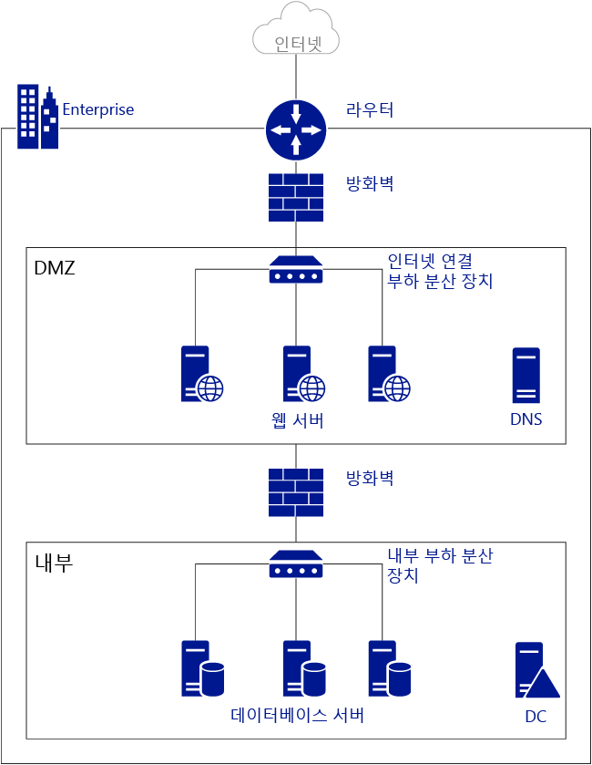
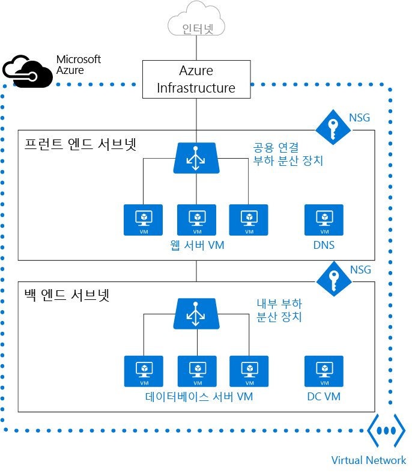

<properties
   pageTitle="Azure 가상 네트워크(VNet) 개요"
   description="Azure의 가상 네트워크(VNet)에 대해 자세히 알아봅니다."
   services="virtual-network"
   documentationCenter="na"
   authors="jimdial"
   manager="carmonm"
   editor="tysonn" />
<tags
   ms.service="virtual-network"
   ms.devlang="na"
   ms.topic="get-started-article"
   ms.tgt_pltfrm="na"
   ms.workload="infrastructure-services"
   ms.date="03/15/2016"
   ms.author="jdial" />

# 가상 네트워크 개요

Azure 가상 네트워크(VNet)는 클라우드의 사용자 네트워크를 나타내는 표현입니다. 구독 전용 Azure 클라우드를 논리적으로 격리한 것이 가상 네트워크입니다. 사용자는 이 네트워크 내부의 IP 주소 블록, DNS 설정, 보안 정책 및 경로 테이블을 완벽하게 제어할 수 있습니다. 또한 VNet을 여러 서브넷으로 분할하고 Azure IaaS VM(가상 컴퓨터) 및/또는 [클라우드 서비스(PaaS 역할 인스턴스)](../cloud-services/cloud-services-choose-me.md)를 실행할 수 있습니다. 뿐만 아니라 Azure에서 제공하는 [연결 옵션](../vpn-gateway/vpn-gateway-cross-premises-options.md) 중 하나를 사용하여 가상 네트워크를 온-프레미스 네트워크에 연결할 수 있습니다. 기본적으로 네트워크를 Azure로 확장하여 IP 주소 블록을 완벽하게 제어하고, Azure가 제공하는 엔터프라이즈급 솔루션의 혜택을 누릴 수 있습니다.

VNet을 더 잘 이해하기 위해 간소화된 온-프레미스 네트워크가 표시된 아래 그림을 살펴보겠습니다.

위의 그림에서는 라우터를 통해 공용 인터넷에 연결된 온-프레미스 네트워크를 보여줍니다. 또한 DNS 서버 및 웹 서버 팜을 호스트하는 DMZ와 라우터 사이의 방화벽도 볼 수 있습니다. 웹 서버 팜은 인터넷에 노출되어 있는 하드웨어 부하 분산 장치를 사용하여 부하 분산되며 내부 서브넷의 리소스를 소모합니다. 내부 서브넷은 다른 방화벽에 의해 DMZ에서 분리되어 있으며 Active Directory 도메인 컨트롤러 서버, 데이터베이스 서버 및 응용 프로그램 서버를 호스트합니다.

아래 그림에 나온 것처럼 동일한 네트워크를 Azure에서 호스트할 수 있습니다.

Azure 인프라가 라우터의 역할을 수행하여 어떠한 구성도 필요 없이 VNet에서 공용 인터넷에 액세스할 수 있는 방법을 알아봅니다. 방화벽을 대체하여 NSG(네트워크 보안 그룹)를 각 개별 서브넷에 적용할 수 있습니다. 또한 실제 부하 분산 장치는 Azure에서 인터넷에 연결된 내부 부하 분산으로 대체됩니다.

>[AZURE.NOTE] Azure에는 클래식(서비스 관리라고도 함) 및 ARM(Azure 리소스 관리자)의 두 가지 배포 모드가 있습니다. 클래식 VNet은 선호도 그룹에 추가하거나 지역 VNet으로 생성할 수 있습니다. VNet이 선호도 그룹에 있는 경우는 [지역 VNet으로 마이그레이션](virtual-networks-migrate-to-regional-vnet.md)하는 것이 좋습니다.

## 가상 네트워크의 장점

- **격리**. VNet은 서로 완전히 격리됩니다. 따라서 동일한 CIDR 주소 블록을 사용하는 개발, 테스트 및 프로덕션 환경에 대해 개별 네트워크를 만들 수 있습니다.

- **공용 인터넷 액세스**. VNet의 모든 IaaS VM 및 PaaS 역할 인스턴스에서 기본적으로 공용 인터넷에 액세스할 수 있습니다. NSG(네트워크 보안 그룹)을 사용하면 사용자가 액세스를 제어할 수 있습니다.

- **VNet 내의 VM 액세스**. PaaS 역할 인스턴스 및 IaaS VM은 서로 다른 서브넷에 있는 경우에도 게이트웨이를 구성하거나 공용 IP 주소를 사용할 필요 없이 개인 IP 주소를 사용하여 동일한 가상 네트워크에서 실행하고 서로 연결할 수 있습니다.

- **이름 확인**. Azure는 VNet에 배포된 IaaS VM 및 PaaS 역할 인스턴스에 대한 내부 이름 확인 기능을 제공합니다. 또한 사용자 고유의 DNS 서버를 배포하고 이 서버를 사용하도록 VNet을 구성할 수도 있습니다.

- **보안**. 네트워크 보안 그룹을 사용하여 VNet에서 가상 컴퓨터 및 PaaS 역할 인스턴스로 들어오고 나가는 트래픽을 제어할 수 있습니다.

- **연결**. VNet은 사이트 간 VPN 연결 또는 Express 경로 연결을 사용하여 상호 연결할 수 있으며 온-프레미스 데이터 센터에도 연결할 수 있습니다. VPN 게이트웨이에 대한 자세한 내용은 [VPN 게이트웨이 정보](../vpn-gateway/vpn-gateway-about-vpngateways.md)를 참조하세요. Express 경로에 대한 자세한 내용은 [Express 경로 기술 개요](../expressroute/expressroute-introduction.md)를 참조하세요.

    >[AZURE.NOTE] 임의의 IaaS VM 또는 PaaS 역할 인스턴스를 Azure 환경에 배포하기 전에 VNet을 만들었는지 확인합니다. ARM 기반 VM은 VNet이 필요하며 기존 VNet을 지정하지 않으면 Azure에서 기본 VNet을 만드는데, 이 기본 VNet은 온-프레미스 네트워크와 CIDR 주소 블록 충돌이 발생할 수 있습니다. 이 문제가 발생하면 VNet을 온-프레미스 네트워크에 연결할 수 없습니다.

## 서브넷

서브넷은 VNet의 IP 주소 범위이며, 사용자가 구성 및 보안을 목적으로 VNet을 여러 서브넷으로 분할할 수 있습니다. VNet 내부의 서브넷(같은 또는 다른)에 배포된 VM 및 PaaS 역할 인스턴스는 추가 구성 없이 서로 통신할 수 있습니다. 또한 서브넷에 경로 테이블 및 Nsg를 구성할 수 있습니다.

## IP 주소

Azure에서 리소스에 할당되는 IP 주소는 *공용* 및 *개인*의 두 종류가 있습니다. 공용 IP 주소를 사용하면 Azure 리소스가 [Azure Redis Cache](https://azure.microsoft.com/services/cache/), [Azure 이벤트 허브](https://azure.microsoft.com/documentation/services/event-hubs/)와 같은 Azure의 공용 서비스 및 인터넷과 통신할 수 있습니다. 개인 IP 주소를 사용하면 가상 네트워크의 리소스 간 통신 그리고 인터넷 라우팅이 가능한 IP 주소를 사용하지 않고 VPN을 통해 연결된 리소스 간 통신이 가능합니다.

Azure의 IP 주소에 대한 자세한 내용을 알아보려면 [가상 네트워크의 IP 주소](virtual-network-ip-addresses-overview-arm.md)를 방문하세요.

## Azure 부하 분산 장치

Azure 부하 분산 장치를 사용하여 가상 네트워크의 가상 컴퓨터 및 클라우드 서비스를 인터넷에 노출할 수 있습니다. 내부 전용 업무용 응용 프로그램은 내부 부하 분산 장치를 사용해야만 부하를 분산할 수 있습니다.

- **외부 부하 분산 장치**. 외부 부하 분산 장치를 사용하면 공용 인터넷에서 액세스하는 IaaS VM 및 PaaS 역할 인스턴스에 높은 가용성을 제공할 수 있습니다.

- **내부 부하 분산 장치**. 내부 부하 분산 장치를 사용하면 VNet의 다른 서비스에서 액세스하는 IaaS VM 및 PaaS 역할 인스턴스에 높은 가용성을 제공할 수 있습니다.

Azure에서 부하 분산에 대한 자세한 내용은 [부하 분산 장치 개요](../load-balancer/load-balancer-overview.md)를 참조하세요.

## NSG(네트워크 보안 그룹)

네트워크 인터페이스(NIC), VM 및 서브넷에 대한 인바운드 및 아웃바운드 액세스를 제어하는 NSG를 만들 수 있습니다. 각 NSG에는 원본 IP 주소, 원본 포트, 대상 IP 주소 및 대상 포트에 기반하여 트래픽을 승인할지 또는 거부할지 지정하는 하나 이상의 규칙이 포함되어 있습니다. NSG에 대해 자세히 알아보려면 [네트워크 보안 그룹이란?](virtual-networks-nsg.md)을 참조하세요.

## 가상 어플라이언스

가상 어플라이언스는 방화벽, WAN 최적화 또는 침입 감지 등과 같은 소프트웨어 기반 어플라이언스 기능을 실행하는 VNet의 또 다른 VM입니다. 가상 어플라이언스를 통해 VNet 트래픽을 라우팅하는 Azure 경로를 만들어 해당 기능을 사용할 수 있습니다.

예를 들어 NSG는 VNet에 대한 보안을 제공하는 데 사용할 수 있습니다. 그러나 NSG는 들어오고 나가는 패킷에 대해 계층 4 ACL(액세스 제어 목록)을 제공합니다. 계층 7 보안 모델을 사용하려면 방화벽 어플라이언스를 사용해야 합니다.

가상 어플라이언스는 [사용자 정의 경로 및 IP 전달](virtual-networks-udr-overview.md)에 따라 달라집니다.

## 제한
구독에 허용되는 가상 네트워크의 수가 제한되어 있습니다. 자세한 내용은 [Azure 네트워킹 제한](../azure-subscription-service-limits.md#networking-limits)을 참조하세요.

## 가격
추가 비용 없이 Azure에서 가상 네트워크를 사용할 수 있습니다. VNet 내부에서 실행되는 계산 인스턴스는 [Azure VM 가격](https://azure.microsoft.com/pricing/details/virtual-machines/)에 설명된 대로 표준 요금제가 적용됩니다. VNet에 사용되는 [VPN 게이트웨이](https://azure.microsoft.com/pricing/details/vpn-gateway/) 및 [공용 IP 주소](https://azure.microsoft.com/pricing/details/ip-addresses/)에도 표준 요금제가 적용됩니다.

## 다음 단계

- [VNet 만들기](virtual-networks-create-vnet-arm-pportal.md) 및 서브넷 만들기.
- [VNet에서 VM 만들기](../virtual-machines/virtual-machines-windows-hero-tutorial.md).
- [NSG](virtual-networks-nsg.md)에 대해 알아보기.
- [사용자 정의 경로 및 IP 전달](virtual-networks-udr-overview.md)에 대해 알아보기.

<!-----HONumber=AcomDC_0810_2016-->