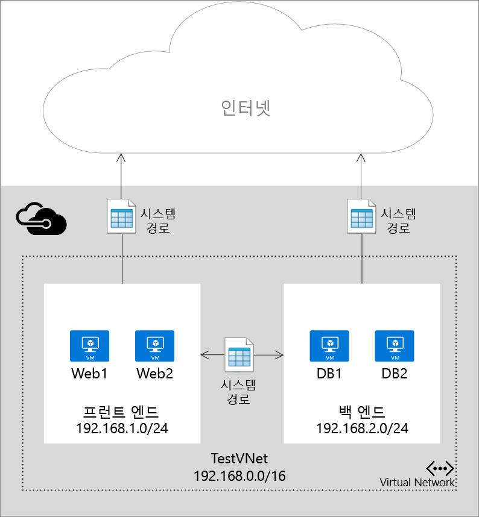
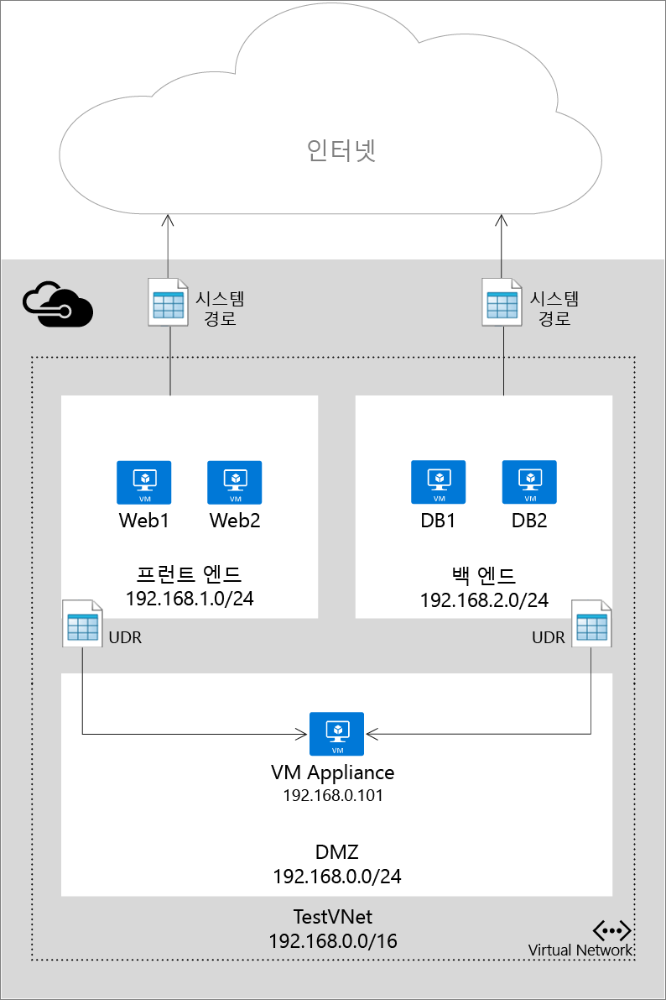

<properties 
   pageTitle="사용자 정의된 경로 및 IP 전달이란?"
   description="Azure에서 UDR(사용자 정의 경로) 및 IP 전달을 사용하여 네트워크 가상 어플라이언스에 트래픽을 전달하는 방법에 대해 알아봅니다."
   services="virtual-network"
   documentationCenter="na"
   authors="jimdial"
   manager="carmonm"
   editor="tysonn" />
<tags 
   ms.service="virtual-network"
   ms.devlang="na"
   ms.topic="get-started-article"
   ms.tgt_pltfrm="na"
   ms.workload="infrastructure-services"
   ms.date="03/15/2016"
   ms.author="jdial" />

# 사용자 정의된 경로 및 IP 전달이란?
Azure에서 VNet(가상 네트워크)에 VM(가상 컴퓨터)을 추가하면 네트워크를 통해 다른 VM과 통신할 수 있는지 자동으로 확인할 수 있습니다. 서로 다른 서브넷에 있는 VM 간에도 게이트웨이를 지정할 필요가 없습니다. VM에서 공용 인터넷에 통신하는 경우는 물론, Azure와 사용자 고유의 데이터 센터 간 하이브리드 연결이 있는 경우 사용자의 온-프레미스 네트워크에 통신하는 경우에도 마찬가지입니다 .

이러한 통신 전달이 가능한 이유는 Azure가 일련의 시스템 경로를 사용하여 IP 트래픽 전달 방식을 정의하기 때문입니다. 다음과 같은 시나리오에서 시스템 경로가 통신 전달을 제어합니다.

- 동일한 서브넷 내의 통신
- 단일 VNet 내의 서로 다른 서브넷 간 통신
- VM에서 인터넷으로의 통신
- VPN 게이트웨이를 통한 서로 다른 VNet 간 통신
- VPN 게이트웨이를 통한 VNet과 사용자의 온-프레미스 네트워크 간 통신.

아래 그림은 단일 VNet, 두 개의 서브넷, 둘 이상의 VM 간 통신과 IP 트래픽이 전달되는 시스템 경로를 간단한 모습으로 보여 줍니다.

시스템 경로를 사용하면 자동으로 트래픽을 쉽게 배포할 수 있지만 가상 어플라이언스를 통해 패킷 라우팅을 제어하고자 하는 경우도 있습니다. 이러한 경우, 특정 서브넷으로 흐르는 패킷이 가상 어플라이언스로 가도록 한 다음 홉을 지정하는 사용자 정의 경로를 생성하고 가상 어플라이언스로 실행되는 VM에서 IP를 전달하도록 설정하면 됩니다.

아래 그림에는 세 번째 서브넷의 가상 기기를 지나가도록 패킷을 한 서브넷에서 다른 서브넷으로 강제 전송하는 사용자 정의 경로와 IP 전달의 예가 나와 있습니다.

>[AZURE.IMPORTANT] 사용자 정의 경로는 서브넷에서 나가는 트래픽에만 적용됩니다. 트래픽이 인터넷에서 서브넷으로 들어오는 방법 등을 지정하는 경로를 만들 수는 없습니다. 또한 트래픽을 전달하는 기기는 트래픽이 시작되는 위치와 동일한 서브넷에 있을 수 없습니다. 항상 기기를 위한 별도의 서브넷을 만드세요.

## 경로 리소스
패킷은 물리적 네트워크의 각 노드에 정의된 경로 테이블을 기반으로 TCP/IP 네트워크를 통해 라우팅됩니다. 경로 테이블은 대상 IP 주소에 따라 패킷을 전달할 위치를 결정하는 데 사용되는 개별 경로의 컬렉션입니다. 경로는 다음으로 구성됩니다.

|속성|설명|제약 조건|고려 사항|
|---|---|---|---|
| 주소 접두사 | 경로가 적용되는 대상 CIDR(예: 10.1.0.0/16)입니다.|공용 인터넷, Azure 가상 네트워크 또는 온-프레미스 데이터 센터에서 주소를 나타내는 유효한 CIDR 범위여야 합니다.|**주소 접두사**가 **다음 홉 주소**에 대한 주소를 포함하지 않도록 하고 포함된 경우 패킷이 대상에 도달하지 않고 원본에서 다음 홉으로 이동하는 루프에 입력됩니다. |
| 다음 홉 유형 | 패킷을 전송해야 하는 대상 Azure 홉의 유형입니다. | 다음 값 중 하나여야 합니다.  **가상 네트워크**. 로컬 가상 네트워크를 나타냅니다. 예를 들어 10.1.0.0/16 및 10.2.0.0/16의 두 서브넷이 같은 가상 네트워크에 있는 경우 경로 테이블의 각 서브넷에 대한 경로는 다음 홉 값이 *가상 네트워크*로 설정됩니다.   **가상 네트워크 게이트웨이** Azure S2S VPN 게이트웨이를 나타냅니다.   **인터넷**. Azure 인프라에서 제공하는 기본 인터넷 게이트웨이를 나타냅니다.   **가상 어플라이언스**. Azure 가상 네트워크에 추가한 가상 어플라이언스를 나타냅니다.   **없음**. 블랙 홀을 나타냅니다. 블랙 홀로 전달된 패킷은 아무 곳에도 전달되지 않습니다.| **없음** 형식을 사용하여 흐름에서 주어진 대상에 패키지를 중지하는 것이 좋습니다. | 
| 다음 홉 주소 | 다음 홉 주소에는 패킷을 전달해야 하는 IP 주소가 포함됩니다. 다음 홉 값은 다음 홉 유형이 *가상 어플라이언스*인 경로에서만 허용됩니다.| 연결 가능한 IP 주소여야 합니다. | IP 주소가 VM을 나타내는 경우 VM에 Azure의 [IP 전달](#IP-forwarding)을 사용하도록 설정합니다. |

Azure PowerShell에서 "NextHopType" 값의 일부에는 다른 이름이 지정되어 있습니다.
- 가상 네트워크는 VnetLocal입니다.
- 가상 네트워크 게이트웨이는 VirtualNetworkGateway입니다.
- 가상 어플라이언스는 VirtualAppliance입니다.
- Internet은 인터넷입니다.
- None은 없음입니다.

### 시스템 경로
가상 네트워크에서 생성된 모든 서브넷은 다음 시스템 경로 규칙을 포함하는 경로 테이블과 자동으로 연결됩니다.

- **로컬 Vnet 규칙**:이 규칙은 가상 네트워크에 있는 모든 서브넷에 대해 자동으로 생성됩니다. VNet의 VM들이 직접 연결되어 있으며 다음 홉으로 연결되는 매개가 없음을 명시합니다.
- **온-프레미스 규칙**: 이 규칙은 온-프레미스 주소 범위로 전달되는 모든 트래픽에 적용되며, VPN 게이트웨이를 다음 홉 대상으로 사용합니다.
- **인터넷 규칙**: 이 규칙은 공용 인터넷에 유입되는 모든 트래픽을 처리하며 인프라 인터넷 게이트웨이를 인터넷에 유입되는 모든 트래픽에 대한 다음 홉으로 사용합니다.

### 사용자 정의 경로
대부분의 환경에는 Azure에서 사전 정의된 시스템 경로만 필요합니다. 그러나 다음과 같은 특정한 경우에는 경로 테이블을 만들고 하나 이상의 경로를 추가해야 할 수 있습니다.

- 온-프레미스 네트워크를 통해 인터넷으로 강제 터널링하는 경우
- Azure 환경에서 가상 어플라이언스를 사용하는 경우

위 시나리오에서는 경로 테이블을 만들어 사용자 정의 경로를 추가해야 합니다. 여러 경로 테이블을 만들 수 있으며, 동일한 경로 테이블을 하나 이상의 서브넷에 연결할 수 있습니다. 또한 각 서브넷은 단일 경로 테이블에만 연결할 수 있습니다. 서브넷의 모든 VM 및 클라우드 서비스는 해당 서브넷에 연결된 경로 테이블을 사용합니다.

경로 테이블이 서브넷에 연결될 때까지 서브넷은 시스템 경로에 의존합니다. 연결이 설정되면 사용자 정의 경로 및 시스템 경로 간에 LPM(가장 긴 접두사 일치)을 기반으로 라우팅이 수행됩니다. LPM 일치가 동일한 경로가 두 개 이상 있으면 다음 순서대로 해당 원점에 따라 경로가 선택됩니다.

1. 사용자 정의 경로
1. BGP 경로(ExpressRoute를 사용하는 경우)
1. 시스템 경로

사용자 정의 경로를 만드는 방법은 [를 만들고 IP 전달을 사용하도록 설정하는 방법](virtual-network-create-udr-arm-template.md)을 참조하십시오.

>[AZURE.IMPORTANT] 사용자 정의 경로는 Azure VM 및 클라우드 서비스에만 적용됩니다. 예를 들어 온-프레미스 네트워크와 Azure 간에 방화벽 가상 어플라이언스를 추가하려면 온-프레미스 주소 공간으로 이동하는 모든 트래픽을 가상 어플라이언스로 전달하는 Azure 경로 테이블에 대한 사용자 정의 경로를 만들어야 합니다. 또한 GatewaySubnet에 UDR(사용자 정의 경로)를 추가하여 모든 가상 어플라이언스를 통해 온-프레미스에서 Azure로 트래픽을 전달할 수 있습니다. 이 기능은 최근에 추가되었습니다.

### BGP 경로
온-프레미스 네트워크와 Azure 간에 ExpressRoute 연결이 있는 경우 BGP를 사용하도록 설정하여 온-프레미스 네트워크에서 Azure로 경로를 전파할 수 있습니다. 이러한 BGP 경로는 각 Azure 서브넷의 사용자 정의 경로 및 시스템 경로와 동일한 방식으로 사용됩니다. 자세한 내용은 [Express 경로 소개](../expressroute/expressroute-introduction.md)를 참조하세요.

>[AZURE.IMPORTANT] VPN 게이트웨이를 다음 홉으로 사용하는 서브넷 0.0.0.0/0에 대한 사용자 정의 경로를 만들어 온-프레미스 네트워크를 통한 강제 터널링을 사용하도록 Azure 환경을 구성할 수 있습니다. 그러나 이 구성은 VPN 게이트웨이를 사용하는 경우에만 작동하고 ExpressRoute를 사용하는 경우에는 작동하지 않습니다. ExpressRoute의 경우 강제 터널링은 BGP를 통해 구성됩니다.

## IP 전달
위에서 설명한 것처럼 사용자 정의 경로를 만드는 주된 이유 중 하나는 트래픽을 가상 어플라이언스로 전달하기 위한 것입니다. 가상 어플라이언스는 방화벽이나 NAT 장치와 같이 네트워크 트래픽을 처리하는 데 사용되는 응용 프로그램을 실행하는 VM일 뿐입니다.

이 가상 어플라이언스 VM은 주소가 자신으로 지정되지 않은 들어오는 트래픽을 받을 수 있어야 합니다. VM이 다른 대상으로 주소가 지정된 트래픽을 받을 수 있도록 하려면 해당 VM에서 IP 전달을 사용하도록 설정해야 합니다. 이것은 Azure 설정으로 게스트 운영 체제에서 설정할 수 없습니다.

## 다음 단계

- [Resource Manager 배포 모델에서 경로를 만들어](virtual-network-create-udr-arm-template.md) 서브넷에 연결하는 방법에 대해 알아봅니다.
- [클래식 배포 모델에서 경로를 만들어](virtual-network-create-udr-classic-ps.md) 서브넷에 연결하는 방법에 대해 알아봅니다.

<!-----HONumber=AcomDC_0810_2016-->