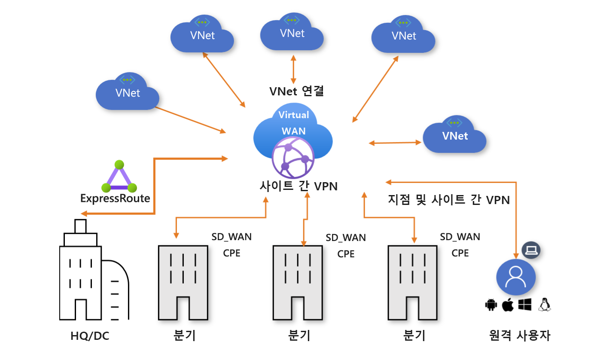

# Azure Virtual WAN 정보

Azure Virtual WAN은 많은 네트워킹, 보안 및 라우팅 기능을 결합하여 단일 운영 인터페이스를 제공하는 네트워킹 서비스입니다. 이러한 기능에는 분기 연결(SD-WAN 또는 VPN CPE와 같은 Virtual WAN 파트너 디바이스에서 연결 자동화를 통해), 사이트 간 VPN 연결, 원격 사용자 VPN(지점 및 사이트 간) 연결, 프라이빗(ExpressRoute) 연결, 클라우드 연결(가상 네트워크에 대한 전이 연결), VPN ExpressRoute 상호 연결, 라우팅, Azure Firewall, 프라이빗 연결용 암호화 등이 포함됩니다. Virtual WAN 사용을 시작하는 데에는 이러한 사용 사례 중 일부만 필요합니다. 하나의 사용 사례만으로 시작한 다음, 네트워크가 발전함에 따라 네크워크를 조정할 수 있습니다.

Virtual WAN 아키텍처는 분기(VPN/SD-WAN 디바이스), 사용자(Azure VPN/OpenVPN/IKEv2 클라이언트), ExpressRoute 회로 및 가상 네트워크를 위한 확장 및 성능이 기본 제공되는 허브 및 스포크 아키텍처입니다. 이를 통해 클라우드 호스팅된 네트워크 '허브'가 서로 다른 유형의 '스포크'에 분산될 수 있는 엔드포인트 간의 전이적 연결을 가능하게 하는 [글로벌 전송 네트워크 아키텍처](virtual-wan-global-transit-network-architecture.md)를 활성화합니다.

Azure 지역은 연결하도록 선택할 수 있는 허브 역할을 합니다. 모든 허브가 표준 Virtual WAN에서 풀 메시로 연결되므로 사용자는 Microsoft 백본을 임의(모든 스포크) 연결에 쉽게 사용할 수 있습니다. SD-WAN/VPN 디바이스와의 스포크 연결의 경우 사용자는 Azure Virtual WAN에서 수동으로 설정하거나 Virtual WAN CPE(SD-WAN/VPN) 파트너 솔루션을 사용하여 Azure에 대한 연결을 설정할 수 있습니다. Azure Virtual WAN과의 연결 자동화(디바이스 정보를 Azure로 내보내고, Azure 구성을 다운로드하고, 연결을 설정할 수 있는 기능)를 지원하는 파트너 목록이 있습니다. 자세한 내용은 [Virtual WAN 파트너 및 위치](virtual-wan-locations-partners.md) 문서를 참조하세요.

이 문서에서는 Azure Virtual WAN의 네트워크 연결에 대해 간략하게 설명합니다. Virtual WAN은 다음과 같은 이점을 제공합니다.

* **허브 스포크에서 통합된 연결 솔루션:** 온-프레미스 사이트와 Azure Hub 간의 사이트 간 구성과 연결을 자동화합니다.
* **자동화된 스포크 설정 및 구성:** 가상 네트워크와 워크로드를 Azure 허브에 원활하게 연결합니다.
* **직관적인 문제 해결:** Azure 내에서 엔드투엔드 흐름을 확인한 다음, 이 정보를 사용하여 필요한 작업을 수행할 수 있습니다.

## 기본 및 표준 가상 WAN

다음과 같은 두 가지 유형의 가상 WAN이 있습니다. 기본 및 표준 다음 표에서는 각 유형에 사용 가능한 구성을 보여 줍니다.

[!INCLUDE [Basic and Standard SKUs](../../includes/virtual-wan-standard-basic-include.md)]

가상 WAN을 업그레이드하는 단계는 [기본에서 표준으로 가상 WAN 업그레이드](upgrade-virtual-wan.md)를 참조하세요.

## 아키텍처

Virtual WAN 아키텍처 및 Virtual WAN으로 마이그레이션하는 방법에 대한 자세한 내용은 다음 문서를 참조하세요.

* [Virtual WAN 아키텍처](migrate-from-hub-spoke-topology.md)
* [글로벌 전송 네트워크 아키텍처](virtual-wan-global-transit-network-architecture.md)

## Virtual WAN 리소스

엔드투엔드 가상 WAN을 구성하려면 다음 리소스를 만듭니다.

* **virtualWAN:** virtualWAN 리소스는 Azure 네트워크의 가상 오버레이를 나타내며 여러 리소스의 컬렉션입니다. 가상 WAN 내에서 가지려는 모든 가상 허브에 대한 링크를 포함합니다. Virtual WAN 리소스는 서로 격리되며 공통의 허브를 포함할 수 없습니다. Virtual WAN에서 가상 허브는 서로 통신하지 않습니다.

* **허브**: 가상 허브는 Microsoft에서 관리하는 가상 네트워크입니다. 허브에는 연결을 활성화하는 다양한 서비스 엔드포인트가 있습니다. 사용자의 온-프레미스 네트워크(vpnsite)에서 가상 허브 내의 VPN Gateway에 연결하거나, 가상 허브에 ExpressRoute 회로를 연결할 수 있으며 가상 허브의 지점 및 사이트 간 게이트웨이에 모바일 사용자를 연결할 수도 있습니다. 허브는 지역에서 네트워크의 핵심입니다. Azure 지역당 하나의 허브만 있을 수 있습니다.

  허브 게이트웨이는 ExpressRoute 및 VPN Gateway에 사용하는 가상 네트워크 게이트웨이와 동일하지 않습니다. 예를 들어 Virtual WAN을 사용하는 경우 온-프레미스 사이트에서 VNet으로의 직접적인 사이트 간 연결을 만들지 않습니다. 대신 사이트 간 연결을 허브에 만듭니다. 트래픽은 항상 허브 게이트웨이를 통해 이동합니다. VNet에 자체 가상 네트워크 게이트웨이가 필요하지 않다는 것을 의미합니다. Virtual WAN을 사용하면 VNet은 가상 허브와 가상 허브 게이트웨이를 통해 쉽게 크기 조정을 활용할 수 있습니다.

* **허브 가상 네트워크 연결:** 허브 가상 네트워크 연결 리소스는 허브를 가상 네트워크에 원활하게 연결하는 데 사용됩니다.

* **허브 간 연결:** 허브는 모두 가상 WAN에서 서로 연결되어 있습니다. 따라서 로컬 허브에 연결된 분기, 사용자 또는 VNet이 연결된 허브의 풀 메시 아키텍처를 사용하여 다른 분기나 VNet과 통신할 수 있습니다. 가상 허브를 통해 전송 중인 허브 내의 VNet을 연결할 수 있을 뿐만 아니라 허브-허브 연결 프레임워크를 사용하여 허브 전체의 VNet을 연결할 수도 있습니다.

* **허브 경로 테이블:**  가상 허브 경로를 만들어 가상 허브 경로 테이블에 적용할 수 있습니다. 가상 허브 경로 테이블에 여러 경로를 적용할 수 있습니다.

**추가 Virtual WAN 리소스**

* **사이트:** 이 리소스는 사이트 간 연결에만 사용됩니다. 사이트 리소스는 **vpnsite**입니다. 온-프레미스 VPN 디바이스와 해당 설정을 나타냅니다. Virtual WAN 파트너와 작업하여 이 정보를 Azure로 자동으로 내보내는 기본 제공 솔루션을 갖습니다.

## 연결 유형

Virtual WAN에서 허용하는 연결 유형은 사이트 간 VPN, 사용자 VPN(지점 및 사이트 간) 및 ExpressRoute입니다.

### 사이트 간 VPN 연결

사이트 간 IPsec/IKE(IKEv2) 연결을 통해 Azure의 리소스에 연결할 수 있습니다. 자세한 내용은 [Virtual WAN을 사용하여 사이트 간 연결 만들기](virtual-wan-site-to-site-portal.md)를 참조하세요. 

이 연결 유형에는 VPN 디바이스 또는 Virtual WAN 파트너 디바이스가 필요합니다. Virtual WAN 파트너는 디바이스 정보를 Azure로 내보내고, Azure 구성을 다운로드하고, Azure Virtual WAN 허브에 대한 연결을 설정하는 기능인 연결 자동화를 제공합니다. 사용 가능한 파트너와 위치의 목록은 [Virtual WAN 파트너 및 위치](virtual-wan-locations-partners.md) 문서를 참조하세요. VPN/SD-WAN 디바이스 공급자가 위에 언급된 링크에 없는 경우 [Virtual WAN을 사용하여 사이트 간 연결 만들기](virtual-wan-site-to-site-portal.md) 단계별 지침에 따라 간단히 연결을 설정할 수 있습니다.

### 사용자 VPN(지점 및 사이트 간) 연결

IPsec/IKE(IKEv2) 또는 OpenVPN 연결을 통해 Azure의 리소스에 연결할 수 있습니다. 이 연결 유형은 클라이언트 컴퓨터에서 VPN 클라이언트를 구성해야 합니다. 자세한 내용은 [지점 및 사이트 간 연결 만들기](virtual-wan-point-to-site-portal.md)를 참조하세요.

### ExpressRoute 연결
ExpressRoute를 사용하면 프라이빗 연결을 통해 온-프레미스 네트워크를 Azure에 연결할 수 있습니다. 연결을 만들려면 [Virtual WAN을 사용하여 ExpressRoute 연결 만들기](virtual-wan-expressroute-portal.md)를 참조하세요.

### 허브-VNet 연결

Azure 가상 네트워크를 가상 허브에 연결할 수 있습니다. 자세한 내용은 [허브에 VNet 연결](virtual-wan-site-to-site-portal.md#vnet)을 참조하세요.

### 전송 연결

#### VNet 간 전송 연결

Virtual WAN은 VNet 간의 전송 연결을 허용합니다. VNet은 가상 네트워크 연결을 통해 가상 허브에 연결합니다. 모든 가상 허브에 라우터가 있으므로 **표준 Virtual WAN**의 VNet 간에 전송 연결이 사용됩니다. 이 라우터는 가상 허브를 처음으로 만들 때 인스턴스화됩니다.

라우터의 상태는 [프로비저닝됨], [프로비저닝 중], [실패] 또는 [없음]의 네 가지입니다. **라우팅 상태**는 Azure Portal의 가상 허브 페이지로 이동하여 확인할 수 있습니다.

* **없음** 상태는 가상 허브가 라우터를 프로비저닝하지 않았음을 나타냅니다. Virtual WAN이 *기본* 유형인 경우 또는 서비스를 사용할 수 있게 되기 전에 가상 허브가 배포된 경우에 이 상태가 될 수 있습니다.
* **실패** 상태는 인스턴스화하는 중에 오류가 발생했음을 나타냅니다. 라우터를 인스턴스화하거나 다시 설정하려면 Azure Portal의 가상 허브 개요 페이지로 이동하여 **라우터 다시 설정** 옵션을 찾으면 됩니다.

모든 가상 허브 라우터는 최대 50Gbps의 집계 처리량을 지원합니다. 가상 네트워크 연결 간의 연결 옵션은 가상 WAN의 모든 VNet에서 VM 워크로드가 총 2000개인 것으로 가정합니다.

#### VPN과 ExpressRoute 간의 전송 연결

Virtual WAN은 VPN과 ExpressRoute 간의 전송 연결을 허용합니다. VPN 연결 사이트 또는 원격 사용자가 ExpressRoute 연결 사이트와 통신할 수 있다는 뜻입니다. 또한 **분기 간 플래그**가 사용된다고 암묵적으로 가정합니다. 이 플래그는 Azure Portal의 Azure Virtual WAN 설정에서 찾을 수 있습니다. 모든 경로 관리는 가상 허브 라우터에서 제공하며, 이렇게 하면 가상 네트워크 간에 전송 연결이 가능합니다.

### 사용자 지정 라우팅

Virtual WAN은 향상된 고급 라우팅 기능을 제공합니다. 사용자 지정 경로 테이블을 설정하고, 경로 연결 및 전파를 사용하여 가상 네트워크 라우팅을 최적화하고, 레이블을 지정하여 경로 테이블을 논리적으로 그룹화하고, 수많은 네트워크 가상 어플라이언스 또는 공유 서비스 라우팅 시나리오를 간소화하는 기능이 제공됩니다.

### 글로벌 VNet 피어링

글로벌 VNet 피어링은 서로 다른 지역의 두 VNet을 연결하는 메커니즘을 제공합니다. Virtual WAN에서 가상 네트워크 연결은 VNet을 가상 허브에 연결합니다. 사용자는 글로벌 VNet 피어링을 명시적으로 설정할 필요가 없습니다. 같은 지역의 가상 허브에 연결된 VNet의 경우 VNet 피어링 요금이 발생합니다. 다른 지역의 가상 허브에 연결된 VNet의 경우 글로벌 VNet 피어링 요금이 발생합니다.

### ExpressRoute 트래픽 암호화

Azure Virtual WAN은 ExpressRoute 트래픽을 암호화하는 기능을 제공합니다. 이 기술은 공용 인터넷을 통하거나 공용 IP 주소를 사용하지 않고 ExpressRoute를 통해 온-프레미스 네트워크와 Azure 가상 네트워크 간에 암호화된 전송을 제공합니다. 자세한 내용은 [Virtual WAN에 사용되는 ExpressRoute를 통한 IPsec](vpn-over-expressroute.md)을 참조하세요.

## 위치

위치 정보는 [Virtual WAN 파트너 및 위치](virtual-wan-locations-partners.md) 문서를 참조하세요.

## 기본 및 표준 가상 WAN의 경로 테이블

이제 경로 테이블은 연결 및 전파 기능을 제공합니다. 기존 경로 테이블은 이러한 기능이 없는 경로 테이블입니다. 허브 라우팅에 기존 경로를 사용 중이고 새 기능을 사용하려는 경우 다음 사항을 고려하세요.

* **가상 허브에서 기존 경로를 사용 중인 표준 Virtual WAN 고객**: 새 경로 테이블 기능을 사용하려면 Azure에서 롤아웃이 완료되는 8월 셋째 주까지 기다려주세요. Azure Portal의 허브에 대한 라우팅 섹션에 기존 경로가 있는 경우 먼저 해당 경로를 삭제한 다음, 새 경로 테이블을 만들어야 합니다(Azure Portal의 허브에 대한 경로 테이블 섹션에서 사용 가능).

* **가상 허브에서 기존 경로를 사용 중인 기본 Virtual WAN 고객**: 새 경로 테이블 기능을 사용하려면 Azure에서 롤아웃이 완료되는 8월 셋째 주까지 기다려주세요. Azure Portal의 허브에 대한 라우팅 섹션에 기존 경로가 있는 경우 먼저 해당 경로를 삭제한 다음, 기본 Virtual WAN을 표준 Virtual WAN으로 **업그레이드**합니다. [가상 WAN을 기본에서 표준으로 업그레이드](upgrade-virtual-wan.md)를 참조하세요.

## FAQ

[!INCLUDE [Virtual WAN FAQ](../../includes/virtual-wan-faq-include.md)]

## 다음 단계

[Virtual WAN을 사용하여 사이트 간 연결 만들기](virtual-wan-site-to-site-portal.md)
