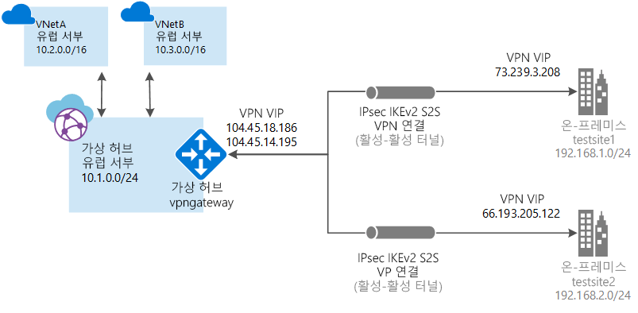

# <a name="tutorial-create-a-site-to-site-connection-using-azure-virtual-wan"></a>자습서: Azure Virtual WAN을 사용하여 사이트 간 연결 만들기

이 자습서에서는 가상 WAN을 사용하여 IPsec/IKE(IKEv1 및 IKEv2) VPN 연결을 통해 Azure에서 리소스를 연결하는 방법을 보여줍니다. 이 연결 유형은 할당된 외부 연결 공용 IP 주소를 갖고 있는 온-프레미스에 있는 VPN 디바이스를 필요로 합니다. Virtual WAN에 대한 자세한 내용은 [Virtual WAN 개요](virtual-wan-about.md)를 참조하세요.

> [!NOTE]
> 사이트가 많은 경우 일반적으로 [가상 WAN 파트너](https://aka.ms/virtualwan)를 사용하여 이러한 구성을 만듭니다. 하지만 네트워킹에 익숙하고 자신의 VPN 디바이스를 구성하는 데 능숙한 경우에는 구성을 직접 만들 수 있습니다.
>



이 자습서에서는 다음 방법에 대해 알아봅니다.

> [!div class="checklist"]
> * WAN 만들기
> * 사이트 만들기
> * 허브 만들기
> * 사이트에 허브 연결
> * 호환되는 VNet 만들기(아직 없는 경우)
> * 허브에 VNet 연결
> * VPN 디바이스 구성 다운로드 및 적용
> * 가상 WAN 보기
> * 리소스 상태 보기
> * 연결 모니터링

## <a name="before-you-begin"></a>시작하기 전에

[!INCLUDE [Before you begin](../../includes/virtual-wan-tutorial-vwan-before-include.md)]

## <a name="openvwan"></a>1. 가상 WAN 만들기

브라우저에서 [Azure 포털](https://aka.ms/azurevirtualwanpreviewfeatures) 로 이동하고 Azure 계정으로 로그인합니다.

[!INCLUDE [Create a virtual WAN](../../includes/virtual-wan-tutorial-vwan-include.md)]

## <a name="site"></a>2. 사이트 만들기

물리적 위치에 해당하는 사이트를 필요한 만큼 만듭니다. 예를 들어 NY에 지사가 있고, 런던에 지사가 있고, LA에 지사가 있는 경우 3개의 사이트를 별도로 만들 수 있습니다. 이 사이트에는 온-프레미스 VPN 디바이스 엔드포인트가 포함됩니다. 이 때, 사이트에 대한 프라이빗 주소 공간은 하나만 지정할 수 있습니다.

1. 만든 WAN을 클릭합니다. WAN 페이지의 **WAN 아키텍처**에서 **VPN 사이트**를 클릭하여 VPN 사이트 페이지를 엽니다.
2. **VPN 사이트** 페이지에서 **+사이트 만들기**를 클릭합니다.
3. **사이트 만들기** 페이지에서 다음 필드를 채웁니다.

   * **이름** - 온-프레미스 사이트를 참조할 때 사용하려는 이름입니다.
   * **공용 IP 주소** - 온-프레미스 사이트에 상주하는 VPN 디바이스의 공용 IP 주소입니다.
   * **개인 주소 공간** - 온-프레미스 사이트에 있는 IP 주소 공간입니다. 이 주소 공간으로 향하는 트래픽은 로컬 사이트로 라우팅됩니다.
   * **구독** - 구독을 확인합니다.
   * **리소스 그룹** - 사용하려는 리소스 그룹입니다.
   * **위치**:
4. **고급 표시**를 클릭하여 고급 설정을 표시합니다. **BGP**를 선택하여 BGP를 사용하도록 설정하면, Azure에서 이 사이트에 대해 만든 모든 연결에서 이 기능을 사용하도록 설정됩니다. **디바이스 정보**(선택적 필드)를 입력할 수도 있습니다. 이렇게 하면 Azure 팀이 환경을 더 잘 이해하고 향후 최적화 가능성을 높이거나 문제를 해결하는 데 도움이 됩니다.
5. **확인**을 클릭합니다.
6. **확인** 을 클릭한 다음 VPN 사이트 페이지에서 상태를 확인합니다. 사이트가 **프로비저닝 중**에서 **프로비저닝됨**으로 이동됩니다.

## <a name="hub"></a>3. 허브 만들기

[!INCLUDE [Create a hub](../../includes/virtual-wan-tutorial-hub-include.md)]

## <a name="associate"></a>4. 사이트를 허브와 연결합니다.

일반적으로 허브는 VNet이 있는 동일한 지역에 있는 사이트와 연결되어야 합니다.

1. **VPN 사이트** 페이지에서 허브와 연결할 하나 이상의 사이트를 선택한 후 **+새 허브 연결**을 클릭합니다.
2. **하나 이상의 허브와 사이트 연결** 페이지의 드롭다운에서 허브를 선택합니다. **+연결 추가**를 클릭하여 사이트를 추가 허브와 연결할 수 있습니다.
3. 여기에서 특정 **PSK**를 추가하거나 기본값을 사용할 수도 있습니다.
4. **확인**을 클릭합니다.
5. **VPN 사이트** 페이지에서 연결 상태를 볼 수 있습니다.

## <a name="vnet"></a>5. 가상 네트워크 만들기

VNet이 없으면 PowerShell 또는 Azure Portal을 사용하여 신속하게 만들 수 있습니다. VNet이 이미 있는 경우에는 필요한 조건을 충족하는지 가상 네트워크 게이트웨이가 없는지 확인합니다.

[!INCLUDE [Create a virtual network](../../includes/virtual-wan-tutorial-vnet-include.md)]

## <a name="vnet"></a>6. 허브에 VNet 연결

이 단계에서는 허브와 VNet 간에 피어링 연결을 만듭니다. 연결하려는 각 VNet에 대해 이 단계를 반복합니다.

1. 가상 WAN에 대한 페이지에서 **가상 네트워크 연결**을 클릭합니다.
2. 가상 네트워크 연결 페이지에서 **+연결 추가**를 클릭합니다.
3. **연결 추가** 페이지에서 다음 필드를 채웁니다.

    * **연결 이름** - 연결의 이름을 지정합니다.
    * **허브** - 이 연결과 연결할 허브를 선택합니다.
    * **구독** - 구독을 확인합니다.
    * **가상 네트워크** - 이 허브에 연결할 가상 네트워크를 선택합니다. 가상 네트워크에는 기존의 가상 네트워크 게이트웨이를 사용할 수 없습니다.
4. **확인**을 클릭하여 피어링 연결을 만듭니다.

## <a name="device"></a>7. VPN 구성 다운로드

VPN 디바이스 구성을 사용하여 온-프레미스 VPN 디바이스를 구성합니다.

1. 가상 WAN에 대한 페이지에서 **개요**를 클릭합니다.
2. 개요 페이지의 맨 위에서 **VPN 구성 다운로드**를 클릭합니다. Azure는 'microsoft-network-[location]' 리소스 그룹에 저장소 계정을 만듭니다. 여기서 위치는 WAN의 위치입니다. VPN 디바이스에 구성을 적용한 후에는 이 저장소 계정을 삭제할 수 있습니다.
3. 파일 만들기가 끝나면 링크를 클릭하여 다운로드할 수 있습니다.
4. VPN 디바이스에 구성을 적용합니다.

### <a name="understanding-the-vpn-device-configuration-file"></a>VPN 디바이스 구성 파일 이해

디바이스 구성 파일은 온-프레미스 VPN 디바이스를 구성할 때 사용할 설정을 포함합니다. 이 파일을 볼 때 다음 정보를 확인합니다.

* **vpnSiteConfiguration -** 이 섹션은 Virtual WAN에 연결된 사이트로 설정된 디바이스 정보를 나타냅니다. 여기에는 분기 디바이스의 이름 및 공용 IP 주소가 포함됩니다.
* **vpnSiteConnections -** 이 섹션에서는 다음 설정에 관한 정보를 제공합니다.

    * 가상 허브 VNet의 **주소 공간**<br>예제:
 
        ```
        "AddressSpace":"10.1.0.0/24"
        ```
    * 허브에 연결된 VNet의 **주소 공간**<br>예제:

         ```
        "ConnectedSubnets":["10.2.0.0/16","10.30.0.0/16"]
         ```
    * 가상 허브 vpngateway의 **IP 주소**. vpngateway의 각 연결은 활성-활성 구성의 2개 터널로 구성되므로 이 파일에 두 IP 주소가 모두 나열됩니다. 이 예제에서는 각 사이트에 대한 “Instance0” 및 “Instance1”이 표시됩니다.<br>예제:

        ``` 
        "Instance0":"104.45.18.186"
        "Instance1":"104.45.13.195"
        ```
    * BGP, 미리 공유한 키 등의 **Vpngateway 연결 구성 세부 정보**. PSK는 자동으로 생성되는 미리 공유한 키입니다. 사용자 지정 PSK의 개요 페이지에서 연결을 언제든지 편집할 수 있습니다.
  
### <a name="example-device-configuration-file"></a>예제 디바이스 구성 파일

  ```
  { 
      "configurationVersion":{ 
         "LastUpdatedTime":"2018-07-03T18:29:49.8405161Z",
         "Version":"r403583d-9c82-4cb8-8570-1cbbcd9983b5"
      },
      "vpnSiteConfiguration":{ 
         "Name":"testsite1",
         "IPAddress":"73.239.3.208"
      },
      "vpnSiteConnections":[ 
         { 
            "hubConfiguration":{ 
               "AddressSpace":"10.1.0.0/24",
               "Region":"West Europe",
               "ConnectedSubnets":[ 
                  "10.2.0.0/16",
                  "10.30.0.0/16"
               ]
            },
            "gatewayConfiguration":{ 
               "IpAddresses":{ 
                  "Instance0":"104.45.18.186",
                  "Instance1":"104.45.13.195"
               }
            },
            "connectionConfiguration":{ 
               "IsBgpEnabled":false,
               "PSK":"bkOWe5dPPqkx0DfFE3tyuP7y3oYqAEbI",
               "IPsecParameters":{ 
                  "SADataSizeInKilobytes":102400000,
                  "SALifeTimeInSeconds":3600
               }
            }
         }
      ]
   },
   { 
      "configurationVersion":{ 
         "LastUpdatedTime":"2018-07-03T18:29:49.8405161Z",
         "Version":"1f33f891-e1ab-42b8-8d8c-c024d337bcac"
      },
      "vpnSiteConfiguration":{ 
         "Name":" testsite2",
         "IPAddress":"66.193.205.122"
      },
      "vpnSiteConnections":[ 
         { 
            "hubConfiguration":{ 
               "AddressSpace":"10.1.0.0/24",
               "Region":"West Europe"
            },
            "gatewayConfiguration":{ 
               "IpAddresses":{ 
                  "Instance0":"104.45.18.187",
                  "Instance1":"104.45.13.195"
               }
            },
            "connectionConfiguration":{ 
               "IsBgpEnabled":false,
               "PSK":"XzODPyAYQqFs4ai9WzrJour0qLzeg7Qg",
               "IPsecParameters":{ 
                  "SADataSizeInKilobytes":102400000,
                  "SALifeTimeInSeconds":3600
               }
            }
         }
      ]
   },
   { 
      "configurationVersion":{ 
         "LastUpdatedTime":"2018-07-03T18:29:49.8405161Z",
         "Version":"cd1e4a23-96bd-43a9-93b5-b51c2a945c7"
      },
      "vpnSiteConfiguration":{ 
         "Name":" testsite3",
         "IPAddress":"182.71.123.228"
      },
      "vpnSiteConnections":[ 
         { 
            "hubConfiguration":{ 
               "AddressSpace":"10.1.0.0/24",
               "Region":"West Europe"
            },
            "gatewayConfiguration":{ 
               "IpAddresses":{ 
                  "Instance0":"104.45.18.187",
                  "Instance1":"104.45.13.195"
               }
            },
            "connectionConfiguration":{ 
               "IsBgpEnabled":false,
               "PSK":"YLkSdSYd4wjjEThR3aIxaXaqNdxUwSo9",
               "IPsecParameters":{ 
                  "SADataSizeInKilobytes":102400000,
                  "SALifeTimeInSeconds":3600
               }
            }
         }
      ]
   }
  ```

### <a name="configuring-your-vpn-device"></a>VPN 디바이스 구성

>[!NOTE]
> Virtual WAN 파트너 솔루션을 사용하여 작업하는 경우 VPN 디바이스 구성이 자동으로 수행됩니다. 디바이스 컨트롤러는 Azure에서 구성 파일을 가져오고 Azure에 대한 연결을 설정하는 디바이스에 적용합니다. 따라서 VPN 디바이스를 수동으로 구성하는 방법을 알 필요가 없습니다.
>

디바이스를 구성하는 지침이 필요한 경우에는 [VPN 디바이스 구성 스크립트 페이지](~/articles/vpn-gateway/vpn-gateway-about-vpn-devices.md#configscripts)의 지침을 다음 주의 사항과 함께 사용하면 됩니다.

* VPN 디바이스 페이지의 지침은 Virtual WAN용으로 작성되지 않았지만 구성 파일의 Virtual WAN 값을 사용하여 VPN 디바이스를 수동으로 구성할 수 있습니다. 
* VPN Gateway용 다운로드 가능한 디바이스 구성 스크립트는 구성이 다르기 때문에 Virtual WAN에서는 작동하지 않습니다.
* 새 가상 WAN은 IKEv1 및 IKEv2를 모두 지원할 수 있습니다.
* 가상 WAN은 경로 기반 VPN 디바이스와 디바이스 지침만 사용할 수 있습니다.

## <a name="viewwan"></a>8. 가상 WAN 보기

1. 가상 WAN 탭으로 이동합니다.
2. 개요 페이지의 맵에 있는 각 점은 허브를 나타냅니다. 점 위로 마우스를 가져가면 허브 상태 요약을 볼 수 있습니다.
3. 허브 및 연결 섹션에서 허브 상태, 사이트, 지역, VPN 연결 상태 및 입/출력 바이트를 볼 수 있습니다.

## <a name="viewhealth"></a>9. 리소스 상태 보기

1. WAN으로 이동합니다.
2. WAN 페이지의 **지원 및 문제 해결** 섹션에서 **상태**를 클릭하고 리소스를 봅니다.

## <a name="connectmon"></a>10. 연결 모니터링

Azure VM과 원격 사이트 간의 통신을 모니터링하는 연결을 만듭니다. 연결 모니터를 설정하는 방법에 대한 자세한 내용은 [네트워크 통신 모니터링](~/articles/network-watcher/connection-monitor.md)을 참조하세요. 원본 필드는 Azure의 VM IP이고 대상 IP는 사이트 IP입니다.

## <a name="cleanup"></a>11. 리소스 정리

이러한 리소스가 더 이상 필요하지 않은 경우 [Remove-AzResourceGroup](/powershell/module/az.resources/remove-azresourcegroup)을 사용하여 리소스 그룹과 여기에 포함된 모든 리소스를 제거할 수 있습니다. "myResourceGroup"을 리소스 그룹의 이름으로 바꾸고 다음 PowerShell 명령을 실행합니다.

```azurepowershell-interactive
Remove-AzResourceGroup -Name myResourceGroup -Force
```

## <a name="next-steps"></a>다음 단계

이 자습서에서는 다음 방법에 대해 알아보았습니다.

> [!div class="checklist"]
> * WAN 만들기
> * 사이트 만들기
> * 허브 만들기
> * 사이트에 허브 연결
> * 허브에 VNet 연결
> * VPN 디바이스 구성 다운로드 및 적용
> * 가상 WAN 보기
> * 리소스 상태 보기
> * 연결 모니터링

가상 WAN에 대해 자세히 알아보려면 [가상 WAN 개요](virtual-wan-about.md) 페이지를 참조하세요.
