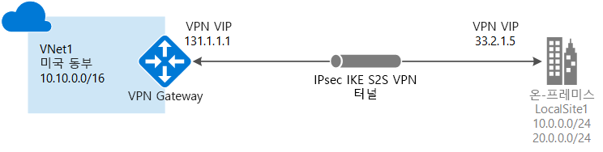
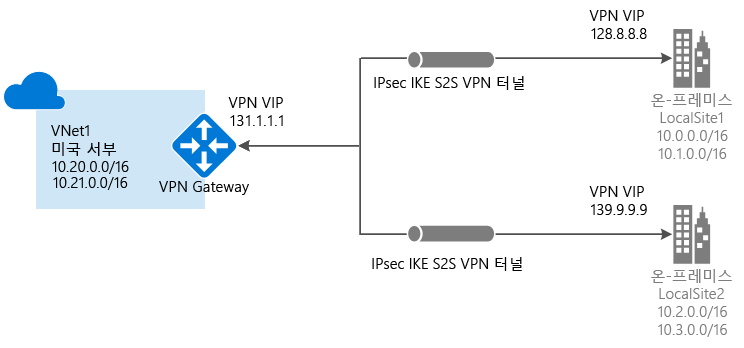
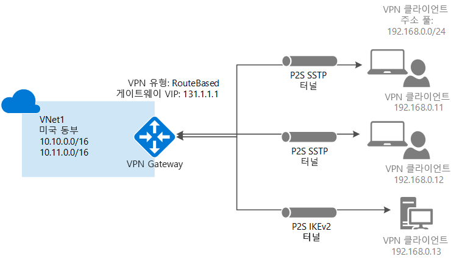
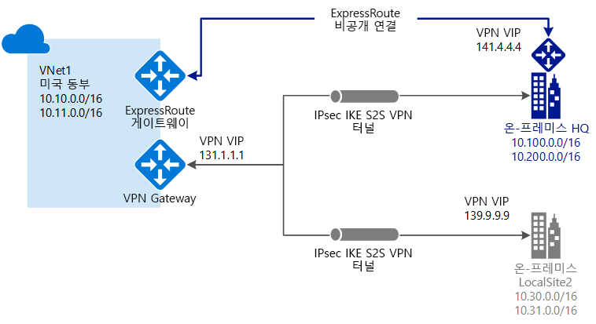

# VPN Gateway란?

VPN Gateway는 공용 인터넷을 통해 Azure 가상 네트워크와 온-프레미스 위치 간에 암호화된 트래픽을 전송하는 데 사용되는 특정 유형의 가상 네트워크 게이트웨이입니다. VPN Gateway를 사용하여 Microsoft 네트워크를 통해 Azure 가상 네트워크 간에 암호화된 트래픽을 보낼 수도 있습니다. VPN Gateway는 각 가상 네트워크당 하나만 사용할 수 있습니다. 그러나 동일한 VPN Gateway에 대해 여러 연결을 만들 수 있습니다. 동일한 VPN Gateway에 대해 여러 연결을 만들면 모든 VPN 터널이 사용 가능한 게이트웨이 대역폭을 공유합니다.

## 가상 네트워크 게이트웨이란?

가상 네트워크 게이트웨이는 *게이트웨이 서브넷*이라는 사용자가 만든 특정 서브넷에 배포되는 둘 이상의 가상 머신으로 구성됩니다. 게이트웨이 서브넷에 있는 VM은 가상 네트워크 게이트웨이를 만들 때 생성됩니다. VM을 구성한 가상 네트워크 게이트웨이는 라우팅 테이블 및 게이트웨이에 특정한 게이트웨이 서비스를 포함합니다. 가상 네트워크 게이트웨이의 일부인 VM은 직접 구성할 수 없고 게이트웨이 서브넷에 추가 리소스를 배포해서는 안 됩니다.

가상 네트워크 게이트웨이 만들기는 완료되는 데 최대 45분까지 소요됩니다. 가상 네트워크 게이트웨이를 만들 때 게이트웨이 VM은 게이트웨이 서브넷에 배포되고 지정한 설정으로 구성됩니다. 사용자가 구성하는 설정 중 하나는 게이트웨이 유형입니다. 게이트웨이 유형 ‘vpn’은 만든 가상 네트워크 게이트웨이의 유형이 VPN 게이트웨이임을 지정합니다. VPN Gateway를 만든 후에 해당 VPN Gateway와 다른 VPN Gateway(VNet 대 VNet) 간에 IPsec/IKE VPN 터널 연결을 만들거나, VPN Gateway와 온-프레미스 VPN 디바이스 간(사이트 간)의 크로스-프레미스 IPsec/IKE VPN 터널 연결을 생성할 수 있습니다. 지점과 사이트 간 VPN 연결(IKEv2 또는 SSTP를 통한 VPN)을 생성하여 회의실의 또는 집과 같은 원격 위치에서 가상 네트워크에 연결할 수 있습니다.

## VPN Gateway 구성

VPN Gateway 연결은 특정 설정으로 구성된 여러 리소스에 따라 다릅니다. 대부분의 리소스는 개별적으로 구성할 수 있지만 일부 리소스는 특정 순서로 구성해야 합니다.

### 설정

각 리소스에 선택하는 설정은 성공적인 연결을 만드는 데 매우 중요합니다. VPN Gateway의 개별 리소스 및 설정에 대한 정보는 [VPN Gateway 설정 정보](vpn-gateway-about-vpn-gateway-settings.md)를 참조하세요. 이 아티클에는 게이트웨이 유형, 게이트웨이 SKU, VPN 유형, 연결 유형, 게이트웨이 서브넷, 로컬 네트워크 게이트웨이 및 고려해야 할 다른 다양한 리소스 설정을 이해하는 데 유용한 정보가 포함되어 있습니다.

### 배포 도구

Azure Portal과 같은 하나의 구성 도구를 사용하여 리소스를 시작하고 구성할 수 있습니다. 나중에 PowerShell과 같은 다른 도구로 전환하도록 결정하여 추가 리소스를 구성하거나 해당하는 경우 기존 리소스를 수정할 수 있습니다. 현재, Azure Portal에서 모든 리소스 및 리소스 설정을 구성할 수 없습니다. 각 연결 토폴로지에 대한 문서의 지침은 특정 구성 도구가 필요한지 여부를 지정합니다. 

### 배포 모델

현재 Azure용 배포 모델은 두 가지가 있습니다. VPN Gateway를 구성할 때 수행할 단계는 가상 네트워크를 만드는 데 사용되는 배포 모델에 따라 달라집니다. 예를 들어 클래식 배포 모델을 사용하여 VNet을 만든 경우 클래식 배포 모델에 대한 가이드 및 지침을 사용하여 VPN 게이트웨이 설정을 만들고 구성합니다. 배포 모델에 대한 자세한 내용은 [Resource Manager 배포 및 클래식 배포 모델 이해](../azure-resource-manager/resource-manager-deployment-model.md)를 참조하세요.

### 계획 표

다음 테이블은 솔루션에 대한 최상의 연결 옵션을 결정하는 데 도움이 될 수 있습니다.

[!INCLUDE [cross-premises](../../includes/vpn-gateway-cross-premises-include.md)]

## 게이트웨이 SKU

가상 네트워크 게이트웨이를 만들 때는 사용하려는 게이트웨이 SKU를 지정합니다. 작업 부하, 처리량, 기능 및 SLA의 종류를 기반으로 하는 요구 사항을 충족하는 SKU를 선택합니다. 지원되는 기능, 프로덕션 및 개발-테스트, 구성 단계를 포함한 게이트웨이 SKU에 대한 자세한 내용은 [게이트웨이 SKU](vpn-gateway-about-vpn-gateway-settings.md#gwsku)를 참조하세요.

### 터널, 연결 및 처리량별 게이트웨이 SKU

[!INCLUDE [Aggregated throughput by SKU](../../includes/vpn-gateway-table-gwtype-aggtput-include.md)]

## 연결 토폴로지 다이어그램

VPN Gateway 연결에 사용할 수 있는 다양한 구성이 있다는 사실을 꼭 기억하시기 바랍니다. 그 중에서 필요에 맞는 최상의 구성을 결정해야 합니다. 아래 섹션에서는 다음과 같은 VPN Gateway 연결에 대한 정보 및 토폴로지 다이어그램을 볼 수 있습니다. 다음 섹션에는 다음에 나열된 테이블이 포함되어 있습니다.

* 사용 가능한 배포 모델
* 사용 가능한 구성 도구
* 사용할 수 있는 경우 문서로 직접 이동하는 링크

다이어그램 및 설명을 사용하여 요구 사항에 맞게 연결 토폴로지를 선택하도록 도울 수 있습니다. 다이어그램은 기본 초기 토폴로지를 보여 주지만 다이어그램을 지침으로 사용하여 더 복잡한 구성을 작성할 수 있습니다.

## 사이트 간 및 다중 사이트(IPsec/IKE VPN 터널)

### 사이트 간

S2S(사이트 간) VPN Gateway 연결은 IPsec/IKE(IKEv1 또는 IKEv2) VPN 터널을 통한 연결입니다. S2S 연결은 프레미스 간 및 하이브리드 구성에 사용될 수 있습니다. S2S 연결은 공용 IP 주소가 할당되어 있고 NAT 다음에 위치하지 않는 온-프레미스에 있는 VPN 디바이스를 필요로 합니다. VPN 디바이스 선택에 대한 자세한 내용은 [VPN Gateway FAQ - VPN 디바이스](vpn-gateway-vpn-faq.md#s2s)를 참조하세요.

### 다중 사이트

사이트 간 연결에서 변형된 연결 유형입니다. 가상 네트워크 게이트웨이에서 일반적으로 여러 온-프레미스 사이트에 연결하는 둘 이상의 VPN 연결을 만듭니다. 여러 연결을 사용하는 경우 경로 기반 VPN 유형(클래식 VNet을 사용하는 경우 동적 게이트웨이)을 사용해야 합니다. 각 가상 네트워크가 하나의 VPN Gateway만 사용할 수 있으므로 게이트웨이를 통한 모든 연결은 사용 가능한 대역폭을 공유합니다. 이러한 유형의 연결은 흔히 "다중 사이트" 연결이라고 합니다.

### 사이트 간 및 다중 사이트의 배포 모델 및 메서드

[!INCLUDE [site-to-site and multi-site table](../../includes/vpn-gateway-table-site-to-site-include.md)]

## 지점 및 사이트 간(IKEv2 또는 SSTP를 통한 VPN)

P2S(지점 및 사이트 간) VPN 게이트웨이 연결을 사용하면 개별 클라이언트 컴퓨터에서 가상 네트워크에 대한 안전한 연결을 만들 수 있습니다. P2S 연결은 클라이언트 컴퓨터에서 시작하여 설정됩니다. 이 솔루션은 집 또는 회의실과 같은 원격 위치에서 Azure VNet에 연결하려는 재택 근무자에게 유용합니다. 또한 P2S VPN은 VNet에 연결해야 하는 클라이언트가 몇 개만 있는 경우 S2S VPN 대신 사용할 수 있는 유용한 솔루션입니다.

S2S 연결과 달리 P2S 연결은 온-프레미스 공용 IP 주소 또는 VPN 디바이스가 필요하지 않습니다. P2S 연결과 S2S 연결에 대한 구성 요구 사항이 모두 충족될 경우 동일한 VPN Gateway를 통해 두 연결을 함께 사용할 수 있습니다. 지점 및 사이트 간 연결에 대한 자세한 내용은 [지점 및 사이트 간 VPN 정보](point-to-site-about.md)를 참조하세요.

### P2S의 배포 모델 및 메서드

[!INCLUDE [vpn-gateway-table-site-to-site](../../includes/vpn-gateway-table-point-to-site-include.md)]

## VNet 간 연결(IPsec/IKE VPN 터널)

가상 네트워크를 다른 가상 네트워크에 연결(VNet-VNet)하는 것은 VNet을 온-프레미스 사이트 위치에 연결하는 것과 유사합니다. 두 연결 유형 모두 VPN 게이트웨이를 사용하여 IPsec/IKE를 통한 보안 터널을 제공합니다. VNet 간 통신을 다중 사이트 연결 구성과 통합할 수도 있습니다. 이렇게 하면 프레미스 간 연결을 가상 네트워크 간 연결과 결합하는 네트워크 토폴로지를 설정할 수 있습니다.

연결할 VNet의 상태는 다음과 같습니다.

* 동일하거나 다른 지역에 위치
* 동일하거나 다른 구독에 위치 
* 동일하거나 다른 배포 모델

### 배포 모델 간의 연결

Azure에는 현재 클래식 및 Resource Manager 등 두 개의 배포 모델이 있습니다. 일정 기간 동안 Azure를 사용한 경우 Azure VM 및 인스턴스 역할이 클래식 VNet에서 실행되고 있을 것입니다. 이후의 VM 및 역할 인스턴스는 Resource Manager에서 만들 VNet에서 실행되고 있을 것입니다. VNet 간의 연결을 만들어 어떤 VNet의 리소스가 다른 리소스와 서로 직접 통신하도록 할 수 있습니다.

### VNet 피어링

가상 네트워크가 특정 요구 사항을 충족하면 VNet 피어링을 사용하여 연결을 만들 수 있습니다. VNet 피어링은 가상 네트워크 게이트웨이를 사용하지 않습니다. 자세한 내용은 [VNet 피어링](../virtual-network/virtual-network-peering-overview.md)을 참조하세요.

### VNet 간 배포 모델 및 메서드

[!INCLUDE [vpn-gateway-table-vnet-to-vnet](../../includes/vpn-gateway-table-vnet-to-vnet-include.md)]

## ExpressRoute(개인 연결)

ExpressRoute를 사용하면 연결 공급자가 지원하는 프라이빗 연결을 통해 온-프레미스 네트워크를 Microsoft 클라우드로 확장할 수 있습니다. ExpressRoute를 사용하면 Microsoft Azure, Office 365, CRM Online과 같은 Microsoft 클라우드 서비스에 대한 연결을 설정하거나, 공동 배치 시설에서 연결 공급자를 통해 임의의(IP VPN) 네트워크, 지점간 이더넷 네트워크 또는 가상 간 연결에서 연결할 수 있습니다.

ExpressRoute 연결은 공용 인터넷을 통해 이동하지 않습니다. 이 기능을 사용하면 ExpressRoute 연결은 인터넷을 통한 일반 연결보다 안정적이고 속도가 빠르며 대기 시간이 짧고 보안성이 높습니다.

ExpressRoute 연결은 필수 구성의 일부분으로 가상 네트워크 게이트웨이를 사용합니다. ExpressRoute 연결에서 가상 네트워크 게이트웨이는 'Vpn'이 아닌 'ExpressRoute' 게이트웨이 유형으로 구성됩니다. ExpressRoute 회로를 통해 전송되는 트래픽은 기본적으로 암호화되지 않으므로, ExpressRoute 회로를 통해 암호화된 트래픽을 보낼 수 있는 솔루션을 만듭니다. ExpressRoute에 대한 자세한 내용은 [ExpressRoute 기술 개요](../expressroute/expressroute-introduction.md)를 참조하세요.

## 사이트 간 및 ExpressRoute 공존 연결

ExpressRoute는 공용 인터넷을 사용하지 않는 WAN에서 Azure를 비롯한 Microsoft 서비스에 대한 프라이빗 직접 연결입니다. 사이트 간 VPN 트래픽은 공용 인터넷을 통해 암호화되어 이동합니다. 동일한 가상 네트워크에 대한 사이트 간 VPN 및 Express 경로 연결을 구성할 수 있으면 여러 장점이 있습니다.

사이트 간 VPN을 ExpressRoute에 대한 보안 장애 조치(failover) 경로로 구성하거나 사이트 간 VPN을 사용하여 사용자 네트워크의 일부가 아니지만 ExpressRoute를 통해 연결된 사이트에 연결할 수 있습니다. 이 구성에는 동일한 가상 네트워크에 대한 두 개의 가상 네트워크 게이트웨이가 필요합니다. 하나는 'Vpn' 게이트웨이 유형을 사용하고 다른 하나는 'ExpressRoute' 게이트웨이 유형을 사용합니다.

### S2S 및 ExpressRoute 공존의 배포 모델 및 메서드

[!INCLUDE [vpn-gateway-table-coexist](../../includes/vpn-gateway-table-coexist-include.md)]

## 가격

[!INCLUDE [vpn-gateway-about-pricing-include](../../includes/vpn-gateway-about-pricing-include.md)]

VPN Gateway용 게이트웨이 SKU에 대한 자세한 내용은 [게이트웨이 SKU](vpn-gateway-about-vpn-gateway-settings.md#gwsku)를 참조하세요.

## FAQ

VPN Gateway에 대한 자주 묻는 질문은 [VPN Gateway FAQ](vpn-gateway-vpn-faq.md)를 참조하세요.

## 다음 단계

- 자세한 내용은 [VPN Gateway FAQ](vpn-gateway-vpn-faq.md)를 참조하세요.
- [구독 및 서비스 한도](../azure-subscription-service-limits.md#networking-limits)를 참조하세요.
- Azure의 몇 가지 다른 주요 [네트워킹 기능](../networking/networking-overview.md)을 알아봅니다.
