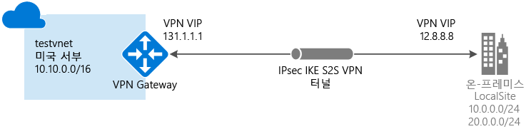

# <a name="create-a-vnet-with-a-site-to-site-vpn-connection-using-powershell"></a>PowerShell을 사용하여 사이트 간 VPN 연결로 VNet 만들기

이 문서에서는 PowerShell을 사용하여 온-프레미스 네트워크에서 VNet으로 사이트 간 VPN Gateway 연결을 만드는 방법을 보여줍니다. 이 문서의 단계는 Resource Manager 배포 모델에 적용됩니다. 다른 배포 도구 또는 배포 모델을 사용하는 경우 다음 목록에서 별도의 옵션을 선택하여 이 구성을 만들 수도 있습니다.

> [!div class="op_single_selector"]
> * [Resource Manager - Azure Portal](vpn-gateway-howto-site-to-site-resource-manager-portal.md)
> * [Resource Manager - PowerShell](vpn-gateway-create-site-to-site-rm-powershell.md)
> * [Resource Manager - CLI](vpn-gateway-howto-site-to-site-resource-manager-cli.md)
> * [클래식 - Azure Portal](vpn-gateway-howto-site-to-site-classic-portal.md)
> * [클래식 - 클래식 포털](vpn-gateway-site-to-site-create.md)
> 
>




사이트 간 VPN Gateway 연결은 IPsec/IKE(IKEv1 또는 IKEv2) VPN 터널을 통해 온-프레미스 네트워크를 Azure 가상 네트워크에 연결하는 데 사용됩니다. 이 연결 유형은 할당된 외부 연결 공용 IP 주소를 갖고 있는 온-프레미스에 있는 VPN 장치를 필요로 합니다. VPN Gateway 대한 자세한 내용은 [VPN Gateway 정보](vpn-gateway-about-vpngateways.md)를 참조하세요.

## <a name="before-you-begin"></a>시작하기 전에

구성을 시작하기 전에 다음 기준을 충족하는지 확인합니다.

* Resource Manager 배포 모델을 사용할 것인지 확인합니다. [!INCLUDE [deployment models](../../includes/vpn-gateway-deployment-models-include.md)] 
* 호환되는 VPN 장치 및 구성할 수 있는 사람. 호환되는 VPN 장치 및 장치 구성에 대한 자세한 내용은 [VPN 장치 정보](vpn-gateway-about-vpn-devices.md)를 참조하세요.
* VPN 장치에 대한 외부 연결 공용 IPv4 주소. 이 IP 주소는 NAT 뒤에 배치할 수 없습니다.
* 온-프레미스 네트워크에 있는 IP 주소 범위에 익숙하지 않은 경우 세부 정보를 제공할 수 있는 다른 사람의 도움을 받아야 합니다. 이 구성을 만들 때 Azure가 온-프레미스 위치에 라우팅할 IP 주소 범위 접두사를 지정해야 합니다. 온-프레미스 네트워크의 어떤 서브넷도 사용자가 연결하려는 가상 네트워크 서브넷과 중첩될 수 없습니다.
* 최신 버전의 Azure Resource Manager PowerShell cmdlet. PowerShell cmdlet 설치에 대한 자세한 내용은 [Azure PowerShell 설치 및 구성 방법](/powershell/azureps-cmdlets-docs) 을 참조하세요.

### <a name="example-values"></a>예제 값

이 문서의 예제에서는 다음 값을 사용합니다. 이러한 값을 사용하여 테스트 환경을 만들거나 이 값을 참조하여 이 문서의 예제를 보다 정확하게 이해할 수 있습니다.

```
#Example values

VnetName                = testvnet 
ResourceGroup           = testrg 
Location                = West US 
AddressSpace            = 10.0.0.0/16 
SubnetName              = Subnet1 
Subnet                  = 10.0.1.0/28 
GatewaySubnet           = 10.0.0.0/27
LocalNetworkGatewayName = LocalSite
LNG Public IP           = <VPN device IP address> 
Local Address Prefixes  = 10.0.0.0/24','20.0.0.0/24
Gateway Name            = vnetgw1
PublicIP                = gwpip
Gateway IP Config       = gwipconfig1 
VPNType                 = RouteBased 
GatewayType             = Vpn 
ConnectionName          = myGWConnection
```

## <a name="Login"></a>1. 구독에 연결
리소스 관리자 cmdlet을 사용하려면 PowerShell 모드로 전환해야 합니다. 자세한 내용은 [리소스 관리자에서 Windows PowerShell 사용](../powershell-azure-resource-manager.md)을 참조하세요.

1. PowerShell 콘솔을 열고 계정에 연결합니다. 연결에 도움이 되도록 다음 예제를 사용합니다.

  ```powershell
  Login-AzureRmAccount
  ```
2. 계정에 대한 구독을 확인합니다.

  ```powershell
  Get-AzureRmSubscription
  ```
3. 사용할 구독을 지정합니다.

  ```powershell
  Select-AzureRmSubscription -SubscriptionName "Replace_with_your_subscription_name"
  ```

## <a name="VNet"></a>2. 가상 네트워크 및 게이트웨이 서브넷 만들기

가상 네트워크가 아직 없는 경우 만듭니다. 가상 네트워크를 만들 때 지정하는 주소 공간이 온-프레미스 네트워크에 있는 주소 공간과 겹치지 않는지 확인하세요. 이 구성에는 게이트웨이 서브넷도 필요합니다. 가상 네트워크 게이트웨이는 VPN Gateway 서비스에서 사용하는 IP 주소가 포함된 게이트웨이 서브넷을 사용합니다. 게이트웨이 서브넷을 만들 때 이름을 'GatewaySubnet'으로 지정해야 합니다. 다른 이름을 지정하는 경우 서브넷을 만들지만 Azure에서는 게이트웨이 서브넷으로 취급하지 않습니다.

지정하는 게이트웨이 서브넷의 크기는 만들려는 VPN Gateway 구성에 따라 달라집니다. 게이트웨이 서브넷을 /29만큼 작게 만들 수 있지만 /27 또는 /28을 선택하여 더 많은 주소를 포함하는 큰 서브넷을 만드는 것이 좋습니다. 더 큰 게이트웨이 서브넷을 사용하면 향후 구성을 수용할 수 있을 만큼 충분한 IP 주소를 확보할 수 있습니다.

[!INCLUDE [vpn-gateway-no-nsg](../../includes/vpn-gateway-no-nsg-include.md)]

### <a name="to-create-a-virtual-network-and-a-gateway-subnet"></a>가상 네트워크 및 게이트웨이 서브넷을 만들려면

이 예제에서는 가상 네트워크 및 게이트웨이 서브넷을 만듭니다. 게이트웨이 서브넷을 추가해야 하는 가상 네트워크가 이미 있는 경우 [이미 만든 가상 네트워크에 게이트웨이 서브넷을 추가하려면](#gatewaysubnet)을 참조하세요.

리소스 그룹 만들기:

```powershell
New-AzureRmResourceGroup -Name testrg -Location 'West US'
```

가상 네트워크를 만듭니다. 

1. 변수를 설정합니다.

  ```powershell
  $subnet1 = New-AzureRmVirtualNetworkSubnetConfig -Name 'GatewaySubnet' -AddressPrefix 10.0.0.0/27
  $subnet2 = New-AzureRmVirtualNetworkSubnetConfig -Name 'Subnet1' -AddressPrefix '10.0.1.0/28'
  ```
2. VNet을 만듭니다.

  ```powershell
  New-AzureRmVirtualNetwork -Name testvnet -ResourceGroupName testrg `
  -Location 'West US' -AddressPrefix 10.0.0.0/16 -Subnet $subnet1, $subnet2
  ```

### <a name="gatewaysubnet"></a>이미 만든 가상 네트워크에 게이트웨이 서브넷을 추가하려면

1. 변수를 설정합니다.

  ```powershell
  $vnet = Get-AzureRmVirtualNetwork -ResourceGroupName testrg -Name testvnet
  ```
2. 게이트웨이 서브넷을 만듭니다.

  ```powershell
  Add-AzureRmVirtualNetworkSubnetConfig -Name 'GatewaySubnet' -AddressPrefix 10.0.0.0/27 -VirtualNetwork $vnet
  ```
3. 구성을 설정합니다.

  ```powershell
  Set-AzureRmVirtualNetwork -VirtualNetwork $vnet
  ```

## 3. <a name="localnet"></a>로컬 네트워크 게이트웨이 만들기

로컬 네트워크 게이트웨이는 일반적으로 온-프레미스 위치를 가리킵니다. Azure가 참조할 수 있는 사이트 이름을 지정한 다음 연결을 만들 온-프레미스 VPN 장치의 IP 주소를 지정합니다. 또한 VPN Gateway를 통해 VPN 장치로 라우팅될 IP 주소 접두사를 지정합니다. 사용자가 지정하는 주소 접두사는 온-프레미스 네트워크에 있는 접두사입니다. 온-프레미스 네트워크가 변경되면 이러한 접두사를 쉽게 업데이트할 수 있습니다.

다음 값을 사용합니다.

* *GatewayIPAddress* 는 온-프레미스 VPN 장치의 IP 주소입니다. VPN 장치는 NAT 뒤에 배치할 수 없습니다.
* *AddressPrefix* 는 온-프레미스 주소 공간입니다.

- 로컬 네트워크 게이트웨이에 단일 주소 접두사를 추가하려면:

  ```powershell
  New-AzureRmLocalNetworkGateway -Name LocalSite -ResourceGroupName testrg `
  -Location 'West US' -GatewayIpAddress '23.99.221.164' -AddressPrefix   '10.0.0.0/24'
  ```

- 로컬 네트워크 게이트웨이에 중복 주소 접두사를 추가하려면:

  ```powershell
  New-AzureRmLocalNetworkGateway -Name LocalSite -ResourceGroupName testrg `
  -Location 'West US' -GatewayIpAddress '23.99.221.164' -AddressPrefix @('10.0.0.0/24','20.0.0.0/24')
  ```

- 로컬 네트워크 게이트웨이에 대한 IP 주소 접두사를 수정하려면:<br>
경우에 따라 로컬 네트워크 게이트웨이 접두사를 변경합니다. IP 주소 접두사를 수정하기 위해 수행하는 단계는 VPN 게이트웨이 연결을 만들었는지에 따라 달라집니다. 이 문서의 [로컬 네트워크 게이트웨이에 대한 IP 주소 접두사 수정](#modify) 섹션을 참조하세요.

## <a name="PublicIP"></a>4. 공용 IP 주소 요청

가상 네트워크 VPN Gateway에 할당할 공용 IP 주소를 요청합니다. 이 IP 주소는 연결할 VPN 장치를 구성하는 주소입니다.

리소스 관리자 배포 모델에 대한 가상 네트워크 게이트웨이는 현재 동적 할당 방법을 사용하여 공용 IP 주소를 지원합니다. 그러나 이로 인해 IP 주소가 변경되지는 않습니다. 게이트웨이가 삭제되고 다시 만들어지는 경우에만 VPN Gateway IP 주소가 변경됩니다. 가상 네트워크 게이트웨이 공용 IP 주소는 VPN Gateway의 크기 조정, 다시 설정 또는 기타 내부 유지 관리/업그레이드에서 변경되지 않습니다.

다음 PowerShell 예제를 사용합니다.

```powershell
$gwpip= New-AzureRmPublicIpAddress -Name gwpip -ResourceGroupName testrg -Location 'West US' -AllocationMethod Dynamic
```

## <a name="GatewayIPConfig"></a>5. 게이트웨이 IP 주소 지정 구성 만들기
게이트웨이 구성은 사용할 공용 IP 주소 및 서브넷을 정의합니다. 다음 예제를 사용하여 게이트웨이 구성을 만듭니다.

```powershell
$vnet = Get-AzureRmVirtualNetwork -Name testvnet -ResourceGroupName testrg
$subnet = Get-AzureRmVirtualNetworkSubnetConfig -Name 'GatewaySubnet' -VirtualNetwork $vnet
$gwipconfig = New-AzureRmVirtualNetworkGatewayIpConfig -Name gwipconfig1 -SubnetId $subnet.Id -PublicIpAddressId $gwpip.Id
```

## <a name="CreateGateway"></a>6. VPN Gateway 만들기

가상 네트워크 VPN Gateway 만들기. VPN Gateway 만들기를 완료하는 데 45분 이상 걸릴 수 있습니다.

다음 값을 사용합니다.

* 사이트 간 구성에 대한 *-GatewayType*은 *Vpn*입니다. 게이트웨이 유형은 항상 구현하는 구성에 따라 다릅니다. 예를 들어 다른 게이트웨이 구성인 GatewayType Express 경로가 필요할 수 있습니다.
* *-VpnType*은 *경로 기반*(일부 설명서에서는 동적 게이트웨이라고도 함)이거나 *정책 기반*(일부 설명서에서는 고정 게이트웨이라고도 함)일 수 있습니다. VPN Gateway 형식에 대한 자세한 내용은 [VPN Gateway 정보](vpn-gateway-about-vpngateways.md)를 참조하세요.
* *-GatewaySku*는 기본, 표준 또는 HighPerformance일 수 있습니다. 특정 SKU에 대한 구성 제한이 있습니다. 자세한 내용은 [게이트웨이 SKU](vpn-gateway-about-vpngateways.md#gateway-skus)를 참조하세요.

```powershell
New-AzureRmVirtualNetworkGateway -Name vnetgw1 -ResourceGroupName testrg `
-Location 'West US' -IpConfigurations $gwipconfig -GatewayType Vpn `
-VpnType RouteBased -GatewaySku Standard
```

## <a name="ConfigureVPNDevice"></a>7. VPN 장치 구성

[!INCLUDE [vpn-gateway-configure-vpn-device-rm](../../includes/vpn-gateway-configure-vpn-device-rm-include.md)]

PowerShell을 사용하여 가상 네트워크 게이트웨이의 공용 IP 주소를 찾으려면 다음 예제를 사용합니다.

```powershell
Get-AzureRmPublicIpAddress -Name GW1PublicIP -ResourceGroupName TestRG
```

## <a name="CreateConnection"></a>8. VPN 연결 만들기
다음으로 가상 네트워크 게이트웨이와 VPN 장치 사이에 사이트 간 VPN 연결을 만듭니다. 사용자 고유의 값으로 대체해야 합니다. 공유 키는 VPN 장치 구성에 사용한 값과 일치해야 합니다. 사이트 간 '-ConnectionType'은 *IPsec*입니다.

1. 변수를 설정합니다.
  ```powershell
  $gateway1 = Get-AzureRmVirtualNetworkGateway -Name vnetgw1 -ResourceGroupName testrg
  $local = Get-AzureRmLocalNetworkGateway -Name LocalSite -ResourceGroupName testrg
  ```

2. 연결을 만듭니다.
  ```powershell
  New-AzureRmVirtualNetworkGatewayConnection -Name MyGWConnection -ResourceGroupName testrg `
  -Location 'West US' -VirtualNetworkGateway1 $gateway1 -LocalNetworkGateway2 $local `
  -ConnectionType IPsec -RoutingWeight 10 -SharedKey 'abc123'
  ```

잠시 후, 연결이 설정됩니다.

## <a name="toverify"></a>9. VPN 연결 확인
VPN 연결을 확인하는 몇 가지 방법이 있습니다.

[!INCLUDE [vpn-gateway-verify-connection-ps-rm](../../includes/vpn-gateway-verify-connection-ps-rm-include.md)]

## <a name="modify"></a>로컬 네트워크 게이트웨이에 대한 IP 주소 접두사를 수정하려면
로컬 네트워크 게이트웨이에 대한 접두사를 변경해야 하는 경우 다음 지침을 사용합니다. 두 가지 지침이 제공됩니다. 게이트웨이 연결을 이미 만들었는지 여부에 따라 선택하는 지침이 다릅니다.

[!INCLUDE [vpn-gateway-modify-ip-prefix-rm](../../includes/vpn-gateway-modify-ip-prefix-rm-include.md)]

## <a name="modifygwipaddress"></a>로컬 네트워크 게이트웨이에 대한 IP 주소를 수정하려면
[!INCLUDE [vpn-gateway-modify-lng-gateway-ip-rm](../../includes/vpn-gateway-modify-lng-gateway-ip-rm-include.md)]

## <a name="next-steps"></a>다음 단계
*  연결이 완료되면 가상 네트워크에 가상 컴퓨터를 추가할 수 있습니다. 자세한 내용은 [Virtual Machines](https://docs.microsoft.com/azure/#pivot=services&panel=Compute)를 참조하세요.
* BGP에 대한 내용은 [BGP 개요](vpn-gateway-bgp-overview.md) 및 [BGP를 구성하는 방법](vpn-gateway-bgp-resource-manager-ps.md)을 참조하세요.

