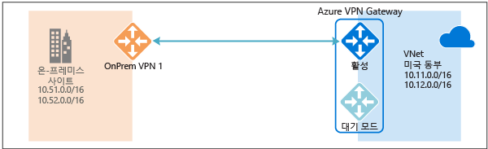
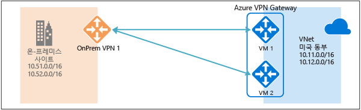
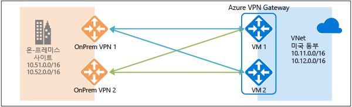
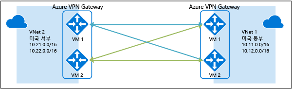

# 항상 사용 가능한 크로스-프레미스 및 VNet 간 연결
이 문서에서는 Azure VPN Gateway를 사용하여 크로스-프레미스 및 VNet 간 연결에 대해 항상 사용 가능한 구성 옵션의 개요를 제공합니다.

## Azure VPN Gateway 중복 정보
모든 Azure VPN Gateway는 활성-대기 구성 상태에 있는 두 인스턴스로 구성됩니다. 활성 인스턴스에 계획된 유지 관리 또는 계획되지 않은 중단이 발생한 경우 대기 인스턴스가 자동으로 발생(장애 조치)하여 S2S VPN 또는 VNet 간 연결을 다시 시작합니다. 전환하면 짧게 중단이 발생합니다. 계획된 유지 관리의 경우 10-15초 내에 연결을 복원해야 합니다. 계획되지 않은 문제의 경우 연결 복구가 1분에서 최악의 경우 1분 30초로 길어집니다. 게이트웨이에 대한 P2S VPN 클라이언트 연결의 경우 P2S 연결의 연결이 끊어지고 사용자가 클라이언트 컴퓨터에서 다시 연결해야 합니다.

## 항상 사용 가능한 크로스-프레미스 연결
크로스 프레미스 연결에 더 나은 가용성을 제공하려면 다음과 같은 두 가지 옵션을 사용할 수 있습니다.

* 다중 온-프레미스 VPN 디바이스
* 활성-활성 Azure VPN Gateway
* 둘의 조합

### 다중 온-프레미스 VPN 디바이스
다음 다이어그램에 표시된 대로 다중 VPN 디바이스를 사용하여 온-프레미스 네트워크에서 Azure VPN Gateway에 연결할 수 있습니다.

이 구성은 동일한 위치에 있는 동일한 Azure VPN Gateway에서 온-프레미스 디바이스에 여러 활성 터널을 제공합니다. 요구 사항 및 제약 조건은 다음과 같습니다.

1. VPN 디바이스에서 Azure에 여러 S2S VPN 연결을 만들어야 합니다. 동일한 온-프레미스 네트워크에서 Azure에 여러 VPN 디바이스를 연결하면 각 VPN 디바이스에 하나의 로컬 네트워크 게이트웨이를 만들고 Azure VPN Gateway에서 각 로컬 네트워크 게이트웨이에 하나의 연결을 만들어야 합니다.
2. VPN 디바이스에 해당하는 로컬 네트워크 게이트웨이는 "GatewayIpAddress" 속성에 고유한 공용 IP 주소가 있어야 합니다.
3. BGP가 이 구성에 필요합니다. VPN 디바이스를 나타내는 각 로컬 네트워크 게이트웨이에는 "BgpPeerIpAddress" 속성에 지정된 고유한 BGP 피어링 IP 주소가 있어야 합니다.
4. 각 로컬 네트워크 게이트웨이에서 AddressPrefix 속성 필드는 겹치지 않아야 합니다. AddressPrefix 필드에서 /32 CIDR 형식인 "BgpPeerIpAddress"를 10.200.200.254/32와 같이 지정해야 합니다.
5. BGP를 사용하여 Azure VPN Gateway에 대한 온-프레미스 네트워크 접두사와 동일한 접두사를 보급해야 합니다. 그러면 동시에 이러한 터널을 통해 트래픽이 전달됩니다.
6. ECMP(같은 비용 다중 경로 라우팅)를 사용해야 합니다.
7. 각 연결은 Azure VPN Gateway에 대한 터널의 최대 수를 계산합니다. 기본 및 표준 SKU에 대해 10개, HighPerformance SKU에 대해 30개입니다. 

이 구성에서 Azure VPN Gateway는 활성-대기 모드이므로 [위에](#activestandby)설명된 대로 동일한 장애 조치 동작 및 짧은 중단이 발생합니다. 하지만 이 설정을 통해 온-프레미스 네트워크 및 VPN 디바이스에서 실패 또는 중단되지 않도록 보호합니다.

### 활성-활성 Azure VPN Gateway
이제 활성-활성 구성에서 Azure VPN gateway를 만들 수 있습니다. 여기서 게이트웨이 VM의 두 인스턴스는 다음 다이어그램에 표시된 대로 온-프레미스 VPN 디바이스에 S2S VPN 터널을 설정합니다.

이 구성에서 각 Azure 게이트웨이 인스턴스는 고유한 공용 IP 주소를 가지며 각 로컬 네트워크 게이트웨이 및 연결에 지정된 온-프레미스 VPN 디바이스에 IPsec/IKE S2S VPN 터널을 설정합니다. VPN 터널은 모두 동일한 연결의 일부입니다. 온-프레미스 VPN 디바이스를 구성하여 해당 Azure VPN Gateway 공용 IP 주소에 두 개의 S2S VPN 터널을 허용하거나 설정해야 합니다.

Azure 게이트웨이 인스턴스가 활성-활성 구성이기 때문에 온-프레미스 VPN 디바이스가 하나의 터널을 다른 터널보다 우선하더라도 Azure 가상 네트워크에서 온-프레미스 네트워크로의 트래픽은 두 터널을 통해 동시에 라우팅됩니다. 인스턴스 중 하나에서 유지 관리 이벤트가 발생하지 않으면 동일한 TCP 또는 UDP 흐름은 항상 동일한 터널 또는 경로로 트래버스됩니다.

계획된 유지 관리 또는 계획되지 않은 이벤트가 하나의 게이트웨이 인스턴스에서 발생한 경우 해당 인스턴스에서 온-프레미스 VPN 디바이스로의 IPsec 터널의 연결을 끊습니다. 트래픽이 다른 활성 IPsec 터널로 전환되도록 VPN 디바이스에 대한 해당 경로를 제거하거나 자동으로 제거해야 합니다. Azure 측에서 전환은 영향을 받는 인스턴스에서 활성 인스턴스로 자동으로 발생합니다.

### 이중 중복: Azure와 온-프레미스 네트워크에 대한 활성-활성 VPN Gateway
가장 신뢰할 수 있는 옵션은 아래 다이어그램에 표시된 대로 네트워크와 Azure 모두에 대한 활성-활성 게이트웨이를 결합하는 것입니다.

위에 설명한 대로 활성-활성 구성에서 Azure VPN Gateway를 만들고 설정하며 두 개의 온-프레미스 VPN 디바이스에 두 개의 로컬 네트워크 게이트웨이 및 두 개의 연결을 만듭니다. 그 결과, Azure 가상 네트워크 및 온-프레미스 네트워크 간에 4개 IPsec 터널의 전체 메시 연결이 생성됩니다.

각 TCP 또는 UDP 흐름은 다시 동일한 터널 또는 Azure 측의 경로를 따르지만 트래픽이 4개의 터널에 동시에 분산되도록 모든 게이트웨이 및 터널은 Azure 측에서 활성화됩니다. 트래픽을 분산하더라도 IPsec 터널을 통한 처리량은 조금 더 나아진 것으로 표시됩니다. 이 구성의 주요 목표는 고가용성임을 기억하세요. 또한 분산이라는 통계 특성으로 인해 애플리케이션 트래픽 조건이 집계 처리량에 어떤 영향을 주는지에 대한 측정값을 제공하기가 어렵습니다.

이 토폴로지에는 두 개의 온-프레미스 VPN 디바이스를 지원하기 위해 두 개의 로컬 네트워크 게이트웨이 및 두 개의 연결이 필요합니다. 동일한 온-프레미스 네트워크에 두 개의 연결을 허용하려면 BGP가 필요합니다. 이러한 요구 사항은 [위와](#activeactiveonprem) 동일합니다. 

## Azure VPN Gateways를 통해 항상 사용 가능한 VNet 간 연결
또한 동일한 활성-활성 구성은 Azure VNet 간 연결에 적용할 수 있습니다. 두 가상 네트워크에 대한 활성-활성 VPN Gateways를 만들고 이들을 서로 연결하여 아래 다이어그램에 표시된 대로 두 VNet 간에 4개 터널의 동일한 전체 메시 연결을 형성할 수 있습니다.

이렇게 하면 더 나은 가용성을 제공하여 계획된 유지 관리 이벤트에 대한 두 개의 가상 네트워크 간에 몇 개의 터널을 유지하게 됩니다. 크로스-프레미스 연결에 대한 동일한 토폴로지가 두 개의 연결을 필요로 하더라도 위에 표시된 VNet 간 토폴로지는 각 게이트웨이에 하나의 연결만을 필요로 합니다. 또한 VNet 간 연결을 통한 전송 라우팅이 필요한 경우가 아니면 BGP는 선택 사항입니다.

## 다음 단계
활성-활성 크로스-프레미스 및 VNet 간 연결을 구성하는 단계는 [크로스-프레미스 및 VNet 간 연결에 대한 활성-활성 VPN Gateways 구성](vpn-gateway-activeactive-rm-powershell.md) 을 참조하세요.

