# <a name="configure-a-point-to-site-connection-by-using-certificate-authentication-classic"></a>인증서 인증을 사용하여 지점 및 사이트 간 연결 구성(클래식)

[!INCLUDE [deployment models](../../includes/vpn-gateway-classic-deployment-model-include.md)]

이 문서에서는 지점 및 사이트 간 연결을 통해 VNet을 만드는 방법을 설명합니다. Azure Portal을 사용하여 클래식 배포 모델을 통해 이 VNet을 만듭니다. 이 구성은 자체 서명된 CA 또는 발급된 CA 중 하나인 인증서를 사용하여 연결 중인 클라이언트를 인증합니다. 다음 문서에 설명된 옵션을 사용하여 다른 배포 도구 또는 모델을 통해 이 구성을 만들 수도 있습니다.

> [!div class="op_single_selector"]
> * [Azure Portal](vpn-gateway-howto-point-to-site-resource-manager-portal.md)
> * [PowerShell](vpn-gateway-howto-point-to-site-rm-ps.md)
> * [Azure Portal(클래식)](vpn-gateway-howto-point-to-site-classic-azure-portal.md)
>

P2S(지점 및 사이트 간) VPN 게이트웨이를 사용하여 개별 클라이언트 컴퓨터에서 가상 네트워크로의 보안 연결을 만듭니다. 지점 및 사이트 간 VPN 연결은 원격 위치에서 VNet에 연결하려는 경우에 유용합니다. VNet에 연결해야 하는 클라이언트가 몇 개뿐이면 사이트 간 VPN 대신 P2S VPN을 사용하는 것이 좋습니다. 클라이언트 컴퓨터에서 시작하여 P2S VPN 연결을 설정합니다.

> [!IMPORTANT]
> 클래식 배포 모델은 Windows VPN 클라이언트만을 지원하고 SSTP(Secure Socket Tunneling Protocol), SSL 기반 VPN 프로토콜을 사용합니다. 비 Windows VPN 클라이언트를 지원하려면 Resource Manager 배포 모델을 통해 VNet을 만들어야 합니다. 리소스 관리자 배포 모델은 SSTP 외에도 IKEv2 VPN을 지원합니다. 자세한 내용은 [P2S 연결 정보](point-to-site-about.md)를 참조하세요.
>
>

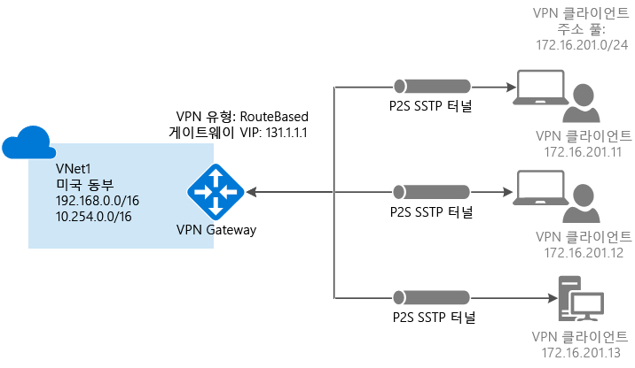

## <a name="prerequisites"></a>필수 조건

지점 및 사이트 간 인증서 인증 연결을 사용하려면 다음 필수 조건이 필요합니다.

* 동적 VPN 게이트웨이
* Azure에 업로드된 루트 인증서에 대한 공개 키(.cer 파일)입니다. 이 키는 신뢰할 수 있는 인증서로 간주되며 인증에 사용됩니다.
* 루트 인증서에서 생성되고 연결할 각 클라이언트 컴퓨터에 설치된 클라이언트 인증서 - 클라이언트 인증에 사용됩니다.
* 연결하는 모든 클라이언트 컴퓨터에 VPN 클라이언트 구성 패키지를 생성하여 설치해야 합니다. 클라이언트 구성 패키지는 VNet에 연결하는 데 필요한 정보를 사용하여 운영 체제에 이미 있는 네이티브 VPN 클라이언트를 구성합니다.

지점 및 사이트 간 연결에는 VPN 디바이스 또는 온-프레미스 공용 IP 주소가 필요하지 않습니다. VPN 연결은 SSTP(Secure Socket Tunneling Protocol)를 통해 만듭니다. 서버 쪽에서 SSTP 버전 1.0, 1.1 및 1.2를 지원하며, 클라이언트에서 사용할 버전을 결정합니다. Windows 8.1 이상에서는 기본적으로 SSTP 버전 1.2를 사용합니다. 

지점 및 사이트 간 연결에 대한 자세한 내용은 [지점 및 사이트 간 연결 FAQ](#point-to-site-faq)를 참조하세요.

### <a name="example-settings"></a>예제 설정

다음 값을 사용하여 테스트 환경을 만들거나, 이 값을 참조하여 이 문서의 예제를 보다 정확하게 파악합니다.

- **가상 네트워크(클래식) 설정 만들기**
   - **이름**: *VNet1*을 입력합니다.
   - **주소 공간**: *192.168.0.0/16*을 입력합니다. 이 예제에서는 하나의 주소 공간만 사용합니다. 다이어그램과 같이 VNet에는 둘 이상의 주소 공간이 있을 수 있습니다.
   - **서브넷 이름**: *FrontEnd*를 입력합니다.
   - **서브넷 주소 범위**: *192.168.1.0/24*를 입력합니다.
   - **구독**: 사용 가능한 구독 목록에서 구독을 선택합니다.
   - **리소스 그룹**: *TestRG*를 입력합니다. 리소스 그룹이 없는 경우 **새로 만들기**를 선택합니다.
   - **위치**: 목록에서 **미국 동부**를 선택합니다.

  - **VPN 연결 설정**
    - **연결 형식**: **지점 및 사이트 간**을 선택합니다.
    - **클라이언트 주소 공간**: *172.16.201.0/24* 이 지점 및 사이트 간 연결을 사용하여 VNet에 연결하는 VPN 클라이언트는 지정된 풀에서 IP 주소를 받습니다.

- **게이트웨이 구성 서브넷 설정**
   - **이름**: *GatewaySubnet*을 사용하여 자동으로 채워집니다.
   - **주소 범위**: *192.168.200.0/24*를 입력합니다. 

- **게이트웨이 구성 설정**:
   - **크기**: 사용할 게이트웨이 SKU를 선택합니다.
   - **라우팅 유형**: **동적**을 선택합니다.

## <a name="create-a-virtual-network-and-a-vpn-gateway"></a>가상 네트워크 및 VPN Gateway 만들기

시작하기 전에 Azure 구독이 있는지 확인합니다. Azure 구독이 아직 없는 경우 [MSDN 구독자 혜택](https://azure.microsoft.com/pricing/member-offers/msdn-benefits-details)을 활성화하거나 [무료 계정](https://azure.microsoft.com/pricing/free-trial)에 등록할 수 있습니다.

### <a name="part-1-create-a-virtual-network"></a>1부: 가상 네트워크 만들기

VNet(가상 네트워크)이 아직 없는 경우 만듭니다. 스크린샷은 예제로 제공됩니다. 사용자 고유의 값으로 대체해야 합니다. Azure 포털을 사용하여 VNet을 만들려면 다음 단계를 사용하세요.

1. [Azure Portal](https://portal.azure.com)에 로그인하고 **리소스 만들기**를 선택합니다. **새로 만들기** 페이지가 열립니다. 

2. **Marketplace 검색** 필드에 *가상 네트워크*를 입력하고 반환된 목록에서 **가상 네트워크**를 선택합니다. **가상 네트워크** 페이지가 열립니다.

3. **배포 모델 선택** 목록에서 **클래식**을 선택한 다음, **만들기**를 선택합니다. **가상 네트워크 만들기** 페이지가 열립니다.

4. **가상 네트워크 만들기** 페이지에서 VNet 설정을 구성합니다. 이 페이지에서 첫 번째 주소 공간과 단일 서브넷 주소 범위를 추가합니다. VNet 만들기를 완료한 후에 다시 돌아와서 추가 서브넷 및 주소 공간을 추가합니다.

   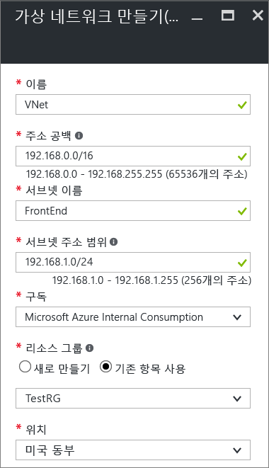

5. 드롭다운 목록에서 사용할 **구독**을 선택합니다.

6. 기존 **리소스 그룹**을 선택합니다. 또는 **새로 만들기**를 선택하고 이름을 입력하여 새 리소스 그룹을 만듭니다. 새 리소스 그룹을 만드는 경우 계획된 구성 값에 따라 리소스 그룹의 이름을 지정합니다. 리소스 그룹에 대한 자세한 내용은 [Azure Resource Manager 개요](../azure-resource-manager/resource-group-overview.md#resource-groups)를 참조하세요.

7. VNet의 **위치**를 선택합니다. 이 설정은 이 VNet에 배포하는 리소스의 지리적 위치를 결정합니다.

8. **만들기**를 선택하여 VNet을 만듭니다. **알림** 페이지에 **배포 진행 중** 메시지가 표시됩니다.

8. 가상 네트워크가 생성되면 **알림** 페이지의 메시지가 **배포 성공**으로 바뀝니다. 대시보드에서 VNet을 쉽게 찾으려면 **대시보드에 고정**을 선택합니다. 

10. DNS 서버를 추가합니다(선택 사항). 가상 네트워크를 만든 후에 이름 확인을 위해 DNS 서버의 IP 주소를 추가할 수 있습니다. 지정한 DNS 서버 IP 주소는 VNet에서 리소스의 이름을 확인할 수 있는 DNS 서버의 주소여야 합니다.

    DNS 서버를 추가하려면 VNet 페이지에서 **DNS 서버**를 선택합니다. 그런 다음, 사용할 DNS 서버의 IP 주소를 입력하고 **저장**을 선택합니다.

### <a name="part-2-create-a-gateway-subnet-and-a-dynamic-routing-gateway"></a>2부: 게이트웨이 서브넷 및 동적 라우팅 게이트웨이 만들기

이 단계에서는 게이트웨이 서브넷 및 동적 라우팅 게이트웨이를 만듭니다. 클래식 배포 모델을 위한 Azure Portal에서 동일한 구성 페이지를 통해 게이트웨이 서브넷 및 게이트웨이를 만듭니다. 게이트웨이 서브넷은 게이트웨이 서비스에만 사용합니다. 게이트웨이 서브넷(예: VM 또는 다른 서비스)에 직접 배포하지 마세요.

1. Azure Portal에서 게이트웨이를 만들려는 가상 네트워크로 이동합니다.

2. 가상 네트워크 페이지에서 **개요**를 선택한 다음, **VPN 연결** 섹션에서 **게이트웨이**를 선택합니다.

   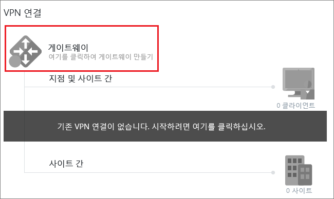
3. **새 VPN 연결** 페이지에서 **지점 및 사이트 간**을 선택합니다.

   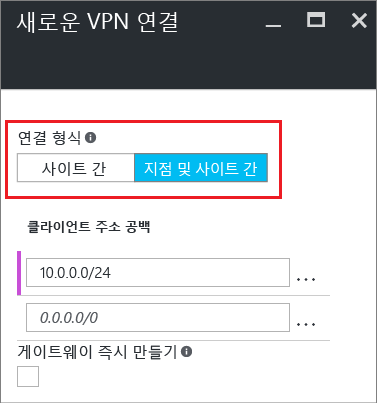
4. **클라이언트 주소 공간**에서 VPN 클라이언트가 연결할 때 IP 주소를 받는 IP 주소 범위를 추가합니다. 연결 원본이 되는 온-프레미스 위치 또는 연결 대상이 되는 VNet과 겹치지 않는 개인 IP 주소 범위를 사용합니다. 자동으로 채워진 범위를 사용하려는 개인 IP 주소 범위로 덮어쓸 수 있습니다. 이 예제에서는 자동으로 채워진 범위를 보여 줍니다. 

   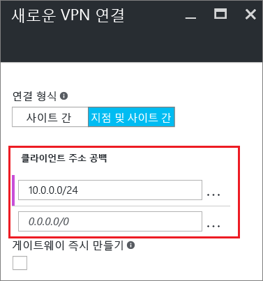
5. **게이트웨이 즉시 만들기**를 선택한 다음, **선택적 게이트웨이 구성**을 선택하여 **게이트웨이 구성** 페이지를 엽니다.

   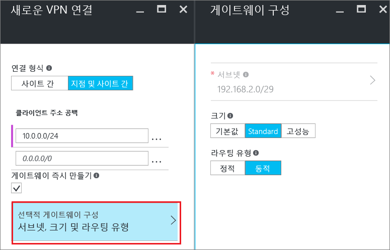

6. **게이트웨이 구성** 페이지에서 **서브넷**을 선택하여 게이트웨이 서브넷을 추가합니다. 게이트웨이 서브넷을 /29만큼 작게 만들 수 있습니다. 그러나 적어도 /28 또는 /27을 선택하여 더 많은 주소를 포함하는 큰 서브넷을 만드는 것이 좋습니다. 이렇게 하면 나중에 필요할 수도 있는 추가 구성을 위해 충분한 주소를 사용할 수 있습니다. 게이트웨이 서브넷에서 작업할 때는 게이트웨이 서브넷에 NSG(네트워크 보안 그룹)를 연결하지 않습니다. 이 서브넷에 네트워크 보안 그룹을 연결하면 VPN 게이트웨이가 예상대로 작동하지 않을 수 있습니다. **확인**을 선택하여 이 설정을 저장합니다.

   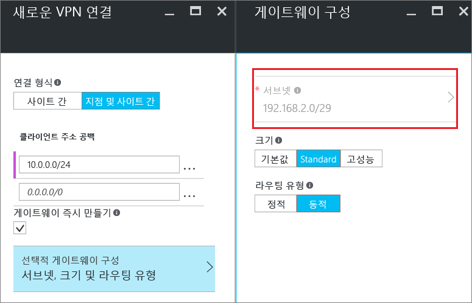
7. 게이트웨이 **크기**를 선택합니다. 크기는 가상 네트워크 게이트웨이에 대한 게이트웨이 SKU입니다. Azure Portal에서 기본 SKU는 **기본값**입니다. 게이트웨이 SKU에 대한 자세한 내용은 [VPN 게이트웨이 설정 정보](vpn-gateway-about-vpn-gateway-settings.md#gwsku)를 참조하세요.

   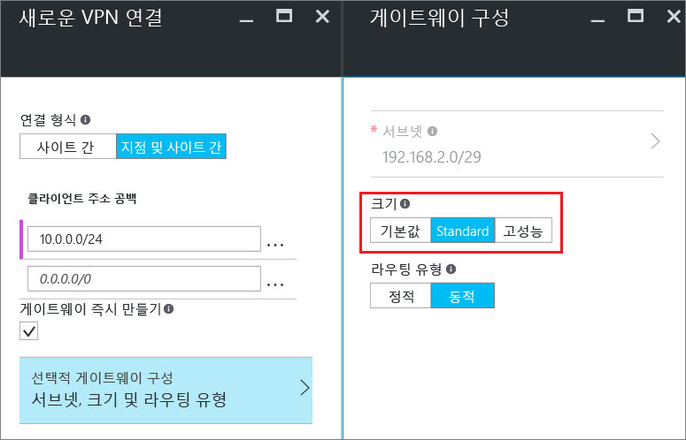
8. 게이트웨이에 대한 **라우팅 유형**을 선택합니다. P2S 구성에는 **동적** 라우팅 유형이 필요합니다. 이 페이지의 구성을 마쳤으면 **확인**을 선택합니다.

   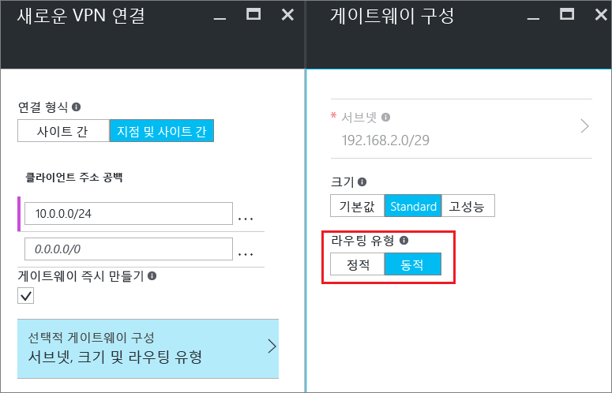

9. **새 VPN 연결** 페이지의 맨 아래에서 **확인**을 선택하여 가상 네트워크 게이트웨이 만들기를 시작합니다. 선택한 게이트웨이 SKU에 따라 VPN 게이트웨이를 완료하는 데 최대 45분이 걸릴 수 있습니다.
 
## <a name="generatecerts"></a>인증서 만들기

Azure는 인증서를 사용하여 지점 및 사이트 간 VPN에 대한 VPN 클라이언트를 인증합니다. Azure에 루트 인증서의 공개 키 정보를 업로드합니다. 그러면 공개 키가 ‘신뢰할 수 있는 키’로 간주됩니다. 클라이언트 인증서는 신뢰할 수 있는 루트 인증서에서 생성한 다음, 각 클라이언트 컴퓨터의 인증서 - 현재 사용자\개인\인증서 인증서 저장소에 설치해야 합니다. 인증서는 VNet에 연결할 때 클라이언트를 인증하는 데 사용됩니다. 

자체 서명된 인증서를 사용하는 경우 특정 매개 변수를 사용하여 인증서를 만들어야 합니다. [PowerShell 및 Windows 10](vpn-gateway-certificates-point-to-site.md) 또는 [MakeCert](vpn-gateway-certificates-point-to-site-makecert.md)에 대한 지침을 사용하여 자체 서명된 인증서를 만들 수 있습니다. 자체 서명된 루트 인증서를 사용하고 자체 서명된 루트 인증서에서 클라이언트 인증서를 생성하는 경우 이러한 지침의 단계를 따르는 것이 중요합니다. 그러지 않으면 만든 인증서가 P2S 연결과 호환되지 않으며 연결 오류가 발생합니다.

### <a name="acquire-the-public-key-cer-for-the-root-certificate"></a>루트 인증서에 대한 공개 키(.cer) 획득

[!INCLUDE [vpn-gateway-basic-vnet-rm-portal](../../includes/vpn-gateway-p2s-rootcert-include.md)]

### <a name="generate-a-client-certificate"></a>클라이언트 인증서 생성

[!INCLUDE [vpn-gateway-basic-vnet-rm-portal](../../includes/vpn-gateway-p2s-clientcert-include.md)]

## <a name="upload-the-root-certificate-cer-file"></a>루트 인증서 .cer 파일 업로드

게이트웨이가 생성된 후 신뢰할 수 있는 루트 인증서의 .cer 파일(공개 키 정보 포함)을 Azure 서버에 업로드합니다. 루트 인증서에 대한 개인 키를 업로드하지 마세요. 인증서를 업로드하면 Azure는 이 인증서를 사용하여 신뢰할 수 있는 루트 인증서에서 생성된 클라이언트 인증서를 설치한 클라이언트를 인증합니다. 필요한 경우 나중에 신뢰할 수 있는 루트 인증서 파일을 추가로 업로드할 수 있습니다(최대 20개).  

1. VNet 페이지의 **VPN 연결** 섹션에서 클라이언트 그래픽을 선택하여 **지점 및 사이트 간 VPN 연결** 페이지를 엽니다.

   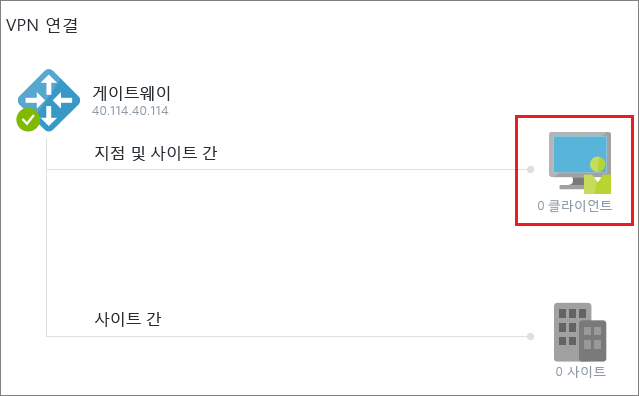

2. **지점 및 사이트 간 VPN 연결** 페이지에서 **인증서 관리**를 선택하여 **인증서** 페이지를 엽니다.

   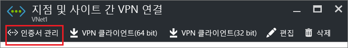

1. **인증서** 페이지에서 **업로드**를 선택하여 **인증서 업로드** 페이지를 엽니다.

    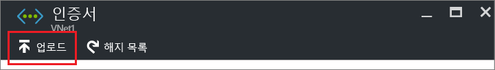

4. 폴더 그래픽을 선택하여 .cer 파일을 찾습니다. 파일을 선택한 다음, **확인**을 선택합니다. 업로드된 인증서가 **인증서** 페이지에 나타납니다.

   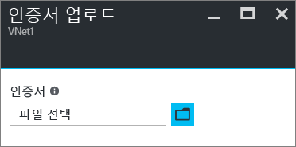


## <a name="configure-the-client"></a>클라이언트 구성

지점 및 사이트 간 VPN을 사용하여 VNet에 연결하려면 각 클라이언트에서 패키지를 설치하여 네이티브 Windows VPN 클라이언트를 구성해야 합니다. 구성 패키지는 가상 네트워크에 연결하는 데 필요한 설정을 사용하여 네이티브 Windows VPN 클라이언트를 구성합니다.

버전이 클라이언트의 아키텍처와 일치하는 한 각 클라이언트 컴퓨터에서 동일한 VPN 클라이언트 구성 패키지를 사용할 수 있습니다. 지원되는 클라이언트 운영 체제 목록은 [지점 및 사이트 간 연결 FAQ](#point-to-site-faq)를 참조하세요.

### <a name="generate-and-install-a-vpn-client-configuration-package"></a>VPN 클라이언트 구성 패키지 생성 및 설치

1. Azure Portal, VNet **개요** 페이지의 **VPN 연결**에서 클라이언트 그래픽을 선택하여 **지점 및 사이트 간 VPN 연결** 페이지를 엽니다.

2. **지점 및 사이트 간 VPN 연결** 페이지에서 패키지를 설치할 클라이언트 운영 체제에 해당하는 다운로드 패키지를 선택합니다.

   * 64비트 클라이언트인 경우 **VPN 클라이언트(64비트)** 를 선택합니다.
   * 32비트 클라이언트인 경우 **VPN 클라이언트(32비트)** 를 선택합니다.

   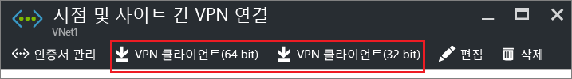

3. 패키지가 생성되면 다운로드하여 클라이언트 컴퓨터에 설치합니다. SmartScreen 팝업이 표시되면 **추가 정보**를 선택한 다음, **실행**을 선택합니다. 다른 클라이언트 컴퓨터에 설치하기 위해 패키지를 저장할 수도 있습니다.

### <a name="install-a-client-certificate"></a>클라이언트 인증서 설치

클라이언트 인증서를 생성하는 데 사용된 컴퓨터가 아닌 다른 클라이언트 컴퓨터에서 P2S 연결을 만들려면 클라이언트 인증서를 설치합니다. 클라이언트 인증서를 설치하는 경우 클라이언트 인증서를 내보낼 때 만든 암호가 필요합니다. 일반적으로 두 번 클릭만 하면 인증서를 설치할 수 있습니다. 자세한 내용은 [내보낸 클라이언트 인증서 설치](vpn-gateway-certificates-point-to-site.md#install)를 참조하세요.


## <a name="connect-to-your-vnet"></a>VNet에 연결

>[!NOTE]
>연결하는 클라이언트 컴퓨터에서 관리자 권한이 있어야 합니다.
>
>

1. VNet에 연결하려면 클라이언트 컴퓨터에서 Azure Portal의 **VPN 연결**로 이동한 다음, 만든 VPN 연결을 찾습니다. VPN 연결의 이름은 가상 네트워크와 같습니다. **연결**을 선택합니다. 인증서에 대한 팝업 메시지가 표시되면 **계속**을 선택하여 상승된 권한을 사용합니다.

2. **연결** 상태 페이지에서 **연결**을 선택하여 연결을 시작합니다. **인증서 선택** 화면이 표시되는 경우 표시된 클라이언트 인증서가 올바른지 확인합니다. 올바르지 않으면 드롭다운 목록에서 올바른 인증서를 선택한 다음, **확인**을 선택합니다.

3. 연결에 성공하면 **연결됨** 알림이 표시됩니다.


### <a name="troubleshooting-p2s-connections"></a>P2S 연결 문제 해결

[!INCLUDE [verify-client-certificates](../../includes/vpn-gateway-certificates-verify-client-cert-include.md)]

## <a name="verify-the-vpn-connection"></a>VPN 연결 확인

1. VPN 연결이 활성 상태인지 확인합니다. 클라이언트 컴퓨터에서 관리자 권한 명령 프롬프트를 열고 **ipconfig/all**을 실행합니다.
2. 결과를 확인합니다. 받은 IP 주소가 VNet을 만들 때 지정한 지점 및 사이트 간 연결 주소 범위 내의 주소 중 하나인지 확인합니다. 결과는 다음 예제와 비슷합니다.

   ```
    PPP adapter VNet1:
        Connection-specific DNS Suffix .:
        Description.....................: VNet1
        Physical Address................:
        DHCP Enabled....................: No
        Autoconfiguration Enabled.......: Yes
        IPv4 Address....................: 192.168.130.2(Preferred)
        Subnet Mask.....................: 255.255.255.255
        Default Gateway.................:
        NetBIOS over Tcpip..............: Enabled
   ```

## <a name="connect-to-a-virtual-machine"></a>가상 머신에 연결

[!INCLUDE [Connect to a VM](../../includes/vpn-gateway-connect-vm-p2s-classic-include.md)]

## <a name="add-or-remove-trusted-root-certificates"></a>신뢰할 수 있는 루트 인증서 추가 또는 제거

Azure에서 신뢰할 수 있는 루트 인증서를 추가 및 제거할 수 있습니다. 루트 인증서를 제거하면 해당 루트에서 생성된 인증서가 있는 클라이언트가 더 이상 인증하고 연결할 수 없습니다. 이러한 클라이언트가 다시 인증하고 연결하려면 Azure가 신뢰하는 루트 인증서에서 생성된 새 클라이언트 인증서를 설치해야 합니다.

### <a name="to-add-a-trusted-root-certificate"></a>신뢰할 수 있는 루트 인증서를 추가하려면

Azure에 최대 20개의 신뢰할 수 있는 루트 인증서 .cer 파일을 추가할 수 있습니다. 지침은 루트 인증서 .cer 파일 업로드를 참조하세요.

### <a name="to-remove-a-trusted-root-certificate"></a>신뢰할 수 있는 루트 인증서를 제거하려면

1. VNet 페이지의 **VPN 연결** 섹션에서 클라이언트 그래픽을 선택하여 **지점 및 사이트 간 VPN 연결** 페이지를 엽니다.

   

2. **지점 및 사이트 간 VPN 연결** 페이지에서 **인증서 관리**를 선택하여 **인증서** 페이지를 엽니다.

   

3. **인증서** 페이지에서 제거할 인증서 옆에 있는 줄임표를 선택한 다음, **삭제**를 선택합니다.

   

## <a name="revoke-a-client-certificate"></a>클라이언트 인증서 해지

필요한 경우 클라이언트 인증서를 해지할 수 있습니다. 인증서 해지 목록에서 개별 클라이언트 인증서를 기반으로 하는 지점 및 사이트 간 연결을 선택적으로 거부할 수 있습니다. 이 방법은 신뢰할 수 있는 루트 인증서를 제거하는 것과 다릅니다. Azure에서 신뢰할 수 있는 루트 인증서 .cer를 제거하면, 해지된 루트 인증서로 생성/서명된 모든 클라이언트 인증서에 대한 액세스 권한도 해지됩니다. 루트 인증서가 아닌 클라이언트 인증서를 해지해야 루트 인증서로부터 생성된 다른 인증서를 지점 및 사이트 간 연결을 위한 인증에 계속 사용할 수 있습니다.

해지된 클라이언트 인증서를 사용하는 동안 개별 사용자의 세분화된 액세스 제어를 위해 일반적으로 루트 인증서를 사용하여 팀 또는 조직 수준에서 액세스를 관리합니다.

### <a name="to-revoke-a-client-certificate"></a>클라이언트 인증서를 해지하려면

해지 목록에 지문을 추가하여 클라이언트 인증서를 해지할 수 있습니다.

1. 클라이언트 인증서 지문을 검색합니다. 자세한 내용은 [방법: 인증서의 지문 검색](https://msdn.microsoft.com/library/ms734695.aspx)을 참조하세요.
2. 텍스트 편집기에 정보를 복사하고 연속 문자열이 되도록 공백을 제거합니다.
3. 클래식 가상 네트워크로 이동합니다. **지점 및 사이트 간 VPN 연결**을 선택한 다음, **인증서 관리**를 선택하여 **인증서** 페이지를 엽니다.
4. **해지 목록**을 선택하여 **해지 목록** 페이지를 엽니다. 
5. **인증서 추가**를 선택하여 **해지 목록에 인증서 추가** 페이지를 엽니다.
6. **지문**에서 인증서 지문을 공백 없이한 줄의 텍스트로 붙여넣습니다. **확인**을 선택하여 마칩니다.

업데이트가 완료된 후에는 인증서를 더 이상 연결에 사용할 수 없습니다. 이 인증서를 사용하여 연결하려는 클라이언트는 인증서가 더 이상 유효하지 않다는 메시지를 받습니다.

## <a name="point-to-site-faq"></a>지점 및 사이트 간 연결 FAQ

[!INCLUDE [Point-to-Site FAQ](../../includes/vpn-gateway-faq-point-to-site-classic-include.md)]

## <a name="next-steps"></a>다음 단계

- 연결이 완료되면 가상 네트워크에 가상 머신을 추가할 수 있습니다. 자세한 내용은 [Virtual Machines](https://docs.microsoft.com/azure/)를 참조하세요. 

- 네트워킹 및 Linux 가상 머신에 대한 자세한 내용은 [Azure 및 Linux VM 네트워크 개요](../virtual-machines/linux/network-overview.md)를 참조하세요.

- P2S 문제 해결 정보는 [Azure 지점 및 사이트 간 연결 문제 해결](vpn-gateway-troubleshoot-vpn-point-to-site-connection-problems.md)을 참조하세요.
