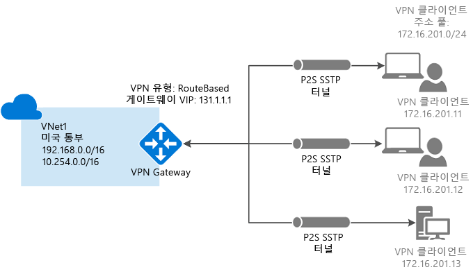
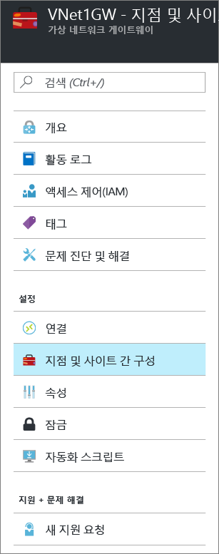
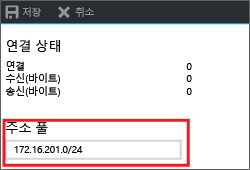
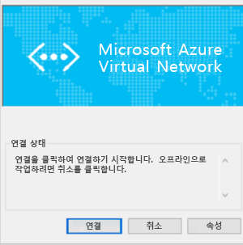

# Azure 포털을 사용하여 VNet에 지점 및 사이트 간 연결 구성
> [!div class="op_single_selector"]
> * [Resource Manager - Azure Portal](vpn-gateway-howto-point-to-site-resource-manager-portal.md)
> * [Resource Manager - PowerShell](vpn-gateway-howto-point-to-site-rm-ps.md)
> * [클래식 - Azure Portal](vpn-gateway-howto-point-to-site-classic-azure-portal.md)
> 
> 

지점 및 사이트 간(P2S) 구성을 사용하면 개별 클라이언트 컴퓨터에서 가상 네트워크에 안전한 연결을 만들 수 있습니다. P2S는 SSTP를 통한 VPN 연결입니다(보안 소켓 터널링 프로토콜). 지점 및 사이트 간 연결은 집 또는 회의와 같은 원격 위치에서 VNet에 연결하려는 경우 또는 몇 명의 클라이언트만 가상 네트워크에 연결해야 하는 경우 유용합니다. P2S 연결에는 VPN 장치 또는 공용 IP 주소가 필요하지 않습니다. 클라이언트 컴퓨터에서 VPN 연결을 설정합니다.

이 문서에서는 Azure Portal을 사용하여 지점 및 사이트 간 연결로 VNet을 만드는 방법을 안내합니다. 지점 및 사이트 간 연결에 대한 자세한 내용은 이 문서의 끝에 있는 [지점 및 사이트 간 FAQ](#faq)를 참조하세요.

### P2S 연결에 대한 배포 모델 및 메서드
[!INCLUDE [deployment models](../../includes/vpn-gateway-deployment-models-include.md)]

아래 표에서는 P2S 구성에 대한 두 가지 배포 모델과 사용할 수 있는 배포 메서드를 보여 줍니다. 구성 단계를 포함한 문서를 사용할 수 있는 경우 아래 표에서 관련 링크를 직접 제공합니다.

[!INCLUDE [vpn-gateway-clasic-rm](../../includes/vpn-gateway-table-point-to-site-include.md)]

## 기본 워크플로

### 예제 값
* **이름: VNet1**
* **주소 공간: 192.168.0.0/16** 이 예제에서는 하나의 주소 공간만 사용합니다. VNet에는 둘 이상의 주소 공간을 포함할 수 있습니다.
* **서브넷 이름: FrontEnd**
* **서브넷 주소 범위: 192.168.1.0/24**
* **구독:** 구독이 2개 이상 있는 경우 올바른 구독을 사용 중인지 확인합니다.
* **리소스 그룹: TestRG**
* **위치: 미국 동부**
* **GatewaySubnet: 192.168.200.0/24**
* **가상 네트워크 게이트웨이 이름: VNet1GW**
* **게이트웨이 유형: VPN**
* **VPN 유형: 경로 기반**
* **공용 IP 주소: VNet1GWpip**
* **연결 형식: 지점 및 사이트 간**
* **클라이언트 주소 풀: 172.16.201.0/24** 이 지점 및 사이트 간 연결을 사용하여 VNet에 연결되는 VPN 클라이언트는 클라이언트 주소 풀에서 IP 주소를 받습니다.

## 1부 - 가상 네트워크 만들기
시작하기 전에 Azure 구독이 있는지 확인합니다. Azure 구독이 아직 없는 경우 [MSDN 구독자 혜택](https://azure.microsoft.com/pricing/member-offers/msdn-benefits-details)을 활성화하거나 [무료 계정](https://azure.microsoft.com/pricing/free-trial)에 등록할 수 있습니다. 연습으로 이 구성을 만드는 경우 [예제 값](#example)을 참조하세요.

[!INCLUDE [vpn-gateway-basic-vnet-rm-portal](../../includes/vpn-gateway-basic-vnet-rm-portal-include.md)]

## 2부 - 주소 공간 및 서브넷 지정
VNet이 만들어지면 여기에 다른 주소 공간 및 서브넷을 추가할 수 있습니다.

[!INCLUDE [vpn-gateway-additional-address-space](../../includes/vpn-gateway-additional-address-space-include.md)]

## 3부 - 게이트웨이 서브넷 추가

가상 네트워크를 게이트웨이에 연결하기 전에 먼저 연결하려는 가상 네트워크에 대한 게이트웨이 서브넷을 만들어야 합니다. 게이트웨이 서비스는 게이트웨이 서브넷에 지정된 IP 주소를 사용합니다. 향후 추가적인 구성 요구 사항을 수용하기에 충분한 IP 주소를 제공하도록 가능하면 /28 또는 /27 CIDR 블록을 사용하여 게이트웨이 서브넷을 만듭니다.

이 섹션의 스크린샷은 참조 예제로 제공됩니다. 구성에 필요한 값에 해당하는 GatewaySubnet 주소 범위를 사용해야 합니다.

###게이트웨이 서브넷을 만들려면

[!INCLUDE [vpn-gateway-add-gwsubnet-rm-portal](../../includes/vpn-gateway-add-gwsubnet-rm-portal-include.md)]

## 4부 - DNS 서버 지정(선택 사항)

DNS는 지점 및 사이트 간 연결에 필요하지 않습니다. 하지만 가상 네트워크에 배포된 리소스에 대한 이름을 확인하려는 경우 DNS 서버를 지정해야 합니다. 이 설정을 통해 이 가상 네트워크에 대한 이름을 확인하는 데 사용하려는 DNS 서버를 지정할 수 있습니다. DNS 서버를 만들지 않습니다.

[!INCLUDE [vpn-gateway-add-dns-rm-portal](../../includes/vpn-gateway-add-dns-rm-portal-include.md)]

## 5부 - 가상 네트워크 게이트웨이 만들기
지점 및 사이트 간 연결에는 다음 설정이 필요합니다.

* 게이트웨이 유형: VPN
* VPN 유형: 경로 기반

### 가상 네트워크 게이트웨이를 만들려면
[!INCLUDE [vpn-gateway-add-gw-rm-portal](../../includes/vpn-gateway-add-gw-rm-portal-include.md)]

## 6부 - 인증서 생성

인증서는 지점 및 사이트 간 VPN에 대한 VPN 클라이언트를 인증하기 위해 Azure에 의해 사용됩니다. 루트 인증서를 만든 후 Base-64 인코딩된 X.509 .cer 파일로 공용 인증서 데이터(개인 키 아님)를 내보냅니다. 그런 다음 루트 인증서에서 Azure로 공용 인증서 데이터를 업로드합니다.

지점 및 사이트 간을 사용하여 VNet에 연결하는 각 클라이언트 컴퓨터에 클라이언트 인증서가 설치되어 있어야 합니다. 클라이언트 인증서는 루트 인증서에서 생성되고 각 클라이언트 컴퓨터에 설치됩니다. 유효한 클라이언트 인증서가 설치되어 있지 않고 클라이언트가 VNet에 연결하려고 하는 경우 인증이 실패합니다.

### 1단계 - 루트 인증서용 .cer 파일 가져오기

####엔터프라이즈 인증서
 
엔터프라이즈 솔루션을 사용하는 경우 기존 인증서 체인을 사용할 수 있습니다. 사용할 루트 인증서용 .cer 파일을 가져옵니다.

####자체 서명된 루트 인증서

엔터프라이즈 인증서 솔루션을 사용하지 않는 경우 자체 서명된 루트 인증서를 만들어야 합니다. P2S 인증에 필요한 필드가 포함된 자체 서명된 루트 인증서를 만들기 위해 PowerShell을 사용할 수 있습니다. [PowerShell을 사용하여 지점 및 사이트 간 연결을 위해 자체 서명된 루트 인증서 만들기](vpn-gateway-certificates-point-to-site.md)에 자체 서명된 루트 인증서를 만드는 단계가 안내되어 있습니다.

> [!NOTE]
> 이전에 makecert는 자체 서명된 루트 인증서를 만들고 지점 및 사이트 간 연결에 대한 클라이언트 인증서를 생성하는 데 권장된 메서드였습니다. 이제 이러한 인증서를 만드는 데 PowerShell을 사용할 수 있습니다. PowerShell을 사용하는 이점 중 하나는 SHA-2 인증서를 만드는 기능입니다. 필요한 값은 [PowerShell을 사용하여 지점 및 사이트 간 연결에 대한 자체 서명된 루트 인증서 만들기](vpn-gateway-certificates-point-to-site.md)를 참조하세요.
>
>

#### 자체 서명된 루트 인증서에 대한 공개 키를 내보내려면

지점 및 사이트 간 연결에는 Azure에 업로드될 공개 키(.cer)가 필요합니다. 다음 단계는 자체 서명된 루트 인증서에 대한 .cer 파일을 내보내는 데 도움이 됩니다.

1. 인증서에서 .cer 파일을 가져오려면 **certmgr.msc**를 엽니다. 일반적으로 'Certificates - Current User\Personal\Certificates'에서 자체 서명된 루트 인증서를 찾아 마우스 오른쪽 단추로 클릭합니다. **모든 태스크**를 클릭한 다음 **내보내기**를 클릭합니다. 이렇게 하면 **인증서 내보내기 마법사**가 열립니다.
2. 마법사에서 **다음**을 클릭합니다. **아니요, 개인 키를 내보내지 않습니다.**를 선택한 후 **다음**을 클릭합니다.
3. **내보내기 파일 형식** 페이지에서 **Base 64로 인코딩된 X.509(.CER)**를 선택한 후 **다음**을 클릭합니다. 
4. **내보낼 파일**에서 인증서를 내보낼 위치를 **찾아보기**합니다. **파일 이름**에는 인증서 파일의 이름을 입력합니다. 그런 후 **Next**를 클릭합니다.
5. **마침** 을 클릭하여 인증서를 내보냅니다. **내보내기에 성공했습니다**라는 메시지가 표시됩니다. **확인**을 클릭하여 마법사를 닫습니다.

### 2단계 - 클라이언트 인증서 생성
가상 네트워크에 연결할 각 클라이언트의 고유한 인증서를 생성할 수도 있고 여러 클라이언트에서 동일한 인증서를 사용할 수도 있습니다. 고유한 클라이언트 인증서를 생성하면 필요할 경우 단일 인증서를 해지할 수 있는 장점이 있습니다. 그렇지 않은 경우 즉, 모든 구성원이 동일한 클라이언트 인증서를 사용하고 한 클라이언트에 대한 인증서를 해지해야 하는 경우, 인증서를 사용하는 모든 클라이언트에 대해 새 인증서를 생성하고 설치해야 합니다.

####엔터프라이즈 인증서
- 엔터프라이즈 인증서 솔루션을 사용하는 경우, 'domain name\username' 형식이 아닌 일반 이름 값 형식 'name@yourdomain.com'으로 클라이언트 인증서를 생성합니다.
- 발급한 클라이언트 인증서가 사용 목록의 첫 번째 항목으로 스마트 카드 로그온 등이 아닌 '클라이언트 인증'을 가지는 ‘사용자' 인증서 템플릿을 기준으로 하는지 확인합니다. 클라이언트 인증서를 두 번 클릭하고 **세부 정보 > 확장된 키 사용**을 확인하여 인증서를 확인할 수 있습니다.

####자체 서명된 루트 인증서 
자체 서명된 루트 인증서를 사용하는 경우 지점 및 사이트 간 연결과 호환되는 클라이언트 인증서를 생성하는 단계는 [PowerShell을 사용하여 클라이언트 인증서 생성](vpn-gateway-certificates-point-to-site.md#clientcert)을 참조하세요.

### 3단계 - 클라이언트 인증서 내보내기
[PowerShell](vpn-gateway-certificates-point-to-site.md#clientcert) 지침을 사용하여 자체 서명된 루트 인증서에서 클라이언트 인증서를 생성하는 경우 생성하는 데 사용한 컴퓨터에 자동으로 설치됩니다. 다른 클라이언트 컴퓨터에 클라이언트 인증서를 설치하려는 경우 내보내야 합니다.

1. 클라이언트 인증서를 내보내려면 **certmgr.msc**를 엽니다. 내보낼 클라이언트 인증서를 마우스 오른쪽 단추로 클릭하고 **모든 작업**을 클릭한 다음 **내보내기**를 클릭합니다. 이렇게 하면 **인증서 내보내기 마법사**가 열립니다.
2. 마법사에서 **다음**을 클릭하고 **예, 개인 키를 내보냅니다.**를 선택한 후 **다음**을 클릭합니다.
3. **파일 내보내기 형식** 페이지에서 선택된 기본값을 유지합니다. **가능하면 인증 경로에 있는 인증서 모두 포함**을 선택했는지 확인합니다. 그런 후 **Next**를 클릭합니다. 
4. **보안** 페이지에서 개인 키를 보호해야 합니다. 암호를 사용하도록 선택하는 경우 이 인증서에 대해 설정한 암호를 기록해두거나 기억합니다. 그런 후 **Next**를 클릭합니다.
5. **내보낼 파일**에서 인증서를 내보낼 위치를 **찾아보기**합니다. **파일 이름**에는 인증서 파일의 이름을 입력합니다. 그런 후 **Next**를 클릭합니다.
6. **마침** 을 클릭하여 인증서를 내보냅니다.   

## 7부 - 클라이언트 주소 풀 추가
1. 가상 네트워크 게이트웨이가 생성된 후에는 가상 네트워크 게이트웨이 블레이드의 **설정** 섹션으로 이동합니다. **설정** 섹션에서 **지점 및 사이트 간 구성**을 클릭하여 **구성** 블레이드를 엽니다.
   
    
2. **주소 풀**은 연결된 클라이언트가 IP 주소를 수신할 IP 주소 풀입니다. 주소 풀을 추가한 후 **저장**을 클릭합니다.
   
    

## 8부 - 루트 인증서 .cer 파일 업로드
게이트웨이가 생성되었으면 신뢰할 수 있는 루트 인증서에 대한 .cer 파일을 Azure에 업로드할 수 있습니다. 최대 20개의 루트 인증서에 대한 파일을 업로드할 수 있습니다. 루트 인증서에 대한 개인 키를 Azure에 업로드하지 않습니다. .cer 파일이 업로드되었으면 Azure에서는 이 파일을 사용하여 가상 네트워크에 연결할 클라이언트를 인증합니다.

1. **루트 인증서** 섹션의 **지점 및 사이트 간 구성** 블레이드에 인증서가 추가됩니다.  
2. 루트 인증서를 Base-64 인코딩된 X.509(.cer) 파일로 내보내야 합니다. 이 형식으로 내보내야 텍스트 편집기에서 인증서를 열 수 있습니다.
3. 메모장과 같은 텍스트 편집기에서 인증서를 엽니다. 하나의 연속 줄로만 다음 섹션을 복사합니다.
   
    

    > [!NOTE]
    > 인증서 데이터를 복사하는 경우 캐리지 리턴 또는 줄 바꿈 없이 하나의 연속 줄로 텍스트를 복사합니다. 캐리지 리턴 및 줄 바꿈을 보려면 ‘기호 표시/모든 문자 표시'에 대한 텍스트 편집기의 보기를 수정해야 할 수도 있습니다.                                                                                                                                                                            
    >
    >

4. 인증서 데이터를 **공용 인증서 데이터** 필드에 붙여 넣습니다. 인증서의 **이름을 지정**한 다음 **저장**을 클릭합니다. 최대 20개의 신뢰할 수 있는 루트 인증서를 추가할 수 있습니다.
   
    

## 9부 - VPN 클라이언트 구성 패키지 다운로드 및 설치
P2S를 사용하여 Azure에 연결된 클라이언트에는 클라이언트 인증서와 VPN 클라이언트 구성 패키지가 설치되어야 합니다. VPN 클라이언트 구성 패키지는 Windows 클라이언트에 사용할 수 있습니다. 

VPN 클라이언트 패키지는 Windows에 기본 제공되는 VPN 클라이언트 소프트웨어를 구성할 정보를 포함합니다. 구성은 연결하려는 VPN에 따라 다릅니다. 패키지는 추가 소프트웨어를 설치하지 않습니다.

버전이 클라이언트에 대한 아키텍처와 일치하는 경우 각 클라이언트 컴퓨터에서 동일한 VPN 클라이언트 구성 패키지를 사용할 수 있습니다.

### 1단계 - 클라이언트 구성 패키지 다운로드

1. **지점 및 사이트 간 구성** 블레이드에서 **VPN 클라이언트 다운로드**를 클릭하여 **VPN 클라이언트 다운로드** 블레이드를 엽니다. 패키지 생성에 1~2분이 걸립니다.
   
    
2. 클라이언트에 대한 올바른 패키지를 선택한 후 **다운로드**를 클릭합니다. 구성 패키지 파일을 저장합니다. 가상 네트워크에 연결하려는 각 클라이언트 컴퓨터에 이 파일을 설치합니다.

    

### 2단계 - 클라이언트 구성 패키지 설치

1. 구성 파일을 가상 네트워크에 연결할 컴퓨터에 로컬로 복사합니다. 
2. .exe 파일을 두 번 클릭하여 클라이언트 컴퓨터에 패키지를 설치합니다. 구성 패키지를 직접 만들었으므로 서명되지 않았습니다. 다시 말해 경고가 표시될 수 있습니다. Windows SmartScreen 팝업이 나타나면 **자세한 정보**(왼쪽), **실행**을 차례로 클릭하여 패키지를 설치합니다.
3. 클라이언트 컴퓨터에서 **네트워크 설정**으로 이동하고 **VPN**을 클릭합니다. 나열된 연결이 표시됩니다. 연결할 가상 네트워크의 이름이 다음과 비슷하게 표시됩니다.
3. 클라이언트 컴퓨터에 패키지를 설치합니다. Windows SmartScreen 팝업이 나타나면 **자세한 정보**(왼쪽), **실행**을 차례로 클릭하여 패키지를 설치합니다.
4. 클라이언트 컴퓨터에서 **네트워크 설정**으로 이동하고 **VPN**을 클릭합니다. 나열된 연결이 표시됩니다. 연결된 가상 네트워크의 이름이 다음 예제와 비슷하게 표시됩니다. 
   
    

## 10부 - 내보낸 클라이언트 인증서 설치

클라이언트 인증서를 생성하는 데 사용한 것 외의 클라이언트 컴퓨터에서 P2S 연결을 만들려는 경우 클라이언트 인증서를 설치해야 합니다. 클라이언트 인증서를 설치할 때는 클라이언트 인증서를 내보낼 때 만든 암호가 필요합니다. 

1. *.pfx* 파일을 찾아 클라이언트 컴퓨터에 복사합니다. 클라이언트 컴퓨터에서 *.pfx* 파일을 두 번 클릭하여 설치합니다. **저장소 위치**를 **현재 사용자**로 유지한 후 **다음**을 클릭합니다.
2. 가져올 **파일** 페이지에서 아무 것도 변경하지 않습니다. **다음**을 클릭합니다.
3. **개인 키 보호** 페이지에서 인증서를 사용한 경우 인증서에 대한 암호를 입력하거나 인증서를 설치하는 보안 주체가 올바른지 확인한 후 **다음**을 클릭합니다.
4. **인증서 저장소** 페이지에서 기본 위치를 유지한 후 **다음**을 클릭합니다.
5. **Finish**를 클릭합니다. 인증서 설치에 대한 **보안 경고**에서 **예**를 클릭합니다. 인증서를 생성했으므로 '예'를 클릭하면 됩니다. 이제 인증서를 성공적으로 가져왔습니다.

## 11부 - Azure에 연결
1. VNet에 연결하려면 클라이언트 컴퓨터에서 VPN 연결로 이동하고 만든 VPN 연결을 찾습니다. 가상 네트워크와 같은 이름이 지정됩니다. **Connect**를 클릭합니다. 인증서 사용을 안내하는 팝업 메시지가 나타날 수 있습니다. 이 경우 **계속** 을 클릭하여 상승된 권한을 사용합니다. 
2. **연결** 상태 페이지에서 **연결**을 클릭하여 연결을 시작합니다. **인증서 선택** 화면에서 표시되는 클라이언트 인증서가 연결하는 데 사용할 인증서인지 확인합니다. 그렇지 않은 경우 드롭다운 화살표를 사용하여 올바른 인증서를 선택한 다음 **확인**을 클릭합니다.
   
    

    
3. 이제 연결이 설정됩니다.
   
    
                                                                                                                                                                           

> [!NOTE]
> 엔터프라이즈 CA 솔루션을 사용하여 발급된 인증서를 사용하고 인증에 문제가 발생하는 경우 클라이언트 인증서에서 인증 순서를 확인합니다. 클라이언트 인증서를 두 번 클릭하고 **세부 정보 > 확장된 키 사용**으로 이동하여 인증 목록 순서를 확인할 수 있습니다. 목록의 첫 번째 항목으로 '클라이언트 인증'이 표시되는지 확인합니다. 그렇지 않으면 목록에서 첫 번째 항목으로 클라이언트 인증을 가진 사용자 템플릿을 기반으로 하는 클라이언트 인증서를 발급해야 합니다. 
>
>

## 12부 - 연결 확인
1. VPN 연결이 활성인지를 확인하려면, 관리자 권한 명령 프롬프트를 열고 *ipconfig/all*을 실행합니다.
2. 결과를 확인합니다. 받은 IP 주소가 구성에 지정한 지점 및 사이트 VPN 클라이언트 주소 풀 내의 주소 중 하나인지 확인합니다. 결과는 다음과 같아야 합니다.
   
        PPP adapter VNet1:
            Connection-specific DNS Suffix .:
            Description.....................: VNet1
            Physical Address................:
            DHCP Enabled....................: No
            Autoconfiguration Enabled.......: Yes
            IPv4 Address....................: 172.16.201.3(Preferred)
            Subnet Mask.....................: 255.255.255.255
            Default Gateway.................:
            NetBIOS over Tcpip..............: Enabled

## 신뢰할 수 있는 루트 인증서 추가 또는 제거
Azure에서 신뢰할 수 있는 루트 인증서를 추가 및 제거할 수 있습니다. 신뢰할 수 있는 인증서를 제거하면 루트 인증서에서 생성된 클라이언트 인증서는 더 이상 지점 및 사이트 간을 통해 Azure에 연결할 수 없습니다. 클라이언트를 연결하려는 경우 Azure에서 신뢰할 수 있는 인증서에서 생성된 새 클라이언트 인증서를 설치해야 합니다.

### 신뢰할 수 있는 루트 인증서를 추가하려면

Azure에 최대 20개의 신뢰할 수 있는 루트 인증서 .cer 파일을 추가할 수 있습니다. 자세한 내용은 이 문서에서 [신뢰할 수 있는 루트 인증서를 업로드](#uploadfile) 섹션을 참조하세요.

### 신뢰할 수 있는 루트 인증서를 제거하려면

1. 신뢰할 수 있는 루트 인증서를 제거하려면 가상 네트워크 게이트웨이에 대한 **지점 및 사이트 간 구성** 블레이드로 이동합니다.
2. 블레이드의 **루트 인증서** 섹션에서 제거할 인증서를 찾습니다.
3. 인증서 옆의 줄임표를 클릭한 다음 '제거'를 클릭합니다.

## 클라이언트 인증서 해지
클라이언트 인증서를 해지할 수 있습니다. 인증서 해지 목록에서 개별 클라이언트 인증서를 기반으로 하는 지점 및 사이트 간 연결을 선택적으로 거부할 수 있습니다. 이것은 신뢰할 수 있는 루트 인증서를 제거하는 것과 다릅니다. Azure에서 신뢰할 수 있는 루트 인증서 .cer를 제거하면, 해지된 루트 인증서로 생성/서명된 모든 클라이언트 인증서에 대한 액세스 권한도 해지됩니다. 루트 인증서가 아닌 클라이언트 인증서를 해지해야 루트 인증서로부터 생성된 다른 인증서를 지점 및 사이트 간 연결을 위한 인증에 계속 사용할 수 있습니다.

해지된 클라이언트 인증서를 사용하는 동안 개별 사용자의 세분화된 액세스 제어를 위해 일반적으로 루트 인증서를 사용하여 팀 또는 조직 수준에서 액세스를 관리합니다.

### 클라이언트 인증서를 해지하려면

해지 목록에 지문을 추가하여 클라이언트 인증서를 해지할 수 있습니다.

1. 클라이언트 인증서 지문을 검색합니다. 자세한 내용은 [인증서의 지문을 검색하는 방법](https://msdn.microsoft.com/library/ms734695.aspx)을 참조하세요.
2. 텍스트 편집기에 정보를 복사하고 연속 문자열이 되도록 공백을 모두 제거합니다.
3. 가상 네트워크 게이트웨이 **지점 및 사이트 간 구성** 블레이드로 이동합니다. [신뢰할 수 있는 루트 인증서를 업로드](#uploadfile)하는 데 사용한 블레이드입니다.
4. **해지된 인증서** 섹션에서 인증서에 대한 이름(인증서 CN이 아니어도 됨)을 입력합니다.
5. 지문 문자열을 **지문** 필드에 복사하여 붙여 넣습니다.
6. 지문의 유효성이 검사되고 해지 목록에 자동으로 추가됩니다. 목록을 업데이트 중이라는 메시지가 화면에 표시됩니다. 
7. 업데이트가 완료된 후에는 인증서를 더 이상 연결에 사용할 수 없습니다. 이 인증서를 사용하여 연결하려는 클라이언트에게는 인증서가 더 이상 유효하지 않다는 메시지가 표시됩니다.

## 지점 및 사이트 간 FAQ

[!INCLUDE [Point-to-Site FAQ](../../includes/vpn-gateway-point-to-site-faq-include.md)]

## 다음 단계
연결이 완료되면 가상 네트워크에 가상 컴퓨터를 추가할 수 있습니다. 자세한 내용은 [Virtual Machines](https://docs.microsoft.com/azure/#pivot=services&panel=Compute)를 참조하세요. 네트워킹 및 가상 컴퓨터에 대한 자세한 내용은 [Azure 및 Linux VM 네트워크 개요](../virtual-machines/linux/azure-vm-network-overview.md)를 참조하세요.

