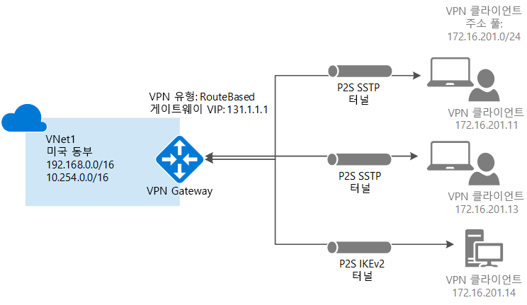
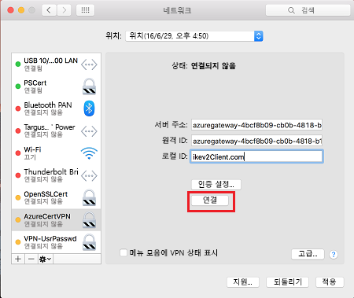

# <a name="configure-a-point-to-site-connection-to-a-vnet-using-native-azure-certificate-authentication-powershell"></a>네이티브 Azure 인증서 인증을 사용하여 VNet에 지점 및 사이트 간 연결을 구성합니다. PowerShell

이 문서는 Windows, Linux 또는 Mac OS X을 실행하는 개별 클라이언트를 Azure VNet에 안전하게 연결하는 데 도움이 됩니다. 지점 및 사이트 간 VPN 연결은 집 또는 회의에서 원격 통신하는 경우와 같이 원격 위치에서 VNet에 연결하려는 경우에 유용합니다. 또한 VNet에 연결해야 하는 몇 가지 클라이언트만 있는 경우 사이트 간 VPN 대신 P2S를 사용할 수도 있습니다. P2S 연결을 작동하는 데는 VPN 디바이스 또는 공용 IP 주소가 필요하지 않습니다. P2S는 SSTP(Secure Socket Tunneling Protocol) 또는 IKEv2를 통한 VPN 연결을 만듭니다. 지점 및 사이트 간 VPN에 대한 자세한 내용은 [지점 및 사이트 간 VPN 정보](point-to-site-about.md)를 참조하세요.



## <a name="architecture"></a>아키텍처

지점 및 사이트 간 네이티브 Azure 인증서 인증 연결은 이 연습에서 구성하는 다음 항목을 사용합니다.

* RouteBased VPN 게이트웨이입니다.
* Azure에 업로드된 루트 인증서에 대한 공개 키(.cer 파일)입니다. 인증서가 업로드되면 신뢰할 수 있는 인증서로 간주되며 인증에 사용됩니다.
* 루트 인증서에서 생성된 클라이언트 인증서. 클라이언트 인증서는 VNet에 연결할 각 클라이언트 컴퓨터에 설치됩니다. 클라이언트 인증에 사용됩니다.
* VPN 클라이언트 구성 VPN 클라이언트 구성 파일에는 클라이언트를 VNet에 연결하는 데 필요한 정보가 포함됩니다. 파일은 운영 체제에 기본적으로 제공된 기존의 VPN 클라이언트를 구성합니다. 연결되는 각 클라이언트는 구성 파일에서 설정을 사용하여 구성해야 합니다.

## <a name="before-you-begin"></a>시작하기 전에

[!INCLUDE [updated-for-az](../../includes/updated-for-az.md)]

Azure 구독이 있는지 확인합니다. Azure 구독이 아직 없는 경우 [MSDN 구독자 혜택](https://azure.microsoft.com/pricing/member-offers/msdn-benefits-details)을 활성화하거나 [무료 계정](https://azure.microsoft.com/pricing/free-trial)에 등록할 수 있습니다.

[!INCLUDE [powershell](../../includes/vpn-gateway-cloud-shell-powershell-about.md)]

이 문서에 나오는 대부분의 단계에서 Cloud Shell을 사용할 수 있습니다. 그러나 루트 인증서 공개 키를 업로드하려면 PowerShell을 로컬로 사용하거나 Azure Portal을 사용해야 합니다.

### <a name="example"></a>예제 값

예제 값을 사용하여 테스트 환경을 만들거나 이 값을 참조하여 이 문서의 예제를 보다 정확하게 이해할 수 있습니다. 문서의 섹션 [1](#declare)에서 변수가 설정됩니다. 단계를 계속 따라가며 값을 변경 없이 사용해도 되고, 사용자 환경을 반영하도록 값을 변경해도 됩니다.

* **이름: VNet1**
* **주소 공간: 192.168.0.0/16** 및 **10.254.0.0/16**<br>이 예제에서는 둘 이상의 주소 공간을 사용하여 이 구성이 여러 주소 공간에서 작동하는 것을 보여 줍니다. 하지만 이 구성에 여러 주소 공간이 반드시 필요한 것은 아닙니다.
* **서브넷 이름: FrontEnd**
  * **서브넷 주소 범위: 192.168.1.0/24**
* **서브넷 이름: BackEnd**
  * **서브넷 주소 범위: 10.254.1.0/24**
* **서브넷 이름: GatewaySubnet**<br>서브넷 이름 *GatewaySubnet*은 VPN Gateway가 작동하기 위한 필수 항목입니다.
  * **GatewaySubnet 주소 범위: 192.168.200.0/24** 
* **VPN 클라이언트 주소 풀: 172.16.201.0/24**<br>이 지점 및 사이트 간 연결을 사용하여 VNet에 연결되는 VPN 클라이언트는 VPN 클라이언트 주소 풀에서 IP 주소를 받습니다.
* **구독:** 구독이 둘 이상 있는 경우 올바른 구독을 사용 중인지 확인합니다.
* **리소스 그룹: TestRG**
* **위치: 미국 동부**
* **DNS 서버: 이름 확인에 사용할 DNS 서버의 IP 주소** (선택 사항)
* **GW 이름: Vnet1GW**
* **공용 IP 이름: VNet1GWPIP**
* **VpnType: 경로 기반** 

## <a name="declare"></a>1. 로그인 및 변수 설정

이 섹션에서는 로그인하고 이 구성에 사용되는 값을 선언합니다. 선언된 값은 예제 스크립트에 사용됩니다. 값을 변경하여 고유한 환경을 반영합니다. 또는 선언된 값을 사용하고 단계를 연습 삼아 살펴볼 수 있습니다.

### <a name="sign-in"></a>로그인

[!INCLUDE [sign in](../../includes/vpn-gateway-cloud-shell-ps-login.md)]

### <a name="declare-variables"></a>변수 선언

사용할 변수를 선언합니다. 다음 샘플을 사용하여 필요할 때 고유한 값으로 대체합니다. 이 연습을 수행하는 동안 PowerShell/Cloud Shell 세션을 닫게 되는 경우 값을 복사하고 붙여넣어 변수를 다시 선언하세요.

  ```azurepowershell-interactive
  $VNetName  = "VNet1"
  $FESubName = "FrontEnd"
  $BESubName = "Backend"
  $GWSubName = "GatewaySubnet"
  $VNetPrefix1 = "192.168.0.0/16"
  $VNetPrefix2 = "10.254.0.0/16"
  $FESubPrefix = "192.168.1.0/24"
  $BESubPrefix = "10.254.1.0/24"
  $GWSubPrefix = "192.168.200.0/26"
  $VPNClientAddressPool = "172.16.201.0/24"
  $RG = "TestRG"
  $Location = "East US"
  $GWName = "VNet1GW"
  $GWIPName = "VNet1GWPIP"
  $GWIPconfName = "gwipconf"
  ```

## <a name="ConfigureVNet"></a>2. VNet 구성

1. 리소스 그룹을 만듭니다.

   ```azurepowershell-interactive
   New-AzResourceGroup -Name $RG -Location $Location
   ```
2. 가상 네트워크에 대한 서브넷 구성을 만들고 *FrontEnd*, *BackEnd* 및 *GatewaySubnet*으로 이름을 지정합니다. 이러한 접두사는 선언된 VNet 주소 공간의 일부여야 합니다.

   ```azurepowershell-interactive
   $fesub = New-AzVirtualNetworkSubnetConfig -Name $FESubName -AddressPrefix $FESubPrefix
   $besub = New-AzVirtualNetworkSubnetConfig -Name $BESubName -AddressPrefix $BESubPrefix
   $gwsub = New-AzVirtualNetworkSubnetConfig -Name $GWSubName -AddressPrefix $GWSubPrefix
   ```
3. 가상 네트워크 만들기

   이 예제에서 -DnsServer 서버 매개 변수는 선택 사항입니다. 값을 지정하더라도 새 DNS 서버를 만들지 않습니다. 지정한 DNS 서버 IP 주소는 VNet에서 연결하는 리소스에 대한 이름을 확인할 수 있는 DNS 서버여야 합니다. 이 예에서는 개인 IP 주소를 사용하지만 DNS 서버의 IP 주소가 아닐 가능성이 높습니다. 고유한 값을 사용해야 합니다. 지정한 값은 P2S 연결 또는 VPN 클라이언트가 아니라 VNet에 배포한 리소스에서 사용됩니다.

   ```azurepowershell-interactive
   New-AzVirtualNetwork -Name $VNetName -ResourceGroupName $RG -Location $Location -AddressPrefix $VNetPrefix1,$VNetPrefix2 -Subnet $fesub, $besub, $gwsub -DnsServer 10.2.1.3
   ```
4. 만든 가상 네트워크에 대한 변수를 지정합니다.

   ```azurepowershell-interactive
   $vnet = Get-AzVirtualNetwork -Name $VNetName -ResourceGroupName $RG
   $subnet = Get-AzVirtualNetworkSubnetConfig -Name "GatewaySubnet" -VirtualNetwork $vnet
   ```
5. VPN Gateway에는 공용 IP 주소가 있어야 합니다. 먼저 IP 주소 리소스를 요청하고, 가상 네트워크 게이트웨이를 만들 때 참조합니다. VPN Gateway가 생성될 때 IP 주소는 리소스에 동적으로 할당됩니다. 현재 VPN Gateway는 *동적* 공용 IP 주소 할당만 지원합니다. 고정 공용 IP 주소 할당을 요청할 수 없습니다. 하지만 IP 주소가 VPN 게이트웨이에 할당된 후 변경되는 것은 아닙니다. 게이트웨이가 삭제되고 다시 만들어지는 경우에만 공용 IP 주소가 변경됩니다. VPN Gateway의 크기 조정, 다시 설정 또는 기타 내부 유지 관리/업그레이드 시에는 변경되지 않습니다.

   동적으로 할당된 공용 IP 주소를 요청합니다.

   ```azurepowershell-interactive
   $pip = New-AzPublicIpAddress -Name $GWIPName -ResourceGroupName $RG -Location $Location -AllocationMethod Dynamic
   $ipconf = New-AzVirtualNetworkGatewayIpConfig -Name $GWIPconfName -Subnet $subnet -PublicIpAddress $pip
   ```

## <a name="creategateway"></a>3. VPN Gateway 만들기

VNet용 가상 네트워크 게이트웨이를 구성하고 만듭니다.

* -GatewayType은  **Vpn**이어야 하고 -VpnType은 **RouteBased**여야 합니다.
* -VpnClientProtocol은 사용하려는 터널의 유형을 지정하는 데 사용됩니다. 터널 옵션은 **SSTP** 및 **IKEv2**입니다. 그 중 하나 또는 둘 다를 사용하도록 선택할 수 있습니다. 둘 다 사용하려는 경우 쉼표로 구분된 이름을 지정합니다. Android 및 Linux의 strongSwan 클라이언트와 iOS 및 OSX의 네이티브 IKEv2 VPN 클라이언트는 IKEv2 터널만 사용하여 연결합니다. Windows 클라이언트는 IKEv2를 먼저 시도하고 연결되지 않는 경우 SSTP로 대체합니다.
* 가상 네트워크 게이트웨이 ‘기본’ SKU는 IKEv2 또는 RADIUS 인증을 지원하지 않습니다. Mac 클라이언트를 가상 네트워크에 연결하려는 경우 기본 SKU를 사용하지 마세요.
* VPN 게이트웨이는 선택한 [게이트웨이 SKU](vpn-gateway-about-vpn-gateway-settings.md)에 따라 완료하는 데 최대 45분이 걸릴 수 있습니다. 이 예제에서는 IKEv2를 사용합니다.

```azurepowershell-interactive
New-AzVirtualNetworkGateway -Name $GWName -ResourceGroupName $RG `
-Location $Location -IpConfigurations $ipconf -GatewayType Vpn `
-VpnType RouteBased -EnableBgp $false -GatewaySku VpnGw1 -VpnClientProtocol "IKEv2"
```

## <a name="addresspool"></a>4. VPN 클라이언트 주소 풀 추가

VPN 게이트웨이에서 만들기를 완료한 후에 VPN 클라이언트 주소 풀을 추가할 수 있습니다. VPN 클라이언트 주소 풀은 연결할 때 VPN 클라이언트에서 IP 주소를 받는 범위입니다. 연결 원본이 되는 온-프레미스 위치 또는 연결 대상이 되는 VNet과 겹치지 않는 개인 IP 주소 범위를 사용합니다. 이 예제에서 VPN 클라이언트 주소 풀은 1단계에서 [변수](#declare)로 선언되었습니다.

```azurepowershell-interactive
$Gateway = Get-AzVirtualNetworkGateway -ResourceGroupName $RG -Name $GWName
Set-AzVirtualNetworkGateway -VirtualNetworkGateway $Gateway -VpnClientAddressPool $VPNClientAddressPool
```

## <a name="Certificates"></a>5. 인증서 생성

인증서는 지점 및 사이트 간 VPN에 대한 VPN 클라이언트를 인증하기 위해 Azure에 의해 사용됩니다. Azure에 루트 인증서의 공개 키 정보를 업로드합니다. 그러면 해당 공개 키가 '신뢰할 수 있는 키'로 간주됩니다. 클라이언트 인증서는 신뢰할 수 있는 루트 인증서에서 생성한 다음 각 클라이언트 컴퓨터의 [인증서 - 현재 사용자/개인] 인증서 저장소에 설치해야 합니다. 인증서는 VNet에 대한 연결을 시작할 때 해당 클라이언트를 인증하는 데 사용됩니다. 

자체 서명된 인증서를 사용하는 경우 특정 매개 변수를 사용하여 만들어야 합니다. [PowerShell 및 Windows 10](vpn-gateway-certificates-point-to-site.md)에 대한 지침을 사용하여 자체 서명된 인증서를 만들 수 있고 Windows 10을 사용하지 않는 경우 [MakeCert](vpn-gateway-certificates-point-to-site-makecert.md)를 사용할 수 있습니다. 자체 서명된 루트 인증서 및 클라이언트 인증서를 생성할 때 지침에 나와 있는 단계를 따르는 것이 중요합니다. 그렇지 않으면 생성된 인증서가 P2S 연결과 호환되지 않으며 연결 오류가 발생하게 됩니다.

### <a name="cer"></a>1. 루트 인증서용 .cer 파일 가져오기

[!INCLUDE [vpn-gateway-basic-vnet-rm-portal](../../includes/vpn-gateway-p2s-rootcert-include.md)]


### <a name="generate"></a>2. 클라이언트 인증서 생성

[!INCLUDE [vpn-gateway-basic-vnet-rm-portal](../../includes/vpn-gateway-p2s-clientcert-include.md)]

## <a name="upload"></a>6. 루트 인증서 공개 키 정보 업로드

VPN 게이트웨이에서 만들기가 완료되었는지 확인합니다. 완료되었으면 신뢰할 수 있는 루트 인증서의 .cer 파일(공개 키 정보 포함)을 Azure로 업로드할 수 있습니다. a.cer 파일이 업로드되면 Azure는 이.cer 파일을 사용하여 신뢰할 수 있는 루트 인증서에서 생성된 클라이언트 인증서를 설치한 클라이언트를 인증합니다. 필요한 경우 나중에 신뢰할 수 있는 루트 인증서 파일을 최대 20개까지 추가로 업로드할 수 있습니다.

Azure Cloud Shell을 사용하여 이 정보를 업로드할 수 없습니다. 컴퓨터에서 로컬로 PowerShell을 사용해도 되고, [Azure Portal 단계](vpn-gateway-howto-point-to-site-resource-manager-portal.md#uploadfile)를 사용해도 됩니다.

1. 인증서 이름에 대한 변수를 선언하고 변수를 고유한 값으로 바꿉니다.

   ```azurepowershell
   $P2SRootCertName = "P2SRootCert.cer"
   ```
2. 파일 경로를 고유한 값으로 바꾼 후 cmdlet을 실행합니다.

   ```azurepowershell
   $filePathForCert = "C:\cert\P2SRootCert.cer"
   $cert = new-object System.Security.Cryptography.X509Certificates.X509Certificate2($filePathForCert)
   $CertBase64 = [system.convert]::ToBase64String($cert.RawData)
   $p2srootcert = New-AzVpnClientRootCertificate -Name $P2SRootCertName -PublicCertData $CertBase64
   ```
3. 공개 키 정보를 Azure에 업로드합니다. 인증서 정보가 업로드되면 Azure는 해당 인증서를 신뢰할 수 있는 루트 인증서로 간주합니다.

   ```azurepowershell
   Add-AzVpnClientRootCertificate -VpnClientRootCertificateName $P2SRootCertName -VirtualNetworkGatewayname "VNet1GW" -ResourceGroupName "TestRG" -PublicCertData $CertBase64
   ```

## <a name="clientcertificate"></a>7. 내보낸 클라이언트 인증서 설치

클라이언트 인증서를 생성하는 데 사용한 것 외의 클라이언트 컴퓨터에서 P2S 연결을 만들려는 경우 클라이언트 인증서를 설치해야 합니다. 클라이언트 인증서를 설치하는 경우 클라이언트 인증서를 내보낼 때 만든 암호가 필요합니다.

전체 인증서 체인(즉, 기본값)과 함께.pfx로 클라이언트 인증서를 내보냈는지 확인합니다. 그렇지 않은 경우, 루트 인증서 정보가 클라이언트 컴퓨터에 존재하지 않으며 클라이언트를 제대로 인증할 수 없습니다. 

설치 단계는 [클라이언트 인증서 설치](point-to-site-how-to-vpn-client-install-azure-cert.md)를 참조하세요.

## <a name="clientconfig"></a>8. 네이티브 VPN 클라이언트 구성

VPN 클라이언트 구성 파일에는 P2S 연결을 통해 VNet에 연결하도록 디바이스를 구성하는 설정이 포함되어 있습니다. VPN 클라이언트 구성 파일을 생성하고 설치하는 지침은 [네이티브 Azure 인증서 인증 P2S 구성에 VPN 클라이언트 구성 파일 만들기 및 설치](point-to-site-vpn-client-configuration-azure-cert.md)를 참조하세요.

## <a name="connect"></a>9. Azure에 연결

### <a name="to-connect-from-a-windows-vpn-client"></a>Windows VPN 클라이언트에서 연결

>[!NOTE]
>연결하는 Windows 클라이언트 컴퓨터에서 관리자 권한이 있어야 합니다.
>
>

1. VNet에 연결하려면 클라이언트 컴퓨터에서 VPN 연결로 이동하고 만든 VPN 연결을 찾습니다. 가상 네트워크와 같은 이름이 지정됩니다. **Connect**를 클릭합니다. 인증서 사용을 안내하는 팝업 메시지가 나타날 수 있습니다. **계속**을 클릭하여 상승된 권한을 사용합니다. 
2. **연결** 상태 페이지에서 **연결**을 클릭하여 연결을 시작합니다. **인증서 선택** 화면에서 표시되는 클라이언트 인증서가 연결하는 데 사용할 인증서인지 확인합니다. 그렇지 않은 경우 드롭다운 화살표를 사용하여 올바른 인증서를 선택한 다음 **확인**을 클릭합니다.

   
3. 연결이 설정되었습니다.

   

#### <a name="troubleshooting-windows-client-p2s-connections"></a>Windows 클라이언트 P2S 연결 문제 해결

[!INCLUDE [client certificates](../../includes/vpn-gateway-certificates-verify-client-cert-include.md)]

### <a name="to-connect-from-a-mac-vpn-client"></a>Mac VPN 클라이언트에서 연결하려면

[네트워크] 대화 상자에서 사용하려는 클라이언트 프로필을 찾은 다음 **연결**을 클릭합니다.
자세한 지침은 [설치 - Mac(OS X)](https://docs.microsoft.com/azure/vpn-gateway/point-to-site-vpn-client-configuration-azure-cert#installmac)에서 확인하세요. 연결에 문제가 발생하면 가상 네트워크 게이트웨이가 기본 SKU를 사용하지 않는지 확인합니다. 기본 SKU는 Mac 클라이언트에서 지원되지 않습니다.

  

## <a name="verify"></a>연결을 확인하려면

이러한 지침은 Windows 클라이언트에 적용됩니다.

1. VPN 연결이 활성인지를 확인하려면, 관리자 권한 명령 프롬프트를 열고 *ipconfig/all*을 실행합니다.
2. 결과를 확인합니다. 받은 IP 주소가 구성에 지정한 지점 및 사이트 VPN 클라이언트 주소 풀 내의 주소 중 하나인지 확인합니다. 결과는 다음 예제와 비슷합니다.

   ```
   PPP adapter VNet1:
      Connection-specific DNS Suffix .:
      Description.....................: VNet1
      Physical Address................:
      DHCP Enabled....................: No
      Autoconfiguration Enabled.......: Yes
      IPv4 Address....................: 172.16.201.3(Preferred)
      Subnet Mask.....................: 255.255.255.255
      Default Gateway.................:
      NetBIOS over Tcpip..............: Enabled
   ```

## <a name="connectVM"></a>가상 컴퓨터에 연결하려면

이러한 지침은 Windows 클라이언트에 적용됩니다.

[!INCLUDE [Connect to a VM](../../includes/vpn-gateway-connect-vm-p2s-include.md)]

## <a name="addremovecert"></a>루트 인증서 추가 또는 제거하려면

Azure에서 신뢰할 수 있는 루트 인증서를 추가 및 제거할 수 있습니다. 루트 인증서를 제거하면 해당 루트 인증서에서 생성된 인증서가 있는 클라이언트를 인증하지 못하게 되며 연결할 수도 없습니다. 클라이언트를 인증하고 연결하려는 경우 Azure에 (업로드된)신뢰할 수 있는 루트 인증서에서 생성된 새 클라이언트 인증서를 설치해야 합니다.

### <a name="addtrustedroot"></a>신뢰할 수 있는 루트 인증서를 추가하려면

Azure에 최대 20개의 루트 인증서 .cer 파일을 추가할 수 있습니다. 다음 단계를 사용하면 루트 인증서를 추가할 수 있습니다.

#### <a name="certmethod1"></a>방법 1


루트 인증서를 업로드하는 가장 효율적인 방법입니다. 이 방법을 사용하려면 Azure PowerShell cmdlet이 컴퓨터에 로컬로 설치되어야 합니다(Azure Cloud Shell 아님).

1. 업로드할 .cer 파일을 준비합니다.

   ```azurepowershell
   $filePathForCert = "C:\cert\P2SRootCert3.cer"
   $cert = new-object System.Security.Cryptography.X509Certificates.X509Certificate2($filePathForCert)
   $CertBase64_3 = [system.convert]::ToBase64String($cert.RawData)
   $p2srootcert = New-AzVpnClientRootCertificate -Name $P2SRootCertName -PublicCertData $CertBase64_3
   ```
2. 파일을 업로드합니다. 한 번에 하나의 파일만 업로드할 수 있습니다.

   ```azurepowershell
   Add-AzVpnClientRootCertificate -VpnClientRootCertificateName $P2SRootCertName -VirtualNetworkGatewayname "VNet1GW" -ResourceGroupName "TestRG" -PublicCertData $CertBase64_3
   ```

3. 인증서 파일이 업로드되었는지 확인하려면

   ```azurepowershell
   Get-AzVpnClientRootCertificate -ResourceGroupName "TestRG" `
   -VirtualNetworkGatewayName "VNet1GW"
   ```

#### <a name="certmethod2"></a>방법 2 - Azure Portal

이 방법은 방법 1보다 더 많은 단계를 포함하지만 결과는 동일합니다. 인증서 데이터를 보는 데 필요한 경우 포함됩니다. 이 방법을 사용하려면 Azure PowerShell cmdlet이 컴퓨터에 로컬로 설치되어야 합니다(Azure Cloud Shell 아님).

1. Azure에 추가할 새 루트 인증서를 만들고 준비합니다. Base-64로 인코딩된 X.509(.CER)로 공개 키를 내보내고 텍스트 편집기로 엽니다. 다음 예제와 같이 값을 복사합니다.

   

   > [!NOTE]
   > 인증서 데이터를 복사하는 경우 캐리지 리턴 또는 줄 바꿈 없이 하나의 연속 줄로 텍스트를 복사합니다. 캐리지 리턴 및 줄 바꿈을 보려면 '기호 표시/모든 문자 표시'에 대한 텍스트 편집기의 보기를 수정해야 할 수도 있습니다.
   >
   >

2. 인증서 이름 및 키 정보를 변수로 지정합니다. 다음 예제에 나와 있는 것처럼 정보를 고유한 정보로 바꿉니다.

   ```azurepowershell
   $P2SRootCertName2 = "ARMP2SRootCert2.cer"
   $MyP2SCertPubKeyBase64_2 = "MIIC/zCCAeugAwIBAgIQKazxzFjMkp9JRiX+tkTfSzAJBgUrDgMCHQUAMBgxFjAUBgNVBAMTDU15UDJTUm9vdENlcnQwHhcNMTUxMjE5MDI1MTIxWhcNMzkxMjMxMjM1OTU5WjAYMRYwFAYDVQQDEw1NeVAyU1Jvb3RDZXJ0MIIBIjANBgkqhkiG9w0BAQEFAAOCAQ8AMIIBCgKCAQEAyjIXoWy8xE/GF1OSIvUaA0bxBjZ1PJfcXkMWsHPzvhWc2esOKrVQtgFgDz4ggAnOUFEkFaszjiHdnXv3mjzE2SpmAVIZPf2/yPWqkoHwkmrp6BpOvNVOpKxaGPOuK8+dql1xcL0eCkt69g4lxy0FGRFkBcSIgVTViS9wjuuS7LPo5+OXgyFkAY3pSDiMzQCkRGNFgw5WGMHRDAiruDQF1ciLNojAQCsDdLnI3pDYsvRW73HZEhmOqRRnJQe6VekvBYKLvnKaxUTKhFIYwuymHBB96nMFdRUKCZIiWRIy8Hc8+sQEsAML2EItAjQv4+fqgYiFdSWqnQCPf/7IZbotgQIDAQABo00wSzBJBgNVHQEEQjBAgBAkuVrWvFsCJAdK5pb/eoCNoRowGDEWMBQGA1UEAxMNTXlQMlNSb290Q2VydIIQKazxzFjMkp9JRiX+tkTfSzAJBgUrDgMCHQUAA4IBAQA223veAZEIar9N12ubNH2+HwZASNzDVNqspkPKD97TXfKHlPlIcS43TaYkTz38eVrwI6E0yDk4jAuPaKnPuPYFRj9w540SvY6PdOUwDoEqpIcAVp+b4VYwxPL6oyEQ8wnOYuoAK1hhh20lCbo8h9mMy9ofU+RP6HJ7lTqupLfXdID/XevI8tW6Dm+C/wCeV3EmIlO9KUoblD/e24zlo3YzOtbyXwTIh34T0fO/zQvUuBqZMcIPfM1cDvqcqiEFLWvWKoAnxbzckye2uk1gHO52d8AVL3mGiX8wBJkjc/pMdxrEvvCzJkltBmqxTM6XjDJALuVh16qFlqgTWCIcb7ju"
   ```
3. 새 루트 인증서를 추가합니다. 한번에 하나의 인증서만 추가할 수 있습니다.

   ```azurepowershell
   Add-AzVpnClientRootCertificate -VpnClientRootCertificateName $P2SRootCertName2 -VirtualNetworkGatewayname "VNet1GW" -ResourceGroupName "TestRG" -PublicCertData $MyP2SCertPubKeyBase64_2
   ```
4. 다음 예제를 사용하여 새 인증서가 올바르게 추가되었는지 확인할 수 있습니다.

   ```azurepowershell
   Get-AzVpnClientRootCertificate -ResourceGroupName "TestRG" `
   -VirtualNetworkGatewayName "VNet1GW"
   ```

### <a name="removerootcert"></a>루트 인증서를 제거하려면

1. 변수를 선언합니다.

   ```azurepowershell-interactive
   $GWName = "Name_of_virtual_network_gateway"
   $RG = "Name_of_resource_group"
   $P2SRootCertName2 = "ARMP2SRootCert2.cer"
   $MyP2SCertPubKeyBase64_2 = "MIIC/zCCAeugAwIBAgIQKazxzFjMkp9JRiX+tkTfSzAJBgUrDgMCHQUAMBgxFjAUBgNVBAMTDU15UDJTUm9vdENlcnQwHhcNMTUxMjE5MDI1MTIxWhcNMzkxMjMxMjM1OTU5WjAYMRYwFAYDVQQDEw1NeVAyU1Jvb3RDZXJ0MIIBIjANBgkqhkiG9w0BAQEFAAOCAQ8AMIIBCgKCAQEAyjIXoWy8xE/GF1OSIvUaA0bxBjZ1PJfcXkMWsHPzvhWc2esOKrVQtgFgDz4ggAnOUFEkFaszjiHdnXv3mjzE2SpmAVIZPf2/yPWqkoHwkmrp6BpOvNVOpKxaGPOuK8+dql1xcL0eCkt69g4lxy0FGRFkBcSIgVTViS9wjuuS7LPo5+OXgyFkAY3pSDiMzQCkRGNFgw5WGMHRDAiruDQF1ciLNojAQCsDdLnI3pDYsvRW73HZEhmOqRRnJQe6VekvBYKLvnKaxUTKhFIYwuymHBB96nMFdRUKCZIiWRIy8Hc8+sQEsAML2EItAjQv4+fqgYiFdSWqnQCPf/7IZbotgQIDAQABo00wSzBJBgNVHQEEQjBAgBAkuVrWvFsCJAdK5pb/eoCNoRowGDEWMBQGA1UEAxMNTXlQMlNSb290Q2VydIIQKazxzFjMkp9JRiX+tkTfSzAJBgUrDgMCHQUAA4IBAQA223veAZEIar9N12ubNH2+HwZASNzDVNqspkPKD97TXfKHlPlIcS43TaYkTz38eVrwI6E0yDk4jAuPaKnPuPYFRj9w540SvY6PdOUwDoEqpIcAVp+b4VYwxPL6oyEQ8wnOYuoAK1hhh20lCbo8h9mMy9ofU+RP6HJ7lTqupLfXdID/XevI8tW6Dm+C/wCeV3EmIlO9KUoblD/e24zlo3YzOtbyXwTIh34T0fO/zQvUuBqZMcIPfM1cDvqcqiEFLWvWKoAnxbzckye2uk1gHO52d8AVL3mGiX8wBJkjc/pMdxrEvvCzJkltBmqxTM6XjDJALuVh16qFlqgTWCIcb7ju"
   ```
2. 인증서를 제거합니다.

   ```azurepowershell-interactive
   Remove-AzVpnClientRootCertificate -VpnClientRootCertificateName $P2SRootCertName2 -VirtualNetworkGatewayName $GWName -ResourceGroupName $RG -PublicCertData $MyP2SCertPubKeyBase64_2
   ```
3. 다음 예제를 사용하여 인증서가 성공적으로 제거되었는지 확인합니다.

   ```azurepowershell-interactive
   Get-AzVpnClientRootCertificate -ResourceGroupName "TestRG" `
   -VirtualNetworkGatewayName "VNet1GW"
   ```

## <a name="revoke"></a>클라이언트 인증서를 해지하려면

클라이언트 인증서를 해지할 수 있습니다. 인증서 해지 목록에서 개별 클라이언트 인증서를 기반으로 하는 지점 및 사이트 간 연결을 선택적으로 거부할 수 있습니다. 이것은 신뢰할 수 있는 루트 인증서를 제거하는 것과 다릅니다. Azure에서 신뢰할 수 있는 루트 인증서 .cer를 제거하면, 해지된 루트 인증서로 생성/서명된 모든 클라이언트 인증서에 대한 액세스 권한도 해지됩니다. 루트 인증서가 아닌 클라이언트 인증서를 해지하면 루트 인증서에서 생성된 다른 인증서를 인증에 계속 사용할 수 있습니다.

해지된 클라이언트 인증서를 사용하는 동안 개별 사용자의 세분화된 액세스 제어를 위해 일반적으로 루트 인증서를 사용하여 팀 또는 조직 수준에서 액세스를 관리합니다.

### <a name="revokeclientcert"></a>클라이언트 인증서 해지

1. 클라이언트 인증서 지문을 검색합니다. 자세한 내용은 [인증서의 지문을 검색하는 방법](https://msdn.microsoft.com/library/ms734695.aspx)을 참조하세요.
2. 텍스트 편집기에 정보를 복사하고 연속 문자열이 되도록 공백을 모두 제거합니다. 이 문자열은 다음 단계에서 변수로 선언됩니다.
3. 변수를 선언합니다. 이전 단계에서 검색된 지문을 선언해야 합니다.

   ```azurepowershell-interactive
   $RevokedClientCert1 = "NameofCertificate"
   $RevokedThumbprint1 = "‎51ab1edd8da4cfed77e20061c5eb6d2ef2f778c7"
   $GWName = "Name_of_virtual_network_gateway"
   $RG = "Name_of_resource_group"
   ```
4. 해지된 인증서 목록에 지문을 추가합니다. 지문이 추가되면 "성공"이라고 표시됩니다.

   ```azurepowershell-interactive
   Add-AzVpnClientRevokedCertificate -VpnClientRevokedCertificateName $RevokedClientCert1 `
   -VirtualNetworkGatewayName $GWName -ResourceGroupName $RG `
   -Thumbprint $RevokedThumbprint1
   ```
5. 지문이 인증서 해지 목록에 추가되었는지 확인합니다.

   ```azurepowershell-interactive
   Get-AzVpnClientRevokedCertificate -VirtualNetworkGatewayName $GWName -ResourceGroupName $RG
   ```
6. 지문이 추가된 후에는 인증서를 더 이상 연결에 사용할 수 없습니다. 이 인증서를 사용하여 연결하려는 클라이언트에서 인증서가 더 이상 유효하지 않다고 하는 메시지를 받습니다.

### <a name="reinstateclientcert"></a>클라이언트 인증서를 복구하려면

해지된 클라이언트 인증서 목록에서 지문을 제거하여 클라이언트 인증서를 복구할 수 있습니다.

1. 변수를 선언합니다. 복구하려는 인증서에 대한 올바른 지문을 선언해야 합니다.

   ```azurepowershell-interactive
   $RevokedClientCert1 = "NameofCertificate"
   $RevokedThumbprint1 = "‎51ab1edd8da4cfed77e20061c5eb6d2ef2f778c7"
   $GWName = "Name_of_virtual_network_gateway"
   $RG = "Name_of_resource_group"
   ```
2. 인증서 지문을 인증서 해지 목록에서 제거합니다.

   ```azurepowershell-interactive
   Remove-AzVpnClientRevokedCertificate -VpnClientRevokedCertificateName $RevokedClientCert1 `
   -VirtualNetworkGatewayName $GWName -ResourceGroupName $RG -Thumbprint $RevokedThumbprint1
   ```
3. 해지된 목록에서 지문이 제거되었는지 확인합니다.

   ```azurepowershell-interactive
   Get-AzVpnClientRevokedCertificate -VirtualNetworkGatewayName $GWName -ResourceGroupName $RG
   ```

## <a name="faq"></a>지점 및 사이트 간 FAQ

[!INCLUDE [Point-to-Site FAQ](../../includes/vpn-gateway-faq-p2s-azurecert-include.md)]

## <a name="next-steps"></a>다음 단계
연결이 완료되면 가상 네트워크에 가상 머신을 추가할 수 있습니다. 자세한 내용은 [Virtual Machines](https://docs.microsoft.com/azure/)를 참조하세요. 네트워킹 및 가상 머신에 대한 자세한 내용은 [Azure 및 Linux VM 네트워크 개요](../virtual-machines/linux/azure-vm-network-overview.md)를 참조하세요.

P2S 문제 해결 정보는 [문제 해결: 지점 및 사이트 간 연결 문제](vpn-gateway-troubleshoot-vpn-point-to-site-connection-problems.md)를 참조하세요.
