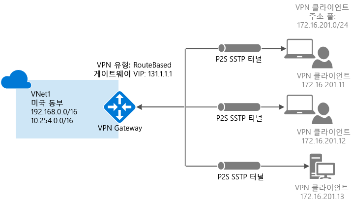

# <a name="configure-a-point-to-site-connection-to-a-vnet-using-powershell"></a>PowerShell을 사용하여 VNet에 지점 및 사이트 간 연결 구성


이 문서에서는 Resource Manager 배포 모델에서 PowerShell을 사용하여 지점 및 사이트 간 연결로 VNet을 만드는 방법을 보여줍니다. 다른 배포 도구 또는 배포 모델을 사용하는 경우 다음 목록에서 별도의 옵션을 선택하여 이 구성을 만들 수도 있습니다.

> [!div class="op_single_selector"]
> * [Resource Manager - Azure Portal](vpn-gateway-howto-point-to-site-resource-manager-portal.md)
> * [Resource Manager - PowerShell](vpn-gateway-howto-point-to-site-rm-ps.md)
> * [클래식 - Azure Portal](vpn-gateway-howto-point-to-site-classic-azure-portal.md)
>
>

지점 및 사이트 간(P2S) 구성을 사용하면 개별 클라이언트 컴퓨터에서 가상 네트워크에 안전한 연결을 만들 수 있습니다. 지점 및 사이트 간 연결은 집 또는 회의와 같은 원격 위치에서 VNet에 연결하려는 경우 또는 몇 명의 클라이언트만 가상 네트워크에 연결해야 하는 경우 유용합니다. P2S VPN 연결은 기본 Windows VPN 클라이언트를 사용하여 클라이언트 컴퓨터에서 시작됩니다. 클라이언트 연결은 인증서를 사용하여 인증합니다. 



P2S 연결을 작동하는 데는 VPN 장치 또는 공용 IP 주소가 필요하지 않습니다. P2S는 SSTP(Secure Socket Tunneling Protocol)를 통해 VPN 연결을 만듭니다. 서버 쪽에서 SSTP 버전 1.0, 1.1 및 1.2를 지원하며, 클라이언트에서 사용할 버전을 결정합니다. Windows 8.1 이상에서는 기본적으로 SSTP 버전 1.2를 사용합니다. 지점 및 사이트 간 연결에 대한 자세한 내용은 이 문서의 끝에 있는 [지점 및 사이트 간 FAQ](#faq)를 참조하세요.

P2S 연결에는 다음이 필요합니다.

* RouteBased VPN 게이트웨이입니다.
* Azure에 업로드된 루트 인증서에 대한 공개 키(.cer 파일) - 신뢰할 수 있는 인증서로 간주되며 인증에 사용됩니다.
* 루트 인증서에서 생성되고 연결할 각 클라이언트 컴퓨터에 설치된 클라이언트 인증서 - 클라이언트 인증에 사용됩니다.
* 연결하는 모든 클라이언트 컴퓨터에 VPN 클라이언트 구성 패키지를 생성하여 설치해야 합니다. 클라이언트 구성 패키지는 VNet에 연결하는 데 필요한 정보와 함께 운영 체제에 이미 있는 기본 VPN 클라이언트를 구성합니다.


## <a name="before-beginning"></a>시작하기 전에

* Azure 구독이 있는지 확인합니다. Azure 구독이 아직 없는 경우 [MSDN 구독자 혜택](https://azure.microsoft.com/pricing/member-offers/msdn-benefits-details)을 활성화하거나 [무료 계정](https://azure.microsoft.com/pricing/free-trial)에 등록할 수 있습니다.
* 최신 버전의 Azure Resource Manager PowerShell cmdlet을 설치합니다. PowerShell cmdlet 설치에 대한 자세한 내용은 [Azure PowerShell 설치 및 구성 방법](/powershell/azure/overview)을 참조하세요.

### <a name="example"></a>예제 값

예제 값을 사용하여 테스트 환경을 만들거나 이 값을 참조하여 이 문서의 예제를 보다 정확하게 이해할 수 있습니다. 문서의 섹션 [1](#declare) 에서 변수를 설정합니다. 단계를 계속 따라가며 값을 변경 없이 사용해도 되고, 사용자 환경을 반영하도록 값을 변경해도 됩니다. 

* **이름: VNet1**
* **주소 공간: 192.168.0.0/16** 및 **10.254.0.0/16**<br>이 예제에서는 둘 이상의 주소 공간을 사용하여 이 구성이 여러 주소 공간에서 작동하는 것을 보여 줍니다. 하지만 이 구성에 여러 주소 공간이 반드시 필요한 것은 아닙니다.
* **서브넷 이름: FrontEnd**
  * **서브넷 주소 범위: 192.168.1.0/24**
* **서브넷 이름: BackEnd**
  * **서브넷 주소 범위: 10.254.1.0/24**
* **서브넷 이름: GatewaySubnet**<br>서브넷 이름 *GatewaySubnet*은 VPN Gateway가 작동하기 위한 필수 항목입니다.
  * **GatewaySubnet 주소 범위: 192.168.200.0/24** 
* **VPN 클라이언트 주소 풀: 172.16.201.0/24**<br>이 지점 및 사이트 간 연결을 사용하여 VNet에 연결되는 VPN 클라이언트는 VPN 클라이언트 주소 풀에서 IP 주소를 받습니다.
* **구독:** 구독이 2개 이상 있는 경우 올바른 구독을 사용 중인지 확인합니다.
* **리소스 그룹: TestRG**
* **위치: 미국 동부**
* **DNS 서버: 이름 확인에 사용할 DNS 서버의 IP 주소**.
* **GW 이름: Vnet1GW**
* **공용 IP 이름: VNet1GWPIP**
* **VpnType: RouteBased** 

## <a name="declare"></a>1 - 로그인 및 변수 설정

이 섹션에서는 로그인하고 이 구성에 사용되는 값을 선언합니다. 선언된 값은 예제 스크립트에 사용됩니다. 값을 변경하여 고유한 환경을 반영합니다. 또는 선언된 값을 사용하고 단계를 연습 삼아 살펴볼 수 있습니다.

1. 상승된 권한으로 PowerShell 콘솔을 열고 Azure 계정에 로그인합니다. 이 cmdlet은 로그인 자격 증명을 요구하는 메시지를 표시합니다. 로그인한 다음 Azure PowerShell에 사용할 수 있도록 계정 설정을 다운로드합니다.

  ```powershell
  Login-AzureRmAccount
  ```
2. Azure 구독 목록을 가져옵니다.

  ```powershell
  Get-AzureRmSubscription
  ```
3. 사용할 구독을 지정합니다.

  ```powershell
  Select-AzureRmSubscription -SubscriptionName "Name of subscription"
  ```
4. 사용할 변수를 선언합니다. 다음 샘플을 사용하여 필요할 때 고유한 값으로 대체합니다.

  ```powershell
  $VNetName  = "VNet1"
  $FESubName = "FrontEnd"
  $BESubName = "Backend"
  $GWSubName = "GatewaySubnet"
  $VNetPrefix1 = "192.168.0.0/16"
  $VNetPrefix2 = "10.254.0.0/16"
  $FESubPrefix = "192.168.1.0/24"
  $BESubPrefix = "10.254.1.0/24"
  $GWSubPrefix = "192.168.200.0/26"
  $VPNClientAddressPool = "172.16.201.0/24"
  $RG = "TestRG"
  $Location = "East US"
  $DNS = "8.8.8.8"
  $GWName = "VNet1GW"
  $GWIPName = "VNet1GWPIP"
  $GWIPconfName = "gwipconf"
  ```

## <a name="ConfigureVNet"></a>2 - VNet 구성

1. 리소스 그룹을 만듭니다.

  ```powershell
  New-AzureRmResourceGroup -Name $RG -Location $Location
  ```
2. 가상 네트워크에 대한 서브넷 구성을 만들고 *FrontEnd*, *BackEnd* 및 *GatewaySubnet*으로 이름을 지정합니다. 이러한 접두사는 선언된 VNet 주소 공간의 일부여야 합니다.

  ```powershell
  $fesub = New-AzureRmVirtualNetworkSubnetConfig -Name $FESubName -AddressPrefix $FESubPrefix
  $besub = New-AzureRmVirtualNetworkSubnetConfig -Name $BESubName -AddressPrefix $BESubPrefix
  $gwsub = New-AzureRmVirtualNetworkSubnetConfig -Name $GWSubName -AddressPrefix $GWSubPrefix
  ```
3. 가상 네트워크 만들기 <br>DNS 서버는 선택 사항입니다. 이 값을 지정하더라도 새 DNS 서버를 만들지 않습니다. 이후 단계에서 생성하는 클라이언트 구성 패키지는 이 설정에서 지정한 DNS 서버의 IP 주소를 포함합니다. 나중에 DNS 서버 목록을 업데이트해야 하는 경우 새 목록을 반영하는 새 VPN 클라이언트 구성 패키지를 생성하고 설치할 수 있습니다. 지정된 DNS 서버는 연결 중인 리소스에 대한 이름을 확인할 수 있는 DNS 서버여야 합니다. 이 예제에서는 공용 IP 주소를 사용했습니다. 고유한 값을 사용해야 합니다.

  ```powershell
  New-AzureRmVirtualNetwork -Name $VNetName -ResourceGroupName $RG -Location $Location -AddressPrefix $VNetPrefix1,$VNetPrefix2 -Subnet $fesub, $besub, $gwsub -DnsServer $DNS
  ```
4. 만든 가상 네트워크에 대한 변수를 지정합니다.

  ```powershell
  $vnet = Get-AzureRmVirtualNetwork -Name $VNetName -ResourceGroupName $RG
  $subnet = Get-AzureRmVirtualNetworkSubnetConfig -Name "GatewaySubnet" -VirtualNetwork $vnet
  ```
5. VPN Gateway에는 공용 IP 주소가 있어야 합니다. 먼저 IP 주소 리소스를 요청하고, 가상 네트워크 게이트웨이를 만들 때 참조합니다. VPN Gateway가 생성될 때 IP 주소는 리소스에 동적으로 할당됩니다. 현재 VPN Gateway는 *동적* 공용 IP 주소 할당만 지원합니다. 고정 공용 IP 주소 할당을 요청할 수 없습니다. 하지만 IP 주소가 VPN Gateway에 할당된 후 변경되는 것은 아닙니다. 게이트웨이가 삭제되고 다시 만들어지는 경우에만 공용 IP 주소가 변경됩니다. VPN Gateway의 크기 조정, 다시 설정 또는 기타 내부 유지 관리/업그레이드 시에는 변경되지 않습니다.

  동적으로 할당된 공용 IP 주소를 요청합니다.

  ```powershell
  $pip = New-AzureRmPublicIpAddress -Name $GWIPName -ResourceGroupName $RG -Location $Location -AllocationMethod Dynamic
  $ipconf = New-AzureRmVirtualNetworkGatewayIpConfig -Name $GWIPconfName -Subnet $subnet -PublicIpAddress $pip
  ```

## <a name="Certificates"></a>3 - 인증서 생성

인증서는 지점 및 사이트 간 VPN에 대한 VPN 클라이언트를 인증하기 위해 Azure에 의해 사용됩니다. Azure에 루트 인증서의 공개 키 정보를 업로드합니다. 그러면 해당 공개 키가 '신뢰할 수 있는 키'로 간주됩니다. 클라이언트 인증서는 신뢰할 수 있는 루트 인증서에서 생성한 다음 각 클라이언트 컴퓨터의 [인증서 - 현재 사용자/개인] 인증서 저장소에 설치해야 합니다. 인증서는 VNet에 대한 연결을 시작할 때 해당 클라이언트를 인증하는 데 사용됩니다. 인증서 생성 및 설치에 대한 자세한 내용은 [지점 및 사이트 간 인증서](vpn-gateway-certificates-point-to-site.md)를 참조하세요.

### <a name="cer"></a>1단계 - 루트 인증서용 .cer 파일 가져오기

[!INCLUDE [vpn-gateway-basic-vnet-rm-portal](../../includes/vpn-gateway-p2s-rootcert-include.md)]


### <a name="generate"></a>2단계 - 클라이언트 인증서 생성

[!INCLUDE [vpn-gateway-basic-vnet-rm-portal](../../includes/vpn-gateway-p2s-clientcert-include.md)]

## <a name="upload"></a>4 - 업로드할 .cer 루트 인증서 파일 준비

신뢰할 수 있는 루트 인증서의 .cer 파일(공개 키 정보 포함)을 Azure에 업로드할 준비를 합니다. 루트 인증서에 대한 개인 키를 Azure에 업로드하지 않습니다. a.cer 파일이 업로드되면 Azure는 이.cer 파일을 사용하여 신뢰할 수 있는 루트 인증서에서 생성된 클라이언트 인증서를 설치한 클라이언트를 인증합니다. 필요한 경우 나중에 신뢰할 수 있는 루트 인증서 파일을 최대 20개까지 추가로 업로드할 수 있습니다. 이 섹션에서는 다음 섹션에서 VPN 게이트웨이를 만들 때 이 게이트웨이와 연결할 .cer 루트 인증서 파일을 선언합니다.

1. 인증서 이름에 대한 변수를 선언하고 변수를 고유한 값으로 바꿉니다.

  ```powershell
  $P2SRootCertName = "P2SRootCert.cer"
  ```
2. 파일 경로를 고유한 값으로 바꾼 후 cmdlet을 실행합니다.

  ```powershell
  $filePathForCert = "C:\cert\P2SRootCert.cer"
  $cert = new-object System.Security.Cryptography.X509Certificates.X509Certificate2($filePathForCert)
  $CertBase64 = [system.convert]::ToBase64String($cert.RawData)
  $p2srootcert = New-AzureRmVpnClientRootCertificate -Name $P2SRootCertName -PublicCertData $CertBase64
  ```

## <a name="creategateway"></a>5 - VPN Gateway 만들기

VNet용 가상 네트워크 게이트웨이를 구성하고 만듭니다.

* *-GatewayType*은 **Vpn**이어야 하고 *-VpnType*은 **RouteBased**이어야 합니다.
* 이 예제에서 루트 인증서의 공개 키는 이전 섹션에서 지정한 '$p2srootcert' 변수를 사용하여 VPN 게이트웨이와 연결됩니다.
* 이 예제에서 VPN 클라이언트 주소 풀은 1단계에서 [변수](#declare)로 선언되었습니다. VPN 클라이언트 주소 풀은 연결할 때 VPN 클라이언트에서 IP 주소를 받는 범위입니다. 연결 원본이 되는 온-프레미스 위치 또는 연결 대상이 되는 VNet과 겹치지 않는 개인 IP 주소 범위를 사용합니다.
* VPN 게이트웨이는 선택한 [게이트웨이 SKU](vpn-gateway-about-vpn-gateway-settings.md)에 따라 완료하는 데 최대 45분이 걸릴 수 있습니다.

```powershell
New-AzureRmVirtualNetworkGateway -Name $GWName -ResourceGroupName $RG `
-Location $Location -IpConfigurations $ipconf -GatewayType Vpn `
-VpnType RouteBased -EnableBgp $false -GatewaySku Standard `
-VpnClientAddressPool $VPNClientAddressPool -VpnClientRootCertificates $p2srootcert
```

## <a name="clientconfig"></a>6 - VPN 클라이언트 구성 패키지 다운로드

지점 및 사이트 간 VPN을 사용하여 VNet에 연결하려면 각 클라이언트에서 기본 Windows VPN 클라이언트를 구성하는 패키지를 설치해야 합니다. 구성 패키지는 가상 네트워크에 연결하는 데 필요한 설정을 사용하여 네이티브 Windows VPN 클라이언트를 구성하고 VNet에 DNS 서버를 지정한 경우 클라이언트가 이름 확인을 위해 사용하는 DNS 서버 IP 주소를 포함합니다. 지정된 DNS 서버를 변경하는 경우에 클라이언트 구성 패키지를 생성한 후에 새 클라이언트 구성 패키지를 생성하여 클라이언트 컴퓨터에 설치하도록 합니다.

버전이 클라이언트의 아키텍처와 일치하는 한 각 클라이언트 컴퓨터에서 동일한 VPN 클라이언트 구성 패키지를 사용할 수 있습니다. 지원되는 클라이언트 운영 체제의 목록은 이 문서 끝의 [지점 및 사이트 간 연결 FAQ](#faq)를 참조하세요.

1. 게이트웨이를 만들었으면 클라이언트 구성 패키지를 생성하고 다운로드할 수 있습니다. 이 예제에서는 64비트 클라이언트용 패키지를 다운로드합니다. 32비트 클라이언트를 다운로드하려는 경우 'Amd64'를h 'x86'으로 바꿉니다. Azure 포털을 사용하여 VPN 클라이언트를 다운로드할 수도 있습니다.

  ```powershell
  Get-AzureRmVpnClientPackage -ResourceGroupName $RG `
  -VirtualNetworkGatewayName $GWName -ProcessorArchitecture Amd64
  ```
2. 패키지를 다운로드하기 위해 반환된 링크를 둘러싼 따옴표를 조심스럽게 제거한 채로 복사한 다음 웹 브라우저에 붙여넣습니다. 
3. 클라이언트 컴퓨터에 패키지를 다운하여 설치합니다. SmartScreen 팝업이 표시되면 **자세한 정보**, **실행**을 차례로 클릭합니다. 다른 클라이언트 컴퓨터에 설치하기 위해 패키지를 저장할 수도 있습니다.
4. 클라이언트 컴퓨터에서 **네트워크 설정**으로 이동하고 **VPN**을 클릭합니다. VPN 연결에서 연결되는 가상 네트워크의 이름을 표시합니다.

## <a name="clientcertificate"></a>7 - 내보낸 클라이언트 인증서 설치

클라이언트 인증서를 생성하는 데 사용한 것 외의 클라이언트 컴퓨터에서 P2S 연결을 만들려는 경우 클라이언트 인증서를 설치해야 합니다. 클라이언트 인증서를 설치하는 경우 클라이언트 인증서를 내보낼 때 만든 암호가 필요합니다. 일반적으로 이 인증서를 두 번 클릭하고 설치하기만 하면 됩니다. 자세한 내용은 [내보낸 클라이언트 인증서 설치](vpn-gateway-certificates-point-to-site.md#install)를 참조하세요.

## <a name="connect"></a>8 - Azure에 연결
1. VNet에 연결하려면 클라이언트 컴퓨터에서 VPN 연결로 이동하고 만든 VPN 연결을 찾습니다. 가상 네트워크와 같은 이름이 지정됩니다. **Connect**를 클릭합니다. 인증서 사용을 안내하는 팝업 메시지가 나타날 수 있습니다. **계속**을 클릭하여 상승된 권한을 사용합니다. 
2. **연결** 상태 페이지에서 **연결**을 클릭하여 연결을 시작합니다. **인증서 선택** 화면에서 표시되는 클라이언트 인증서가 연결하는 데 사용할 인증서인지 확인합니다. 그렇지 않은 경우 드롭다운 화살표를 사용하여 올바른 인증서를 선택한 다음 **확인**을 클릭합니다.

  
3. 연결이 설정되었습니다.

  

연결 문제가 있으면 다음 항목을 확인합니다.

- **사용자 인증서 관리**를 열고 **신뢰할 수 있는 루트 인증 기관\인증서**로 이동합니다. 루트 인증서가 나열되어 있는지 확인합니다. 인증이 작동하려면 루트 인증서가 있어야 합니다. [가능한 경우 인증 경로에 있는 인증서 모두 포함] 기본값을 사용하여 .pfx 클라이언트 인증서를 내보낼 때는 루트 인증서 정보도 내보내집니다. 클라이언트 인증서를 설치하면 루트 인증서도 클라이언트 컴퓨터에 설치됩니다. 

- 엔터프라이즈 CA 솔루션을 사용하여 발급된 인증서를 사용하고 인증에 문제가 발생하는 경우 클라이언트 인증서에서 인증 순서를 확인합니다. 클라이언트 인증서를 두 번 클릭하고 **세부 정보 > 확장된 키 사용**으로 이동하여 인증 목록 순서를 확인할 수 있습니다. 목록의 첫 번째 항목으로 '클라이언트 인증'이 표시되는지 확인합니다. 그렇지 않으면 목록에서 첫 번째 항목으로 클라이언트 인증을 가진 사용자 템플릿을 기반으로 하는 클라이언트 인증서를 발급해야 합니다.  

## <a name="verify"></a>9 - 연결 확인

1. VPN 연결이 활성인지를 확인하려면, 관리자 권한 명령 프롬프트를 열고 *ipconfig/all*을 실행합니다.
2. 결과를 확인합니다. 받은 IP 주소가 구성에 지정한 지점 및 사이트 VPN 클라이언트 주소 풀 내의 주소 중 하나인지 확인합니다. 결과는 다음 예제와 비슷합니다.

  ```
  PPP adapter VNet1:
      Connection-specific DNS Suffix .:
      Description.....................: VNet1
      Physical Address................:
      DHCP Enabled....................: No
      Autoconfiguration Enabled.......: Yes
      IPv4 Address....................: 172.16.201.3(Preferred)
      Subnet Mask.....................: 255.255.255.255
      Default Gateway.................:
      NetBIOS over Tcpip..............: Enabled
  ```


## <a name="connectVM"></a>가상 컴퓨터에 연결

[!INCLUDE [Connect to a VM](../../includes/vpn-gateway-connect-vm-p2s-include.md)]

## <a name="addremovecert"></a>루트 인증서 추가 또는 제거

Azure에서 신뢰할 수 있는 루트 인증서를 추가 및 제거할 수 있습니다. 루트 인증서를 제거하면 해당 루트에서 생성된 인증서가 있는 클라이언트를 인증하지 못하게 됩니다. 따라서 연결할 수도 없습니다. 클라이언트를 인증하고 연결하려는 경우 Azure에 (업로드된)신뢰할 수 있는 루트 인증서에서 생성된 새 클라이언트 인증서를 설치해야 합니다.

### <a name="to-add-a-root-certificate"></a>루트 인증서를 추가하려면

Azure에 최대 20개의 루트 인증서 .cer 파일을 추가할 수 있습니다. 다음 단계를 사용하면 루트 인증서를 추가할 수 있습니다.

1. Azure에 추가할 새 루트 인증서를 만들고 준비합니다. Base-64로 인코딩된 X.509(.CER)로 공개 키를 내보내고 텍스트 편집기로 엽니다. 다음 예제와 같이 값을 복사합니다.

  

  > [!NOTE]
  > 인증서 데이터를 복사하는 경우 캐리지 리턴 또는 줄 바꿈 없이 하나의 연속 줄로 텍스트를 복사합니다. 캐리지 리턴 및 줄 바꿈을 보려면 ‘기호 표시/모든 문자 표시'에 대한 텍스트 편집기의 보기를 수정해야 할 수도 있습니다.
  >
  >

2. 인증서 이름 및 키 정보를 변수로 지정합니다. 다음 예제에 나와 있는 것처럼 정보를 고유한 정보로 바꿉니다.

  ```powershell
  $P2SRootCertName2 = "ARMP2SRootCert2.cer"
  $MyP2SCertPubKeyBase64_2 = "MIIC/zCCAeugAwIBAgIQKazxzFjMkp9JRiX+tkTfSzAJBgUrDgMCHQUAMBgxFjAUBgNVBAMTDU15UDJTUm9vdENlcnQwHhcNMTUxMjE5MDI1MTIxWhcNMzkxMjMxMjM1OTU5WjAYMRYwFAYDVQQDEw1NeVAyU1Jvb3RDZXJ0MIIBIjANBgkqhkiG9w0BAQEFAAOCAQ8AMIIBCgKCAQEAyjIXoWy8xE/GF1OSIvUaA0bxBjZ1PJfcXkMWsHPzvhWc2esOKrVQtgFgDz4ggAnOUFEkFaszjiHdnXv3mjzE2SpmAVIZPf2/yPWqkoHwkmrp6BpOvNVOpKxaGPOuK8+dql1xcL0eCkt69g4lxy0FGRFkBcSIgVTViS9wjuuS7LPo5+OXgyFkAY3pSDiMzQCkRGNFgw5WGMHRDAiruDQF1ciLNojAQCsDdLnI3pDYsvRW73HZEhmOqRRnJQe6VekvBYKLvnKaxUTKhFIYwuymHBB96nMFdRUKCZIiWRIy8Hc8+sQEsAML2EItAjQv4+fqgYiFdSWqnQCPf/7IZbotgQIDAQABo00wSzBJBgNVHQEEQjBAgBAkuVrWvFsCJAdK5pb/eoCNoRowGDEWMBQGA1UEAxMNTXlQMlNSb290Q2VydIIQKazxzFjMkp9JRiX+tkTfSzAJBgUrDgMCHQUAA4IBAQA223veAZEIar9N12ubNH2+HwZASNzDVNqspkPKD97TXfKHlPlIcS43TaYkTz38eVrwI6E0yDk4jAuPaKnPuPYFRj9w540SvY6PdOUwDoEqpIcAVp+b4VYwxPL6oyEQ8wnOYuoAK1hhh20lCbo8h9mMy9ofU+RP6HJ7lTqupLfXdID/XevI8tW6Dm+C/wCeV3EmIlO9KUoblD/e24zlo3YzOtbyXwTIh34T0fO/zQvUuBqZMcIPfM1cDvqcqiEFLWvWKoAnxbzckye2uk1gHO52d8AVL3mGiX8wBJkjc/pMdxrEvvCzJkltBmqxTM6XjDJALuVh16qFlqgTWCIcb7ju"
  ```
3. 새 루트 인증서를 추가합니다. 한번에 하나의 인증서만 추가할 수 있습니다.

  ```powershell
  Add-AzureRmVpnClientRootCertificate -VpnClientRootCertificateName $P2SRootCertName2 -VirtualNetworkGatewayname "VNet1GW" -ResourceGroupName "TestRG" -PublicCertData $MyP2SCertPubKeyBase64_2
  ```
4. 다음 예제를 사용하여 새 인증서가 올바르게 추가되었는지 확인할 수 있습니다.

  ```powershell
  Get-AzureRmVpnClientRootCertificate -ResourceGroupName "TestRG" `
  -VirtualNetworkGatewayName "VNet1GW"
  ```

### <a name="to-remove-a-root-certificate"></a>루트 인증서를 추가 또는 제거하려면

1. 변수를 선언합니다.

  ```powershell
  $GWName = "Name_of_virtual_network_gateway"
  $RG = "Name_of_resource_group"
  $P2SRootCertName2 = "ARMP2SRootCert2.cer"
  $MyP2SCertPubKeyBase64_2 = "MIIC/zCCAeugAwIBAgIQKazxzFjMkp9JRiX+tkTfSzAJBgUrDgMCHQUAMBgxFjAUBgNVBAMTDU15UDJTUm9vdENlcnQwHhcNMTUxMjE5MDI1MTIxWhcNMzkxMjMxMjM1OTU5WjAYMRYwFAYDVQQDEw1NeVAyU1Jvb3RDZXJ0MIIBIjANBgkqhkiG9w0BAQEFAAOCAQ8AMIIBCgKCAQEAyjIXoWy8xE/GF1OSIvUaA0bxBjZ1PJfcXkMWsHPzvhWc2esOKrVQtgFgDz4ggAnOUFEkFaszjiHdnXv3mjzE2SpmAVIZPf2/yPWqkoHwkmrp6BpOvNVOpKxaGPOuK8+dql1xcL0eCkt69g4lxy0FGRFkBcSIgVTViS9wjuuS7LPo5+OXgyFkAY3pSDiMzQCkRGNFgw5WGMHRDAiruDQF1ciLNojAQCsDdLnI3pDYsvRW73HZEhmOqRRnJQe6VekvBYKLvnKaxUTKhFIYwuymHBB96nMFdRUKCZIiWRIy8Hc8+sQEsAML2EItAjQv4+fqgYiFdSWqnQCPf/7IZbotgQIDAQABo00wSzBJBgNVHQEEQjBAgBAkuVrWvFsCJAdK5pb/eoCNoRowGDEWMBQGA1UEAxMNTXlQMlNSb290Q2VydIIQKazxzFjMkp9JRiX+tkTfSzAJBgUrDgMCHQUAA4IBAQA223veAZEIar9N12ubNH2+HwZASNzDVNqspkPKD97TXfKHlPlIcS43TaYkTz38eVrwI6E0yDk4jAuPaKnPuPYFRj9w540SvY6PdOUwDoEqpIcAVp+b4VYwxPL6oyEQ8wnOYuoAK1hhh20lCbo8h9mMy9ofU+RP6HJ7lTqupLfXdID/XevI8tW6Dm+C/wCeV3EmIlO9KUoblD/e24zlo3YzOtbyXwTIh34T0fO/zQvUuBqZMcIPfM1cDvqcqiEFLWvWKoAnxbzckye2uk1gHO52d8AVL3mGiX8wBJkjc/pMdxrEvvCzJkltBmqxTM6XjDJALuVh16qFlqgTWCIcb7ju"
  ```
2. 인증서를 제거합니다.

  ```powershell
  Remove-AzureRmVpnClientRootCertificate -VpnClientRootCertificateName $P2SRootCertName2 -VirtualNetworkGatewayName $GWName -ResourceGroupName $RG -PublicCertData $MyP2SCertPubKeyBase64_2
  ```
3. 다음 예제를 사용하여 인증서가 성공적으로 제거되었는지 확인합니다.

  ```powershell
  Get-AzureRmVpnClientRootCertificate -ResourceGroupName "TestRG" `
  -VirtualNetworkGatewayName "VNet1GW"
  ```

## <a name="revoke"></a>클라이언트 인증서 해지

클라이언트 인증서를 해지할 수 있습니다. 인증서 해지 목록에서 개별 클라이언트 인증서를 기반으로 하는 지점 및 사이트 간 연결을 선택적으로 거부할 수 있습니다. 이것은 신뢰할 수 있는 루트 인증서를 제거하는 것과 다릅니다. Azure에서 신뢰할 수 있는 루트 인증서 .cer를 제거하면, 해지된 루트 인증서로 생성/서명된 모든 클라이언트 인증서에 대한 액세스 권한도 해지됩니다. 루트 인증서가 아닌 클라이언트 인증서를 해지하면 루트 인증서에서 생성된 다른 인증서를 인증에 계속 사용할 수 있습니다.

해지된 클라이언트 인증서를 사용하는 동안 개별 사용자의 세분화된 액세스 제어를 위해 일반적으로 루트 인증서를 사용하여 팀 또는 조직 수준에서 액세스를 관리합니다.

### <a name="to-revoke-a-client-certificate"></a>클라이언트 인증서를 해지하려면

1. 클라이언트 인증서 지문을 검색합니다. 자세한 내용은 [인증서의 지문을 검색하는 방법](https://msdn.microsoft.com/library/ms734695.aspx)을 참조하세요.
2. 텍스트 편집기에 정보를 복사하고 연속 문자열이 되도록 공백을 모두 제거합니다. 이 문자열은 다음 단계에서 변수로 선언됩니다.
3. 변수를 선언합니다. 이전 단계에서 검색된 지문을 선언해야 합니다.

  ```powershell
  $RevokedClientCert1 = "NameofCertificate"
  $RevokedThumbprint1 = "‎51ab1edd8da4cfed77e20061c5eb6d2ef2f778c7"
  $GWName = "Name_of_virtual_network_gateway"
  $RG = "Name_of_resource_group"
  ```
4. 해지된 인증서 목록에 지문을 추가합니다. 지문이 추가되면 "성공"이라고 표시됩니다.

  ```powershell
  Add-AzureRmVpnClientRevokedCertificate -VpnClientRevokedCertificateName $RevokedClientCert1 `
  -VirtualNetworkGatewayName $GWName -ResourceGroupName $RG `
  -Thumbprint $RevokedThumbprint1
  ```
5. 지문이 인증서 해지 목록에 추가되었는지 확인합니다.

  ```powershell
  Get-AzureRmVpnClientRevokedCertificate -VirtualNetworkGatewayName $GWName -ResourceGroupName $RG
  ```
6. 지문이 추가된 후에는 인증서를 더 이상 연결에 사용할 수 없습니다. 이 인증서를 사용하여 연결하려는 클라이언트에서 인증서가 더 이상 유효하지 않다고 하는 메시지를 받습니다.

### <a name="to-reinstate-a-client-certificate"></a>클라이언트 인증서를 복구하려면

해지된 클라이언트 인증서 목록에서 지문을 제거하여 클라이언트 인증서를 복구할 수 있습니다.

1. 변수를 선언합니다. 복구하려는 인증서에 대한 올바른 지문을 선언해야 합니다.

  ```powershell
  $RevokedClientCert1 = "NameofCertificate"
  $RevokedThumbprint1 = "‎51ab1edd8da4cfed77e20061c5eb6d2ef2f778c7"
  $GWName = "Name_of_virtual_network_gateway"
  $RG = "Name_of_resource_group"
  ```
2. 인증서 지문을 인증서 해지 목록에서 제거합니다.

  ```powershell
  Remove-AzureRmVpnClientRevokedCertificate -VpnClientRevokedCertificateName $RevokedClientCert1 `
  -VirtualNetworkGatewayName $GWName -ResourceGroupName $RG -Thumbprint $RevokedThumbprint1
  ```
3. 해지된 목록에서 지문이 제거되었는지 확인합니다.

  ```powershell
  Get-AzureRmVpnClientRevokedCertificate -VirtualNetworkGatewayName $GWName -ResourceGroupName $RG
  ```

## <a name="faq"></a>지점 및 사이트 간 FAQ

[!INCLUDE [Point-to-Site FAQ](../../includes/vpn-gateway-point-to-site-faq-include.md)]

## <a name="next-steps"></a>다음 단계
연결이 완료되면 가상 네트워크에 가상 컴퓨터를 추가할 수 있습니다. 자세한 내용은 [Virtual Machines](https://docs.microsoft.com/azure/#pivot=services&panel=Compute)를 참조하세요. 네트워킹 및 가상 컴퓨터에 대한 자세한 내용은 [Azure 및 Linux VM 네트워크 개요](../virtual-machines/linux/azure-vm-network-overview.md)를 참조하세요.
