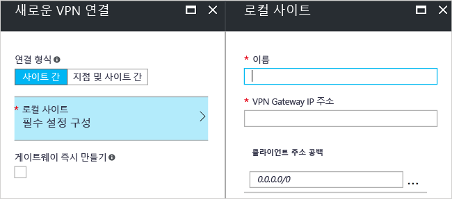

# <a name="create-a-site-to-site-connection-using-the-azure-portal-classic"></a>Azure Portal(클래식)을 사용하여 사이트 간 연결 만들기

[!INCLUDE [deployment models](../../includes/vpn-gateway-classic-deployment-model-include.md)]

이 문서에서는 Azure Portal을 사용하여 온-프레미스 네트워크에서 VNet으로 사이트 간 VPN Gateway 연결을 만드는 방법을 보여줍니다. 이 문서의 단계는 클래식 배포 모델에 적용됩니다. 다른 배포 도구 또는 배포 모델을 사용하는 경우 다음 목록에서 별도의 옵션을 선택하여 이 구성을 만들 수도 있습니다.

> [!div class="op_single_selector"]
> * [Azure Portal](vpn-gateway-howto-site-to-site-resource-manager-portal.md)
> * [PowerShell](vpn-gateway-create-site-to-site-rm-powershell.md)
> * [CLI](vpn-gateway-howto-site-to-site-resource-manager-cli.md)
> * [Azure Portal(클래식)](vpn-gateway-howto-site-to-site-classic-portal.md)
> 
>

사이트 간 VPN Gateway 연결은 IPsec/IKE(IKEv1 또는 IKEv2) VPN 터널을 통해 온-프레미스 네트워크를 Azure Virtual Network에 연결하는 데 사용됩니다. 이 연결 유형은 할당된 외부 연결 공용 IP 주소를 갖고 있는 온-프레미스에 있는 VPN 디바이스를 필요로 합니다. VPN Gateway에 대한 자세한 내용은 [VPN Gateway 정보](vpn-gateway-about-vpngateways.md)를 참조하세요.


## <a name="before-you-begin"></a>시작하기 전에

구성을 시작하기 전에 다음 기준을 충족하는지 확인합니다.

* 클래식 배포 모델에서 작업할 것인지 확인합니다. 리소스 관리자 배포 모델에서 작업하려면 [사이트 간 연결 만들기(리소스 관리자)](vpn-gateway-howto-site-to-site-resource-manager-portal.md)를 참조하세요. 가능한 경우 리소스 관리자 배포 모델을 사용하는 것이 좋습니다.
* 호환되는 VPN 디바이스 및 이 디바이스를 구성할 수 있는 사람이 있는지 확인합니다. 호환되는 VPN 디바이스 및 디바이스 구성에 대한 자세한 내용은 [VPN 디바이스 정보](vpn-gateway-about-vpn-devices.md)를 참조하세요.
* VPN 디바이스에 대한 외부 연결 공용 IPv4 주소가 있는지 확인합니다.
* 온-프레미스 네트워크에 있는 IP 주소 범위에 익숙하지 않은 경우 세부 정보를 제공할 수 있는 다른 사람의 도움을 받아야 합니다. 이 구성을 만들 때 Azure가 온-프레미스 위치에 라우팅할 IP 주소 범위 접두사를 지정해야 합니다. 온-프레미스 네트워크의 어떤 서브넷도 사용자가 연결하려는 가상 네트워크 서브넷과 중첩될 수 없습니다.
* 현재 공유 키를 지정하고 VPN Gateway 연결을 만드는 데 PowerShell이 필요합니다. 최신 버전의 Azure SM(서비스 관리) PowerShell cmdlet을 설치합니다. 자세한 내용은 [Azure PowerShell을 설치 및 구성하는 방법](/powershell/azure/overview)을 참조하세요. 이 구성에 PowerShell을 사용할 때 관리자 권한으로 실행되고 있는지 확인합니다. 

### <a name="values"></a>이 연습에 대한 샘플 구성 값

이 문서의 예제에서는 다음 값을 사용합니다. 이러한 값을 사용하여 테스트 환경을 만들거나 이 값을 참조하여 이 문서의 예제를 보다 정확하게 이해할 수 있습니다.

* **VNet 이름:** TestVNet1
* **주소 공간:** 
  * 10.11.0.0/16
  * 10.12.0.0/16(이 연습의 선택 사항)
* **서브넷:**
  * 프런트 엔드: 10.11.0.0/24
  * 백 엔드: 10.12.0.0/24(이 연습의 선택 사항)
* **게이트웨이 서브넷:** 10.11.255.0/27
* **리소스 그룹:** TestRG1
* **위치:** 미국 동부
* **DNS 서버:** 10.11.0.3(이 연습의 선택 사항)
* **로컬 사이트 이름:** Site2
* **클라이언트 주소 공간:** 온-프레미스 사이트에 있는 주소 공간입니다.

## <a name="CreatVNet"></a>1. 가상 네트워크 만들기

S2S 연결에 사용할 가상 네트워크를 만들 때 지정한 주소 공간이 연결하려는 로컬 사이트의 클라이언트 주소 공간과 겹치지 않는지 확인해야 합니다. 겹치는 서브넷에 있으면 연결이 제대로 작동하지 않습니다.

* VNet이 이미 있는 경우 설정이 VPN 게이트웨이 설계와 호환되는지 확인합니다. 다른 네트워크와 겹칠 수 있는 서브넷에 특히 주의합니다. 

* 가상 네트워크가 아직 없는 경우 만듭니다. 스크린샷은 예제로 제공됩니다. 사용자 고유의 값으로 대체해야 합니다.

### <a name="to-create-a-virtual-network"></a>가상 네트워크를 만들려면

1. 브라우저에서 [Azure Portal](https://portal.azure.com)로 이동하고 필요한 경우 Azure 계정으로 로그인합니다.
2. 페이지 맨 아래에 있는 **+** 를 사용하여 응용 프로그램에 Single Sign-On 할 수 있습니다. **마켓플레이스 검색** 필드에 ‘Virtual Network’를 입력합니다. 반환된 목록에서 **Virtual Network**를 찾아서 클릭하여 **Virtual Network** 페이지를 엽니다.

   
3. Virtual Network 페이지의 아래쪽 근처에 있는 **배포 모델 선택** 드롭다운 목록에서 **클래식**을 선택한 다음 **만들기**를 클릭합니다.

   
4. **가상 네트워크(클래식) 만들기** 페이지에서 VNet 설정을 구성합니다. 이 페이지에서 첫 번째 주소 공간과 단일 서브넷 주소 범위를 추가합니다. VNet 만들기를 완료한 후에 다시 돌아와서 추가 서브넷 및 주소 공간을 추가합니다.

   
5. **구독**이 올바른지 확인합니다. 드롭다운을 사용하여 구독을 변경할 수 있습니다.
6. **리소스 그룹**을 클릭하고 기존 리소스 그룹을 선택하거나 이름을 입력하여 새로 만듭니다. 리소스 그룹에 대한 자세한 내용은 [Azure Resource Manager 개요](../azure-resource-manager/resource-group-overview.md#resource-groups)를 참조하세요.
7. 다음으로 VNet에 대한 **위치** 설정을 선택합니다. 이 위치는 VNet에 배포하는 리소스가 상주할 곳을 결정합니다.
8. 대시보드에서 VNet을 쉽게 찾을 수 있으려면 **대시보드에 고정**을 선택합니다. **만들기**를 클릭하여 VNet을 만듭니다.

   
9. [만들기]를 클릭하면 VNet의 진행 상황을 반영하는 타일이 대시보드에 표시됩니다. 타일은 VNet이 생성되면서 변경됩니다.

   

## <a name="additionaladdress"></a>2. 다른 주소 공간 추가

가상 네트워크를 만든 후에 다른 주소 공간을 추가할 수 있습니다. 다른 주소 공간을 추가하는 작업은 S2S 구성의 일부는 아니지만 여러 개의 주소 공간이 필요한 경우 다음 단계를 사용하세요.

1. 포털에서 가상 네트워크를 찾습니다.
2. 가상 네트워크의 페이지에서 **설정** 섹션 아래에 있는 **주소 공간**을 클릭합니다.
3. 주소 공간 페이지에서 **+추가**를 클릭하여 다른 주소 공간을 입력합니다.

## <a name="dns"></a>3. DNS 서버 지정

DNS 설정이 S2S 구성의 일부가 아니지만 이름을 확인하려는 경우 DNS가 필요합니다. 값을 지정하더라도 새 DNS 서버를 만들지 않습니다. 지정한 DNS 서버는 연결 중인 리소스에 대한 이름을 확인할 수 있는 DNS 서버 IP 주소여야 합니다. 예제 설정에서는 개인 IP 주소를 사용했습니다. 우리가 사용하는 IP 주소는 아마도 DNS 서버의 IP 주소가 아닐 것입니다. 고유한 값을 사용해야 합니다.

가상 네트워크를 만든 후에 DNS 서버의 IP 주소를 추가하여 이름 확인을 처리할 수 있습니다. 가상 네트워크에 대한 설정을 열고 DNS 서버를 클릭하고 이름을 확인하는 데 사용할 DNS 서버의 IP 주소를 추가합니다.

1. 포털에서 가상 네트워크를 찾습니다.
2. 가상 네트워크의 페이지의 **설정** 섹션 아래에 있는 **DNS 서버**를 클릭합니다.
3. DNS 서버를 추가합니다.
4. 설정을 저장하려면 페이지의 위쪽에서 **저장**을 클릭합니다.

## <a name="localsite"></a>4. 로컬 사이트 구성

로컬 사이트는 일반적으로 온-프레미스 위치를 가리킵니다. VPN 디바이스의 IP 주소를 포함하며 여기에서 VPN 디바이스에 대한 VPN Gateway를 통해 라우팅되는 연결 및 IP 주소 범위를 만듭니다.

1. 포털에서 게이트웨이를 만들려는 가상 네트워크로 이동합니다.
2. 가상 네트워크에 대한 페이지에 대해, **개요** 페이지의 VPN 연결 섹션에서 **게이트웨이**를 클릭하여 **새 VPN 연결** 페이지를 엽니다.

   
3. **새 VPN 연결** 페이지에서 **사이트 간**을 선택합니다.
4. **로컬 사이트 - 필수 설정 구성**을 클릭하여 **로컬 사이트** 페이지를 엽니다. 설정을 구성한 다음 **확인**을 클릭하여 설정을 저장합니다.
   - **이름:** 쉽게 식별할 수 있도록 로컬 사이트의 이름을 만듭니다.
   - **VPN 게이트웨이 IP 주소:** 온-프레미스 네트워크에 대한 VPN 디바이스의 공용 IP 주소입니다. VPN 디바이스에는 IPv4 공용 IP 주소가 필요합니다. 연결하려는 VPN 디바이스에 유효한 공용 IP 주소를 지정합니다. Azure에 연결할 수 있어야 합니다. VPN 디바이스의 IP 주소를 모르는 경우 항상 자리 표시자 값을 넣고(반드시 유효한 공용 IP 주소 형식으로) 나중에 변경할 수 있습니다.
   - **클라이언트 주소 공간:** 이 게이트웨이를 통해 로컬 온-프레미스 네트워크에 라우팅할 IP 주소 범위를 나열합니다. 주소 공간 범위를 여러 개 추가할 수 있습니다. 여기에서 지정한 범위가 자체 가상 네트워크가 연결된 다른 네트워크의 범위 또는 가상 네트워크 자체의 주소 범위와 겹치지 않도록 합니다.

   

## <a name="gatewaysubnet"></a>5. 게이트웨이 서브넷 구성

VPN Gateway의 게이트웨이 서브넷을 만들어야 합니다. 게이트웨이 서브넷은 VPN 게이트웨이 서비스에서 사용하는 IP 주소를 포함합니다.

1. **새 VPN 연결** 페이지에서 **게이트웨이 즉시 만들기** 확인란을 선택합니다. [선택적 게이트웨이 구성] 페이지가 표시됩니다. 확인란을 선택하지 않은 경우 게이트웨이 서브넷을 구성하기 위한 페이지를 볼 수 없습니다.

   
2. **게이트웨이 구성** 페이지를 열려면 **선택적 게이트웨이 구성 - 서브넷, 크기 및 라우팅 유형**을 클릭합니다.
3. **게이트웨이 구성** 페이지에서 **서브넷 - 필수 설정 구성**을 클릭하여 **서브넷 추가** 페이지를 엽니다.

   
4. **서브넷 추가** 페이지에서 게이트웨이 서브넷을 추가합니다. 지정하는 게이트웨이 서브넷의 크기는 만들려는 VPN Gateway 구성에 따라 달라집니다. 게이트웨이 서브넷을 /29만큼 작게 만들 수 있지만 /27 또는 /28을 사용하는 것이 좋습니다. 이렇게 하면 더 많은 주소를 포함하는 큰 서브넷이 만들어집니다. 더 큰 게이트웨이 서브넷을 사용하면 향후 구성을 수용할 수 있을 만큼 충분한 IP 주소를 확보할 수 있습니다.

   

## <a name="sku"></a>6. SKU와 VPN 유형 지정

1. 게이트웨이 **크기**를 선택합니다. 이 크기는 가상 네트워크 게이트웨이를 만드는 데 사용하는 게이트웨이 SKU입니다. 포털에서 'SKU 기본값'은 **기본**입니다. 클래식 VPN 게이트웨이는 이전(레거시) 게이트웨이 SKU를 사용합니다. 레거시 게이트웨이 SKU에 대한 자세한 내용은 [가상 네트워크 게이트웨이 SKU(이전 SKU) 작업](vpn-gateway-about-skus-legacy.md)을 참조하세요.

   
2. 게이트웨이에 대한 **라우팅 유형**을 선택합니다. VPN 유형이라고도 합니다. 게이트웨이를 한 가지 유형에서 다른 유형으로 변환할 수 없기 때문에 올바른 게이트웨이 유형을 선택해야 합니다. VPN 디바이스는 선택한 라우팅 유형과 호환되어야 합니다. VPN 유형에 대한 자세한 내용은 [VPN Gateway 설정 정보](vpn-gateway-about-vpn-gateway-settings.md#vpntype)를 참조하세요. '경로 기반' 및 '정책 기반' VPN 유형을 참조하는 문서를 볼 수 있습니다. '동적'은 '경로 기반'에 해당하고 '고정'은 '정책 기반'에 해당합니다.
3. **확인**을 클릭하여 설정을 저장합니다.
4. **새 VPN 연결** 페이지 하단에 **확인**을 클릭하여 가상 네트워크 게이트웨이 만들기를 시작합니다. 선택한 SKU에 따라 가상 네트워크 게이트웨이를 만드는 데 최대 45분까지 걸릴 수 있습니다.

## <a name="vpndevice"></a>7. VPN 디바이스 구성

온-프레미스 네트워크에 대한 사이트 간 연결에는 VPN 디바이스가 필요합니다. 이 단계에서는 VPN 디바이스를 구성합니다. VPN 디바이스를 구성할 때 다음이 필요합니다.

- 공유 키 - 사이트 간 VPN 연결을 만들 때 지정하는 것과 동일한 공유 키입니다. 이 예제에서는 기본적인 공유 키를 사용합니다. 실제로 사용할 키는 좀 더 복잡하게 생성하는 것이 좋습니다.
- 가상 네트워크 게이트웨이의 공용 IP 주소 Azure Portal, PowerShell 또는 CLI를 사용하여 공용 IP 주소를 볼 수 있습니다.

[!INCLUDE [vpn-gateway-configure-vpn-device-rm](../../includes/vpn-gateway-configure-vpn-device-rm-include.md)]

## <a name="CreateConnection"></a>8. 연결 만들기
이 단계에서는 공유 키를 설정하고 연결을 만듭니다. 설정한 키는 VPN 디바이스 구성에 사용된 동일한 키여야 합니다.

> [!NOTE]
> 현재 이 단계는 Azure Portal에서 지원되지 않습니다. Azure PowerShell cmdlet의 SM(서비스 관리) 버전을 사용해야 합니다.
>

### <a name="step-1-connect-to-your-azure-account"></a>1단계. Azure 계정에 연결

1. 상승된 권한으로 PowerShell 콘솔을 열고 계정에 연결합니다. 연결에 도움이 되도록 다음 예제를 사용합니다.

   ```powershell
   Add-AzureAccount
   ```
2. 계정에 대한 구독을 확인합니다.

   ```powershell
   Get-AzureSubscription
   ```
3. 둘 이상의 구독이 있는 경우 사용할 구독을 선택합니다.

   ```powershell
   Select-AzureSubscription -SubscriptionId "Replace_with_your_subscription_ID"
   ```

### <a name="step-2-set-the-shared-key-and-create-the-connection"></a>2단계. 공유 키 설정 및 연결 만들기

PowerShell 및 클래식 배포 모델을 사용하는 경우 포털에 있는 리소스의 이름은 종종 PowerShell을 사용하는 경우에 Azure에서 예상하는 이름이 아닐 수 있습니다. 다음 단계에서는 네트워크 구성 파일을 내보내어 이름의 정확한 값을 가져올 수 있습니다.

1. 컴퓨터에 디렉터리를 만들고 디렉터리에 네트워크 구성 파일을 내보냅니다. 이 예제에서는 네트워크 구성 파일을 C:\AzureNet으로 내보냅니다.

   ```powershell
   Get-AzureVNetConfig -ExportToFile C:\AzureNet\NetworkConfig.xml
   ```
2. xml 편집기에서 네트워크 구성 파일을 열고 'LocalNetworkSite 이름' 및 'VirtualNetworkSite 이름'의 값을 확인합니다. 필요한 값을 반영하도록 예제를 수정합니다. 공백이 포함된 이름을 지정할 때는 값을 작은따옴표로 묶습니다.

3. 공유 키를 설정하고 연결을 만듭니다. '-SharedKey'는 사용자가 생성하고 지정하는 값입니다. 이 예제에서는 'abc123'을 사용했지만 좀 더 복잡한 항목을 생성하여 사용할 수 있습니다. 중요한 점은 여기에서 지정한 값이 VPN 디바이스를 구성하는 경우 지정한 것과 동일한 값이어야 한다는 것입니다.

   ```powershell
   Set-AzureVNetGatewayKey -VNetName 'Group TestRG1 TestVNet1' `
   -LocalNetworkSiteName 'D1BFC9CB_Site2' -SharedKey abc123
   ```
   연결이 생성된 경우 **상태: 성공**이 표시됩니다.

## <a name="verify"></a>9. 연결 확인

[!INCLUDE [vpn-gateway-verify-connection-azureportal-classic](../../includes/vpn-gateway-verify-connection-azureportal-classic-include.md)]

연결에 문제가 있는 경우 왼쪽 창의 목차에서 **문제 해결** 섹션을 참조하세요.

## <a name="reset"></a>VPN 게이트웨이를 다시 설정하는 방법

Azure VPN Gateway 재설정은 하나 이상의 사이트 간 VPN 터널에서 크로스-프레미스 VPN 연결이 손실되는 경우에 유용합니다. 이 상황에서 온-프레미스 VPN 디바이스는 모두 올바르게 작동하지만 Azure VPN 게이트웨이와 IPsec 터널을 설정할 수 없습니다. 자세한 단계는 [VPN 게이트웨이 다시 설정](vpn-gateway-resetgw-classic.md)을 참조하세요.

## <a name="changesku"></a>게이트웨이 SKU를 변경하는 방법

게이트웨이 SKU를 변경하는 단계는 [게이트웨이 SKU 크기 조정](vpn-gateway-about-SKUS-legacy.md)을 참조하세요.

## <a name="next-steps"></a>다음 단계

* 연결이 완료되면 가상 네트워크에 가상 머신을 추가할 수 있습니다. 자세한 내용은 [Virtual Machines](https://docs.microsoft.com/azure/)를 참조하세요.
* 강제 터널링에 대한 내용은 [강제 터널링 정보](vpn-gateway-about-forced-tunneling.md)를 참조하세요.
