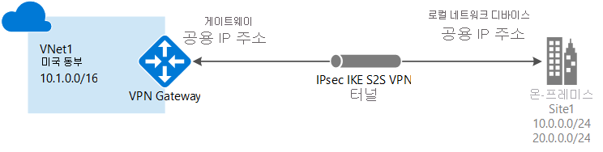

# Azure Portal에서 사이트 간 연결 만들기
> [!div class="op_single_selector"]
> * [Resource Manager - Azure Portal](vpn-gateway-howto-site-to-site-resource-manager-portal.md)
> * [Resource Manager - PowerShell](vpn-gateway-create-site-to-site-rm-powershell.md)
> * [클래식 - Azure Portal](vpn-gateway-howto-site-to-site-classic-portal.md)
> * [클래식 - 클래식 포털](vpn-gateway-site-to-site-create.md)
>
>

S2S(사이트 간) VPN Gateway 연결은 IPsec/IKE(IKEv1 또는 IKEv2) VPN 터널을 통한 연결입니다. 이 연결 유형은 할당된 공용 IP 주소를 가지고 NAT 다음에 위치하지 않는 온-프레미스에 있는 VPN 장치를 필요로 합니다. 사이트간 연결은 프레미스 간 및 하이브리드 구성에 사용될 수 있습니다.

이 문서에서는 Azure Resource Manager 배포 모델 및 Azure 포털을 사용하여 온-프레미스 네트워크에 대한 가상 네트워크와 사이트 간 VPN 게이트웨이 연결을 만드는 과정을 안내합니다. 

### 사이트 간 연결에 대한 배포 모델 및 메서드
[!INCLUDE [deployment models](../../includes/vpn-gateway-deployment-models-include.md)]

아래 표에서는 현재 사용할 수 있는 배포 모델 및 사이트 간 구성을 위한 메서드를 보여 줍니다. 구성 단계를 포함한 문서를 사용할 수 있는 경우 아래 표에서 관련 링크를 직접 제공합니다.

[!INCLUDE [site-to-site table](../../includes/vpn-gateway-table-site-to-site-include.md)]

#### 추가 구성
VNet을 서로 연결하되 온-프레미스 위치에는 연결하지 않으려는 경우 [VNet간 연결 구성](vpn-gateway-vnet-vnet-rm-ps.md)을 참조하세요. 이미 연결되어 있는 VNet에 사이트 간 연결을 추가하려는 경우 [기존 VPN 게이트웨이와 연결된 VNet에 S2S 연결 추가](vpn-gateway-howto-multi-site-to-site-resource-manager-portal.md)를 참조하세요.

## 시작하기 전에
구성을 시작하기 전에 다음 항목이 있는지 확인합니다.

* 호환되는 VPN 장치 및 구성할 수 있는 사람. [VPN 장치 정보](vpn-gateway-about-vpn-devices.md)를 참조하세요.
* 온-프레미스 네트워크에 있는 IP 주소 공간에 익숙하지 않은 경우 세부 정보를 제공할 수 있는 다른 사람의 도움을 받아야 합니다. 사이트 간 연결에는 겹치는 주소 공간이 없어야 합니다.
* VPN 장치에 대한 외부 연결 공용 IP 주소. 이 IP 주소는 NAT 뒤에 배치할 수 없습니다.
* Azure 구독. Azure 구독이 아직 없는 경우 [MSDN 구독자 혜택](http://azure.microsoft.com/pricing/member-offers/msdn-benefits-details)을 활성화하거나 [무료 계정](http://azure.microsoft.com/pricing/free-trial)에 등록할 수 있습니다.

### 예제 값
연습으로 이러한 단계를 사용하는 경우 다음 예제 값을 사용할 수 있습니다.

* **VNet 이름:** TestVNet1
* **주소 공간:** 
    * 10.11.0.0/16
    * 10.12.0.0/16(이 연습의 선택 사항)
* **서브넷:**
  * 프런트 엔드: 10.11.0.0/24
  * 백 엔드: 10.12.0.0/24(이 연습의 선택 사항)
  * GatewaySubnet: 10.11.255.0/27
* **리소스 그룹:** TestRG1
* **위치:** 미국 동부
* **DNS 서버:** DNS 서버의 IP 주소
* **가상 네트워크 게이트웨이 이름:** VNet1GW
* **공용 IP:** VNet1GWIP
* **VPN 유형:** 경로 기반
* **연결 형식:** 사이트 간(IPsec)
* **게이트웨이 유형:** VPN
* **로컬 네트워크 게이트웨이 이름:** Site2
* **연결 이름:** VNet1toSite2

## 1. 가상 네트워크 만들기

[!INCLUDE [vpn-gateway-basic-vnet-rm-portal](../../includes/vpn-gateway-basic-vnet-s2s-rm-portal-include.md)]

## 2. DNS 서버 지정
DNS는 사이트 간 연결에 필요하지 않습니다. 하지만 가상 네트워크에 배포된 리소스에 대한 이름을 확인하려는 경우 DNS 서버를 지정해야 합니다. 이 설정을 통해 이 가상 네트워크에 대한 이름을 확인하는 데 사용하려는 DNS 서버를 지정할 수 있습니다. DNS 서버를 만들지 않습니다.

[!INCLUDE [vpn-gateway-add-dns-rm-portal](../../includes/vpn-gateway-add-dns-rm-portal-include.md)]

## 3. 게이트웨이 서브넷 만들기
VPN Gateway의 게이트웨이 서브넷을 만들어야 합니다. 게이트웨이 서브넷은 VPN Gateway 서비스가 사용할 IP 주소를 포함합니다. 가능하면 /28 또는 /27 CIDR 블록을 사용하여 게이트웨이 서브넷을 만듭니다. 이렇게 하면 앞으로 게이트웨이 구성 요구 사항에 맞는 충분한 IP 주소를 갖게 됩니다.

[!INCLUDE [vpn-gateway-add-gwsubnet-rm-portal](../../includes/vpn-gateway-add-gwsubnet-s2s-rm-portal-include.md)]

## 4. 가상 네트워크 게이트웨이 만들기

[!INCLUDE [vpn-gateway-add-gw-s2s-rm-portal](../../includes/vpn-gateway-add-gw-s2s-rm-portal-include.md)]

## 5. 로컬 네트워크 게이트웨이 만들기
로컬 네트워크 게이트웨이는 온-프레미스 위치를 말합니다. 로컬 네트워크 게이트웨이에 지정한 설정은 온-프레미스 VPN 장치에 라우팅되는 주소 공간을 결정합니다.

[!INCLUDE [vpn-gateway-add-lng-s2s-rm-portal](../../includes/vpn-gateway-add-lng-s2s-rm-portal-include.md)]

## 6. VPN 장치 구성
[!INCLUDE [vpn-gateway-configure-vpn-device-rm](../../includes/vpn-gateway-configure-vpn-device-rm-include.md)]

## 7. 사이트 간 VPN 연결 만들기

이 단계에서는 가상 네트워크 게이트웨이와 온-프레미스 VPN 장치 사이에 사이트 간 VPN 연결을 만듭니다. 이 섹션을 시작하기 전에 가상 네트워크 게이트웨이 및 로컬 네트워크 게이트웨이를 다 만들었는지 확인합니다.

[!INCLUDE [vpn-gateway-add-site-to-site-connection-rm-portal](../../includes/vpn-gateway-add-site-to-site-connection-s2s-rm-portal-include.md)]

## 8. VPN 연결 확인

[!INCLUDE [Azure portal](../../includes/vpn-gateway-verify-connection-portal-rm-include.md)]

## 다음 단계
*  연결이 완료되면 가상 네트워크에 가상 컴퓨터를 추가할 수 있습니다. 자세한 내용은 [Virtual Machines](https://docs.microsoft.com/azure/#pivot=services&panel=Compute)를 참조하세요.
*  BGP에 대한 내용은 [BGP 개요](vpn-gateway-bgp-overview.md) 및 [BGP를 구성하는 방법](vpn-gateway-bgp-resource-manager-ps.md)을 참조하세요.

