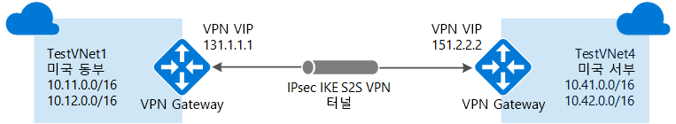
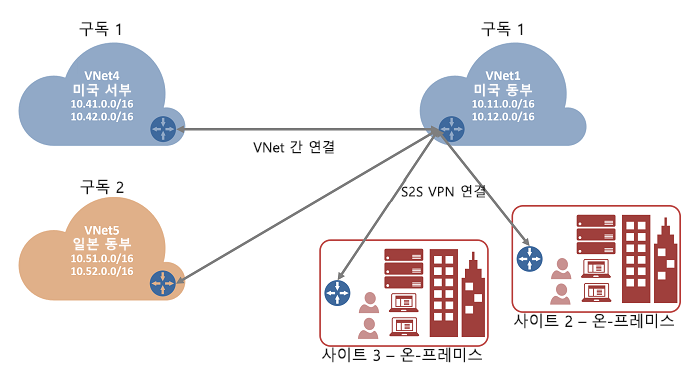

# Azure Portal을 사용하여 VNet-VNet 간 VPN Gateway 연결 구성

이 문서에서는 VNet-VNet 연결 형식을 사용하여 VNet(가상 네트워크)를 연결합니다. 가상 네트워크가 서로 다른 지역과 구독에 있어도 됩니다. 다른 구독의 VNet을 연결할 때 구독을 동일한 Active Directory 테넌트에 연결할 필요는 없습니다. 

이 문서의 단계는 Azure Resource Manager 배포 모델에 적용되며 Azure Portal을 사용합니다. 다음 문서에 설명된 옵션을 사용하여 다른 배포 도구 또는 모델을 통해 이 구성을 만들 수 있습니다.

> [!div class="op_single_selector"]
> * [Azure Portal](vpn-gateway-howto-vnet-vnet-resource-manager-portal.md)
> * [PowerShell](vpn-gateway-vnet-vnet-rm-ps.md)
> * [Azure CLI](vpn-gateway-howto-vnet-vnet-cli.md)
> * [Azure Portal(클래식)](vpn-gateway-howto-vnet-vnet-portal-classic.md)
> * [다양한 배포 모델 간 연결 - Azure Portal](vpn-gateway-connect-different-deployment-models-portal.md)
> * [다양한 배포 모델 간 연결 - PowerShell](vpn-gateway-connect-different-deployment-models-powershell.md)
>
>

## VNet 연결 정보

다음 섹션에서는 가상 네트워크를 연결하는 다양한 방법을 설명합니다.

### VNet 간

VNet-VNet 연결 구성은 간단하게 VNet을 연결할 수 있는 방법입니다. VNet-VNet 연결 형식(VNet2VNet)을 사용하여 가상 네트워크를 다른 가상 네트워크에 연결하는 것은 온-프레미스 위치에 사이트 간 IPsec 연결을 설정하는 것과 비슷합니다. 두 연결 형식 모두 VPN 게이트웨이를 사용하여 IPsec/IKE를 통한 보안 터널을 제공하며 둘 다 동일한 방식으로 통신합니다. 그러나 로컬 네트워크 게이트웨이를 구성하는 방법이 다릅니다. 

VNet-VNet 연결을 설정할 때 로컬 네트워크 게이트웨이 주소 공간이 자동으로 생성되고 채워집니다. 한 VNet의 주소 공간을 업데이트하면 다른 VNet이 자동으로 업데이트된 주소 공간으로 라우팅됩니다. 일반적으로 사이트 간 연결보다는 VNet-VNet 연결이 더 빠르고 쉽습니다.

### 사이트 간(IPsec)

복잡한 네트워크 구성을 작업하는 경우 [사이트 간 연결](vpn-gateway-howto-site-to-site-resource-manager-portal.md)을 사용하여 VNet에 연결하는 것이 좋습니다. 사이트 간 IPsec 단계를 수행할 때 로컬 네트워크 게이트웨이를 수동으로 만들고 구성합니다. 각 VNet의 로컬 네트워크 게이트웨이는 다른 VNet을 로컬 사이트로 처리합니다. 이러한 단계를 통해 로컬 네트워크 게이트웨이가 트래픽을 라우팅할 추가 주소 공간을 지정할 수 있습니다. VNet의 주소 공간이 변경되면 해당 로컬 네트워크 게이트웨이를 수동으로 업데이트해야 합니다.

### VNet 피어링

VNet 피어링을 사용하여 VNet을 연결할 수도 있습니다. VNet 피어링은 VPN 게이트웨이를 사용하지 않으며 여러 제약 조건이 있습니다. 또한 [VNet 피어링 가격 책정](https://azure.microsoft.com/pricing/details/virtual-network)은 [VNet-VNet VPN Gateway 가격 책정](https://azure.microsoft.com/pricing/details/vpn-gateway)과 다르게 계산됩니다. 자세한 내용은 [VNet 피어링](../virtual-network/virtual-network-peering-overview.md)을 참조하세요.

## VNet-VNet 연결을 만드는 이유

VNet-VNet 연결을 사용하여 가상 네트워크를 연결하는 이유는 다음과 같습니다.

### 지역 간 지리적 중복 및 지리적 상태

  * 인터넷 연결 엔드포인트로 이동하지 않고도 보안 연결을 통해 지역에서 복제 또는 동기화를 직접 설정할 수 있습니다.
  * Azure Traffic Manager 및 Azure Load Balancer를 사용하여 여러 Azure 지역 간의 지리적 중복을 통해 워크로드의 가용성을 높게 설정할 수 있습니다. 예를 들어 여러 Azure 지역에서 SQL Server Always On 가용성 그룹을 설정할 수 있습니다.

### 분리 또는 관리 경계를 가진 지역별 다중 계층 애플리케이션

  * 같은 지역 내에서 격리 또는 관리 요구 사항 때문에 여러 가상 네트워크가 서로 연결된 다중 계층 애플리케이션을 설정할 수 있습니다.

VNet-VNet 통신을 다중 사이트 구성과 결합할 수 있습니다. 이렇게 구성하면 다음 다이어그램에 표시된 것처럼 프레미스 간 연결을 가상 네트워크 간 연결과 결합하는 네트워크 토폴로지를 설정할 수 있습니다.

이 문서에서는 VNet-VNet 연결 형식을 사용하여 VNet을 연결하는 방법을 보여줍니다. 이러한 단계를 연습으로 사용하는 경우 다음 예제 설정 값을 사용할 수 있습니다. 예제에서는 가상 네트워크가 동일한 구독에 있지만 다른 리소스 그룹에 있습니다. VNet이 다른 구독에 있으면 포털에서 연결을 만들 수 없습니다. [PowerShell](vpn-gateway-vnet-vnet-rm-ps.md) 또는 [CLI](vpn-gateway-howto-vnet-vnet-cli.md)를 대신 사용합니다. VNet-VNet 연결에 대한 자세한 내용은 [VNet-VNet FAQ](#vnet-to-vnet-faq)를 참조하세요.

### 예제 설정

**TestVNet1에 대한 값:**

- **가상 네트워크 설정**
    - **이름**: *TestVNet1*을 입력합니다.
    - **주소 공간**: *10.11.0.0/16*을 입력합니다.
    - **구독**: 사용할 구독을 선택합니다.
    - **리소스 그룹**: *TestRG1*을 입력합니다.
    - **위치**: **미국 동부**를 선택합니다.
    - **서브넷**
        - **이름**: *FrontEnd*를 입력합니다.
        - **주소 범위**: *10.11.0.0/24*를 입력합니다.
    - **게이트웨이 서브넷**:
        - **이름**: *GatewaySubnet*이 자동으로 채워집니다.
        - **주소 범위**: *10.11.255.0/27*을 입력합니다.
    - **DNS 서버**: **사용자 지정**을 선택하고 DNS 서버의 IP 주소를 입력합니다.

- **가상 네트워크 게이트웨이 설정** 
    - **이름**: *TestVNet1GW*를 입력합니다.
    - **게이트웨이 유형**: **VPN**을 선택합니다.
    - **VPN 형식**: **경로 기반**을 선택합니다.
    - **SKU**: 사용할 게이트웨이 SKU를 선택합니다.
    - **공용 IP 주소 이름**: *TestVNet1GWIP*를 입력합니다.
    - **연결** 
       - **이름**: *TestVNet1toTestVNet4*를 입력합니다.
       - **공유 키**: *abc123*을 입력합니다. 공유 키를 직접 만들 수 있습니다. VNet 간 연결을 만들 때 값이 일치해야 합니다.

**TestVNet4에 대한 값:**

- **가상 네트워크 설정**
   - **이름**: *TestVNet4*를 입력합니다.
   - **주소 공간**: *10.41.0.0/16*을 입력합니다.
   - **구독**: 사용할 구독을 선택합니다.
   - **리소스 그룹**: *TestRG4*를 입력합니다.
   - **위치**: **미국 서부**를 선택합니다.
   - **서브넷** 
      - **이름**: *FrontEnd*를 입력합니다.
      - **주소 범위**: *10.41.0.0/24*를 입력합니다.
   - **GatewaySubnet** 
      - **이름**: *GatewaySubnet*이 자동으로 채워집니다.
      - **주소 범위**: *10.41.255.0/27*을 입력합니다.
   - **DNS 서버**: **사용자 지정**을 선택하고 DNS 서버의 IP 주소를 입력합니다.

- **가상 네트워크 게이트웨이 설정** 
    - **이름**: *TestVNet4GW*를 입력합니다.
    - **게이트웨이 유형**: **VPN**을 선택합니다.
    - **VPN 형식**: **경로 기반**을 선택합니다.
    - **SKU**: 사용할 게이트웨이 SKU를 선택합니다.
    - **공용 IP 주소 이름**: *TestVNet4GWIP*를 입력합니다.
    - **연결** 
       - **이름**: *TestVNet4toTestVNet1*을 입력합니다.
       - **공유 키**: *abc123*을 입력합니다. 공유 키를 직접 만들 수 있습니다. VNet 간 연결을 만들 때 값이 일치해야 합니다.

## TestVNet1 만들기 및 구성
VNet이 이미 있는 경우 설정이 VPN 게이트웨이 설계와 호환되는지 확인합니다. 다른 네트워크와 겹칠 수 있는 서브넷에 특히 주의합니다. 겹치는 서브넷에 있으면 연결이 제대로 작동하지 않습니다. VNet이 올바른 설정으로 구성되었다면 DNS 서버 지정 섹션의 단계를 시작할 수 있습니다.

### 가상 네트워크를 만들려면
[!INCLUDE [vpn-gateway-basic-vnet-rm-portal](../../includes/vpn-gateway-basic-vnet-rm-portal-include.md)]

## 다른 주소 공간 추가 및 서브넷 만들기
VNet이 만들어지면 여기에 다른 주소 공간을 추가하고 서브넷을 만들 수 있습니다.

[!INCLUDE [vpn-gateway-additional-address-space](../../includes/vpn-gateway-additional-address-space-include.md)]

## 게이트웨이 서브넷 만들기
가상 네트워크에 대한 가상 네트워크 게이트웨이를 만들려면 먼저 게이트웨이 서브넷을 만들어야 합니다. 게이트웨이 서브넷은 가상 네트워크 게이트웨이에서 사용되는 IP 주소를 포함하고 있습니다. 향후 추가 구성 요구 사항을 수용하기에 충분한 IP 주소를 제공할 수 있도록, 되도록이면 /28 또는 /27 CIDR 블록을 사용하여 게이트웨이 서브넷을 만드는 것이 가장 좋습니다.

연습으로 이 구성을 만드는 경우 게이트웨이 서브넷을 만들 때 이러한 [예제 설정](#example-settings)을 참조하세요.

[!INCLUDE [vpn-gateway-no-nsg](../../includes/vpn-gateway-no-nsg-include.md)]

### 게이트웨이 서브넷을 만들려면
[!INCLUDE [vpn-gateway-add-gwsubnet-rm-portal](../../includes/vpn-gateway-add-gwsubnet-rm-portal-include.md)]

## DNS 서버 지정(선택 사항)
VNet-VNet 연결에는 DNS가 필요 없습니다. 하지만 가상 네트워크에 배포된 리소스에 대한 이름을 확인하려는 경우 DNS 서버를 지정합니다. 이 설정을 통해 이 가상 네트워크에 대한 이름을 확인하는 데 사용하려는 DNS 서버를 지정할 수 있습니다. DNS 서버를 만들지 않습니다.

[!INCLUDE [vpn-gateway-add-dns-rm-portal](../../includes/vpn-gateway-add-dns-rm-portal-include.md)]

## 가상 네트워크 게이트웨이 만들기
이 단계에서는 VNet용 가상 네트워크 게이트웨이를 만듭니다. 종종 선택한 게이트웨이 SKU에 따라 게이트웨이를 만드는 데 45분 이상 걸릴 수 있습니다. 연습으로 이 구성을 만드는 경우 [예제 설정](#example-settings)을 참조하세요.

### 가상 네트워크 게이트웨이를 만들려면
[!INCLUDE [vpn-gateway-add-gw-rm-portal](../../includes/vpn-gateway-add-gw-rm-portal-include.md)]

## TestVNet4 만들기 및 구성
TestVNet1을 구성한 후에는 값을 TestVNet4로 바꿔서 이전 단계를 반복하여 TestVNet4를 만듭니다. TestVNet1에 대한 가상 네트워크 게이트웨이 만들기가 완료될 때까지 기다릴 필요 없이 TestVNet4를 구성할 수 있습니다. 고유한 값을 사용하는 경우에 주소 공간에 연결하려는 VNet을 사용하여 겹치지 않는지 확인합니다.

## TestVNet1 게이트웨이 연결 구성
가상 네트워크 게이트웨이 TestVNet1 및 TestVNet4를 모두 완료했을 때 게이트웨이 연결 가상 네트워크를 만들 수 있습니다. 이 섹션에서는 VNet1에서 VNet4에 연결을 만듭니다. 이러한 단계는 동일한 구독에 있는 Vnet에 대해서만 작동합니다. VNet이 다른 구독에 있으면 [PowerShell](vpn-gateway-vnet-vnet-rm-ps.md)을 사용하여 연결해야 합니다. 그러나 VNet이 동일한 구독의 다른 리소스 그룹에 있는 경우 포털을 사용하여 연결할 수 있습니다.

1. Azure Portal에서 **모든 리소스**를 선택하고, 검색 상자에 *가상 네트워크 게이트웨이*를 입력하고, VNet의 가상 네트워크 게이트웨이로 이동합니다. 예를 들어 **TestVNet1GW**로 이동합니다. 선택하여 **가상 네트워크 게이트웨이** 페이지를 엽니다.

   
2. **설정** 아래에서 **연결**을 선택한 다음, **추가**를 선택하여 **연결 추가** 페이지를 엽니다.

   
3. **연결 추가** 페이지에서 연결의 값을 입력합니다.

   - **이름**: 연결의 이름을 입력합니다. 예를 들어, *TestVNet1toTestVNet4*를 입력합니다.

   - **연결 형식**: 드롭다운에서 **VNet-VNet**을 선택합니다.

   - **첫 번째 가상 네트워크 게이트웨이**: 아 필드 값은 지정된 가상 네트워크 게이트웨이에서 이 연결을 만들고 있으므로 자동으로 입력됩니다.

   - **두 번째 가상 네트워크 게이트웨이**: 이 필드는 연결을 만들고자 하는 VNet의 가상 네트워크 게이트웨이입니다. **다른 가상 네트워크 게이트웨이 선택**을 선택하여 **선택 가상 네트워크 게이트웨이** 페이지를 엽니다.

     - 이 페이지에 나열된 가상 네트워크 게이트웨이를 봅니다. 구독에 있는 가상 네트워크 게이트웨이만 나열되어 있는지 확인합니다. 구독에 없는 가상 네트워크 게이트웨이에 연결하려면 [PowerShell](vpn-gateway-vnet-vnet-rm-ps.md)을 사용합니다.

     - 연결하려는 가상 네트워크 게이트웨이를 선택합니다.

     - **공유 키(PSK)**: 이 필드에서 연결의 공유 키를 입력합니다. 이 키를 생성하거나 직접 만들 수 있습니다. 사이트 간 연결에 사용되는 키는 온-프레미스 디바이스 및 가상 네트워크 게이트웨이 연결에서 사용하는 키와 동일합니다. 개념은 비슷하지만, 여기서는 VPN 디바이스에 연결하지 않고 다른 가상 네트워크 게이트웨이를 연결합니다.
    
4. **확인** 을 선택하여 변경 내용을 저장합니다.

## TestVNet4 게이트웨이 연결 구성
다음으로 TestVNet4에서 TestVNet1에 연결을 만듭니다. 포털에서 TestVNet4와 연결 된 가상 네트워크 게이트웨이 찾습니다. 이전 섹션의 단계를 따라 TestVNet4에서 TestVNet1로 연결을 만들기 위해 값을 교체합니다. 동일한 공유 키를 사용하고 있는지 확인합니다.

## 연결 확인

Azure Portal에서 가상 네트워크 게이트웨이를 찾습니다. **가상 네트워크 게이트웨이** 페이지에서 **연결**을 선택하여 가상 네트워크 게이트웨이에 대한 **연결** 페이지를 봅니다. 연결이 설정되면 **상태** 값이 **성공** 및 **연결됨**으로 변경됩니다. **Essentials** 페이지를 열고 자세한 정보를 보려면 연결을 선택합니다.

데이터 흐름이 시작되면 **데이터 입력** 및 **데이터 출력** 값이 보입니다.

## 연결 추가

연결을 추가하려면 연결을 만들 가상 네트워크 게이트웨이로 이동하여 **연결**을 선택합니다. 다른 VNet 대 VNet 연결을 만들거나 온-프레미스 위치에 대한 IPsec 사이트 간 연결을 만들 수 있습니다. **연결 형식**을 만들려는 연결 형식과 일치하도록 조정해야 합니다. 추가 연결을 만들기 전에, 가상 네트워크에 대한 주소 공간이 연결하려는 주소 공간과 겹치지 않는지 확인합니다. 사이트 간 연결을 만드는 단계는 [사이트 간 연결 만들기](vpn-gateway-howto-site-to-site-resource-manager-portal.md)를 참조하세요.

## VNet-VNet FAQ
VNet 간 연결에 대한 자세한 내용은 FAQ 세부 정보를 봅니다.

[!INCLUDE [vpn-gateway-vnet-vnet-faq](../../includes/vpn-gateway-faq-vnet-vnet-include.md)]

## 다음 단계

가상 네트워크에서 리소스에 대한 네트워크 트래픽을 제한하는 방법에 대한 자세한 내용은 [네트워크 보안](../virtual-network/security-overview.md)을 참조하세요.

Azure에서 트래픽을 Azure, 온-프레미스 및 인터넷 리소스간에 라우팅하는 방법에 대한 정보는 [가상 네트워크 트래픽 라우팅](../virtual-network/virtual-networks-udr-overview.md)을 참조하세요.
