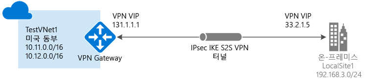

# 클래식 포털을 사용하여 사이트 간 연결로 VNet 만들기
> [!div class="op_single_selector"]
> * [Resource Manager - Azure Portal](vpn-gateway-howto-site-to-site-resource-manager-portal.md)
> * [Resource Manager - PowerShell](vpn-gateway-create-site-to-site-rm-powershell.md)
> * [클래식 - 클래식 포털](vpn-gateway-site-to-site-create.md)
> 
> 

이 문서에서는 클래식 배포 모델 및 클래식 포털을 사용하여 온-프레미스 네트워크에 대한 가상 네트워크와 사이트 간 VPN 게이트웨이 연결을 만드는 과정을 안내합니다. 사이트간 연결은 프레미스 간 및 하이브리드 구성에 사용될 수 있습니다.

### 사이트 간 연결에 대한 배포 모델 및 메서드
[!INCLUDE [deployment models](../../includes/vpn-gateway-deployment-models-include.md)]

아래 표에서는 현재 사용할 수 있는 배포 모델 및 사이트 간 구성을 위한 메서드를 보여 줍니다. 구성 단계를 포함한 문서를 사용할 수 있는 경우 아래 표에서 관련 링크를 직접 제공합니다.

[!INCLUDE [vpn-gateway-table-site-to-site-table](../../includes/vpn-gateway-table-site-to-site-include.md)]

#### 추가 구성
Vnet끼리 서로 연결하려는 경우 [클래식 배포 모델에 대한 VNet간 연결 구성](virtual-networks-configure-vnet-to-vnet-connection.md)을 참조하세요. 이미 연결되어 있는 VNet에 사이트 간 연결을 추가하려는 경우 [기존 VPN 게이트웨이와 연결된 VNet에 S2S 연결 추가](vpn-gateway-multi-site.md)를 참조하세요.

## 시작하기 전에
구성을 시작하기 전에 다음 항목이 있는지 확인합니다.

* 호환되는 VPN 장치 및 구성할 수 있는 사람. [VPN 장치 정보](vpn-gateway-about-vpn-devices.md)를 참조하세요. VPN 장치를 구성하는 방법과 온-프레미스 네트워크 구성에 있는 IP 주소 범위에 익숙하지 않은 경우 세부 정보를 제공할 수 있는 다른 사람의 도움을 받아야 합니다.
* VPN 장치에 대한 외부 연결 공용 IP 주소. 이 IP 주소는 NAT 뒤에 배치할 수 없습니다.
* Azure 구독. Azure 구독이 아직 없는 경우 [MSDN 구독자 혜택](https://azure.microsoft.com/pricing/member-offers/msdn-benefits-details)을 활성화하거나 [무료 계정](https://azure.microsoft.com/pricing/free-trial)에 등록할 수 있습니다.

## 가상 네트워크 만들기
1. [Azure 클래식 포털](https://manage.windowsazure.com/)에 로그인합니다.
2. 화면의 왼쪽 아래 모서리에서 **새로 만들기**를 클릭합니다. 탐색 창에서 **Network Services**를 클릭한 다음 **Virtual Network**를 클릭합니다. **사용자 지정 만들기** 를 클릭하여 구성 마법사를 시작합니다.
3. VNet을 만들려면 다음 페이지에서 구성 설정을 입력합니다.

## 가상 네트워크 세부 정보 페이지
다음 정보를 입력합니다.

* **이름**: 가상 네트워크 이름입니다. 예: *EastUSVNet*. VM 및 PaaS 인스턴스를 배포할 때 이름이 너무 복잡하지 않도록 이 가상 네트워크 이름을 사용하는 것이 좋습니다.
* **위치**: 위치는 리소스(VM)를 배치할 실제 위치(지역)과 직접적인 관련이 있습니다. 예를 들어, 이 가상 네트워크에 배포할 VM이 *미국 동부*에 물리적으로 있도록 하려면 해당 위치를 선택합니다. 만든 후 가상 네트워크와 연결된 지역을 변경할 수 없습니다.

## DNS 서버 및 VPN 연결 페이지
다음 정보를 입력한 후 오른쪽 아래에서 다음 화살표를 클릭합니다.

* **DNS 서버**: DNS 서버 이름 및 IP 주소를 입력하거나 바로 가기 메뉴에서 이전에 등록된 DNS 서버를 선택합니다. 이 설정은 DNS 서버를 만들지 않습니다. 이렇게 하면 이 가상 네트워크에 대한 이름 확인에 사용하려는 DNS 서버를 지정할 수 있습니다.
* **사이트 간 VPN 구성**: **사이트 간 VPN 구성** 확인란을 선택합니다.
* **로컬 네트워크**: 로컬 네트워크는 실제 온-프레미스 위치를 나타냅니다. 이전에 만든 로컬 네트워크를 선택하거나 새 로컬 네트워크를 만들 수 있습니다. 하지만 이전에 만든 로컬 네트워크를 사용하려면 **로컬 네트워크** 구성 페이지로 이동하여 이 연결에 사용 중인 VPN 장치의 VPN 장치 IP 주소(공용 IPv4 주소)가 정확한지 확인합니다.

## 사이트 간 연결 페이지
새 로컬 네트워크를 만들 경우 **사이트 간 연결** 페이지가 표시됩니다. 이전에 만든 로컬 네트워크를 사용하려는 경우 이 페이지가 마법사에 나타나지 않고 다음 섹션으로 이동할 수 있습니다.

다음 정보를 입력하고 다음 화살표를 클릭합니다.

* **이름**: 로컬(온-프레미스) 네트워크 사이트를 호출할 이름입니다.
* **VPN 장치 IP 주소**: Azure에 연결하는 데 사용할 온-프레미스 VPN 장치의 공용 IPv4 주소입니다. VPN 장치는 NAT 뒤에 배치할 수 없습니다.
* **주소 공간**: 시작 IP 및 CIDR(주소 수)를 포함합니다. 가상 네트워크 게이트웨이를 통해 로컬 온-프레미스 위치로 보낼 주소 범위를 지정합니다. 대상 IP 주소가 여기서 지정한 범위 내에 포함되는 경우 가상 네트워크 게이트웨이를 통해 라우팅됩니다.
* **주소 공간 추가**: 가상 네트워크 게이트웨이를 통해 여러 주소 범위를 보낼 경우 각 추가 주소 범위를 지정합니다. 나중에 **로컬 네트워크** 페이지에서 범위를 추가하거나 제거할 수 있습니다.

## 가상 네트워크 주소 공간 페이지
가상 네트워크에 사용할 주소 범위를 지정합니다. 이 범위의 DIPS(동적 IP 주소)가 해당 가상 네트워크에 배포하는 VM 및 기타 역할 인스턴스에 할당됩니다.

특히 온-프레미스 네트워크에 사용되는 범위와 겹치지 않는 범위를 선택하는 것이 중요합니다. 네트워크 관리자와 조정해야 합니다. 네트워크 관리자가 가상 네트워크에 사용할 온-프레미스 네트워크 주소 공간에서 일정 범위의 IP 주소를 지정해야 할 수 있습니다.

다음 정보를 입력하고 오른쪽 아래의 확인 표시를 클릭하여 네트워크를 구성합니다.

* **주소 공간**: 시작 IP 및 주소 수를 포함합니다. 지정한 주소 공간이 온-프레미스 네트워크에 가지고 있는 주소 공간과 겹치지 않는지 확인하세요.
* **서브넷 추가**: 시작 IP 및 주소 수를 포함합니다. 추가 서브넷은 필요하지 않지만 고정 DIPS가 있는 VM에 대해 별도의 서브넷을 만들 수 있습니다. 또는 기타 역할 인스턴스와 별도의 서브넷에 VM을 배치할 수 있습니다.
* **게이트웨이 서브넷 추가**: 게이트웨이 서브넷을 추가하려면 클릭합니다. 게이트웨이 서브넷은 가상 네트워크 게이트웨이에 대해서만 사용되며 이 구성에 필요합니다.

페이지 아래에 있는 확인 표시를 클릭하면 가상 네트워크 만들기가 시작됩니다. 완료되면 Azure 클래식 포털의 **네트워크** 페이지에 있는 **상태**에 **생성됨**이 표시됩니다. VNet를 만든 후에 가상 네트워크 게이트웨이를 구성할 수 있습니다.

[!INCLUDE [vpn-gateway-no-nsg](../../includes/vpn-gateway-no-nsg-include.md)]

## 가상 네트워크 게이트웨이 구성
보안 사이트 간 연결을 만들기 위해 가상 네트워크 게이트웨이를 구성합니다. [Azure 클래식 포털에서 가상 네트워크 게이트웨이 구성](vpn-gateway-configure-vpn-gateway-mp.md)을 참조하세요.

## 다음 단계
 연결이 완료되면 가상 네트워크에 가상 컴퓨터를 추가할 수 있습니다. 자세한 내용은 [Virtual Machines](https://docs.microsoft.com/azure/#pivot=services&panel=Compute)를 참조하세요.

