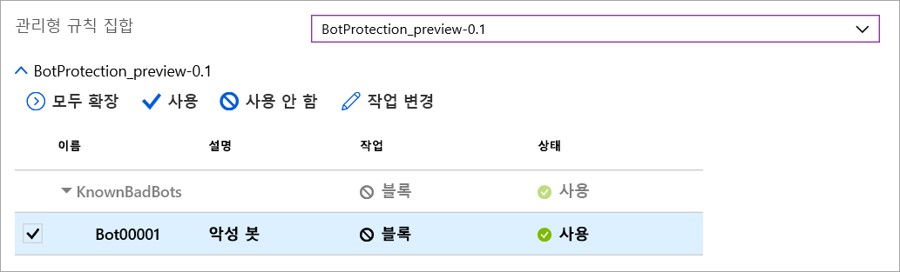

# Azure Front Door의 Azure 웹 애플리케이션 방화벽

Azure Front Door의 Azure WAF(웹 애플리케이션 방화벽)는 전역적으로 제공되는 중앙 집중식 보호를 통해 웹 애플리케이션을 보호합니다. WAF는 일반적인 악용 및 취약성으로부터 웹 서비스를 방어하고, 사용자를 위해 서비스 고가용성을 유지하고, 규정 준수 요구 사항을 충족할 수 있도록 설계되었습니다.

Front Door의 WAF는 글로벌 중앙 집중식 솔루션입니다. 이 솔루션은 전 세계의 Azure 네트워크 에지 위치에 배포되고, Front Door가 제공하는 WAF 사용 웹 애플리케이션에 대한 모든 수신 요청이 네트워크 에지에서 검사됩니다. 이를 통해 WAF는 가상 네트워크에 연결되기 전에 공격 원본에 가까운 악의적인 공격을 방지할 수 있으며, 성능을 저하시키지 않고도 대규모 글로벌 보호 기능을 제공합니다. WAF 정책은 구독의 모든 Front Door 프로필에 쉽게 연결될 수 있으며, 몇 분 내에 새 규칙이 배포될 수 있으므로 변경된 위협 패턴에 신속하게 대응할 수 있습니다.

## WAF 정책 및 규칙

WAF 정책을 구성한 후 보호를 위해 하나 이상의 Front Door 프런트 엔드에 정책을 연결할 수 있습니다. WAF 정책은 다음 두 가지 유형의 보안 규칙으로 구성됩니다.

- 고객이 작성한 사용자 지정 규칙

- Azure에서 관리하는 미리 구성된 규칙 세트의 컬렉션에 해당하는 관리형 규칙 세트

두 규칙이 모두 존재하는 경우 관리형 규칙 세트의 규칙을 처리하기 전에 사용자 지정 규칙이 처리됩니다. 규칙은 일치 조건, 우선 순위 및 작업으로 구성됩니다. 지원되는 작업 유형은 허용, 차단, 로그 및 리디렉션입니다. 관리형 규칙과 사용자 지정 규칙을 결합하여 특정 애플리케이션 보호 요구 사항을 충족하는 완전히 사용자 지정된 정책을 만들 수 있습니다.

정책 내의 규칙은 지정된 우선 순위에 따라 처리됩니다. 우선 순위는 처리되는 규칙의 순서를 정의하는 고유한 정수입니다. 값이 더 작을수록 높은 우선 순위를 나타내며 작은 값의 규칙이 높은 값의 규칙보다 먼저 평가됩니다. 규칙이 일치하면 규칙에 정의된 해당 작업이 요청에 적용됩니다. 이러한 일치가 처리되면 우선 순위가 낮은 규칙은 더 이상 처리되지 않습니다.

Front Door가 제공하는 웹 애플리케이션에는 한 번에 하나의 WAF 정책만 연결될 수 있습니다. 그러나 WAF 정책이 연결되지 않은 Front Door 구성도 사용할 수 있습니다. WAF 정책이 있으면 전 세계 보안 정책에서 일관성을 유지하기 위해 모든 에지 위치에 복제됩니다.

## WAF 모드

WAF 정책은 다음 두 가지 모드에서 실행되도록 구성할 수 있습니다.

- **감지 모드:** 감지 모드에서 실행하는 경우 WAF는 모니터링 이외의 다른 작업을 수행하지 않고, 요청 및 일치하는 WAF 규칙을 WAF 로그에 기록합니다. Front Door에 대한 로깅 진단 기능을 켤 수 있습니다(포털을 사용하는 경우 Azure Portal의 **진단** 섹션으로 이동하여 수행).

- **방지 모드:** 방지 모드에서 실행되도록 구성하면 WAF는 요청이 규칙과 일치하는 경우 지정된 작업을 수행하고, 일치하는 항목이 발견되면 우선 순위가 낮은 추가 규칙을 평가하지 않습니다. 일치하는 모든 요청은 WAF 로그에도 기록됩니다.

## WAF 작업

WAF 고객은 요청이 규칙의 조건과 일치하는 경우 작업 중 하나를 실행하도록 선택할 수 있습니다.

- **허용:**  요청은 WAF를 통과해서 백 엔드에 전달됩니다. 더 낮은 우선 순위 규칙으로는 이 요청을 차단할 수 없습니다.
- **차단:** 요청이 차단되고 WAF는 요청을 백 엔드에 전달하지 않고 클라이언트에 응답을 보냅니다.
- **로그:**  요청은 WAF 로그에 기록되고 WAF는 우선 순위가 낮은 규칙을 계속 평가합니다.
- **리디렉션:** WAF는 요청을 지정된 URI로 리디렉션합니다. 지정된 URI가 정책 수준 설정입니다. 이 옵션이 구성되면 **리디렉션** 작업과 일치하는 모든 요청이 해당 URI로 전송됩니다.

## WAF 규칙

WAF 정책은 두 가지 유형의 보안 규칙으로 구성될 수 있습니다. 하나는 고객이 작성하는 사용자 지정 규칙이고, 다른 하나는 Azure 관리형 미리 구성된 규칙세트를 나타내는 관리형 규칙 세트입니다.

### 사용자 작성 규칙

다음과 같이 사용자 지정 규칙 WAF를 구성할 수 있습니다.

- **IP 허용 목록 및 차단 목록:** 클라이언트 IP 주소 목록 또는 IP 주소 범위에 따라 웹 애플리케이션에 대한 액세스를 제어하도록 사용자 지정 규칙을 구성할 수 있습니다. IPv4 및 IPv6 주소 형식이 모두 지원됩니다. 이 목록은 원본 IP가 목록의 IP와 일치하는 요청을 차단하거나 허용하도록 구성할 수 있습니다.

- **지리 기반 액세스 제어:** 클라이언트의 IP 주소와 연결된 국가 코드를 기준으로 웹 애플리케이션에 대한 액세스를 제어하도록 사용자 지정 규칙을 구성할 수 있습니다.

- **HTTP 매개 변수 기반 액세스 제어:** 쿼리 문자열, POST 인수, 요청 URI, 요청 헤더, 요청 본문 등의 문자열 일치 HTTP/HTTPS 요청 매개 변수를 기준으로 사용자 지정 규칙을 구성할 수 있습니다.

- **요청 메서드 기반 액세스 제어:** 요청의 HTTP 요청 메서드(예: GET, PUT 또는 HEAD)를 기준으로 사용자 지정 규칙을 구성할 수 있습니다.

- **크기 제약 조건:** 쿼리 문자열, URI 또는 요청 본문과 같은 요청의 특정 부분 길이를 기준으로 사용자 지정 규칙을 구성할 수 있습니다.

- **속도 제한 규칙:** 속도 제어 규칙은 모든 클라이언트 IP에서 오는 비정상적으로 높은 트래픽을 제한하는 것입니다. 1분 동안 클라이언트 IP에서 허용하는 웹 요청 수에 대한 임계값을 구성할 수 있습니다. 클라이언트 IP의 모든 요청을 허용하거나 차단하는 IP 목록 기반 허용/차단 사용자 지정 규칙과는 다릅니다. 속도 제한을 세부적인 속도 제어를 위해 HTTP(S) 매개 변수 일치와 같은 추가 일치 조건과 함께 사용할 수 있습니다.

### Azure 관리형 규칙 세트

Azure 관리형 규칙 세트는 일반적인 보안 위협에 대한 보호를 쉽게 배포할 수 있는 방법을 제공합니다. 이러한 규칙 세트는 Azure에서 관리되므로 새로운 공격 서명으로부터 보호하기 위해 필요에 따라 규칙을 업데이트합니다. 퍼블릭 미리 보기에서 Azure 관리형 기본 규칙 세트에는 다음 위협 범주에 대한 규칙이 포함됩니다.

- 사이트 간 스크립팅
- Java 공격
- 로컬 파일 포함
- PHP 삽입 공격
- 원격 명령 실행
- 원격 파일 포함
- 세션 고정
- SQL 삽입 공격 보호
- 프로토콜 공격자

새 공격 서명이 규칙 세트에 추가되면 기본 규칙 세트의 버전 번호가 증가합니다.
기본 규칙 세트는 WAF 정책의 감지 모드에서 기본적으로 사용하도록 설정됩니다. 기본 규칙 세트 내에서 개별 규칙을 사용하지 않거나 사용하도록 설정하여 애플리케이션 요구 사항을 충족할 수 있습니다. 규칙별로 특정 작업(허용/차단/리디렉션/로그)을 설정할 수도 있습니다. 기본 작업은 차단입니다. 또한 기본 규칙 세트의 미리 구성된 규칙을 무시하려는 경우 동일한 WAF 정책에서 사용자 지정 규칙을 구성할 수 있습니다.
사용자 지정 규칙은 항상 기본 규칙 세트의 규칙을 평가하기 전에 적용됩니다. 요청이 사용자 지정 규칙과 일치하는 경우 해당 규칙 작업이 적용되고 요청은 기본 규칙 세트의 추가 사용자 지정 규칙 또는 규칙 호출 없이, 차단되거나 백 엔드로 전달됩니다. 또한 WAF 정책에서 기본 규칙 세트를 제거하는 옵션도 제공됩니다.

### 봇 보호 규칙 세트(미리 보기)

WAF에 대해 관리형 봇 보호 규칙 세트를 사용하도록 설정하여 알려진 봇 범주의 요청에 대해 사용자 지정 작업을 수행할 수 있습니다. 지원되는 세 가지 봇 범주는 잘못된 봇, 올바른 봇 및 알 수 없는 봇입니다. Bot 서명은 WAF 플랫폼에 의해 관리되고 동적으로 업데이트됩니다. 잘못된 봇에 대한 악성 IP 주소는 Microsoft 위협 인텔리전스 피드에서 제공됩니다. [Intelligent Security Graph](https://www.microsoft.com/security/operations/intelligence)는 Microsoft 위협 인텔리전스를 구동하며 Azure Security Center를 비롯한 여러 서비스에서 사용됩니다. 올바른 봇에는 유효성 검사가 완료된 검색 엔진이 포함됩니다. 알 수 없는 봇 범주에는 추가 봇 그룹이 포함됩니다. 다양한 종류의 봇을 차단, 허용, 기록 또는 리디렉션하는 사용자 지정 작업을 설정할 수 있습니다.

> [!IMPORTANT]
> 봇 보호 규칙 세트는 현재 공개 미리 보기이며 미리 보기 서비스 수준 계약과 함께 제공됩니다. 특정 기능이 지원되지 않거나 기능이 제한될 수 있습니다.  자세한 내용은 [Microsoft Azure 미리 보기에 대한 보충 사용 약관](https://azure.microsoft.com/support/legal/preview-supplemental-terms/)을 참조하세요.

봇 보호를 사용하면 봇 규칙과 일치하는 수신 요청이 FrontdoorWebApplicationFirewallLog 로그에 기록됩니다. 스토리지 계정, 이벤트 허브 또는 로그 분석에서 WAF 로그에 액세스할 수 있습니다.

## 구성

모든 WAF 규칙 유형의 구성 및 배포 작업은 Azure Portal, REST API, Azure Resource Manager 템플릿 및 Azure PowerShell을 사용하여 완벽하게 지원됩니다.

## 모니터링

Front Door의 WAF 모니터링은 경고를 추적하고 트래픽 추세를 쉽게 모니터링 하기 위해 Azure Monitor와 연결됩니다.

## 다음 단계

- [Azure Application Gateway의 웹 애플리케이션 방화벽](../ag/ag-overview.md)에 대해 자세히 알아보기
