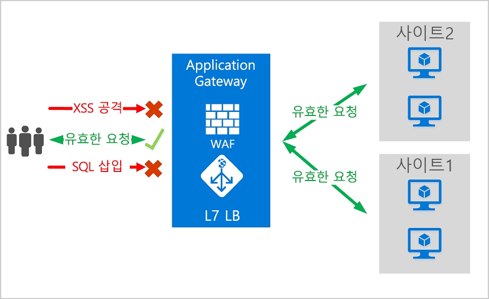
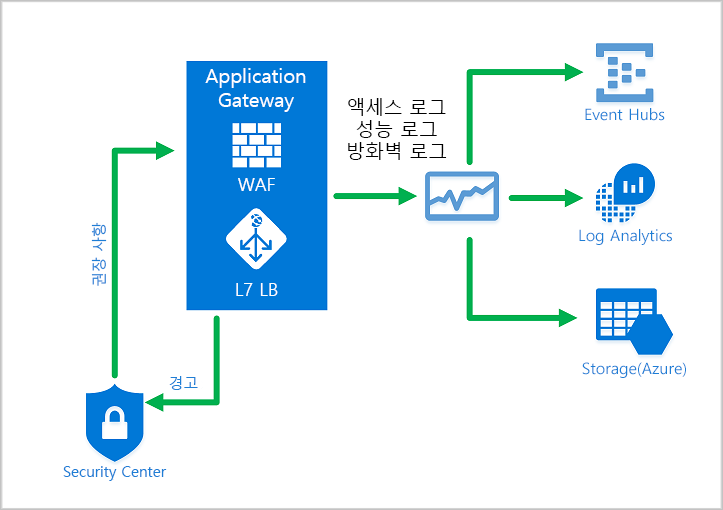
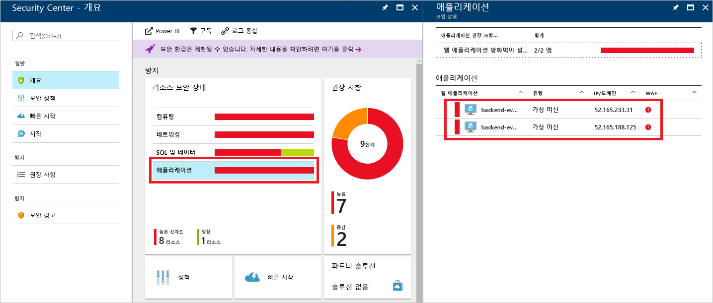
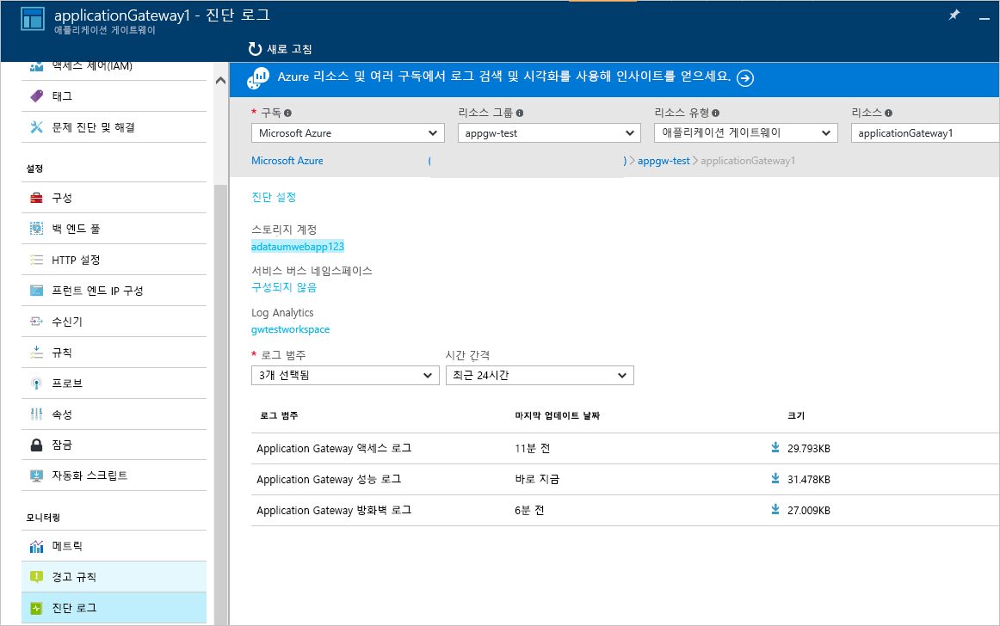

# <a name="azure-web-application-firewall-on-azure-application-gateway"></a>Azure Application Gateway의 Azure 웹 애플리케이션 방화벽

Azure Application Gateway의 Azure WAF(웹 애플리케이션 방화벽)는 일반적인 악용 및 취약성으로부터 웹 애플리케이션을 중앙 집중식으로 보호합니다. 일반적으로 알려진 취약성을 악용하여 웹 애플리케이션을 공격하는 악의적인 사례가 점점 늘어나고 있습니다. 그 중에서 SQL 삽입 및 사이트 간 스크립팅은 가장 흔한 공격 방식입니다.

Application Gateway의 WAF는 OWASP(Open Web Application Security Project)의 [CRS(핵심 규칙 세트)](https://www.owasp.org/index.php/Category:OWASP_ModSecurity_Core_Rule_Set_Project) 3.1, 3.0 또는 2.2.9를 기반으로 합니다. WAF는 새로운 취약점에 대한 방어 기능을 포함하도록 자동으로 업데이트되며, 추가 구성이 필요 없습니다. 

아래에 나열된 모든 WAF 기능은 WAF 정책 내에 있습니다. 여러 정책을 만들 수 있으며, 정책을 Application Gateway, 개별 수신기 또는 Application Gateway의 경로 기반 회람 규칙에 연결할 수 있습니다. 이러한 방식으로 필요에 따라 Application Gateway 뒤에 있는 각 사이트에 별도의 정책을 적용할 수 있습니다. WAF 정책에 대한 자세한 내용은 [WAF 정책 만들기](create-waf-policy-ag.md)를 참조하세요.

   > [!NOTE]
   > 사이트별 및 URI별 WAF 정책은 공개 미리 보기로 제공됩니다. 즉, 이 기능은 Microsoft의 추가 사용 약관을 따릅니다. 자세한 내용은 [Microsoft Azure Preview에 대한 추가 사용 약관](https://azure.microsoft.com/support/legal/preview-supplemental-terms/)을 참조하세요.



Application Gateway는 많은 ADC(애플리케이션 배달 컨트롤러)로 작동합니다. SSL(Secure Sockets Layer) 종료, 쿠키 기반 세션 선호도, 라운드 로빈 부하 분산, 콘텐츠 기반 라우팅, 다중 웹 사이트 호스트 및 향상된 보안 기능을 제공합니다.

Application Gateway의 향상된 보안 기능으로는 SSL 정책 관리와 엔드투엔드 SSL 지원이 있습니다. 애플리케이션 보안은 Application Gateway에 WAF를 통합하여 강화됩니다. 이 조합은 일반적인 취약성으로부터 웹 애플리케이션을 보호합니다. 그리고 구성이 간편한 중앙의 위치에서 관리할 수 있습니다.

## <a name="benefits"></a>이점

이 섹션에서는 Application Gateway의 WAF가 제공하는 핵심 이점에 대해 설명합니다.

### <a name="protection"></a>보호

* 백 엔드 코드를 수정하지 않고 웹 취약점 및 공격으로부터 웹 애플리케이션을 보호합니다.

* 동시에 여러 웹 애플리케이션을 보호합니다. Application Gateway 인스턴스는 웹 애플리케이션 방화벽으로 보호되는 최대 40개의 웹 사이트를 호스팅할 수 있습니다.

* 동일한 WAF 뒤에 있는 다른 사이트에 대한 사용자 지정 WAF 정책을 만듭니다. 

* IP 신뢰도 규칙 세트를 사용하여 악의적인 봇으로부터 웹 애플리케이션을 보호합니다(미리 보기).

### <a name="monitoring"></a>모니터링

* 실시간 WAF 로그를 사용하여 웹 애플리케이션에 대한 공격을 모니터링합니다. 이 로그는 [Azure Monitor](../../azure-monitor/overview.md)와 통합되어 WAF 경고를 추적하고 추세를 쉽게 모니터링합니다.

* Application Gateway WAF는 Azure Security Center와 통합됩니다. 중앙의 Security Center에서 모든 Azure 리소스의 보안 상태를 살펴볼 수 있습니다.

### <a name="customization"></a>사용자 지정

* 애플리케이션 요구 사항에 맞게 WAF 규칙 및 규칙 그룹을 사용자 지정하고 가양성을 제거합니다.

* 사이트별로 구성할 수 있도록 WAF 뒤에 있는 각 사이트에 대한 WAF 정책을 연결합니다.

* 애플리케이션의 요구 사항에 맞는 사용자 지정 규칙을 만듭니다.

## <a name="features"></a>기능

- SQL 삽입 방지
- 사이트 간 스크립팅 방지
- 명령 삽입, HTTP 요청 밀반입, HTTP 응답 분할, 원격 파일 포함 등의 일반 웹 공격 방지
- HTTP 프로토콜 위반 방지
- 누락된 호스트 사용자-에이전트 헤더 및 수락 헤더 같은 HTTP 프로토콜 이상 방지
- 크롤러 및 스캐너에 대한 방지
- 일반적인 애플리케이션 구성 오류(예: Apache 및 IIS) 검색
- 하한값과 상한값이 있는 구성 가능한 요청 크기 제한
- WAF 평가에서 특정 요청 특성을 생략할 수 있는 제외 목록. 일반적인 예로는 인증 또는 암호 필드에 사용되는 Active Directory 삽입 토큰이 있습니다.
- 애플리케이션의 특정 요구 사항에 맞는 사용자 지정 규칙 만들기
- 특정 국가의 애플리케이션에 대한 액세스를 허용하거나 차단하기 위한 지역 필터 트래픽 (미리 보기)
- 봇 완화 규칙 세트를 사용하여 봇으로부터 애플리케이션 보호 (미리 보기)

## <a name="waf-policy"></a>WAF 정책

Application Gateway에서 웹 애플리케이션 방화벽을 사용하도록 설정하려면 WAF 정책을 만들어야 합니다. 이 정책에는 모든 관리형 규칙, 사용자 지정 규칙, 제외 및 기타 사용자 지정(예: 파일 업로드 제한)이 있습니다. 

### <a name="core-rule-sets"></a>핵심 규칙 집합

Application Gateway는 세 가지 규칙 세트 CRS 3.1, CRS 3.0 및 CRS 2.2.9를 지원합니다. 이러한 규칙은 악의적인 활동으로부터 웹 애플리케이션을 보호합니다.

자세한 내용은 [웹 애플리케이션 방화벽 CRS 규칙 그룹 및 규칙](application-gateway-crs-rulegroups-rules.md)을 참조하세요.

### <a name="custom-rules"></a>사용자 지정 규칙

Application Gateway는 사용자 지정 규칙도 지원합니다. 사용자 지정 규칙을 사용하면 WAF를 통해 전달되는 각 요청에 대해 평가되는 사용자 고유의 규칙을 만들 수 있습니다. 이러한 규칙은 관리형 규칙 세트의 나머지 규칙보다 높은 우선 순위를 갖습니다. 조건 세트가 충족되면 허용 또는 차단 작업을 수행합니다. 

이제 geomatch 연산자는 사용자 지정 규칙에 대한 공개 미리 보기에서 사용할 수 있습니다. 자세한 내용은 [geomatch 사용자 지정 규칙](custom-waf-rules-overview.md#geomatch-custom-rules-preview)을 참조하세요.

> [!NOTE]
> 사용자 지정 규칙에 대한 geomatch 연산자는 현재 공개 미리 보기 상태이며 미리 보기 서비스 수준 계약과 함께 제공됩니다. 특정 기능이 지원되지 않거나 기능이 제한될 수 있습니다. 자세한 내용은 [Microsoft Azure 미리 보기에 대한 보충 사용 약관](https://azure.microsoft.com/support/legal/preview-supplemental-terms/)을 참조하세요.

사용자 지정 규칙에 대한 자세한 내용은 [Application Gateway에 대한 사용자 지정 규칙](custom-waf-rules-overview.md)을 참조하세요.

### <a name="bot-mitigation-preview"></a>봇 완화(미리 보기)

관리형 규칙 세트와 함께 관리형 봇 보호 규칙 세트를 WAF에 사용하도록 설정하여 알려진 악성 IP 주소의 요청을 차단하거나 기록할 수 있습니다. IP 주소는 Microsoft 위협 인텔리전스 피드에서 제공됩니다. Intelligent Security Graph는 Microsoft 위협 인텔리전스를 구동하며 Azure Security Center를 비롯한 여러 서비스에서 사용됩니다.

> [!NOTE]
> 봇 보호 규칙 세트는 현재 공개 미리 보기이며 미리 보기 서비스 수준 계약과 함께 제공됩니다. 특정 기능이 지원되지 않거나 기능이 제한될 수 있습니다. 자세한 내용은 [Microsoft Azure 미리 보기에 대한 보충 사용 약관](https://azure.microsoft.com/support/legal/preview-supplemental-terms/)을 참조하세요.

봇 보호를 사용하면 악의적 봇의 클라이언트 IP와 일치하는 수신 요청이 방화벽 로그에 기록됩니다. 자세한 내용은 아래를 참조하세요. 스토리지 계정, 이벤트 허브 또는 로그 분석에서 WAF 로그에 액세스할 수 있습니다. 

### <a name="waf-modes"></a>WAF 모드

Application Gateway WAF는 다음 두 가지 모드에서 실행되도록 구성할 수 있습니다.

* **탐지 모드**: 모든 위협 경고를 모니터링하고 기록합니다. **진단** 섹션에서 Application Gateway에 대한 진단 로깅을 켜야 합니다. 그리고 WAF 로그가 선택되어 있고 켜져 있는지 확인해야 합니다. 웹 애플리케이션 방화벽을 탐지 모드로 실행하면 수신 요청을 차단하지 않습니다.
* **방지 모드**: 규칙에서 탐지하는 침입 및 공격을 차단합니다. 공격자는 "403 무단 액세스" 예외를 수신하고, 연결이 종료됩니다. 방지 모드는 이러한 공격을 WAF 로그에 기록합니다.

> [!NOTE]
> 새로 배포된 WAF를 프로덕션 환경에서 짧은 시간 동안 탐지 모드로 실행하는 것이 좋습니다. 이렇게 하면 방지 모드로 전환하기 전에 [방화벽 로그](../../application-gateway/application-gateway-diagnostics.md#firewall-log)를 얻고 모든 예외 또는 [사용자 지정 규칙](./custom-waf-rules-overview.md)을 업데이트할 수 있습니다. 이를 통해 예기치 않은 트래픽 차단 발생을 줄일 수 있습니다.

### <a name="anomaly-scoring-mode"></a>변칙 채점 모드

OWASP는 트래픽 차단 여부를 결정하는 기존 모드와 변칙 채점 모드 두 가지가 있습니다.

기존 모드에서는 특정 규칙과 일치하는 트래픽은 다른 규칙과 상관없이 일치 항목으로 간주됩니다. 이 모드는 이해하기 쉽습니다. 그러나 특정 요청과 일치하는 규칙이 몇 개인지 알 수 없다는 제한이 있습니다. 이러한 제한을 극복하기 위해 변칙 채점 모드가 도입되었습니다. 변칙 채점 모드는 OWASP 3.*x*의 기본값입니다.

변칙 채점 모드에서는 방화벽이 방지 모드일 때 특정 규칙과 일치하는 트래픽이 즉시 차단되지 않습니다. 규칙에는 네 가지 심각도 *중요*, *오류*, *경고* 또는 *알림*이 있습니다. 이 심각도는 요청의 숫자 값에 영향을 주며, 이것을 변칙 점수라고 합니다. 예를 들어 *경고* 규칙 일치 항목 하나당 3점입니다. *중요* 규칙 일치 항목 하나당 5점입니다.

|심각도  |값  |
|---------|---------|
|중요     |5|
|오류        |4|
|Warning      |3|
|알림       |2|

변칙 점수가 트래픽을 차단하는 임계값은 5입니다. 따라서 *중요* 규칙 일치 항목이 하나만 있어도 Application Gateway WAF가 방지 모드에서도 요청을 차단합니다. 하지만 *경고* 규칙 일치 항목이 하나 있으면 변칙 점수가 3 증가하므로 트래픽을 차단하기에는 점수가 부족합니다.

> [!NOTE]
> WAF 규칙이 트래픽과 일치할 때 기록되는 메시지에는 "차단됨" 작업 값이 포함됩니다. 그러나 실제로 트래픽은 변칙 점수가 5 이상인 경우에만 차단됩니다.  

### <a name="waf-monitoring"></a>WAF 모니터링

Application Gateway의 상태를 모니터링하는 것이 중요합니다. WAF 및 WAF가 보호하는 애플리케이션의 상태를 모니터링하는 기능은 Azure Security Center, Azure Monitor 및 Azure Monitor 로그와의 통합을 통해 제공됩니다.



#### <a name="azure-monitor"></a>Azure Monitor

Application Gateway 로그는 [Azure Monitor](../../azure-monitor/overview.md)와 통합됩니다. 이를 통해 WAF 경고 및 로그를 포함하여 진단 정보를 추적할 수 있습니다. 포털에 있는 Application Gateway 리소스의 **진단** 탭에서 또는 Azure Monitor를 통해 직접 이 기능에 액세스할 수 있습니다. 로그를 사용하도록 설정하는 방법에 대한 자세한 내용은 [Application Gateway 진단](../../application-gateway/application-gateway-diagnostics.md)을 참조하세요.

#### <a name="azure-security-center"></a>Azure Security Center

[Security Center](../../security-center/security-center-intro.md)를 통해 위협을 예방하고, 탐지하고, 대응할 수 있습니다. Security Center를 사용하면 Azure 리소스의 보안 상태를 보다 명확히 파악하고 제어할 수 있습니다. Application Gateway는 [Security Center와 통합됩니다](../../application-gateway/application-gateway-integration-security-center.md). Security Center는 사용자 환경을 검사하여 보호되지 않는 웹 애플리케이션을 검색합니다. 이처럼 취약한 리소스를 보호하도록 애플리케이션 게이트웨이 WAF를 권장할 수 있습니다. Security Center에서 직접 방화벽을 만듭니다. 이러한 WAF 인스턴스는 Security Center와 통합됩니다. WAF 인스턴스는 경고와 상태 정보를 Security Center로 보내서 보고합니다.



#### <a name="azure-sentinel"></a>Azure Sentinel

Microsoft Azure Sentinel은 확장 가능한 클라우드 네이티브, SIEM(보안 정보 이벤트 관리) 및 SOAR(보안 오케스트레이션 자동화 응답) 솔루션입니다. Azure Sentinel은 엔터프라이즈 전반에 지능적인 보안 분석 및 위협 인텔리전스를 제공하며, 경고 검색, 위협 가시성, 주도적 헌팅 및 위협 대응을 위한 단일 솔루션을 제공합니다.

기본 제공 Azure WAF 방화벽 이벤트 통합 문서를 사용하면 WAF의 보안 이벤트에 대한 개요를 볼 수 있습니다. 여기에는 이벤트, 일치 규칙 및 차단 규칙 및 방화벽 로그에 기록되는 모든 항목이 포함됩니다. 로깅에 대해 아래에서 자세히 참조하세요. 


#### <a name="logging"></a>로깅

Application Gateway WAF는 탐지된 각 위협에 대한 상세 보고를 제공합니다. 로깅은 Azure Diagnostics 로그와 통합됩니다. 경고는 .json 형식으로 기록됩니다. 이러한 로그는 [Azure Monitor 로그](../../azure-monitor/insights/azure-networking-analytics.md)와 통합될 수 있습니다.



```json
{
  "resourceId": "/SUBSCRIPTIONS/{subscriptionId}/RESOURCEGROUPS/{resourceGroupId}/PROVIDERS/MICROSOFT.NETWORK/APPLICATIONGATEWAYS/{appGatewayName}",
  "operationName": "ApplicationGatewayFirewall",
  "time": "2017-03-20T15:52:09.1494499Z",
  "category": "ApplicationGatewayFirewallLog",
  "properties": {
    {
      "instanceId": "ApplicationGatewayRole_IN_0",
      "clientIp": "52.161.109.145",
      "clientPort": "0",
      "requestUri": "/",
      "ruleSetType": "OWASP",
      "ruleSetVersion": "3.0",
      "ruleId": "920350",
      "ruleGroup": "920-PROTOCOL-ENFORCEMENT",
      "message": "Host header is a numeric IP address",
      "action": "Matched",
      "site": "Global",
      "details": {
        "message": "Warning. Pattern match \"^[\\\\d.:]+$\" at REQUEST_HEADERS:Host ....",
        "data": "127.0.0.1",
        "file": "rules/REQUEST-920-PROTOCOL-ENFORCEMENT.conf",
        "line": "791"
      },
      "hostname": "127.0.0.1",
      "transactionId": "16861477007022634343"
      "policyId": "/subscriptions/1496a758-b2ff-43ef-b738-8e9eb5161a86/resourceGroups/drewRG/providers/Microsoft.Network/ApplicationGatewayWebApplicationFirewallPolicies/globalWafPolicy",
      "policyScope": "Global",
      "policyScopeName": " Global "
    }
  }
} 

```

## <a name="application-gateway-waf-sku-pricing"></a>Application Gateway WAF SKU 가격 책정

WAF_v1 및 WAF_v2 SKU의 가격 책정 모델이 서로 다릅니다. 자세한 내용은 [Application Gateway 가격 책정](https://azure.microsoft.com/pricing/details/application-gateway/) 페이지를 참조하세요. 

## <a name="next-steps"></a>다음 단계

- [WAF 정책을 만들어](create-waf-policy-ag.md) 시작
- [WAF 관리 규칙](application-gateway-crs-rulegroups-rules.md)에 대해 자세히 알아보기
- [사용자 지정 규칙](custom-waf-rules-overview.md)에 대해 자세히 알아보기
- [Azure Front Door의 웹 애플리케이션 방화벽](../afds/afds-overview.md)에 대한 자세한 내용

