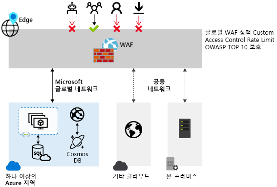

# Azure 웹 애플리케이션 방화벽이란?

WAF(웹 애플리케이션 방화벽)는 일반적인 악용과 취약성으로부터 웹 애플리케이션을 중앙 집중식으로 보호합니다. 일반적으로 알려진 취약성을 악용하여 웹 애플리케이션을 공격하는 악의적인 사례가 점점 늘어나고 있습니다. 그 중에서 SQL 삽입 및 사이트 간 스크립팅은 가장 흔한 공격 방식입니다.

애플리케이션 코드에서 이러한 공격을 방지하는 일은 어렵습니다. 이를 위해 애플리케이션 토폴로지의 여러 계층에서 엄격한 유지 관리, 패치 적용 및 모니터링이 필요할 수 있습니다. 중앙 집중식 웹 애플리케이션 방화벽을 사용하면 보안을 훨씬 쉽게 관리할 수 있습니다. 또한 WAF를 사용하여 애플리케이션 관리자는 위협 및 침입으로부터 보다 확실하게 보호할 수 있습니다.

WAF 솔루션은 각각의 개별 웹 애플리케이션을 보호하는 대신 중앙의 위치에서 알려진 취약점에 패치를 적용하여 보다 신속하게 보안 위협에 대응할 수 있습니다.

## 지원되는 서비스

WAF는 Microsoft의 Azure Application Gateway, Azure Front Door 및 Azure CDN(Content Delivery Network) 서비스를 사용하여 배포할 수 있습니다. Azure CDN의 WAF는 현재 공개 미리 보기로 제공되고 있습니다.  WAF에는 각 특정 서비스에 대해 사용자 지정된 기능이 있습니다. 각 서비스의 WAF 기능에 대한 자세한 내용은 각 서비스에 대한 개요를 참조하세요.

## 다음 단계

- Application Gateway의 웹 애플리케이션 방화벽에 대한 자세한 내용은 [Azure Application Gateway의 웹 애플리케이션 방화벽](./ag/ag-overview.md)을 참조하세요.
- Azure Front Door Service의 웹 애플리케이션 방화벽에 대한 자세한 내용은 [Azure Front Door Service의 웹 애플리케이션 방화벽](./afds/afds-overview.md)을 참조하세요.
- Azure CDN Service의 웹 애플리케이션 방화벽에 대한 자세한 내용은 [Azure CDN Service의 웹 애플리케이션 방화벽](./cdn/cdn-overview.md)을 참조하세요.
