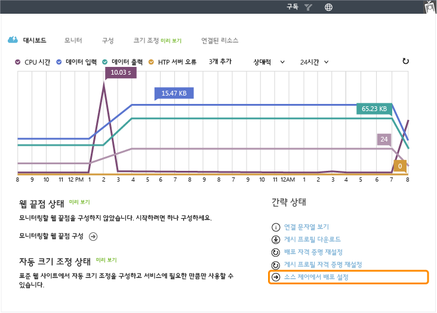
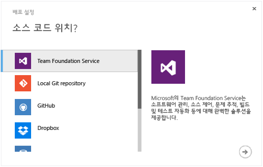
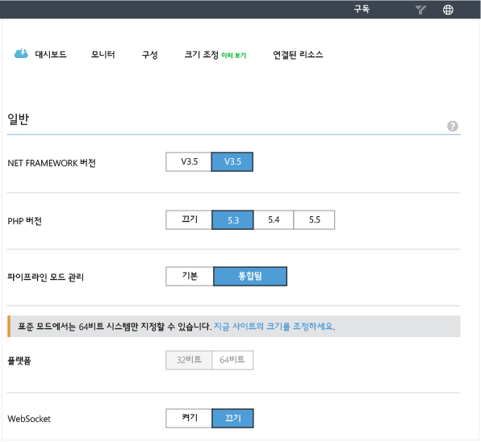
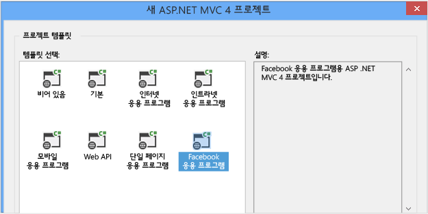
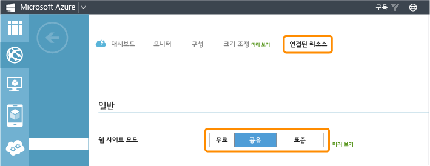
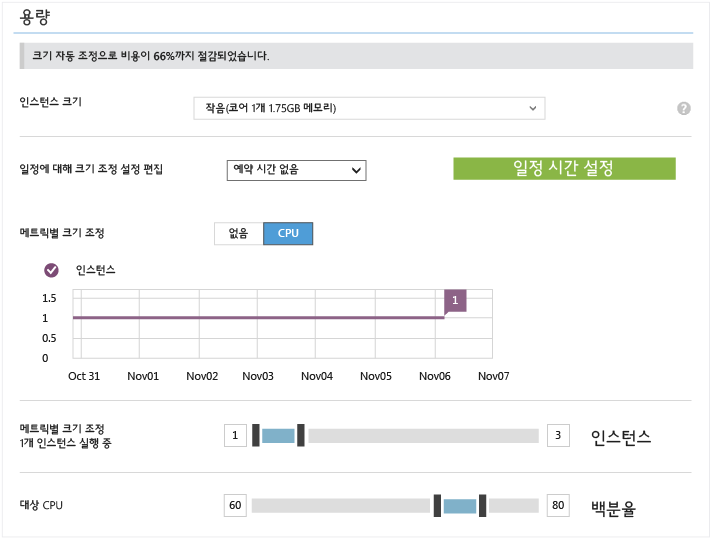
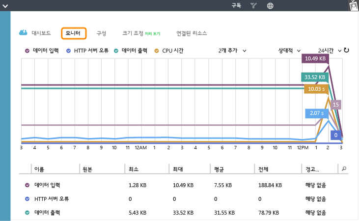
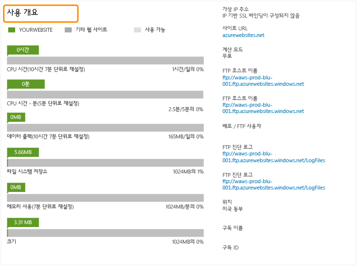

<properties linkid="websites-digital-marketing" urlDisplayName="Resources" pageTitle="Create a Digital Marketing Campaign on Azure Web Sites" metaKeywords="" description="This guide provides a technical overview of how to use Azure Web Sites to create digital marketing campaigns. This includes deployment, social media integration, scaling strategies, and monitoring." metaCanonical="" services="" documentationCenter="" title="Create a Digital Marketing Campaign on Azure Web Sites" authors="jroth" solutions="" manager="paulettm" editor="mollybos" />

Azure 웹 사이트에서 디지털 마케팅 캠페인 만들기
===============================================

이 가이드는 Azure 웹 사이트에서 디지털 마케팅 캠페인을 만드는 방법에 대한 기술적 개요를 제공합니다. 디지털 마케팅 캠페인은 일반적으로 단기간 마케팅 목표를 달성하기 위한 짧은 수명의 엔터티입니다. 두 가지 주요 시나리오를 고려해야 합니다. 첫 번째 시나리오에서는 타 마케팅 회사가 프로모션 기간에 고객을 위한 캠페인을 만들고 관리합니다. 두 번째 시나리오에서는 마케팅 회사가 디지털 마케팅 캠페인을 만든 후 해당 리소스의 소유권을 고객에게 전송합니다. 그러면 고객이 디지털 마케팅 캠페인을 스스로 운영 및 관리합니다.

[Azure 웹 사이트](/ko-kr/documentation/services/web-sites/)는 두 가지 시나리오에 모두 적합합니다. 캠페인을 빠르게 만들 수 있고, 여러 프레임워크와 언어를 지원하고, 사용자 수요에 맞게 크기를 조정할 수 있으며, 많은 배포 및 소스 제어 시스템을 수용합니다. Azure를 사용하면 마케팅 캠페인을 개선할 수 있는 미디어 서비스 등의 기타 Azure 서비스에도 액세스할 수 있습니다.

웹 사이트를 호스트하는 데 [Azure 클라우드 서비스](/ko-kr/documentation/services/cloud-services/) 또는 [Azure 가상 컴퓨터](/ko-kr/documentation/services/virtual-machines/)를 사용할 수도 있지만, Azure 웹 사이트에서 제공하지 않는 필수 기능이 있는 경우가 아니라면 이 시나리오에는 이상적인 선택이 아닙니다. 이러한 옵션에 대해 알아보려면 [Azure 웹 사이트, 클라우드 서비스 및 VM: 각 항목을 사용해야 하는 경우](/en-us/manage/services/web-sites/choose-web-app-service)(영문)를 참조하십시오.

이 가이드에서는 다음 영역에 대해 설명합니다.

-   [기존 웹 사이트 배포](#deployexisting)
-   [소셜 미디어와 통합](#socialmedia)
-   [사용자 수요에 맞게 크기 조정](#scale)
-   [기타 서비스와 통합](#integrate)
-   [캠페인 모니터링](#monitor)

<strong>참고</strong>

이 가이드에서는 공용 .COM 사이트 개발에 맞는 가장 일반적인 몇 가지 영역과 작업에 대해 설명합니다. 그러나 각자의 특정 구현에 사용할 수 있는 Azure 웹 사이트의 다른 기능도 있습니다. 이러한 기능에 대해 알아보려면 <a href="http://www.windowsazure.com/en-us/manage/services/web-sites/global-web-presence-solution-overview/">글로벌 웹 서비스</a>(영문) 및 <a href="http://www.windowsazure.com/en-us/manage/services/web-sites/business-application-solution-overview">비즈니스 응용 프로그램</a>(영문)에서 제공하는 다른 가이드도 참조하십시오.

기존 웹 사이트 배포
-------------------

글로벌 웹 서비스 시나리오에서는 새로운 웹 사이트를 만들고 배포하기 위한 다양한 옵션에 대해 설명했습니다. Azure 웹 사이트에 익숙하지 않은 사용자는 [이러한 정보를 검토](/en-us/manage/services/web-sites/global-web-presence-solution-overview/)해보는 것이 좋습니다. 디지털 마케팅 캠페인을 자주 만드는 경우, 다른 프로모션에 맞게 사용자 지정한 기존의 웹 자산이 있을 수 있습니다. 이 섹션에서는 소스 제어에서 다양한 웹 사이트 유형을 배포하기 위한 옵션에 대해 자세히 살펴보겠습니다.

여러 용도로 웹 자산을 다시 사용하고 있다면 소스 제어 관리 시스템의 사용을 진지하게 고려해야 합니다(아직 사용하지 않는 경우). 이 시스템을 사용하면 특정 고객에 맞게 분기하여 사용자 지정할 수 있는 일반 웹 솔루션의 템플릿을 저장할 수 있습니다. 웹 사이트는 서로 다른 많은 소스 코드 리포지토리와 동기화하기 위한 옵션을 제공합니다. **대시보드** 탭에서 **소스 제어에서 배포 설정** 링크를 선택합니다.

여러 소스 코드 제어 옵션이 포함된 대화 상자가 표시됩니다. TFS와 같이 모든 기능을 갖춘 소스 제어 시스템은 물론 Dropbox와 같은 간단한 배포 솔루션도 포함됩니다.

기존의 기준을 기반으로 하는 새 프로젝트를 관리하는 데 여러 소스 제어 기술을 사용할 수 있습니다. 예를 들면, 새 프로젝트 작업을 시작하기 위해 전에 저장한 기준 리포지토리를 복사할 수도 있고 현재 프로젝트용 사용자 지정을 추적하기 위해 새 분기를 만들 수도 있습니다. 분기를 사용하여 동일한 소스 제어 리포지토리의 서로 다른 배포를 관리하는 좋은 예를 살펴보려면 [Azure 웹 사이트의 여러 환경](http://www.bradygaster.com/post/multiple-environments-with-windows-azure-web-sites)(영문)을 참조하십시오. 이 게시물은 Git 분기를 사용하여 스테이징 및 프로덕션 환경을 관리하는 방법에 대해 설명합니다.

웹 사이트를 소스 제어에 연결했으면 포털에서 배포를 구성 및 추적할 수 있습니다. 웹 사이트에서 소스 제어를 사용하는 방법에 대한 자세한 내용은 [소스 제어에서 Azure 웹 사이트로 게시](/en-us/develop/net/common-tasks/publishing-with-git/)를 참조하십시오.

기존 웹 자산을 사용할 때에는 서로 다른 많은 유형의 웹 사이트를 유연하게 호스트하는 것도 중요합니다. **구성** 탭에서 웹 사이트에 대해 .NET 및 PHP 지원을 모두 선택할 수 있습니다.

이러한 구성 옵션 외에도 웹 사이트는 자동으로 Python 2.7 및 Node.js를 지원합니다. 기본 Node.js 버전은 0.10.5입니다.

Azure 웹 사이트의 추가적인 이점은 스테이징된 사이트를 웹에 배포하는 속도입니다. 사이트의 계획, 프로토타입 및 초기 개발 과정 중에 에이전시와 고객은 라이브 전에 캠페인 사이트의 실제 작동 버전을 살펴볼 수 있습니다. 사이트를 프로덕션 단계로 이전할 준비가 되면 에이전시는 고객을 위해 프로덕션 배포를 관리할 수도 있고, 고객이 배포 및 관리하도록 웹 자산을 제공할 수도 있습니다.

소셜 미디어와 통합
------------------

대부분의 디지털 마케팅 캠페인은 Facebook이나 Twitter 같은 소셜 미디어 사이트를 이용합니다. 한 가지 통합 지점은 인증에 소셜 미디어 ID를 사용하는 것입니다. ASP.NET 응용 프로그램에서 이러한 접근 방식의 예를 보려면 [Azure 웹 사이트에 멤버 자격, OAuth 및 SQL 데이터베이스가 포함된 보안 ASP.NET MVC 앱 배포](/en-us/develop/net/tutorials/web-site-with-sql-database/)를 참조하십시오.

그러나 많은 디지털 마케팅 캠페인은 인증 수준을 넘어서며 소셜 미디어 통합을 전략의 중요한 부분으로 활용합니다. 소셜 미디어 사이트에는 일반적으로 응용 프로그램을 서비스와 통합하는 여러 방법에 대해 설명하는 개발자 섹션이 있습니다. REST API를 제공하는 서비스는 거의 모든 웹 프레임워크에서 사용할 수 있습니다. 그러나 특정 언어에만 해당되는 정보도 종종 있습니다. 예를 들어 Twitter는 [Twitter API를 지원하는 사용 가능한 라이브러리 목록](https://dev.twitter.com/docs/twitter-libraries#dotnet)(영문)을 제공하며, 여기에는 .NET, Node.js 및 PHP용 라이브러리가 포함됩니다. 이는 한 가지 예이며, 대상으로 선택하는 각 소셜 미디어 사이트에서 직접 유사한 개발자 지침을 찾아볼 수 있습니다.

Facebook을 대상으로 하는 ASP.NET 개발자를 위해 Visual Studio에서는 MVC 4 Facebook Application용 템플릿을 제공합니다.

웹 사이트에서 이 템플릿을 사용하는 방법에 대한 빠른 안내를 보려면 [ASP.NET MVC Facebook 템플릿을 사용하여 Facebook 앱을 만들고 무료로 Azure 웹 사이트에 호스트](http://blogs.msdn.com/b/africaapps/archive/2013/02/20/creating-a-facebook-app-using-asp-net-mvc-facebook-templates-and-hosting-them-for-free-on-windows-azure-websites.aspx)(영문)를 참조하십시오. 좀 더 자세한 자습서 및 예제 응용 프로그램은 [ASP.NET MVC Facebook 생일 앱](http://www.asp.net/mvc/tutorials/mvc-4/aspnet-mvc-facebook-birthday-app)(영문) 및 [ASP.NET MVC용 새로운 Facebook 응용 프로그램 템플릿 및 라이브러리](http://blogs.msdn.com/b/webdev/archive/2012/12/13/the-new-facebook-application-template-and-library-for-asp.net-mvc.aspx)(영문)를 참조하십시오.

ASP.NET 개발자인 경우 소셜 미디어와의 통합이 Visual Studio에서 제공하는 템플릿에 의해 제한되지 않는다는 점에 유의해야 합니다. 템플릿은 과정을 간소화하는 데 도움이 될 뿐입니다. 그러나 앞서 설명했듯이, 일반적으로 각 소셜 미디어 사이트에서는 .NET 및 기타 여러 언어와 프레임워크에서 연결하는 다른 방법에 대한 정보를 제공합니다.

사용자 수요에 맞게 크기 조정
----------------------------

클라우드 컴퓨팅은 예측할 수 없는 작업에 유용합니다. 디지털 마케팅 캠페인은 이 범주에 속합니다. 수명이 비교적 짧은 마케팅 사이트의 인기는 예측하기가 어렵습니다. 사용자 관심을 끄는 정도 및 사이트에 트래픽을 더하는 관련 소셜 미디어 상호 작용에 크게 의존하기 때문입니다. Azure는 웹 사이트와 클라우드 서비스 모두의 크기 조정을 위한 몇 가지 옵션을 제공합니다.

-   [Azure 관리 포털](http://manage.windowsazure.com/)을 통해 수동으로 크기를 조정합니다.
-   [서비스 관리 API](http://msdn.microsoft.com/en-us/library/windowsazure/ee460799.aspx)(영문) 또는 [PowerShell 스크립팅](http://msdn.microsoft.com/en-us/library/windowsazure/jj152841.aspx)을 통해 프로그래밍 방식으로 크기를 조정합니다.
-   자동 크기 조정(사전 검토) 기능을 통해 자동으로 크기를 조정합니다.

관리 포털에서 웹 사이트의 **크기 조정** 탭으로 이동합니다. 몇 가지 크기 조정 옵션이 있습니다. 첫 번째 옵션에서는 웹 사이트 모드를 **무료**, **공유** 또는 **표준**으로 지정합니다.

확장성 기능과 옵션이 계층마다 증가합니다. 예를 들어 **무료** 모드 사이트는 여러 인스턴스로 확장할 수 없지만, **공유** 사이트는 6개 인스턴스로 확장할 수 있습니다. **표준** 모드를 선택하여 확장할 수 있는 옵션도 있습니다. 이 모드는 전용 가상 컴퓨터에서 사이트를 실행하며 컴퓨터 크기를 작음, 중간, 큼으로 조정할 수 있는 옵션을 제공합니다. 가상 컴퓨터의 크기를 결정한 후에는 다중 인스턴스로 확장할 수 있는 옵션이 제공됩니다. **표준** 모드에서는 10개 인스턴스로 확장할 수 있습니다. 각 모드의 차이점에 대한 완전한 설명은 [웹 사이트 가격 정보](https://www.windowsazure.com/en-us/pricing/details/web-sites/)에서 찾아볼 수 있습니다.

**표준** 모드를 선택하면 자동 크기 조정(사전 검토) 기능을 사용할 수 있는 추가 옵션이 제공됩니다. 이 옵션을 이용하면 CPU를 기반으로 크기를 조정할 수 있습니다. **대상 CPU** 백분율은 Azure에서 웹 사이트 인스턴스에 대해 설정하는 프로세서 사용률의 범위입니다. 평균 CPU가 이 대상보다 낮으면 Azure는 인스턴스 수를 줄입니다. 동일한 부하에 더 적은 수의 인스턴스를 사용하면 남은 인스턴스에 대한 사용률이 증가하기 때문입니다. 그러나 인스턴스 수를 최소 **인스턴스 수** 값 아래로 내릴 수는 없습니다. 마찬가지로, 평균 CPU가 **대상 CPU**보다 높으면 Azure는 인스턴스 수를 늘립니다. 동일한 부하를 추가 컴퓨터에 분산하면 각 컴퓨터의 CPU 사용률을 낮추는 효과가 있습니다. 추가되는 인스턴스의 수는 최대 **인스턴스 수** 값에 의해 제한됩니다.

자동 크기 조정 기능을 이용하면 리소스를 좀 더 효율적으로 활용할 수 있습니다. 예를 들어, 디지털 마케팅 캠페인은 야간과 주말에 가장 참여가 활발할 수 있습니다. 이 기능은 캠페인의 인기가 예기치 않게 증가하는 시나리오도 효율적으로 처리합니다. 자동 크기 조정 기능은 증가하는 부하를 효율적으로 처리하는 데 도움이 됩니다. 그런 다음 부하가 줄어들면 인스턴스(및 비용)를 줄입니다.

웹 사이트 크기 조정에 대한 자세한 내용은 [웹 사이트 크기를 조정하는 방법](/en-us/manage/services/web-sites/how-to-scale-websites/)을 참조하십시오. 이 주제는 모니터링과 밀접하게 관련되어 있습니다. 자세한 내용은 이 가이드의 [캠페인 모니터링](#monitor) 섹션을 참조하십시오.

**참고**

클라우드 서비스와 웹 역할을 사용하도록 선택한 웹 응용 프로그램의 경우 큐에 있는 항목의 길이를 기반으로 크기를 조정할 수 있는 추가 옵션이 있습니다. 클라우드 서비스에서는 백 엔드 큐를 처리하는 역할이 일반적인 아키텍처 패턴입니다. 클라우드 서비스 크기 조정에 대한 자세한 내용은 [클라우드 서비스의 크기를 조정하는 방법](http://www.windowsazure.com/en-us/manage/services/cloud-services/how-to-scale-a-cloud-service/)(영문)을 참조하십시오.

기타 서비스와 통합
------------------

디지털 마케팅 사이트는 종종 비디오 스트리밍과 같은 리치 미디어와 통합됩니다. Azure에 이러한 사이트를 호스트하면 관련 Azure 서비스와 긴밀하게 통합됩니다. 예를 들면 Azure 미디어 서비스를 사용하여 웹 사이트용 비디오를 인코딩 및 스트리밍할 수 있습니다. 미디어 서비스에 대한 자세한 내용은 [Azure 미디어 서비스 개념 및 시나리오 소개](http://msdn.microsoft.com/en-us/library/windowsazure/dn223282.aspx)(영문)를 참조하십시오.

좀 더 강력한 응용 프로그램을 만들기 위해 기타 Azure 서비스를 사용할 수 있습니다. 예를 들면, 웹 사이트에서 새로운 [Azure 캐시 서비스(사전 검토)](http://msdn.microsoft.com/en-us/library/windowsazure/dn386094.aspx) 기능이 제공하는 분산 캐싱을 사용할 수 있습니다. 또는 Azure 저장소 서비스를 사용하여 응용 프로그램 데이터 및 리소스를 저장할 수 있습니다. 예를 들어 그래픽, 비디오 및 기타 큰 파일은 Blob에 지속적으로 저장할 수 있습니다. 관계형 데이터 요구 사항에 맞게 Azure SQL 데이터베이스 및 MySQL과 같은 데이터베이스 서비스를 사용할 수도 있습니다.

캠페인 모니터링
---------------

**모니터** 탭에는 디지털 마케팅 사이트의 성공과 성과를 평가하는 데 도움이 될 수 있는 메트릭이 포함되어 있습니다.

예를 들면 **CPU 시간**, **요청** 및 **데이터 출력**과 같은 메트릭을 검토하여 사용량 패턴과 수준을 살펴볼 수 있습니다. 마케팅 캠페인의 인기가 높아질수록 이 모든 메트릭이 증가합니다. 사용량에 대한 정보는 규모 확장을 결정하는 데 사용할 수 있습니다. 자세한 내용은 [웹 사이트를 모니터링하는 방법](/en-us/manage/services/web-sites/how-to-monitor-websites/)을 참조하십시오.

**무료** 및 **공유** 모드에서는 또한 리소스 할당량을 알고 있어야 합니다. **대시보드** 탭에는 여러 할당량의 현재 사용량 통계 및 이러한 할당량이 다시 설정되는 시기가 표시됩니다. 이러한 사용량 통계는 선택한 모드에 따라 달라집니다. 다음 스크린샷에서는 **무료** 모드에 대해 표시되는 통계를 보여 줍니다. **공유** 모드에는 **데이터 출력**에 대한 할당량이 없습니다. **표준** 모드에서는 **파일 시스템 저장소** 및 **크기**만 표시됩니다.

이러한 할당량이 얼마 남지 않은 경우 **무료**에서 **공유**로 또는 **공유**에서 **표준**으로의 이전을 고려할 수 있습니다. **표준** 모드에서는 크기가 작음, 중간, 큼으로 구분되는 하나 이상의 가상 컴퓨터에서 전용 리소스를 사용할 수 있습니다.

관리 포털에서도 이러한 정보를 이용할 수 있지만, 웹 사이트를 위한 고급 모니터링 데이터를 제공하는 타사 도구도 많이 있습니다. 예를 들면 Azure 스토어에서 New Relic 추가 기능을 설치할 수 있습니다. New Relic을 사용하여 모니터링하는 방법에 대한 안내는 [Azure에서 New Relic 응용 프로그램 성능 관리](/en-us/develop/net/how-to-guides/new-relic/)를 참조하십시오.

마지막으로, 표준 모드 웹 사이트에서는 끝점 모니터링 및 경고를 사용할 수 있습니다. 끝점 모니터링은 규칙적으로 웹 사이트 도달을 시도하여 응답 시간을 보고합니다. 경고는 응답 시간이 지정된 임계값을 초과하는 경우 전자 메일 알림을 제공합니다. 자세한 내용은 [글로벌 웹 서비스](/en-us/manage/services/web-sites/global-web-presence-solution-overview/) 시나리오의 모니터링 섹션 및 [방법: Azure에서 경고 알림 받기 및 경고 규칙 관리](http://msdn.microsoft.com/library/windowsazure/dn306638.aspx)(영문)를 참조하십시오.

요약
----

개별 마케팅 캠페인을 위해 사용자 지정되며 다시 사용할 수 있는 웹 콘텐츠에는 Azure 웹 사이트를 선택하는 것이 좋습니다. 웹 사이트는 다수의 인기 있는 언어, 프레임워크 및 소스 제어 시스템을 지원하므로, 이러한 자산과 워크플로를 클라우드로 더욱 쉽게 마이그레이션할 수 있습니다. ASP.NET Facebook Application 템플릿을 사용하면 Facebook 응용 프로그램을 더욱 쉽게 만들 수 있지만, 웹 통합을 지원하는 거의 모든 타사 소셜 미디어 통합을 사용할 수 있습니다. Azure 미디어 서비스 및 Azure의 기타 관련 서비스는 잘 디자인된 캠페인 사이트를 만들기 위한 추가 도구를 제공합니다. 여러 가지 수동 및 자동 크기 조정 옵션도 예측이 어려울 수 있는 사용자 수요를 다루는 데 유용합니다. 자세한 내용은 다음 기술 문서를 참조하십시오.

<table cellspacing="0" border="1">
<tr>
   <th align="left" valign="top">영역</th>
   <th align="left" valign="top">리소스</th>
</tr>
<tr>
   <td valign="middle"><strong>계획</strong></td>
   <td valign="top">- <a href="http://www.windowsazure.com/en-us/manage/services/web-sites/choose-web-app-service">Azure 웹 사이트, 클라우드 서비스 및 VM: 각 항목을 사용해야 하는 경우</a>(영문)</td>
</tr>
<tr>
   <td valign="middle"><strong>생성</strong></td>
   <td valign="top">- <a href="http://www.windowsazure.com/en-us/manage/services/web-sites/how-to-create-websites/">웹 사이트를 생성하고 배포하는 방법</a></td>
</tr>
<tr>
   <td valign="middle"><strong>배포</strong></td>
   <td valign="top">- <a href="http://www.windowsazure.com/en-us/develop/net/common-tasks/publishing-with-git/">소스 제어에서 Azure 웹 사이트로 게시</a> - <a href="http://www.windowsazure.com/en-us/manage/services/web-sites/how-to-create-websites/">Azure 웹 사이트에 ASP.NET 웹 응용 프로그램 배포</a>(영문)</td>
</tr>
<tr>
   <td valign="middle"><strong>소셜 미디어</strong></td>
   <td valign="top">- <a href="http://www.windowsazure.com/en-us/develop/net/tutorials/web-site-with-sql-database/">Azure 웹 사이트에 멤버 자격, OAuth 및 SQL 데이터베이스가 포함된 보안 ASP.NET MVC 앱 배포</a> - <a href="http://blogs.msdn.com/b/africaapps/archive/2013/02/20/creating-a-facebook-app-using-asp-net-mvc-facebook-templates-and-hosting-them-for-free-on-windows-azure-websites.aspx">ASP.NET MVC Facebook 템플릿을 사용하여 Facebook 앱 만들기</a>(영문) - <a href="http://blogs.msdn.com/b/webdev/archive/2012/12/13/the-new-facebook-application-template-and-library-for-asp.net-mvc.aspx">ASP.NET MVC용 Facebook 응용 프로그램 템플릿 및 라이브러리</a>(영문)</td>
</tr>
<tr>
   <td valign="middle"><strong>크기 조정</strong></td>
   <td valign="top">- <a href="http://www.windowsazure.com/en-us/manage/services/web-sites/how-to-scale-websites/">웹 사이트 크기를 조정하는 방법</a></td>
</tr>
<tr>
   <td valign="middle"><strong>리치 미디어</strong></td>
   <td valign="top">- <a href="http://msdn.microsoft.com/en-us/library/windowsazure/dn223282.aspx">Azure 미디어 서비스 개념 및 시나리오 소개(영문)</a></td>
</tr>
<tr>
   <td valign="middle"><strong>모니터</strong></td>
   <td valign="top">- <a href="http://www.windowsazure.com/en-us/manage/services/web-sites/how-to-monitor-websites/">웹 사이트를 모니터링하는 방법</a>(영문) - <a href="http://msdn.microsoft.com/library/windowsazure/dn306638.aspx">방법: Azure에서 경고 알림 받기 및 경고 규칙 관리</a>(영문)</td>
</tr>
</table>

