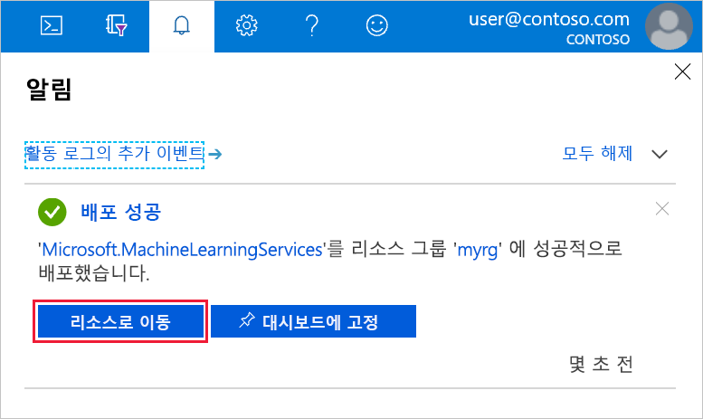

1. 사용하는 Azure 구독에 대한 자격 증명을 사용하여 [Azure Portal](https://portal.azure.com/)에 로그인합니다. 

   

1. 포털의 왼쪽 위 모서리에서 **리소스 만들기**를 선택합니다.

   

1. 검색 표시줄에서 **Machine Learning**을 입력합니다. **Machine Learning 서비스 작업 영역** 검색 결과를 선택합니다.

   

1. **ML 서비스 작업 영역** 창에서 아래로 스크롤하고, **만들기**를 선택하여 시작합니다.

   

1. **ML 서비스 작업 영역** 창에서 작업 영역을 구성합니다.

   필드|설명
   ---|---
   작업 영역 이름 |작업 영역을 식별하는 고유한 이름을 입력합니다. 이 예제에서는 **docs-ws**를 사용합니다. 이름은 리소스 그룹 전체에서 고유해야 합니다. 다른 사용자가 만든 작업 영역과 구별되고 기억하기 쉬운 이름을 사용하세요.  
   구독 |사용할 Azure 구독을 선택합니다.
   리소스 그룹 | 구독에서 기존 리소스 그룹을 사용하거나 이름을 입력하여 새 리소스 그룹을 만듭니다. 리소스 그룹은 Azure 솔루션에 관련된 리소스를 보유하는 컨테이너입니다. 이 예에서는 **docs-aml**을 사용합니다. 
   Location | 사용자 및 데이터 리소스와 가장 가까운 위치를 선택합니다. 작업 영역이 만들어지는 위치입니다.

   

1. 만들기 프로세스를 시작하려면 **만들기**를 선택합니다. 작업 영역을 만드는 데 몇 분 정도 걸릴 수 있습니다.

1. 배포 상태를 확인하려면 도구 모음에서 알림 아이콘(**종모양**)을 선택합니다.

1. 프로세스가 완료되면 배포 성공 메시지가 표시됩니다. 알림 섹션에도 표시됩니다. 새 작업 영역을 보려면 **리소스로 이동**을 선택합니다.

   
