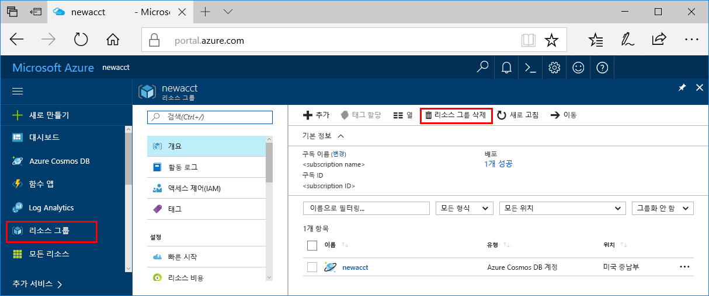

이 앱을 계속 사용하지 않으려면 다음 단계에 따라 이 빠른 시작에서 만든 리소스를 모두 삭제하세요. 요금은 발생되지 않습니다.

>[!NOTE]
>이 리소스는 지금 다른 Azure Machine Learning 서비스 자습서를 수행할 때 유용합니다.

1. Azure Portal의 맨 왼쪽에서 **리소스 그룹**을 선택합니다.  
 
   

2. 리소스 그룹 목록에서 만든 리소스 그룹을 선택하고 **리소스 그룹 삭제**를 클릭합니다.

3. 삭제할 리소스 그룹 이름을 입력한 후 **삭제**를 클릭합니다.

