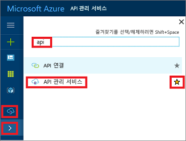

## API Management 인스턴스로 이동

1. [Azure Portal](https://portal.azure.com)에 로그인합니다. 

2. **모든 서비스**를 선택합니다.  

3. 검색 상자에 **api**를 입력합니다.

4. 검색 결과에서 **API Management 서비스**를 선택합니다.

    

5. API Management 서비스 인스턴스를 선택합니다.

> [!TIP]
> Azure Portal에서 API Management를 즐겨찾기에 추가하려면 별표를 선택합니다.
>
> API Management 아이콘()이 이제 포털의 왼쪽 메뉴에 나타납니다.
 