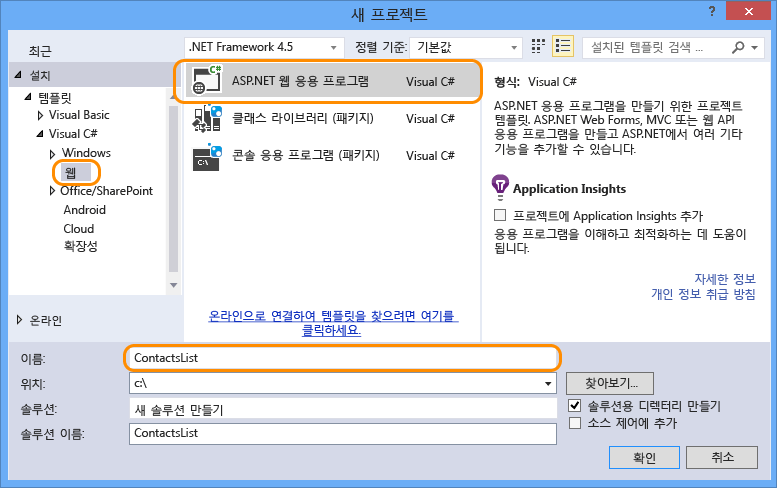
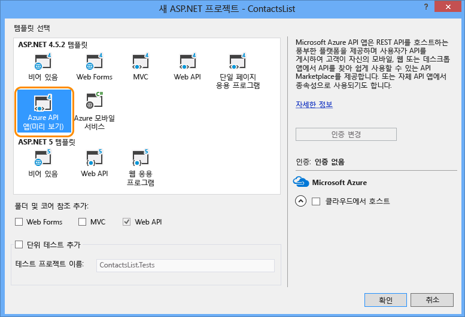

1. Visual Studio 2013을 엽니다.

2. **파일 > 새 프로젝트**를 선택합니다.

3. **ASP.NET 웹 응용 프로그램** 템플릿을 선택합니다.

4. **프로젝트에 Application Insights 추가** 확인란의 선택이 취소되었는지 확인하십시오.

4. 프로젝트의 이름을 입력합니다.

	

5. **확인**을 클릭합니다.

6. **새 ASP.NET 프로젝트** 대화 상자에서 **Azure API 앱** 프로젝트 템플릿을 선택합니다.

	

7. **확인**을 클릭하여 프로젝트를 생성합니다.

Visual Studio에서 API 앱으로 배포하기 위해 구성된 Web API 프로젝트를 만듭니다.

<!---HONumber=July15_HO3-->