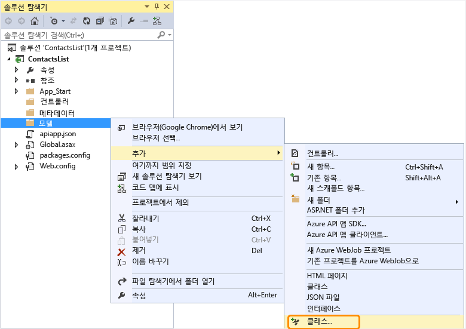
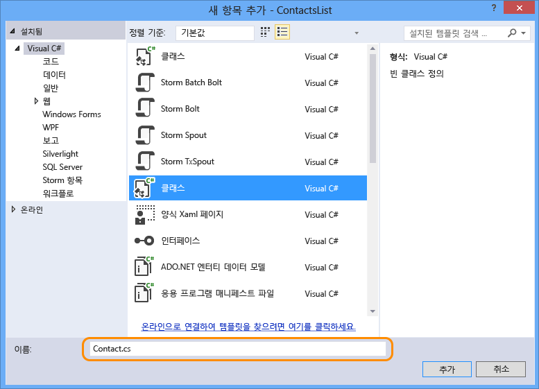
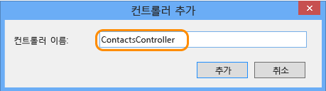

## Web API 코드 추가

다음 단계에서는 하드 코드된 연락처 목록을 반환하는 단순한 HTTP Get 메서드의 코드를 추가합니다.

1. 솔루션 탐색기에서 **Models** 폴더를 마우스 오른쪽 단추로 클릭하고 **추가 > 클래스**를 선택합니다. 

	

2. 새 파일의 이름을 *Contact.cs*로 지정합니다.

	

3. **추가**를 클릭합니다.

4. *Contact.cs* 파일이 생성되면 파일의 전체 내용을 다음 코드로 바꿉니다.

		namespace ContactsList.Models
		{
			public class Contact
			{
				public int Id { get; set; }
				public string Name { get; set; }
				public string EmailAddress { get; set; }
			}
		}

5. **Controllers** 폴더를 마우스 오른쪽 단추로 클릭하고 **추가 > 컨트롤러**를 선택합니다.

	

6. **스캐폴드 추가** 대화 상자에서 **Web API 2 컨트롤러 - 비어 있음** 옵션을 선택하고 **추가**를 클릭합니다.

	

7. 컨트롤러 이름을 **ContactsController**로 지정하고 **추가**를 클릭합니다.

	

8. ContactsController.cs 파일이 생성되면 파일의 전체 내용을 다음 코드로 바꿉니다.

		using ContactsList.Models;
		using System;
		using System.Collections.Generic;
		using System.Linq;
		using System.Net;
		using System.Net.Http;
		using System.Threading.Tasks;
		using System.Web.Http;
		
		namespace ContactsList.Controllers
		{
		    public class ContactsController : ApiController
		    {
		        [HttpGet]
		        public IEnumerable<Contact> Get()
		        {
		            return new Contact[]{
						new Contact { Id = 1, EmailAddress = "barney@contoso.com", Name = "Barney Poland"},
						new Contact { Id = 2, EmailAddress = "lacy@contoso.com", Name = "Lacy Barrera"},
	                	new Contact { Id = 3, EmailAddress = "lora@microsoft.com", Name = "Lora Riggs"}
		            };
		        }
		    }
		}

## Swagger UI 사용

기본적으로 API 앱 프로젝트는 자동 [Swagger](http://swagger.io/ "공식 Swagger 정보") 메타데이터 생성을 통해 사용할 수 있으며, **API 앱 SDK 추가** 메뉴 항목을 사용하여 Web API 프로젝트를 변환한 경우 API 테스트 페이지도 기본적으로 사용할 수 있습니다.

그러나 Azure API 앱의 새 프로젝트 템플릿은 API 테스트 페이지를 사용하지 않도록 설정합니다. API 앱 프로젝트 템플릿을 사용하여 API 앱 프로젝트를 만들 때 테스트 페이지를 사용하도록 설정하려면 다음 단계를 수행합니다.

**참고:** API 앱을 *공용(익명)*으로 Swagger UI를 사용 가능하도록 배포하는 경우 누구든지 API를 검색하고 호출하는 Swagger UI를 사용할 수 있습니다.

1. *App\_Start/SwaggerConfig.cs* 파일을 열고 **EnableSwaggerUI**를 검색합니다.

	

2. 다음 코드 줄의 주석 처리를 제거합니다.

	        })
	    .EnableSwaggerUi(c =>
	        {

3. 완료되면 파일이 다음과 같이 표시됩니다.

	

## Web API 테스트

API 테스트 페이지를 보려면 다음 단계를 수행합니다.

1. 로컬에서 앱을 실행합니다(Ctrl+F5).

	브라우저가 열리고 기준 URL이 유효한 웹 페이지가 아니거나 이 프로젝트의 API 메서드 URL이 아니기 때문에 HTTP 403 오류가 표시됩니다.
 
3.  기준 URL 끝에 `/swagger`를 추가하여 Swagger 페이지로 이동합니다.

	

2. **연락처 > 가져오기 > 사용해 보기**를 클릭하면 API가 작동하고 예상 결과를 반환하는 것을 볼 수 있습니다.

	

3. Visual Studio에서 **디버그 > 디버깅 중지**를 클릭합니다.

<!---HONumber=Oct15_HO3-->