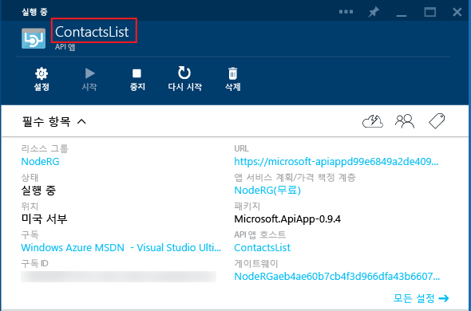
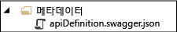

## API 앱 메타데이터

이 섹션에서는 사용자 지정할 수 있는 API 앱 메타데이터에 대한 추가 정보를 제공합니다.

*apiapp.json* 파일의 속성과 *Metadata* 폴더의 파일은 대부분 API 앱 패키지가 Azure 마켓플레이스에 표시되는 방식에 영향을 줍니다. 다음 섹션에서는 Azure 구독의 API 앱에 코드를 배포할 때 API 앱에 영향을 주는 속성 및 파일에 대해 설명합니다.

### API 앱 ID 

`id` 속성은 API 앱의 이름을 결정합니다. 예:

		"id": "ContactsList",

### 네임스페이스

`namespace` 속성을 Azure Active Directory 테넌트의 도메인으로 설정합니다. 도메인을 찾으려면 브라우저에서 [Azure 클래식 포털](https://manage.windowsazure.com/)을 열고 **Active Directory**를 찾은 후 **도메인** 탭을 선택합니다. 예:

		"namespace": "contoso.onmicrosoft.com",

### 동적 Swagger API 정의

동적 [Swagger](http://swagger.io/) API 정의에 대한 URL 끝점을 제공하려면 GET 요청 시 Swagger 2.0 API 정의를 반환하는 API 앱에 의해 노출된 API의 상대 URL을 `endpoints.apiDefinition` 속성에 저장합니다. 예:

		"endpoints": {
		    "apiDefinition": "/swagger/docs/v1"
		}

> **참고:** Swashbuckle을 사용하여 Swagger API 정의를 생성하면 Web API 컨트롤러에서 HTTP 메서드가 오버로드되어 작업 ID가 중복됩니다. 자세한 내용은 [Swashbuckle에서 생성한 작업 식별자 사용자 지정](app-service-api-dotnet-swashbuckle-customize.md)을 참조하세요.
  
### 정적 Swagger API 정의

정적 [Swagger](http://swagger.io/) 2.0 API 정의 파일을 제공하려면 *Metadata* 폴더에 파일을 저장하고 파일 이름을 *apiDefinition.swagger.json*으로 지정합니다.

*apiapp.json* 파일에서 `endpoints.apiDefinition`을 그대로 두거나 해당 값을 null로 설정합니다. `endpoints.apiDefinition` URL과 *apiDefinition.swagger.json* 파일을 둘 다 포함한 경우에는 URL이 우선적으로 적용되며 파일은 무시됩니다.
 

<!---HONumber=58-->