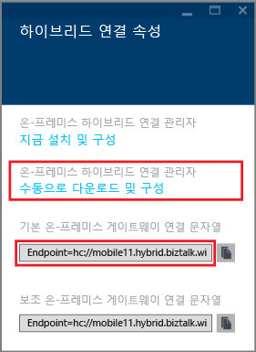
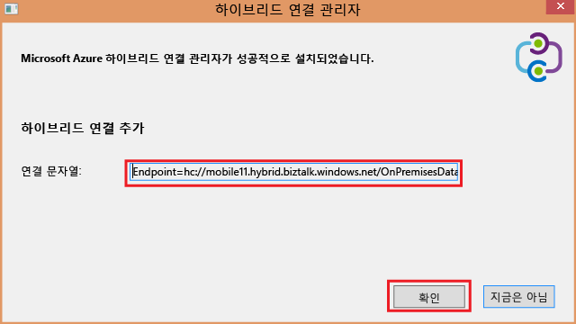
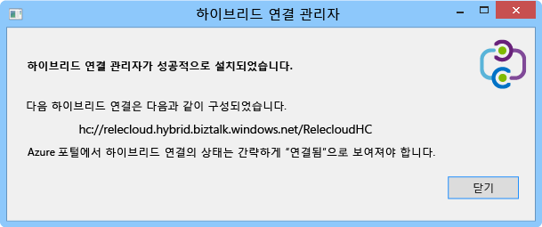
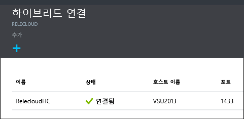

1. **하이브리드 연결** 블레이드에서 방금 만든 하이브리드 연결을 클릭한 다음 **수신기 설치**를 클릭합니다.
   
    
2. **하이브리드 연결 속성** 블레이드가 열립니다. **온-프레미스 하이브리드 연결 관리자**에서 **수동으로 다운로드 및 구성**을 선택하여 다운로드된 HybridConnectionManager.msi 패키지를 저장하고 게이트웨이 연결 문자열을 복사합니다.
   
    
3. 관리자 명령 프롬프트에서 다음 명령을 입력하여 설치 관리자를 시작합니다.
   
        start HybridConnectionManager.msi
4. 설치 관리자가 실행된 다음 **나중에**를 클릭한 후 %ProgramFiles%\\Microsoft\\HybridConnectionManager 폴더를 탐색하고, HCMConfigWizard.exe를 실행하여 **사용자 계정 컨트롤** 대화 상자에서 **예**를 클릭합니다.
5. 앞서 복사한 하이브리드 연결 문자열을 붙여넣고 **확인**을 클릭합니다.
   
    
6. 설치가 완료되면 **닫기**를 클릭합니다.
   
    
   
    **하이브리드 연결** 블레이드에서 이제 **상태** 열은 **연결됨**을 표시합니다.
   
    

<!---HONumber=AcomDC_1125_2015-->