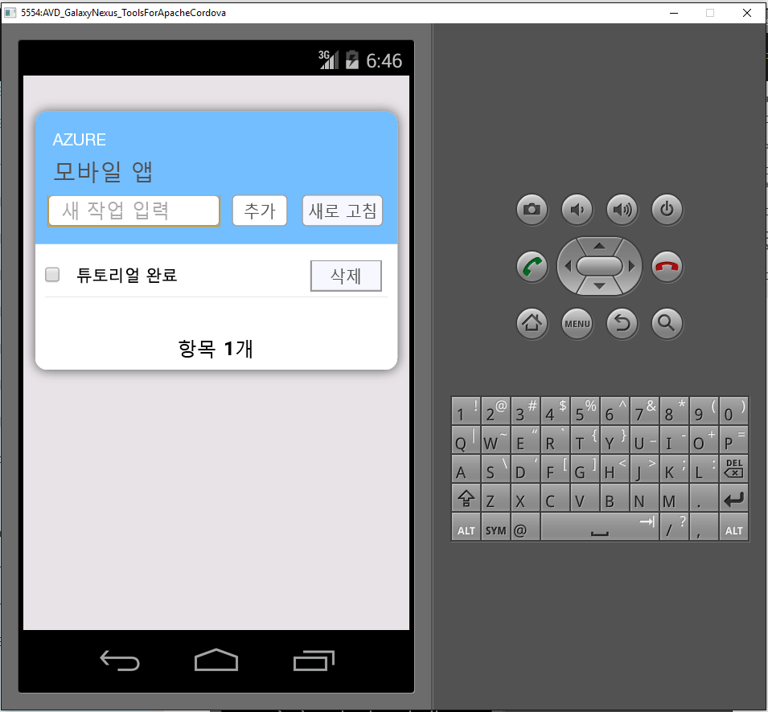

1. [Azure 포털]을 방문합니다. **모두 찾아보기** > **모바일 앱** > 방금 만든 백 엔드를 클릭합니다. 모바일 앱 설정에서 **빠른 시작** > **Cordova**를 클릭합니다. **클라이언트 응용 프로그램 구성**에서 **새 앱 만들기**를 선택한 다음 **다운로드**를 클릭합니다. 그러면 사전 구성된 앱을 백 엔드에 연결하기 위한 전체 Cordova 프로젝트가 다운로드됩니다.

2. 다운로드하는 ZIP 파일을 하드 드라이브의 디렉터리에서 압축을 풉니다.

3. **Visual Studio**를 사용하여 프로젝트를 엽니다. **열기** > **프로젝트/솔루션…**을 클릭합니다.

4. _sitename_.sln 파일을 찾고 **열기**를 클릭합니다.

5. 기본 에뮬레이터는 **Ripple-Nexus(Galaxy)**입니다. 에뮬레이터 옆의 드롭다운 화살표를 클릭하고 **Google Android 에뮬레이터**를 선택합니다.

6. **Google Android 에뮬레이터**를 선택합니다. 프로젝트가 빌드된 다음 실행됩니다. 네트워크에 액세스를 요청하는 Google Android 에뮬레이터에서 네트워크 보안 경고가 표시될 수 있습니다. 마침내 Google Android 에뮬레이터가 표시되고 응용 프로그램이 실행됩니다.

7. 앱에서 _자습서 완료_ 등의 의미 있는 텍스트를 입력한 후 '추가' 단추를 클릭합니다. 그러면 이전에 배포한 Azure 백 엔드에 POST 요청을 보냅니다. 요청의 백 엔드 데이터가 TodoItem SQL 테이블로 삽입되고 새로 저장된 항목에 대한 정보를 모바일 앱으로 다시 반환합니다. 모바일 앱이 이 데이터를 목록에 표시합니다.

    

[Azure 포털]: https://portal.azure.com/

<!---HONumber=AcomDC_0211_2016-->