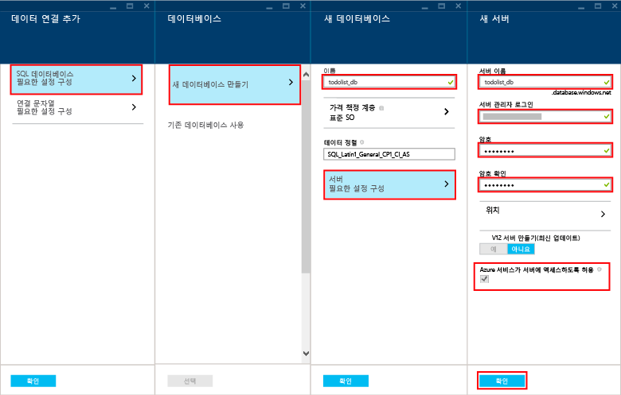

다음 단계에 따라 새 모바일 앱 백 엔드를 만드세요.

1. [Azure 포털]에 로그인합니다.
2. 창의 왼쪽 위에서 **+새로 만들기** 단추 > **웹 + 모바일** > **모바일 앱**을 클릭한 다음 모바일 앱 백 엔드에 대한 이름을 입력합니다.
3. **리소스 그룹** 상자에 앱과 동일한 이름을 입력합니다.
4. 기본 앱 서비스 계획이 선택됩니다. 앱 서비스 계획을 변경하려는 경우 앱 서비스 계획 > **+ 새로 만들기**를 클릭하여 변경합니다. 새 앱 서비스 계획의 이름을 입력하고 적절한 위치를 선택합니다. 가격 책정 계층을 클릭하고 서비스에 대한 적절한 가격 책정 계층을 선택합니다. **무료** 및 **공유** 등의 더 많은 가격 책정 옵션을 보려면 **모두 보기**를 선택합니다. 가격 책정 계층을 선택한 다음 **선택** 단추를 클릭합니다. **앱 서비스 계획** 블레이드로 돌아가서 **확인**을 클릭합니다.
5. **만들기**를 클릭합니다. 그러면 나중에 서버 프로젝트를 배포할 모바일 앱 백 엔드가 만들어집니다. 모바일 앱 백 엔드를 프로비저닝하는 데 몇 분 정도 걸릴 수 있습니다. 모바일 앱 백 엔드가 프로비저닝되면 포털에서 모바일 앱 백 엔드에 대한 **설정** 블레이드가 열립니다. 다음 단계에서 새 SQL 데이터베이스를 만듭니다.
   
   > [!NOTE]
   > 이 자습서에는 새 SQL 데이터베이스 인스턴스와 서버를 만드는 과정이 포함되어 있으며, 이 새 데이터베이스는 다른 SQL 데이터베이스 인스턴스처럼 다시 사용하고 관리할 수 있습니다. 새 모바일 앱 백 엔드와 동일한 지역에 데이터베이스가 이미 있다면 대신 **기존 데이터베이스 사용**을 선택한 다음 해당 데이터베이스를 선택할 수 있습니다. 다른 지역에 있는 데이터베이스는 추가 대역폭 비용과 대기 시간이 높으므로 사용을 권장하지 않습니다.
   > 
   > 
6. 새 모바일 앱 백 엔드에서 **설정** > **모바일 앱** > **데이터** > **+추가**를 클릭합니다.
7. **데이터 연결 추가** 블레이드에서 **SQL 데이터베이스 - 필요한 설정 구성** > **새 데이터베이스를 만들기**를 클릭합니다. **이름** 필드에 새 데이터베이스 이름을 입력합니다.
8. **서버**를 클릭합니다. **새 서버** 블레이드에서 **서버 이름** 필드에 고유한 서버 이름을 입력하고 적절한 **서버 관리자 로그인** 및 **암호**를 입력합니다. **Azure 서비스가 서버에 액세스하도록 허용**이 선택되었는지 확인합니다. **확인**을 클릭합니다.
   
    
9. **새 데이터베이스** 블레이드에서 **확인**을 클릭합니다.
10. **데이터 연결 추가** 블레이드로 돌아가서 **연결 문자열**을 선택하고 데이터베이스를 만들 때 입력한 로그인 및 암호를 입력합니다. 기존 데이터베이스를 사용하는 경우 해당 데이터베이스에 대한 로그인 자격 증명을 입력합니다. 입력한 다음 **확인**을 클릭합니다.
11. **데이터 연결 추가** 블레이드로 다시 돌아가서 **확인**을 클릭하여 데이터베이스를 만듭니다.

데이터베이스를 만드는 데 몇 분 정도 걸릴 수 있습니다. **알림** 영역을 사용하여 배포의 진행률을 모니터링합니다. 데이터베이스가 성공적으로 배포될 때까지 진행하지 마세요.

이제 모바일 클라이언트 응용 프로그램에서 사용할 수 있는 Azure 모바일 앱 백 엔드를 프로비저닝했습니다. 다음으로, 간단한 “할 일 목록” 백 엔드에 대한 서버 프로젝트를 다운로드하고 Azure에 게시합니다.

<!-- URLs. -->
[Azure 포털]: https://portal.azure.com/

<!---HONumber=Oct15_HO3-->