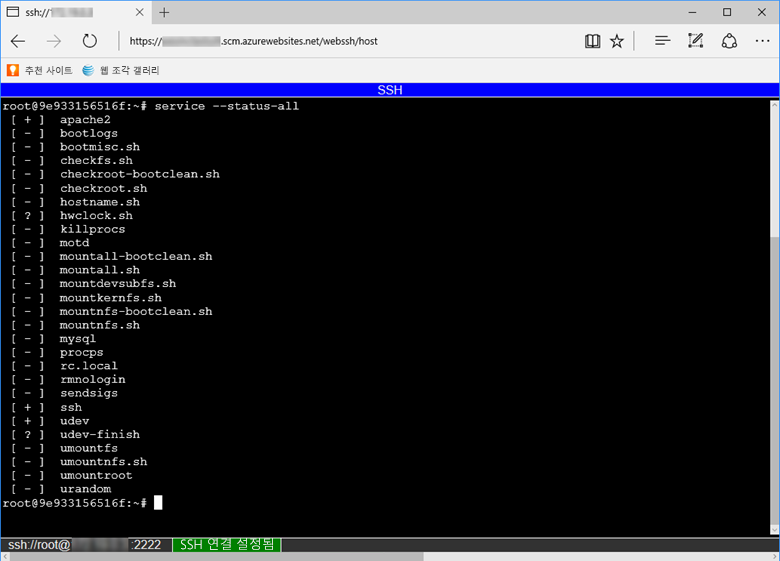

컨테이너와 직접 SSH 세션을 열려면 앱을 실행해야 합니다.

브라우저에 다음 URL을 붙여넣고 앱 이름으로 \<app-name>을 바꿉니다.

```
https://<app-name>.scm.azurewebsites.net/webssh/host
```

아직 인증을 받지 못한 경우 연결하기 위해서는 Azure 구독에서 인증을 받아야 합니다. 인증되면 컨테이너 내부에서 명령을 실행할 수 있는 브라우저 내부 셸을 확인합니다.


