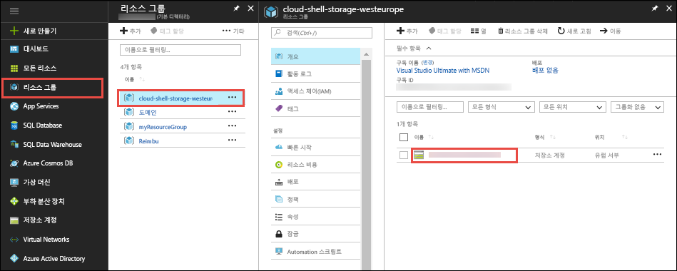
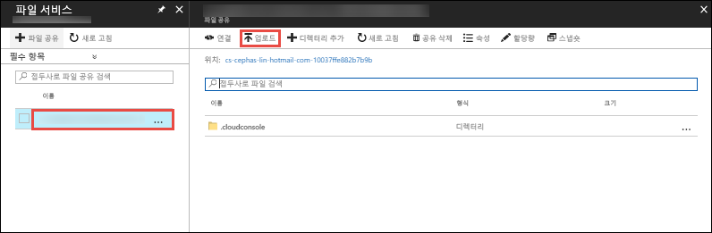

[Azure Portal](https://portal.azure.com)에서 **리소스 그룹** > **cloud-shell-storage-\<your_region>** > **\<storage_account_name>** 을 클릭합니다.



저장소 계정의 **개요** 페이지에서 **파일**을 선택합니다.

자동으로 생성된 파일 공유를 선택하고 **업로드**를 선택합니다. 이 파일 공유는 `clouddrive`으로 Cloud Shell에 마운트됩니다.



파일 선택기를 클릭하고 ZIP 파일을 선택한 다음 **업로드**를 클릭합니다. 

Cloud Shell에서 `ls`를 사용하여 업로드된 ZIP 파일을 기본 `clouddrive` 공유에서 볼 수 있는지 확인합니다.

```azurecli-interactive
ls clouddrive
```
