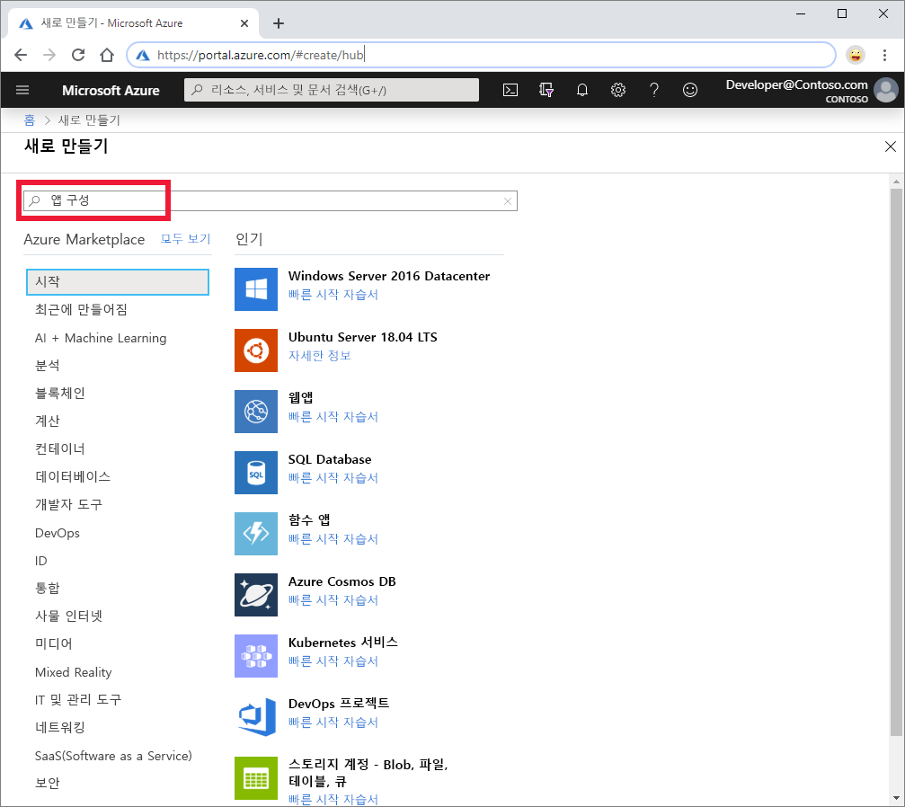
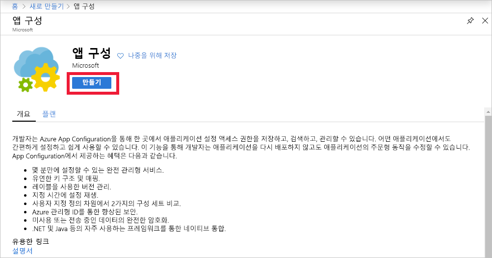

1. 새 App Configuration 저장소를 만들려면 [Azure Portal](https://portal.azure.com)에 로그인합니다. 홈 페이지의 왼쪽 위 모서리에서 **리소스 만들기**를 선택합니다. **Marketplace 검색** 상자에서 *App Configuration*을 입력하고 <kbd>Enter</kbd> 키를 선택합니다.

    

1. 검색 결과에서 **App Configuration**, **만들기**를 차례로 선택합니다.

    

1. **App Configuration 만들기** 창에서 다음 설정을 입력합니다.

    | 설정 | 제안 값 | Description |
    |---|---|---|
    | **구독** | 사용자의 구독 | App Configuration을 테스트하는 데 사용할 Azure 구독을 선택합니다. 계정에 구독이 하나만 있으면 해당 구독이 자동으로 선택되며 **구독** 목록은 표시되지 않습니다. |
    | **리소스 그룹** | *AppConfigTestResources* | App Configuration 저장소 리소스에 대한 리소스 그룹을 선택하거나 만듭니다. 이 그룹은 리소스 그룹을 삭제하여 여러 리소스를 동시에 삭제할 수 있도록 구성하는 데 유용합니다. 자세한 내용은 [리소스 그룹을 사용하여 Azure 리소스 관리](/azure/azure-resource-manager/resource-group-overview)를 참조하세요. |
    | **리소스 이름** | 전역적으로 고유한 이름 | App Configuration 저장소 리소스에 사용할 고유한 리소스 이름을 입력합니다. 이름은 5~50자의 문자열로, 숫자, 영문자 및 `-` 문자만 포함할 수 있습니다. 이름은 `-` 문자로 시작하거나 끝날 수 없습니다. |
    | **위치** | *미국 중부* | **위치**를 사용하여 앱 구성 저장소를 호스트할 지리적 위치를 지정합니다. 최상의 성능을 얻으려면 애플리케이션의 다른 구성 요소와 동일한 지역에 리소스를 만듭니다. |
    | **가격 책정 계층** | *Free* | 원하는 가격 책정 계층을 선택합니다. 자세한 내용은 [App Configuration 가격 페이지](https://azure.microsoft.com/pricing/details/app-configuration)를 참조하세요. |

1. **검토 + 만들기**를 선택하여 설정의 유효성을 검사합니다.

1. **만들기**를 선택합니다. 배포에 몇 분 정도 걸릴 수 있습니다.

1. 배포가 완료되면 App Configuration 리소스로 이동합니다. **설정** > **선택키**를 선택합니다. 기본 읽기 전용 키 연결 문자열을 기록해 둡니다. 이 연결 문자열은 나중에 사용자가 만든 App Configuration 저장소와 통신하도록 애플리케이션을 구성하는 데 사용합니다.
