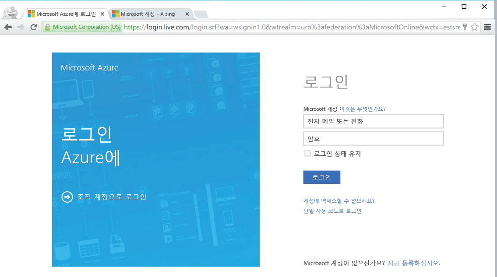

<!--
includes/azure-include-getting-started-v12portal-gettings-an-account.md

Latest Freshness check:  2016-04-11 , carlrab.

As of circa 2016-04-11, the following topics might include this include:
articles/sql-database/sql-database-get-started-tutorial.md

-->
## 구독으로 Azure Portal에 연결

Azure Portal에 연결하려면 구독이 있어야 합니다.

### 새 계정 가져오기

기존 Azure 계정이 없는 경우 계정을 가져오려면 다음 옵션 중 하나를 선택합니다.

- [무료 계정](https://azure.microsoft.com/get-started/) 가져오기
- [MSDN 구독](https://azure.microsoft.com/pricing/member-offers/msdn-benefits/) 사용

### 기존 계정을 사용하여 로그인

[기존 구독](https://account.windowsazure.com/Home/Index)을 사용하고 이러한 다음 단계를 수행하여 Azure Portal에 연결합니다.

1. 선택한 브라우저를 열고 [Azure 포털](https://portal.azure.com/)에 연결합니다.

1. [Azure 포털](https://portal.azure.com/)에 로그인합니다.

1. **로그인** 페이지에서 구독에 대한 자격 증명을 제공합니다.

   

<!---HONumber=AcomDC_0907_2016-->