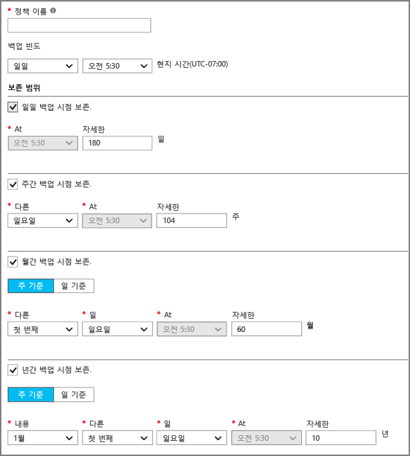
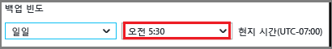
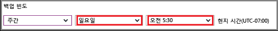

## 백업 정책 정의
백업 정책은 데이터 스냅샷이 생성된 시간 및 스냅샷을 보관하는 기간에 대한 행렬을 정의합니다. VM 백업을 위한 정책을 정의할 때 백업 작업을 *하루에 한 번*트리거할 수 있습니다. 새 정책을 만들면 자격 증명 모음에 적용됩니다. 백업 정책 인터페이스는 다음과 같습니다.

정책을 만들려면:

1. **정책 이름**에 이름을 입력합니다.
2. 데이터의 스냅샷을 매일 또는 매주 간격으로 생성할 수 있습니다. **Backup 주기** 드롭다운 메뉴를 사용하여 데이터 스냅숏을 매일 또는 매주 생성할지를 선택합니다.

   * 매일 간격을 선택한 경우 강조 표시된 컨트롤을 사용하여 스냅샷을 생성할 하루 중 시간을 선택합니다. 시간을 변경하려면 시간을 선택 취소하고 새 시간을 선택합니다.

       
   * 매주 간격을 선택한 경우 강조 표시된 컨트롤을 사용하여 스냅샷을 생성할 요일 및 시간을 선택합니다. 일 메뉴에서 하루 또는 여러 날짜를 선택합니다. 시간 메뉴에서 시간을 하나 선택합니다. 시간을 변경하려면 선택한 시간을 선택 취소하고 새 시간을 선택합니다.

     
3. 기본적으로 모든 **보존 범위** 옵션이 선택되어 있습니다. 사용하지 않으려면 보존 범위 제한을 선택 취소합니다. 그런 다음 사용할 간격을 지정합니다.

    매월 및 매년 보존 범위를 통해 매주 또는 매일 증분으로 스냅샷을 지정할 수 있습니다.

   > [!NOTE]
   > 
   > - VM을 보호하는 경우, 백업 작업이 하루에 한 번 실행됩니다. 백업이 실행되는 시간은 보존 범위마다 같습니다.
   > - 복구 지점은 백업 작업이 예약되었는지에 관계 없이 백업 스냅샷이 완료된 날짜 및 시간에 생성됩니다.
   >   - 예: 백업 빈도가 오후 11:30으로 예약되어 있고 어떤 문제로 인해 스냅샷이 오전 12:01에 완료되면 복구 지점은 다음 날 오전 12:01으로 생성됩니다.
   > - 월간 백업의 경우 백업이 매월 1일에 실행되도록 설정되어 있고 어떤 문제로 인해 다음 날 스냅샷이 완료되면 월간 백업을 위해 생성된 복구 지점은 다음 날(즉, 해당 월의 2일)로 태그가 지정됩니다.

4. 정책에 대한 모든 옵션을 설정한 후 블레이드 맨 위에서 **저장**을 클릭합니다.

    자격 증명 모음에 새 정책이 즉시 적용됩니다.
