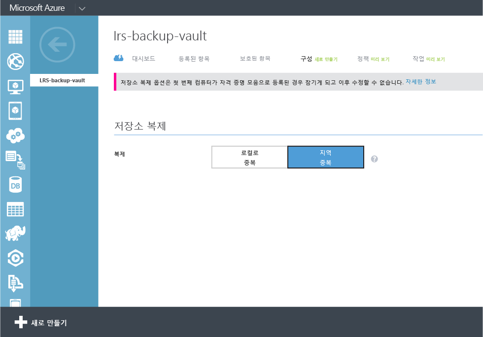
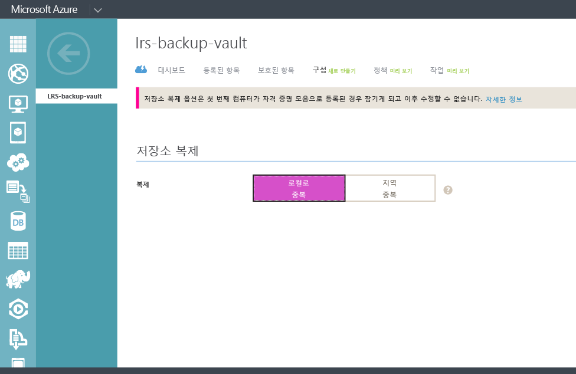

## 백업 자격 증명 모음 만들기
Windows Server 또는 Data Protection Manager(DPM)의 파일과 데이터를 Azure에 백업하거나 IaaS VM을 Azure에 백업하려면 데이터를 저장하려는 지역에 백업 자격 증명 모음을 만들어야 합니다.

다음 단계에서는 백업을 저장하는 데 사용된 자격 증명 모음을 만드는 과정을 안내합니다.

1. [관리 포털](https://manage.windowsazure.com/)에 로그인합니다.
2. **새로 만들기** > **데이터 서비스** > **복구 서비스** > **백업 자격 증명 모음**을 클릭하고 **빨리 만들기**를 선택합니다.

    

3. **이름** 매개 변수에 백업 자격 증명 모음을 식별할 이름을 입력합니다. 이는 각 구독에 대해 고유해야 합니다.

4. **지역** 매개 변수에서 백업 자격 증명 모음의 지역을 선택합니다. 선택에 따라 백업 데이터가 전송되는 지역이 결정됩니다. 사용자의 위치에 가까운 지역을 선택하면 Azure에 백업할 때 네트워크 대기 시간을 줄일 수 있습니다.

5. **자격 증명 모음 만들기**를 클릭하여 워크플로를 완료합니다. 백업 저장소름 만드는 데 시간이 걸릴 수 있습니다. 상태를 확인하려면 포털 화면의 아래쪽에서 알림을 모니터링할 수 있습니다.

    

6. 백업 자격 증명 모음을 만든 후 자격 증명 모음이 성공적으로 생성되었다는 메시지가 나타납니다. 자격 증명 모음이 복구 서비스에 대한 리소스에 **활성**으로 표시됩니다.

    

### Azure 백업 - 저장소 중복 옵션

>[AZURE.IMPORTANT] 저장소 중복 옵션을 지정하기에 가장 좋은 시기는 자격 증명 모음을 만든 후 자격 증명 모음에 컴퓨터를 등록하기 바로 직전입니다. 항목이 자격 증명 모음에 등록되고 나면 저장소 중복 옵션 잠기고 수정할 수 없습니다.

비즈니스 요구에 따라 Azure 백업 백 엔드 저장소의 저장소 중복을 결정해야 합니다. 기본 백업 저장소 끝점으로 Azure를 사용 중인 경우(예: Windows Server에서 Azure로 백업하는 경우) 지역 중복 저장소 옵션(기본값)을 선택하는 것이 좋습니다. 이는 백업 자격 증명 모음의 **구성** 옵션 아래에서 볼 수 있습니다.

#### 지역 중복 저장소(GRS)
GRS는 데이터의 복사본을 6개 유지 관리합니다. GRS를 사용하면 데이터가 기본 영역에서 3번 복제되고 기본 지역으로부터 수백 킬로미터 떨어진 보조 지역에도 3번 복제되며, 최고 수준의 영속성을 제공합니다. Azure 백업은 주 지역에서 오류가 발생할 경우 GRS에 데이터를 저장하여 두 지역에서 데이터가 지속되도록 합니다.

#### 로컬 중복 저장소(LRS)
LRS(로컬 중복 저장소)는 데이터의 복제본을 3개 유지 관리합니다. LRS는 단일 지역의 단일 시설 내에서 3번 복제됩니다. LRS는 전체 Azure 시설의 오류가 아닌 일반적인 하드웨어 오류로부터 데이터를 보호합니다.

3차 백업 저장소 끝점으로 Azure를 사용 중인 경우(예: 온-프레미스에 로컬 백업 복사본을 보관하기 위해 SCDPM을 사용하는 경우 및 장기 보존 요구를 해결하기 위해 Azure를 사용하는 경우), 백업 자격 증명 모음의 **구성** 옵션에서 로컬 중복 저장소를 선택하는 것이 좋습니다. 이렇게 하면 Azure에 데이터를 저장하는 비용을 크게 줄일 수 있지만 3차 복사본에 허용될 수 있는 데이터 영속성 수준이 낮아집니다.

<!---HONumber=AcomDC_0316_2016-->