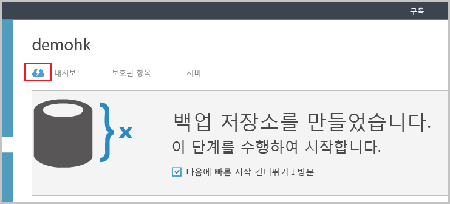
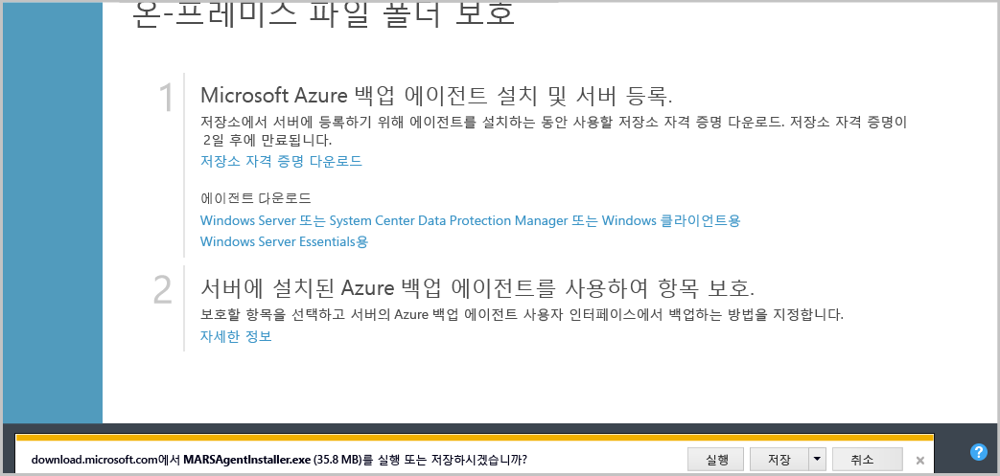
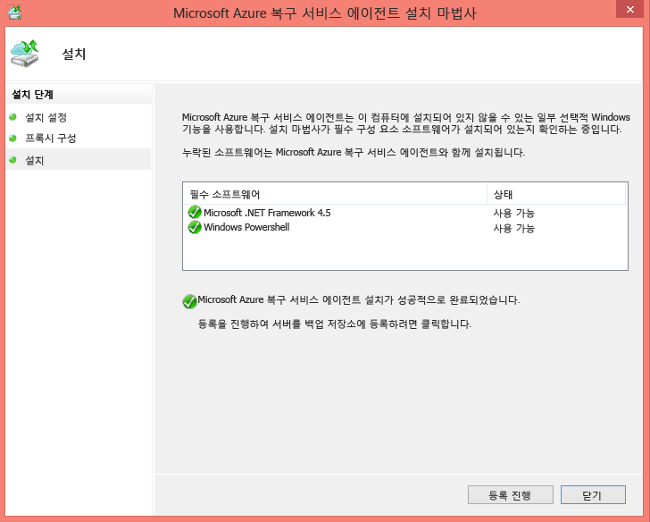
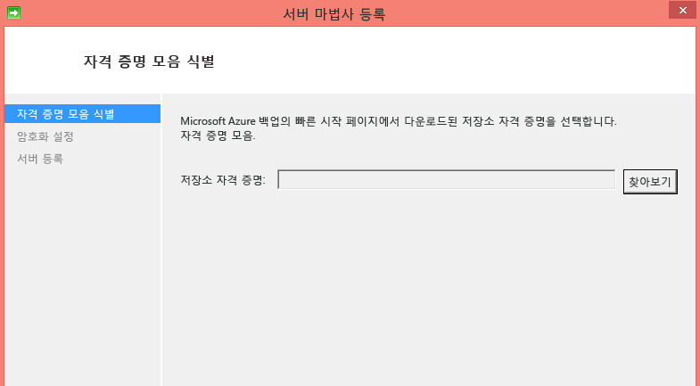
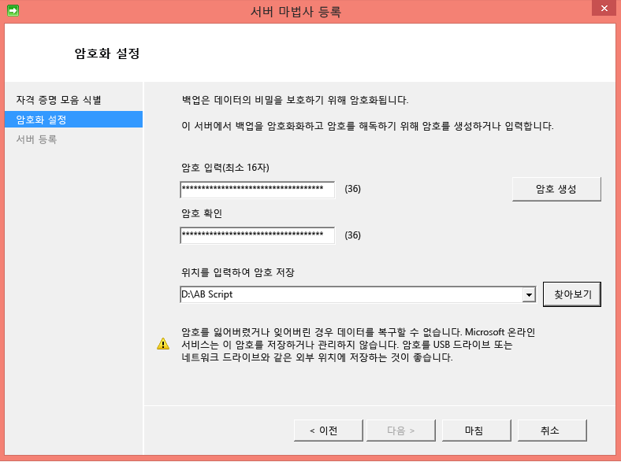
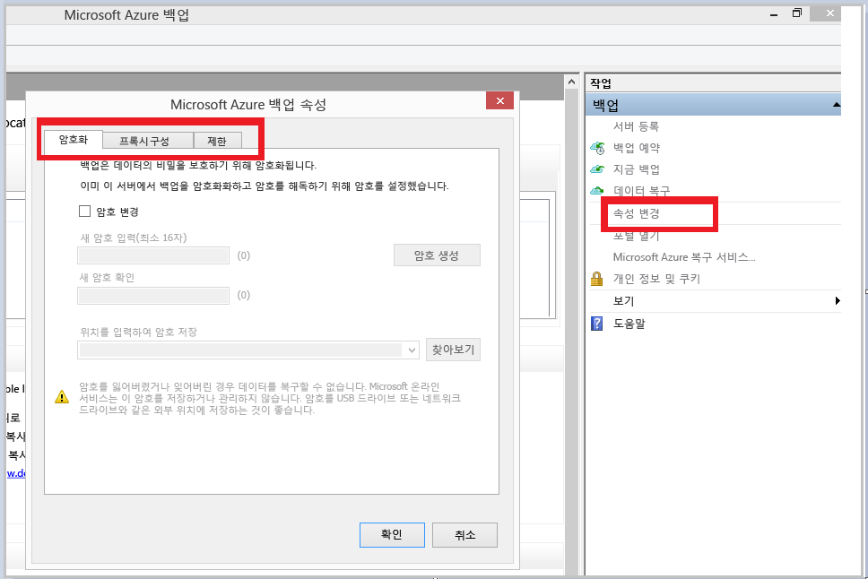
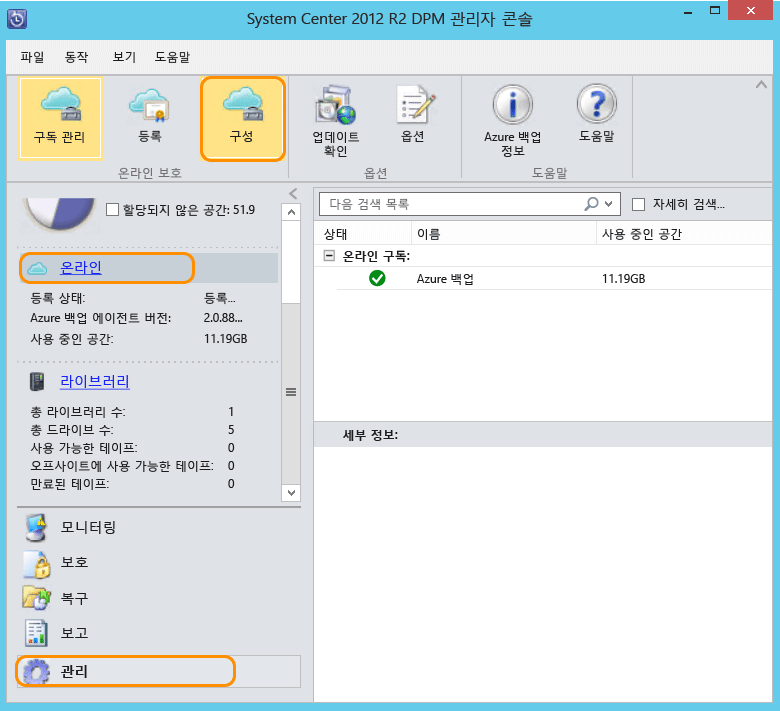

## Azure 백업 에이전트 다운로드, 설치 및 등록
Azure 백업 자격 증명 모음을 만든 후에는 각 Windows 컴퓨터(Windows Server, Windows 클라이언트, 시스템 센터, Data Protection Manager 서버 또는 Azure 백업 서버 컴퓨터)에 Azure에 데이터 및 응용 프로그램을 백업할 수 있게 해주는 에이전트가 설치되어야 합니다.

1. [관리 포털](https://manage.windowsazure.com/)
2. **복구 서비스**를 클릭한 후 서버에 등록하려는 백업 저장소를 선택합니다. 그러면 이 백업 자격 증명 모음의 빠른 시작 페이지가 나타납니다.
   
    
3. 빠른 시작 페이지에서 **에이전트 다운로드**에서 **Windows Server 또는 System Center Data Protection Manager 또는 Windows 클라이언트용** 옵션을 클릭합니다. **저장** 을 클릭하여 로컬 컴퓨터에 복사합니다.
   
    
4. 에이전트가 설치되면 MARSAgentInstaller.exe를 두 번 클릭하여 Azure 백업 에이전트 설치를 시작합니다. 설치 폴더 및 에이전트에 필요한 스크래치 폴더를 선택합니다. 지정된 캐시 위치에 백업 데이터의 5% 이상이 되는 여유 공간이 있어야 합니다.
5. 프록시 서버를 사용하여 인터넷에 연결하는 경우 **프록시 구성** 화면에서 프록시 서버 세부 정보를 입력합니다. 인증된 프록시를 사용하는 경우 이 화면에 사용자 이름 및 암호 세부 정보를 입력합니다.
6. Azure 백업 에이전트가 .NET Framework 4.5 및 Windows PowerShell(아직 설치되지 않은 경우)을 설치하여 설치를 완료합니다.
7. 에이전트가 설치되면 **등록 계속** 단추를 클릭하여 워크플로를 계속합니다.
   
   
8. 자격 증명 모음 자격 증명 화면에서 이전에 다운로드한 자격 증명 모음 자격 증명 파일로 이동하여 선택합니다.
   
    
   
    자격 증명 모음 자격 증명 파일은 48시간 동안만 유효합니다(그 이후에는 포털에서 다운로드). 이 화면에서 오류가 발생할 경우(예: "제공한 자격 증명 모음 자격 증명 파일이 만료되었습니다") Azure 포털에 로그인하고 자격 증명 모음 자격 증명 파일을 다시 다운로드합니다.
   
    설치 응용 프로그램에서 액세스할 수 있는 위치에 있는 자격 증명 모음 자격 증명 파일인지 확인합니다. 액세스 관련 오류가 발생할 경우 이 컴퓨터의 임시 위치에 자격 증명 모음 자격 증명 파일을 복사하고 작업을 다시 시도합니다.
   
    잘못된 자격 증명 모음 자격 증명 오류(예: "잘못된 자격 증명 모음 자격 증명을 제공했습니다.")가 발생한 경우 파일이 손상되었거나 복구 서비스와 연결된 최신 자격 증명이 없습니다. 포털에서 새 자격 증명 모음 자격 증명 파일을 다운로드한 후에 작업을 다시 시도합니다. 이 오류는 일반적으로 사용자가 Azure 포털에서 **자격 증명 모음 자격 증명 다운로드** 옵션을 빠르게 연속적으로 클릭할 경우에 표시됩니다. 이 경우 두 번째 자격 증명 모음 자격 증명 파일만 유효합니다.
9. **암호화 설정** 화면에서 전달 구를 생성하거나 제공합니다(최소 16자). 암호를 안전한 위치에 저장해야 합니다.
   
    
   
   > [!WARNING]
   > 암호를 분실하거나 잊어버린 경우 Microsoft는 백업 데이터 복구를 도와드릴 수 없습니다. 암호화 암호는 최종 사용자가 소유하며 Microsoft는 최종 사용자가 사용하는 암호를 전혀 볼 수 없습니다. 이 파일은 복구 작업에 필요하므로 안전한 위치에 저장하십시오.
   > 
   > 
10. **마침** 단추를 클릭하면 컴퓨터가 자격 증명 모음에 성공적으로 등록되고 이제 Microsoft Azure에 백업을 시작할 준비가 완료된 것입니다.
11. Microsoft Azure 백업 독립 실행형을 사용하는 경우 Azure 백업 mmc 스냅인에서 **속성 변경** 옵션을 클릭하여 등록 워크플로 중에 지정한 설정을 수정할 수 있습니다.
    
    
    
    또는 Data Protection Manager를 사용하는 경우 **관리** 탭에서 **구성**옵션을 클릭하고 **온라인**을 선택하여 등록 워크플로 중에 지정된 설정을 수정할 수 있습니다.
    
    

