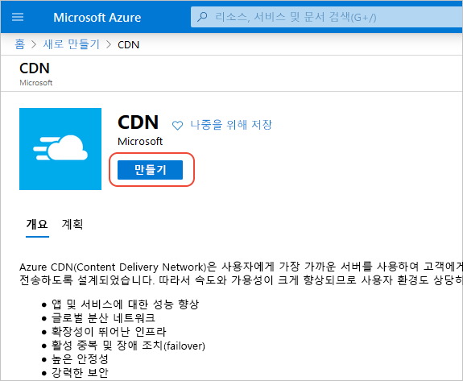
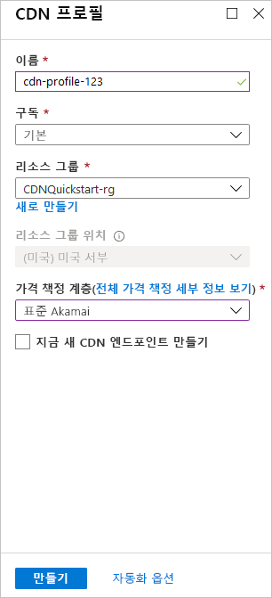

## 새 CDN 프로필 만들기

CDN 프로필은 CDN 엔드포인트에 대한 컨테이너이며 가격 책정 계층을 지정합니다.

1. Azure Portal의 왼쪽 위에서 **리소스 만들기**를 선택합니다. 
    
    **새로 만들기** 창이 나타납니다.
   
2. **웹 + 모바일**을 선택한 후 **CDN**을 선택합니다.
   
    

    **CDN 프로필** 창이 나타납니다.

3. CDN 프로필 설정의 경우 다음 표에 지정된 값을 사용합니다.
   
    | 설정  | 값 |
    | -------- | ----- |
    | **Name** | 프로필 이름에 *my-cdn-profile-123*을 입력합니다. 이 이름은 전역적으로 고유해야 합니다. 이미 사용 중인 경우 다른 이름을 입력할 수 있습니다. |
    | **구독** | 드롭다운 목록에서 Azure 구독을 선택합니다. |
    | **리소스 그룹** | **새로 만들기**를 선택하고, 리소스 그룹 이름에 *my-resource-group-123*을 입력합니다. 이 이름은 전역적으로 고유해야 합니다. 이미 사용 중인 경우 다른 이름을 입력하거나 **기존 항목 사용**을 선택하고 드롭다운 목록에서 **my-resource-group-123**을 선택할 수 있습니다. | 
    | **리소스 그룹 위치** | 드롭다운 목록에서 **미국 중부**를 선택합니다. |
    | **가격 책정 계층** | 드롭다운 목록에서 **Standard Verizon**을 선택합니다. |
    | **지금 새 CDN 엔드포인트 만들기** | 선택하지 않고 그대로 둡니다. |  
   
    

4. **대시보드에 고정**을 선택하여 프로필을 만든 후 대시보드에 저장합니다.
    
5. **만들기**를 선택하여 프로필을 만듭니다. 

    일반적으로 **Microsoft의 Azure CDN 표준** 프로필만 완료하는 데 2시간 정도 걸립니다. 

